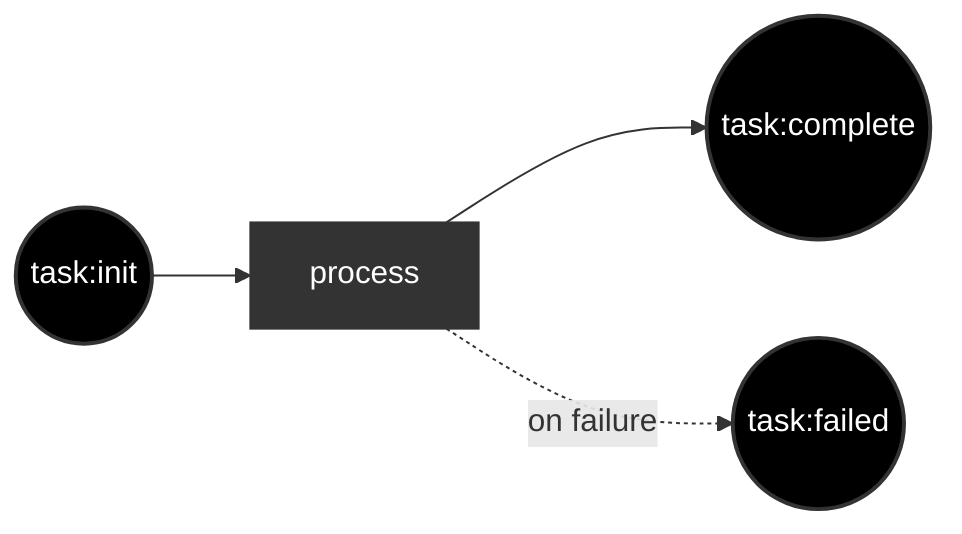
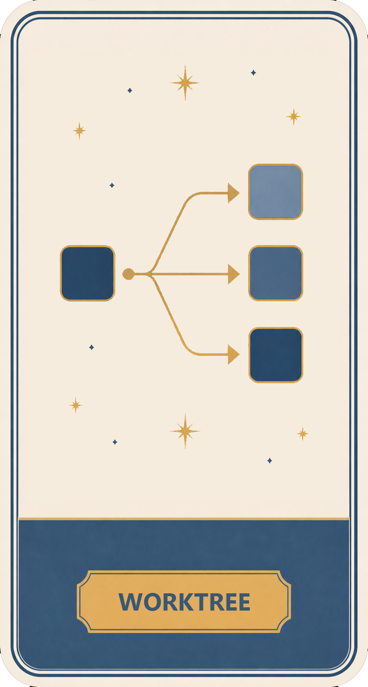

# infinite-you

[](https://github.com/portpowered/infinite-you/actions/workflows/ci.yml)
[](https://github.com/portpowered/infinite-you/releases)
[](https://go.dev/)
[](./LICENSE.md)

**infinite-you** is an AI agent factory for scheduling and orchestrating concurrent AI work—the `you` CLI and dashboard let you run many agents at once instead of babysitting each task manually.


## Why?

Leverage. 

With __you-agent-factory__, you codify your process into a workflow with different AGENTs.md and run them as wrappers around OpenAI codex.

For example: 
- dispatch 10 agents to run independently in separate work trees
- have one agent loop through a series of tasks, and then have a reviewer review the output and retrigger the loop if it failed
- tell the agents a series of plans, and run them in dependency order
- have a cron setup to autonomously look at git tasks or whatever and submit tasks that go through a write/review cycle loop

## Installation

### Prerequisites

- **[Codex CLI](https://developers.openai.com/codex/cli)** (default agent backend for the starter factory): `npm i -g @openai/codex`
- A project directory where you want the local `factory/` scaffold to live

### Install the `you` CLI

**macOS / Linux:**

```sh
curl -fsSL https://github.com/portpowered/infinite-you/releases/latest/download/install.sh | sh
```

**Windows (PowerShell):**

```powershell
irm https://github.com/portpowered/infinite-you/releases/latest/download/install.ps1 | iex
```

For custom install locations or pinned versions, see the [install script](./scripts/install.sh).

## Quick start

The default path uses the Codex-backed starter scaffold:

1. `cd your-project-directory`
2. Run `you` — bootstraps `./factory`, starts the runtime, and prints the dashboard URL (usually `http://localhost:7437/dashboard/ui`)
3. Submit a task from the dashboard (for example, “write a report on my codebase to TEST.md”) and wait for completion

For factory authoring, CLI topics, and advanced setup, see [Authoring factories](./docs/reference/authoring-factories.md) and [`you docs`](./docs/reference/README.md).

### Alternate executor: Claude

To scaffold a factory with Claude as the starter worker instead of Codex:

```sh
you init --executor claude --dir my-factory
you docs workstation
```

## Features

infinite-you is a factory runtime: you define how work moves between workstations, and the `you` CLI plus dashboard schedule concurrent agent runs against that flow.

- **Concurrent agent execution** — Run many agents at once across workstations; the dashboard shows live routing, session status, and factory flow state.
- **Workflow customization** — Model processes as config (`factory.json`, workstation routes, `AGENTS.md`) instead of a fixed pipeline; adapt write/review loops, cron triggers, git worktrees, or other patterns to your repo.
- **Review loops** — Route completed work to reviewer workstations and re-queue failed items; shipped factories such as Ralph and writer-reviewer demonstrate iterative plan/code/review cycles.
- **Batch submission** — Submit single items from the CLI (`you submit`) or drive larger inputs through batch work types and dashboard submission.
- **Example factories** — Load starter and advanced factories from [`examples/factories/`](./examples/factories/) in the dashboard, or scaffold your own with `you init`.

Deeper product documentation:

- [Authoring factories](./docs/reference/authoring-factories.md) — factory topology, workstations, workers, and customization workflow
- [CLI reference topics](./docs/reference/README.md) — `you docs <topic>` for config, work, sessions, workstations, and related guides
- [Architecture overview](./docs/architecture/architecture.md) and [data model](./docs/architecture/data-model.md) — how factories, work, and runtime state fit together
- [Runnable examples](./examples/) — example factory directories and mock-worker inputs under `docs/examples/`

## Factory CLI

With the service running, ask the live API which factory is currently active:

```sh
you factory query
you --server http://localhost:7437 --json factory query
```

`factory query` reads the running service's current-factory API. It does not infer
the answer from local `factory.json` files, so the output reflects the active
default-root runtime or the currently activated named factory on that server.

Manage persisted named factories under the factory root (default `factory/`):

```sh
you factory list
you --json factory list --dir my-factory
you factory save staging --from ./factory.json --set-current
you factory update staging --from ./factory.json
you factory delete staging
```

When a factory service is running, persist the live current factory definition
back to durable storage without a name argument:

```sh
you factory save
you --json factory save --session session-beta
```

## Submit Work From The CLI

Use `submit` for single-work API submission when the factory service is already running:

```sh
you submit --name "driver-incident-review" --work-type-name task --payload request.md
```

`--name`, `--work-type-name`, and `--payload` are required for unary CLI submission.


## Example
Here's an example of you-agent-factory dispatching roughly 5-10 agents.


## How It Works


The default no-argument starter flow looks like below: you give it a task, it spawns a basic agent CLI run and does stuff. 


## Customization 

See [authoring-factories](./docs/reference/authoring-factories.md) for the full configuration guide.
you-agent-factory lets you customize your flow however you want.

The overall system of how __you-agent-factory__ works is relatively simple.
1. You have work. 
2. Work goes to workstations where the work gets worked on by workers (agents, or just shell scripts)
3. When the workstations complete the, work is converted to other work.  
4. __you-agent-factory__ stops when no work remains.

For packaged terminal docs, run `you docs` to list topics or `you docs <topic>`
for embedded reference output. Maintainers edit only
[`docs/reference/`](./docs/reference/) (see
[`docs/reference/README.md`](./docs/reference/README.md)); run
`make docs-reference-smoke` before shipping doc changes. Customer guides such as
[`docs/reference/config.md`](./docs/reference/config.md),
[`docs/reference/work.md`](./docs/reference/work.md),
[`docs/reference/workstations.md`](./docs/reference/workstations.md),
[`docs/reference/workers.md`](./docs/reference/workers.md),
[`docs/reference/resources.md`](./docs/reference/resources.md),
[`docs/reference/batch-inputs.md`](./docs/reference/batch-inputs.md), and
[`docs/reference/templates.md`](./docs/reference/templates.md) live in that tree.


## Shipped example factories

Drag the images from the examples/factories directory into the web interface's flow graph, and it'll load the factory for you. 

<table>
  <tr>
    <td align="center">
      <strong>Doc reviewer</strong><br />
      Write and review workflow.<br />
      
    </td>
    <td align="center">
      <strong>you-agent-factory</strong><br />
      Meta factory that runs the factory.<br />
      
    </td>
    <td align="center">
      <strong>Ralph</strong><br />
      Iterative plan, code, and review loop.<br />
      
    </td>
  </tr>
  <tr>
    <td align="center">
      <strong>Timer</strong><br />
      Cron-based factory trigger.<br />
      
    </td>
    <td align="center">
      <strong>Worktree</strong><br />
      Spawns work in a git worktree.<br />
      
    </td>
    <td align="center">
      <strong>Writer reviewer</strong><br />
      Iterative loop for writing docs.<br />
      
    </td>
  </tr>
</table>

## References

- [Comparing orchestration systems](./docs/comparatives/comparing-systems.md) — background on how infinite-you relates to nearby agent and workflow tools
- [Authoring factories](./docs/reference/authoring-factories.md) — primary guide for defining and running factories
- [CLI reference index](./docs/reference/README.md) — packaged `you docs` topics and links to customer-facing guides
- [Architecture](./docs/architecture/architecture.md) and [data model](./docs/architecture/data-model.md) — factory execution model and persisted state
- [The zen of flow](./docs/reference/the-zen-of-flow.md) — design notes on work routing and factory composition
