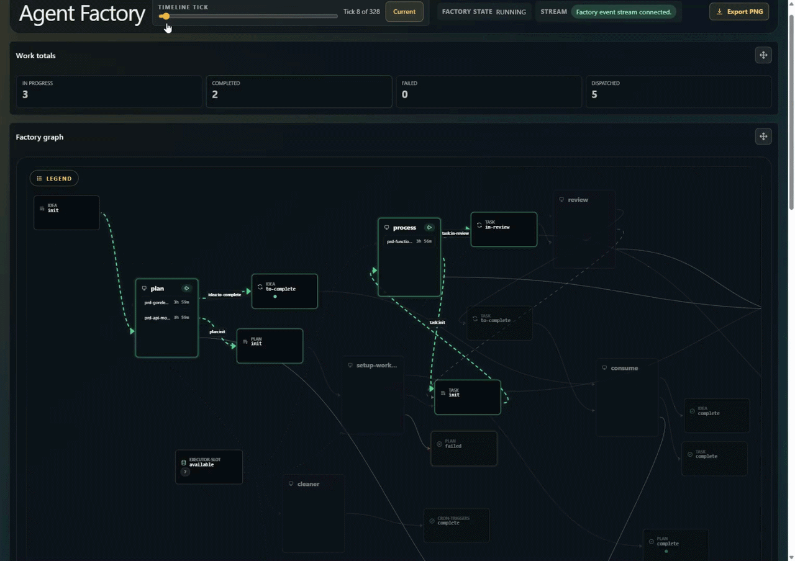

# you-agent-factory

[](https://github.com/portpowered/you-agent-factory/actions/workflows/ci.yml)
[](https://github.com/portpowered/you-agent-factory/releases)
[](https://go.dev/)
[](./LICENSE.md)

# what is YOU?

YOU agent factory CLI is a tool that lets you orchestrate agents together so you can do work faster, save money, and get better outputs.

Have YOU make one agent plan and another agent execute. Fourteen packaged patterns like adversarial review, classify, parallel execution, or custom with graph config or JavaScript. Run across Codex, Cursor, Claude, Copilot (ACP), and 20+ other harnesses.

YOU is a cross-platform single binary CLI. YOU supports complex flows via an orchestration graph, or JavaScript. YOU supports scripts, AI, logic nodes, concurrency, parallelism, recursion, retries, task dependencies, crons, conditionals, and a whole bunch of other stuff. Run YOU as a generic CLI for one-offs, or as an API server that you can interact with.




## Installation

### Prerequisites

Install a harness such as [Codex, Cursor, Claude, Copilot ACP, or the other supported harnesses](./docs/reference/harnesses.md).

### Install the `you` CLI

**macOS / Linux:**

```sh
curl -fsSL https://github.com/portpowered/you-agent-factory/releases/latest/download/install.sh | sh
```

**Windows (PowerShell):**

```powershell
irm https://github.com/portpowered/you-agent-factory/releases/latest/download/install.ps1 | iex
```

For custom install locations or pinned versions, see the [install script](./scripts/install.sh).

### Run

```sh
you run --named @you/goal --to "write to test.txt, append the next consecutive number up to 4" --provider codex
```

If you don’t have a harness yet, use `--with-mock-workers`.

You just ran a loop that continues until the job is complete.

## Quick start

Packaged Factories resolve by name and materialize lazily under
`~/.you-agent-factory/factories` when first used:

1. Run `you init --provider codex` to configure the default model provider.
2. Run `you factory list` to inspect the fourteen available packaged Factories.
3. From the project you want the agent to work in, run:

```sh
you run --named @you/goal --with-site --to "write a report on my codebase to TEST.md"
```

The command opens the dashboard, executes the goal, and exits after its terminal
result.

To author a Factory, follow [Authoring factories](./docs/reference/authoring-factories.md)
and persist it with `you factory create <name> --from ./factory.json`. For CLI
topics, see [`you docs`](./docs/reference/README.md).

### Pre-packaged factories

YOU comes with [fourteen pre-packaged factories](./docs/reference/packaged-factories.md).

#### Save money flow (plan-execute)

A stronger model writes a plan; a cheaper model executes it.

```bash
you run --named @you/plan-execute --to "do this arbitrary" \
  --planner-provider codex --planner-model gpt-5.6-sol \
  --executor-provider codex --executor-model gpt-5.6-terra
```

#### Do work faster (plan-parallel)

A first model writes a plan of tasks, then the scheduler dispatches ready workers in parallel.

```bash
you run --named @you/plan-parallel --to "do this arbitrary" \
  --planner-provider codex --planner-model gpt-5.6-sol \
  --executor-provider cursor --executor-model composer-2.5 \
  --merge-provider codex --merge-model gpt-5.6-sol
```

#### Do work better (adversarial review)

A first model does a task; a second reviews the outputs and the cycle repeats until approval.

```bash
you run --named @you/review --to "do this arbitrary" \
  --writer-provider codex --writer-model gpt-5.6-sol \
  --reviewer-provider cursor --reviewer-model composer-2.5
```

#### Pick the right model (classify)

Have a cheaper model pick the best lane, then run the request on the matching small, medium, or large model.

```bash
you run --named @you/classify --to "build me this one hundred page spec, make no mistakes" \
  --classifier-model gpt-5.6-luna \
  --large-model gpt-5.6-sol \
  --medium-model gpt-5.6-terra \
  --small-model gpt-5.6-luna
```

#### Write your own factories

YOU supports custom factories using a graph language or JavaScript.

1. Packaged factories materialize under `~/.you-agent-factory/factories`; you can edit them arbitrarily.
2. See the [graph authoring reference](./docs/reference/authoring-factories.md).
3. See the [JavaScript workflow reference](./docs/reference/javascript-workflows.md).

### Server mode

Run YOU as a backend that you can submit work against.

Start a continuous named Factory with an API listener:

```bash
you run --named @you/goal --continuously --with-server --to "finish up some random-job"
```

Or serve the project-local Current Factory (`./factory/factory.json`) with the dashboard:

```bash
you server
```

Submit one work item to a running session (payload is a file path):

```bash
printf '%s\n' 'finish up some random-job' > goal.md
you submit --name "task-1" --work-type-name "goal" --payload goal.md
```

Then watch the session run with `you session list` / `you work list`.

### Website mode

Open the dashboard at [http://localhost:7437/dashboard/ui](http://localhost:7437/dashboard/ui)
(or the bound URL printed when you start with `--with-site` / `you server`).

The live graph shows workstations, routing, and Factory Session status as work
moves through the factory. The submit card posts one work item into the running
session the same way `you submit` does.

### Use by agent

If you want an agent to install or run factories or submit work, tell it to look
at `you docs agents` or point it at this repo and the
[agent reference](./docs/reference/agents.md).

## Features

1. Graph-based flows — define workflows as configuration JSON/YAML
2. JavaScript — support JavaScript-based execution
3. Worktrees — support execution within worktrees
4. Permissions — enable skip permissions or use default permission gates
5. Harnesses — bundled Codex/Claude/Cursor/Antigravity CLIs plus 20 packaged ACP integrations (and operator-added ones)
6. Parallel/concurrent — run many agents at the same time
7. Script steps — run shell commands and route on exit codes/results
8. Merge/split steps — perform joins of work using split/merge
9. Recursion — route throughout the graph to repeat
10. Quiescence — terminate when there is no work running
11. Crons — generate new work on a configured time basis
12. ACP — Agent Client Protocol support, plus custom ACP integrations for additional harnesses
13. Templated `AGENTS.md` — inject prior results, request names, and other context into prompts
14. Conditional routing — route based on conditioned agent outputs
15. Throttles/retry — put arbitrary concurrency limits and retry bounds on workers and workstations
16. Multi-session — run multiple factories at the same time
17. Web dashboard — real-time workflow graph with interactive graph and live streaming
18. Validation — config validation using schema-first validation
19. Event stream recording — write an event stream that can be streamed and replayed over time
20. API — REST API for integrating while the service is in runtime
21. Record/replay — default recording plus `--record`, `--replay`, and `--no-record` (see `you docs record-replay`)

## Comparison

How **you-agent-factory** fits next to nearby agent and workflow orchestrators. Dimensions focus on execution model, workflow flexibility, agent-harness support, and operational weight—not “best tool” claims.

| System | Execution model | Workflow shape | Agent harness | Durability / ops weight | Reference |
| --- | --- | --- | --- | --- | --- |
| **you-agent-factory** | Self-hosted `you` runtime and dashboard route work through factory workstations | Custom in-repo flow (`factory.json`, `AGENTS.md`, routes) without a fixed pipeline | Codex, Claude, Cursor, Antigravity, and 20 packaged ACP harnesses | Lightweight local runtime; no built-in durable workflow engine | [Architecture](./docs/architecture/architecture.md) |
| **[Gastown](https://github.com/steveyegge/gastown)** | Mayor-led multi-agent workspace with git-backed hooks and worktrees | Opinionated mayor/beads/convoy coordination around git | Hooks inject context into Claude Code, Copilot, Codex, and peers | Git/worktree persistence; heavier git + beads/dolt stack | [Gastown](https://github.com/steveyegge/gastown) |
| **[Symphony](https://github.com/openai/symphony)** | Long-running orchestrator polls issue trackers and runs per-issue workspaces | Policy in-repo (`WORKFLOW.md`); spec-driven daemon workflow | Codex app-server sessions in isolated workspaces | Elixir daemon with supervision/retries; tracker-centric | [Symphony](https://github.com/openai/symphony) |
| **[Factory](https://factory.ai/)** | Droid Missions orchestrator with Mission Control for multi-day projects | Milestone/feature decomposition with validation contracts | Droid workers with MCP, skills, hooks, and custom droids | Productized orchestration with milestone validation loops | [Factory Missions](https://docs.factory.ai/cli/features/missions) |
| **[8090 Software Factory](https://www.8090.ai/software-factory)** | Hosted SDLC control plane (requirements → blueprints → work orders) | Upstream planning modules feed agents through MCP-connected work orders | External agents (Cursor, Claude Code, etc.) via MCP | Cloud platform with knowledge graph and audit trail | [8090 docs](https://www.8090.ai/docs/general/introduction) |
| **[Claude workflow plugins](https://github.com/sighup/claude-workflow)** | In-IDE Claude Code skills/commands drive spec → plan → execute loops | Plugin-defined task graphs, parallel dispatch, and worktrees | Native Claude Code subagents and skills | Session/task files on disk; no separate orchestration server | [sighup/claude-workflow](https://github.com/sighup/claude-workflow) |
| **Other orchestrators** ([Temporal](https://temporal.io/), [n8n](https://n8n.io/), [DBOS](https://www.dbos.dev/)) | General-purpose durable or RPA workflow engines | DAG/state-machine or node graphs; often code- or node-config driven | Agent harnesses typically custom-built | Strong durability/transactions; heavier for ad-hoc agent loops | - |

## References

### Collection

- [Harnesses](./docs/reference/harnesses.md) — bundled providers and packaged ACP integrations
- [Packaged factories](./docs/reference/packaged-factories.md) — the fourteen `@you/*` catalog Factories
- [Authoring factories (graph)](./docs/reference/authoring-factories.md) — topology, workers, workstations, resources, and routing
- [JavaScript workflows](./docs/reference/javascript-workflows.md) — JavaScript orchestrator Factories
- [System configuration](./docs/reference/config.md) — operator init plus Factory validation and authoring contract
- [CLI reference index](./docs/reference/README.md) — packaged `you docs <topic>` pages
- [Agents](./docs/reference/agents.md) — agent orientation and CLI-only work submission
- [Work submission](./docs/reference/work.md) — `you submit`, batch inputs, and dashboard submission
- [Architecture](./docs/architecture/architecture.md) and [data model](./docs/architecture/data-model.md)
- [The zen of flow](./docs/reference/the-zen-of-flow.md)
- [Example factories](./examples/factories/)
- [Dashboard demo](./docs/internal/resources/dashboard.gif)

### System configuration reference files

- [API reference](./packages/api/generated/openapi/openapi.yaml)
- [CLI reference](./packages/api/generated/cli/commands.json)
- [Factory configuration reference](./packages/api/generated/schemas/factory.schema.json)
- [System configuration reference](./packages/api/generated/schemas/you-config.schema.json)

### Build from source

Prerequisites: install Go, Bun, and npm.

```bash
git clone https://github.com/portpowered/you-agent-factory
cd you-agent-factory
make build-all
make test
```

Report issues or start discussions on the GitHub repository when you need help.

Maintainers: edit packaged reference docs under [`docs/reference/`](./docs/reference/README.md); run `make docs-reference-smoke` before shipping doc changes and `make readme-check` before changing README structure or linked assets.

## License

This repository is released under the [MIT License](./LICENSE.md).

The README hero image (`docs/internal/resources/dashboard.png`) and the animated demo (`docs/internal/resources/dashboard.gif`) are screenshots maintained in this repository and depict the you-agent-factory dashboard UI.
