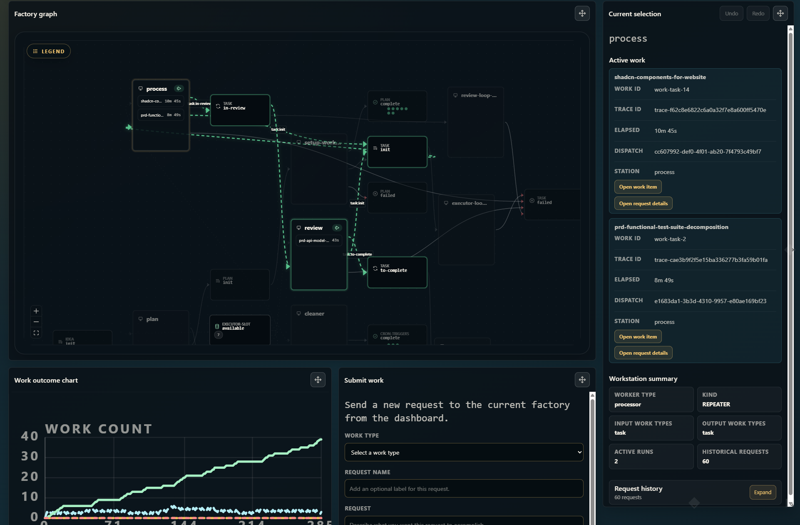

# you-agent-factory

[](https://github.com/portpowered/you-agent-factory/actions/workflows/ci.yml)
[](https://github.com/portpowered/you-agent-factory/releases)
[](https://go.dev/)
[](./LICENSE.md)

**you-agent-factory** is an AI agent factory for scheduling and orchestrating concurrent AI work—the `you` CLI and dashboard let you run many agents at once instead of babysitting each task manually.



## Why?

Leverage.

With **you-agent-factory**, you codify your process into a workflow with different `AGENTS.md` files and run them as wrappers around OpenAI Codex or other agent backends.

For example:

- dispatch many agents to run independently in separate worktrees
- have one agent loop through a series of tasks, then route output to a reviewer that re-queues failed work
- submit plans in dependency order
- use cron triggers to autonomously inspect git tasks and drive write/review cycles

## Installation

### Prerequisites

- **[Codex CLI](https://developers.openai.com/codex/cli)** (default agent backend for the packaged Factories): `npm i -g @openai/codex`
- Credentials for the model provider you plan to use

### Install the `you` CLI

**macOS / Linux:**

```sh
curl -fsSL https://github.com/portpowered/you-agent-factory/releases/latest/download/install.sh | sh
```

**Windows (PowerShell):**

```powershell
irm https://github.com/portpowered/you-agent-factory/releases/latest/download/install.ps1 | iex
```

For custom install locations or pinned versions, see the [install script](./scripts/install.sh).

## Quick start

Packaged Factories resolve by name and materialize lazily under
`~/.you-agent-factory/factories` when first used. The CLI requires an explicit
run or server command; bare `you` prints command help and does not create a
project-local `./factory` scaffold:

1. Run `you init --provider codex` to configure the default model provider.
2. Run `you factory list` to inspect the fourteen available packaged Factories.
3. From the project you want the agent to work in, run
   `you run --named @you/goal --with-site "write a report on my codebase to TEST.md"`.
   The command opens the dashboard, executes the goal, and exits after its
   terminal result.

To author a Factory, follow [Authoring factories](./docs/reference/authoring-factories.md)
and persist it with `you factory create <name> --from ./factory.json`. For CLI
topics and advanced setup, see [`you docs`](./docs/reference/README.md).

### Configure a model provider

`you init` configures the default provider and optional model used by
model-backed workers. It does not scaffold a Factory:

```sh
you init --provider claude --model claude-sonnet-4-5
```

Run `you factory list` to inspect the fourteen packaged Factories; selecting one with
`you run --named <name>` materializes it on first use. To author your own,
follow [Authoring factories](./docs/reference/authoring-factories.md), then
persist a reusable definition with
`you factory create <name> --from ./factory.json`.

## Features

you-agent-factory is a factory runtime: you define how work moves between workstations, and the `you` CLI plus dashboard schedule concurrent agent runs against that flow.

- **Concurrent agent execution** — Run many agents at once across workstations; the dashboard shows live routing, session status, and factory flow state.
- **Workflow customization** — Model processes as config (`factory.json`, workstation routes, `AGENTS.md`) instead of a fixed pipeline; adapt write/review loops, cron triggers, git worktrees, or other patterns to your repo.
- **Review loops** — Route completed work to reviewer workstations and re-queue failed items; shipped factories such as Ralph and writer-reviewer demonstrate iterative plan/code/review cycles.
- **Batch submission** — Submit single items from the CLI (`you submit`) or drive larger inputs through batch work types and dashboard submission.
- **Example factories** — Load starter and advanced factories from [`examples/factories/`](./examples/factories/) in the dashboard, or author a `factory.json` and persist it with `you factory create`.

Deeper product documentation:

- [Authoring factories](./docs/reference/authoring-factories.md) — factory topology, workstations, workers, and customization workflow
- [CLI reference topics](./docs/reference/README.md) — `you docs <topic>` for config, work, sessions, workstations, and related guides
- [Providers and ACP agents](./docs/reference/providers.md) — configure Cursor and other ACP agents, select them from workers or JavaScript, and verify a real run
- [Architecture overview](./docs/architecture/architecture.md) and [data model](./docs/architecture/data-model.md) — how factories, work, and runtime state fit together
- [Runnable examples](./examples/) — example factory directories and mock-worker inputs under `docs/examples/`

## Comparison

How **you-agent-factory** fits next to nearby agent and workflow orchestrators. Dimensions focus on execution model, workflow flexibility, agent-harness support, and operational weight—not “best tool” claims.

| System | Execution model | Workflow shape | Agent harness | Durability / ops weight | Reference |
| --- | --- | --- | --- | --- | --- |
| **you-agent-factory** | Self-hosted `you` runtime and dashboard route work through factory workstations | Custom in-repo flow (`factory.json`, `AGENTS.md`, routes) without a fixed pipeline | Codex, Claude, and shell workers wired through factory config | Lightweight local runtime; no built-in durable workflow engine | [Architecture](./docs/architecture/architecture.md) |
| **[Gastown](https://github.com/steveyegge/gastown)** | Mayor-led multi-agent workspace with git-backed hooks and worktrees | Opinionated mayor/beads/convoy coordination around git | Hooks inject context into Claude Code, Copilot, Codex, and peers | Git/worktree persistence; heavier git + beads/dolt stack | [Gastown](https://github.com/steveyegge/gastown) |
| **[Symphony](https://github.com/openai/symphony)** | Long-running orchestrator polls issue trackers and runs per-issue workspaces | Policy in-repo (`WORKFLOW.md`); spec-driven daemon workflow | Codex app-server sessions in isolated workspaces | Elixir daemon with supervision/retries; tracker-centric | [Symphony](https://github.com/openai/symphony) |
| **[Factory](https://factory.ai/)** | Droid Missions orchestrator with Mission Control for multi-day projects | Milestone/feature decomposition with validation contracts | Droid workers with MCP, skills, hooks, and custom droids | Productized orchestration with milestone validation loops | [Factory Missions](https://docs.factory.ai/cli/features/missions) |
| **[8090 Software Factory](https://www.8090.ai/software-factory)** | Hosted SDLC control plane (requirements → blueprints → work orders) | Upstream planning modules feed agents through MCP-connected work orders | External agents (Cursor, Claude Code, etc.) via MCP | Cloud platform with knowledge graph and audit trail | [8090 docs](https://www.8090.ai/docs/general/introduction) |
| **[Claude workflow plugins](https://github.com/sighup/claude-workflow)** | In-IDE Claude Code skills/commands drive spec → plan → execute loops | Plugin-defined task graphs, parallel dispatch, and worktrees | Native Claude Code subagents and skills | Session/task files on disk; no separate orchestration server | [sighup/claude-workflow](https://github.com/sighup/claude-workflow) |
| **Other orchestrators** ([Temporal](https://temporal.io/), [n8n](https://n8n.io/), [DBOS](https://www.dbos.dev/)) | General-purpose durable or RPA workflow engines | DAG/state-machine or node graphs; often code- or node-config driven | Agent harnesses typically custom-built | Strong durability/transactions; heavier for ad-hoc agent loops | - |

## References

- [Authoring factories](./docs/reference/authoring-factories.md) — primary guide for defining and running factories
- [CLI reference index](./docs/reference/README.md) — packaged `you docs` topics and links to customer-facing guides
- [Work submission](./docs/reference/work.md) — `you submit`, batch inputs, and dashboard submission
- [Factory CLI](./docs/reference/config.md) — `you factory query`, save/list/update, and runtime factory management
- [Architecture](./docs/architecture/architecture.md) and [data model](./docs/architecture/data-model.md) — factory execution model and persisted state
- [The zen of flow](./docs/reference/the-zen-of-flow.md) — design notes on work routing and factory composition
- [Example factories](./examples/factories/) — drag-and-drop starter flows (doc reviewer, Ralph, timer, worktree, writer reviewer, and more)
- [Dashboard demo](./docs/internal/resources/dashboard.gif) — animated view of concurrent agent dispatch

Maintainers: edit packaged reference docs under [`docs/reference/`](./docs/reference/README.md); run `make docs-reference-smoke` before shipping doc changes and `make readme-check` before changing README structure or linked assets.

## License

This repository is released under the [MIT License](./LICENSE.md).

The README hero image (`docs/internal/resources/dashboard.png`) and the animated demo (`docs/internal/resources/dashboard.gif`) are screenshots maintained in this repository and depict the you-agent-factory dashboard UI.
