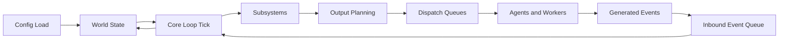
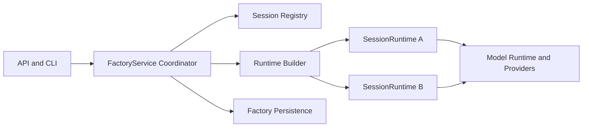
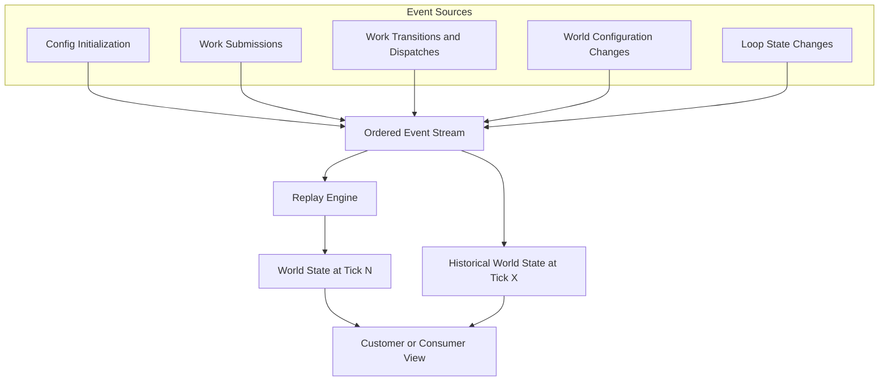
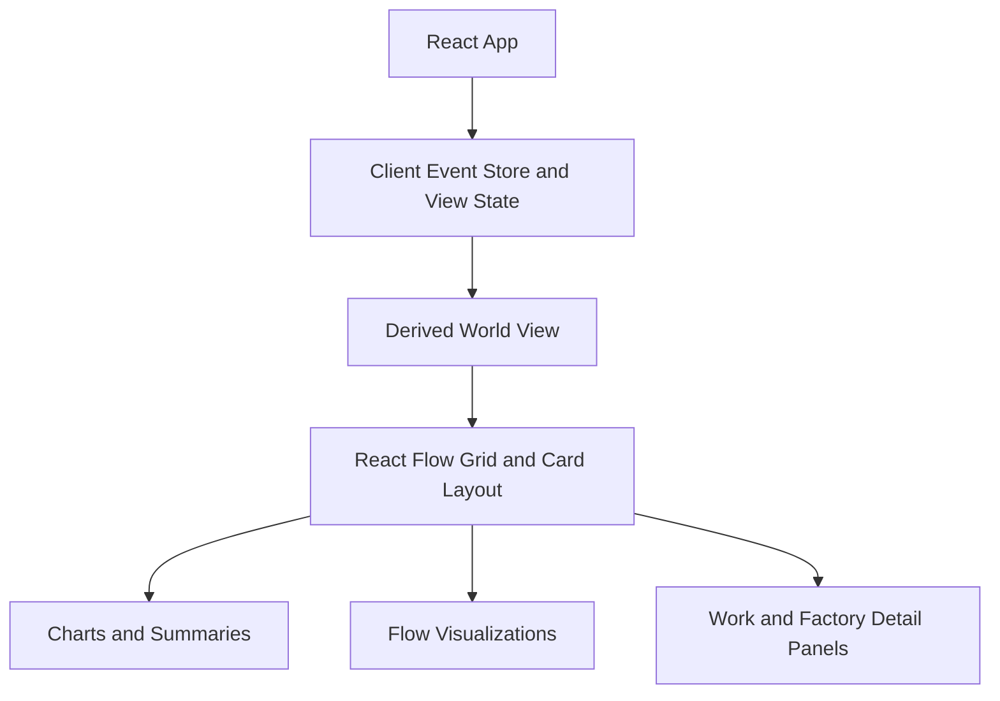
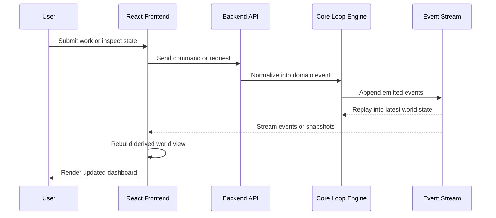

# Backend

## Core Loop

The backend centers on a deterministic tick loop that updates a shared world state from submitted events. Each tick reads pending inputs, applies subsystem logic, and emits outputs that are handed off to queues and workers.

The loop is intentionally closed: workers and agents do not mutate the world directly. They produce outputs that re-enter the system as events, which keeps the state transition history explicit and replayable.

## Service and Session Boundaries

Multi-session runtime hosting adds a second architecture boundary on top of the
core loop:

- the service coordinates sessions
- each session owns one runtime
- runtime construction is driven by immutable session build inputs

The important rule is that `FactoryService` routes and coordinates, but does
not become the canonical owner of per-session runtime state.

## Event Stream

The world is derived from an ordered event stream rather than a collection of opaque mutable objects. This stream is the durable source of truth for replay, synchronization, and historical inspection.

At any tick, the current world is the composition of all prior events. Because the stream is deterministic, customers can receive the same event history and reconstruct a consistent view at any chosen timestamp or tick.

# Front End

The frontend is an embedded React application that consumes the backend event stream and derives a customer-facing world view from it. The UI emphasizes composable dashboards and visualizations rather than owning the authoritative system state.

## Frontend Composition

The React layer receives events, derives projections for the current world, and renders that state through cards, charts, and flow-oriented views.

## Frontend and Backend Integration

The frontend and backend are connected by an event-oriented contract. The backend owns execution, scheduling, and replayable history; the frontend subscribes to that history, derives projections, and sends user actions back as submissions.

This split keeps the frontend lightweight and keeps the backend authoritative. The same event stream that powers execution can also power dashboards, audit history, and deterministic replay.

### Editor state

The graph editor state represents the website's way of managing the world state. 

The event stream is cloud-backed input, but the dashboard snapshot used by current activity is client-computed from events:

You can sort of see here that basically as events get streamed in, the events get streamed in. 

1. from that event stream we construct snapshots of the world state at every single sample time.
2. Then the world state at a sample time presents the factory graph. the workstations, workers, work types, states, and their projection layout. 
3. Then from that world state,  corresponding new UI state is persisted and combined with an internal editor stream of operations. 
4. From the editor operation stream + world state, a projected currented factory/editor state is created. 
5. from the editor state, we map the factory/editor state into a projection that is bespoke to the view of teh "react flow library"
6. from that flow library projection and the editor state we create a fnal state that is called the view model. 
7. the state changes from the view model are projected out to the components, and components render and operate against changes by sending hook calls into the view model. 
8. the view model is responsible for injecting calls into the editor state, which is then responsible for sending API calls to the backend. 
9. the backend, as it finishes changes sends back events to the event stream denoting the world stat echanges as a consequences of API operations. 

```mermaid
flowchart LR
  stream["Cloud event stream\nFactoryEvent SSE"]:::cloud
  hook["useFactoryEventStream"]:::client
  events["FactoryEvent[]\nuseFactoryTimelineStore"]:::client
  replay["reconstructWorldState"]:::client
  projected["projectSnapshot"]:::client
  snapshot["Computed DashboardSnapshot / WorldState\nselected tick"]:::client
  graphState["Current activity graph state"]:::client
  flowProjection["Computed React Flow graph\nnodes + edges + viewport"]:::client

  stream --> hook --> events --> replay --> projected --> snapshot
  snapshot --> graphState --> flowProjection
  snapshot --> flowProjection

  classDef cloud fill:#fee2e2,stroke:#b91c1c,color:#7f1d1d
  classDef client fill:#dbeafe,stroke:#1d4ed8,color:#1e3a8a
```

