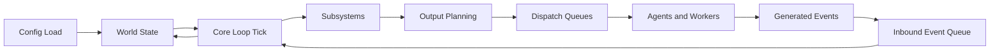
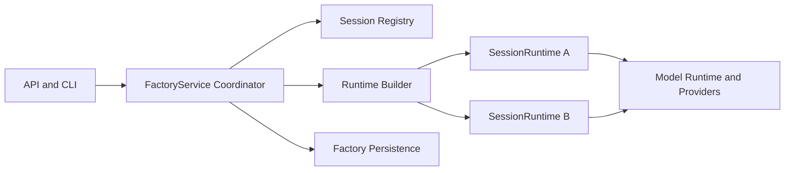
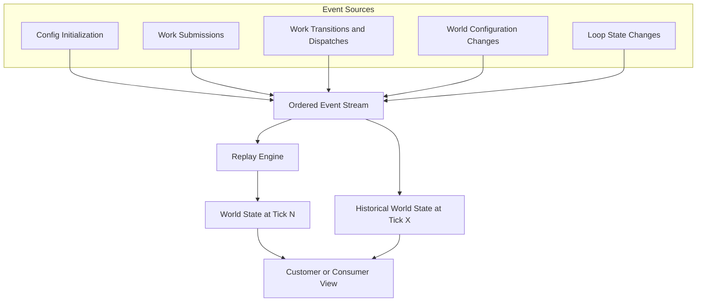
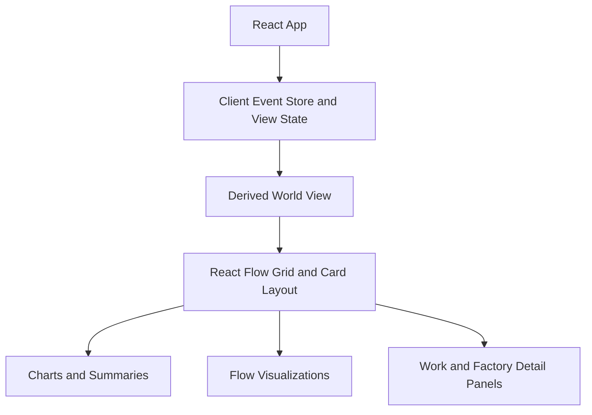
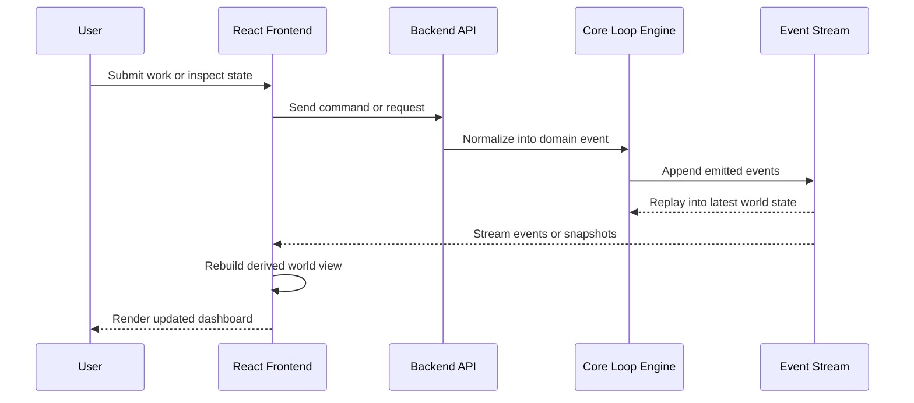

# Backend

## Runtime Startup Ownership

Runtime cleanup work should move process wiring toward this preferred ownership
path:

`cmd/factory -> pkg/root -> pkg/wire -> pkg/initializer -> transports/app graph`

```mermaid
flowchart LR
    cmd["cmd/factory"]
    root["pkg/root"]
    wire["pkg/wire"]
    graph["app dependency graph"]
    initializer["pkg/initializer"]
    transports["API / CLI / MCP transports and sidecars"]
    sessions["Factory Sessions"]

    cmd --> root
    root --> wire
    wire --> graph
    root --> initializer
    graph --> initializer
    initializer --> transports
    graph --> sessions
```

`cmd/factory` is the thin process entrypoint. It should parse only the process
boundary concerns required to hand control to the root package, then avoid
owning runtime composition or transport-specific dependency construction.

`pkg/root` normalizes process arguments and environment input, then selects the
process mode and top-level behavior for the current invocation, such as API
service hosting, local CLI execution, or sidecar startup. It owns root command
flow and chooses which already-defined startup path to run. It does not
construct domain dependencies or start, stop, or supervise long-lived
components.

`pkg/wire` constructs the concrete, typed application dependency graph from
normalized inputs. It is the target owner for dependency construction,
config-loaded collaborators, and service graph assembly. Construction failures
are returned before startup. The graph should be usable by multiple startup
modes without hiding filesystem, environment, process, or transport
dependencies in package globals. `pkg/wire` does not choose process mode or
start long-lived components.

`pkg/initializer` owns lifecycle execution for already-built collaborators. It
starts transports and sidecars, and it stops, cancels, joins, and unwinds them
when startup fails or the process shuts down. It attaches API, CLI, MCP, or other
process adapters to the assembled graph rather than constructing core domain
services lazily, rebuilding Factory Session runtime state, or reaching around
the graph for ad hoc dependencies.

This startup path preserves the event-first runtime model. Transports submit
commands into Factory Session APIs, workers and agents emit outputs, and those
outputs re-enter the runtime as Factory events. They do not mutate canonical
Factory Session state directly.

## Core Loop

The backend centers on a deterministic tick loop that updates a shared world state from submitted events. Each tick reads pending inputs, applies subsystem logic, and emits outputs that are handed off to queues and workers.



The loop is intentionally closed: workers and agents do not mutate the world directly. They produce outputs that re-enter the system as events, which keeps the state transition history explicit and replayable.

## Service and Session Boundaries

Multi-session runtime hosting adds a second architecture boundary on top of the
core loop:

- the service coordinates sessions
- each session owns one runtime
- runtime construction is driven by immutable session build inputs



The important rule is that `FactoryService` routes and coordinates, but does
not become the canonical owner of per-session runtime state.

### Factory Session state ownership

A Factory Session owns both live and durable session state. That ownership
includes the runtime instances created for the session, the ordered Factory
event history, lifecycle and control state, current work, the Current Factory,
and session read models derived for APIs, CLI callers, and dashboards.

`FactoryService` coordinates APIs, CLI calls, session registries, persistence,
runtime construction, and model/runtime dependencies. It can locate, construct,
and route to Factory Sessions, but it must not become the owner of per-session
runtime state. Stateful runtime changes should land in the Factory Session
domain or the session execution owner that serves it, with `FactoryService`
remaining a coordinator around those owners.

Dynamic workflow execution follows the same rule. A JavaScript orchestrator is a
Factory Session execution kind, so its source snapshots, progress, event
history, lifecycle controls, current work, Provider Sessions, and result read
models belong to Factory Session execution surfaces. Customer-facing APIs and
docs should describe those runs as Factory Session execution, not as a separate
public runtime resource.

### Target package-family ownership map

Runtime cleanup work should place new behavior in the narrow owner for the
responsibility being changed. Use this map before reading broad service,
runtime-host implementations. `pkg/service` and `pkg/runtimehost` are not the ownership source of truth
for new placement decisions.

| Responsibility | Preferred owner for new implementation | Placement rule |
| --- | --- | --- |
| Process root and mode selection | `cmd/factory` and target `pkg/root` | Keep `cmd/factory` as the thin process entrypoint; put root command flow and process-mode selection in `pkg/root`. |
| Dependency construction and app graph assembly | target `pkg/wire` | Construct one concrete, typed dependency graph and return construction failures before startup; do not select process mode or start long-lived components. |
| Initializer lifecycle | `pkg/initializer` | Start, stop, cancel, join, and unwind API, CLI, MCP, sidecars, and other already-built process adapters without lazily constructing core services or rebuilding runtime state. |
| Transport boundaries | target `pkg/transports` | Own HTTP, CLI, MCP, generated transport contracts and clients, and boundary mapping. Translate into injected application/domain services; do not own domain policy or canonical runtime state. |
| Factory Session state and lifecycle | `pkg/factory/sessions`, with durable execution in `pkg/factory/sessions/execution` | Own live session registries, runtime identity, lifecycle gateways, event and response-stream access, projections, durable start and resume, controls, results, dispatches, artifacts, and persisted execution behavior for the customer-facing Factory Session. |
| Dynamic workflow / JavaScript orchestration | `pkg/orchestrators/javascript/*` | Put source resolution, validation, policy, preview preparation, runtime execution, result shaping, and checkpoints under the JavaScript orchestrator packages. |
| Factory runtime loop and projections | `pkg/factory` | Own event-first runtime behavior, subsystem coordination, emitted Factory events, replay, and world-state projections. |
| Internal Petri implementation | `pkg/orchestrators/petri` | Keep tokens, places, transitions, markings, and guard mechanics internal; do not promote them as the primary public resource model. |
| Workers and providers | `pkg/workers` and `pkg/workers/hosted` | Put worker execution, provider adapters, mock workers, process runners, sidecars, and hosted-worker integrations in the worker owner. |
| Models and managed runtimes | `pkg/models/host` | Put process-wide model runtime lifecycle, readiness, supervised servers, leases, capacity, and diagnostics in the model host; keep API/CLI adapters in `pkg/models/service`. |
| Work domain | target `pkg/work` | Own Work and Work Request content, query/selection, graph/lineage, pure invocation input and return policy, materialization, and cron/time-work concepts. Exclude Factory Session orchestration, worker/provider execution, and generic platform clocks. |
| Platform infrastructure | target `pkg/platform` | Own cross-cutting logging, replay and artifact infrastructure, metrics, cursor storage, and non-domain clocks. Implement domain-owned interfaces where needed, but do not choose Factory, Factory Session, worker, model, or Work policy. |

When a change crosses rows, choose the owner that owns the durable state or
policy decision, then keep CLI, API, MCP, and UI code as adapters around that
owner. Customer-facing Factory Session behavior belongs in Factory Session
owners; Petri-net concepts stay behind the internal runtime boundary.

### Migration-only package-family register

The package-boundary policy keeps the following direct children of `pkg/`
temporarily available only as migration exceptions. Each record names its
durable target owner and active convergence or deletion work item. The exception
must be removed from the boundary policy as soon as the named deletion gate is
satisfied; new product behavior belongs in the target owner, not the temporary
root.

| Migration-only roots | Target owner | Active work item and deletion gate |
| --- | --- | --- |
| `pkg/api`, `pkg/apisurface`, `pkg/cli`, `pkg/mcp` | `pkg/transports` | **Batch 006 — Transport family move.** Remove each exception when its HTTP, CLI, MCP, generated-contract/client, and boundary-mapping behavior and callers have moved to `pkg/transports`. |
| `pkg/logging`, `pkg/replay`, `pkg/sessionpersistence` | `pkg/platform` | **Batch 006 — Platform family move.** Remove each exception when its logging, replay/artifact, metrics, cursor persistence, or non-domain clock infrastructure and callers have moved to `pkg/platform`. |
| `pkg/service` | `pkg/wire` after domain behavior converges on its narrow owners | **Batch 007 — Service and Factory Session ownership convergence**, followed by **Batch 008 — Legacy composition-root deletion.** Remove the exception when domain/session behavior has moved to its narrow owner and the remaining construction shell has moved to `pkg/wire`. |
| `pkg/runtimehost` | `pkg/wire` | **Batch 008 — Legacy composition-root deletion.** Remove the exception when transports and `pkg/initializer` consume the explicit graph and no caller needs the runtime-host facade. |

Generated-code exceptions are a separate policy class, not migration roots:
`pkg/transports/http/client`, `pkg/transports/http/generated`, and generated Go
files carrying the standard `Code generated ... DO NOT EDIT.` header. They may
contain generated transport contracts or clients but must never own handwritten
product behavior.

The historical transport roots `pkg/api`, `pkg/apisurface`, `pkg/cli`,
`pkg/mcp`, and `pkg/generatedclient` are retired. Repository code imports their
canonical successors under `pkg/transports`; the package-boundary guard rejects
reintroduction of those imports and handwritten Go inside generated-only
transport packages.

Historical model and hosted-worker roots are a prohibited policy class, not
migration exceptions. `pkg/modelhost`, `pkg/localmodels`, and
`pkg/hostedworkers` must not be recreated or imported. Their canonical owners
are `pkg/models/host`, `pkg/models/local` or `pkg/models/assets`, and
`pkg/workers/hosted`, respectively. The package-boundary check enforces both
directory creation and Go imports while allowing legitimate nested packages
within the canonical model and worker families.

### Other migration-era surfaces and compatibility aliases

The following packages and aliases exist to keep current behavior working while
runtime cleanup moves ownership into the target package families above. Treat
them as temporary placement surfaces. New production behavior should not land
there unless the change is a small compatibility delegation to the target owner
or part of an active removal lane.

| Migration-era surface | Temporary role | Target owner or sunset expectation |
| --- | --- | --- |
| Broad `pkg/service` runtime composition files, including `factory.go`, `factory_build.go`, `runtime_sessions.go`, `model_catalog.go`, and `factory_editable_definition.go` | Compatibility shell for existing API, CLI, session, model, save, and runtime construction entrypoints. | Keep converged Factory Session state and durable execution in `pkg/factory/sessions`, factory definition behavior in `pkg/factory/definition`, model behavior in `pkg/models/host` and `pkg/models/service`, Work behavior in target `pkg/work`, and startup graph construction in target `pkg/wire`. Leave `pkg/service` as thin routing until the Batch 007 convergence and Batch 008 deletion gates are complete. |
| `pkg/runtimehost` | Transitional wrapper around the service-backed runtime host shape. | Replace host ownership with explicit Factory Session, runtime loop, and initializer dependencies. Sunset the package once transports and session APIs no longer need a runtime-host facade around `FactoryService` compatibility. |
| Host-object dependency-injection adapters such as service-local `factoryDefinitionHost`, `factorySaveHost`, and `sessionGatewayHost` structs, plus cmd-owned Wire providers under `cmd/factory/compose` | Adapter objects that satisfy narrower service interfaces while the old coordinator still carries many collaborators. | Prefer explicit constructor inputs and graph assembly in target `pkg/wire`, with domain packages owning their own host interfaces only at the boundary they actually consume. Delete each adapter when the target owner accepts explicit collaborators or the old coordinator no longer fronts that behavior. |
| Root `pkg/workflow*` packages: `pkg/workflowsource`, `pkg/workflowvalidation`, `pkg/workflowpolicy`, `pkg/workflowpreview`, and `pkg/workflowresult` | Batch 001 compatibility shims that type-alias JavaScript orchestrator packages. | Import `pkg/orchestrators/javascript/source`, `validation`, `policy`, `preview`, and `result` directly for runtime, API, CLI, MCP, and dashboard work. Remove the shims after downstream imports are gone and compatibility guarantees permit deletion. |
| Retained workflow compatibility aliases, including `you workflow ...` CLI commands, `you.workflow.*` MCP tools, and obsolete workflow-named API routes such as workflow preview aliases | Backward-compatible names for existing operators and host integrations. | Document and test them only as aliases. Primary surfaces are Factory Session APIs (`POST /factory-sessions/async`, `POST /factory-sessions/sync`, session reads, result, dispatch, artifact, event, and lifecycle routes), Factory preview validation (`POST /factories/preview`), Factory Session CLI inspection and durable session execution semantics, and `you.factory_session.*` MCP tools. Where a `you workflow ...` command remains the only shipped CLI entrypoint, docs should describe the command as Factory Session execution or inspection. Sunset aliases only through an explicit compatibility-removal plan. |

Compatibility documentation should name the successor first and the old surface
second. For example, describe JavaScript orchestration as Factory Session
execution with workflow-named CLI or MCP aliases, not as a separate public
runtime resource.

For review-time placement guardrails and focused vocabulary verification, use
`docs/internal/processes/runtime-cleanup-relevant-files.md` alongside this
ownership map.

### Logical session identity and restart recovery

Dashboard tabs and other long-lived clients can persist logical session intent
(`backendScopeID`, `logicalSessionKeyID`) separately from the current live
`factorySessionID` and `streamGenerationID`. After backend restart, sync
preflight resolves logical identity to the replacement live session before SSE
reconnect or timeline checkpoint restore.

The backend's ordered Factory Event stream remains authoritative for Factory
Session replay and history. Browser reconnect cursors, timeline entries,
materialized Work outcomes, and IndexedDB checkpoints are bounded derived
caches. Each such cache belongs to one exact identity made from normalized
`backendScopeID`, a concrete resolved `factorySessionID` UUID,
`logicalSessionKeyID`, and `streamGenerationID`; selector aliases are resolved
at the API boundary and are never durable cache identity.

The dashboard runs sync preflight before checkpoint hydration. It replaces a
checkpoint only with a strictly newer, transaction-complete write, preserves
the last committed checkpoint when replacement fails, and performs best-effort
flush and handoff on session changes and page lifecycle signals. Persistence
diagnostics retain only a bounded, redaction-safe outcome record. Detailed
Dispatch inspection remains a lazy dedicated read and does not expand ordinary
Factory Session identity, timeline, or checkpoint state with raw dispatch
collections.

`logicalSessionKeyID` is derived deterministically from normalized factory
session targets (default, folder-scoped, named, and provider-backed forms). The
backend does not allocate or persist a separate logical-session table for this
identity.

See `docs/architecture/logical-session-identity.md` for target normalization,
the complete browser-cache ownership and durability contract, remap outcomes,
preserved vs dropped client state, and verification surfaces.

## Event Stream

The world is derived from an ordered event stream rather than a collection of opaque mutable objects. This stream is the durable source of truth for replay, synchronization, and historical inspection.



At any tick, the current world is the composition of all prior events. Because the stream is deterministic, customers can receive the same event history and reconstruct a consistent view at any chosen timestamp or tick.

`SESSION_LIFECYCLE_CONTROL` events record accepted Factory Session pause, resume,
and related lifecycle controls. Replay and status reads use those events together
with loop-state changes so current and historical session lifecycle state stay
aligned with live control operations.

### Canonical Factory Session recording ownership

`pkg/factory/sessions/execution` is the sole production owner for recording and
persisting canonical Factory Session events. Orchestrators report runtime facts
and explicitly typed orchestration records to that owner; they do not append a
parallel public history, persist canonical events directly, or mutate canonical
session, Dispatch, Provider Session, artifact, lifecycle, or result projections.
The recorder validates a complete event candidate, persists the accepted ordered
snapshot, and only then publishes the corresponding live projection. Replay
reduces that same accepted canonical event meaning, so persisted and live read
models share one source of truth.

JavaScript checkpoints remain tagged JavaScript runtime records with their
checkpoint and resume semantics. Petri marking and transition records remain
internal Petri records. The Petri runtime reports final output mutations through
`factory.WithPetriMutationRecorder` only after transition routing has determined
their marking semantics; `pkg/factory/sessions/execution` persists those records
before the runtime accepts the completed tick. Either record may cause a separate canonical event when
it independently represents a public Factory Session fact, but neither is
retyped merely to make orchestration histories look alike.

`make durable-runtime-construction-check` enforces this boundary. It rejects
canonical event construction outside `pkg/factory/sessions/execution` and direct
JavaScript-orchestrator imports of session persistence, with diagnostics that
direct the caller back to the Factory Session recorder. Tests and typed
orchestration-record definitions remain permitted.

### Ephemeral response-event observation

Factory Sessions expose two distinct event surfaces that must not be conflated
in customer-facing architecture or API guidance:

| Surface | Route or transport | What it carries | Replay role |
| --- | --- | --- | --- |
| Canonical Factory events | `GET /factory-sessions/{session_id}/events` | Ordered `FactoryEvent` history for lifecycle, dispatches, artifacts, and replay projections | Durable session history for dashboard timeline, status derivation, and reconnect replay within the session's retained event history |
| Ephemeral response events | `GET /factory-sessions/{session_id}/response-events` | Ordered `FactoryResponseEvent` observation records for invocation progress | Session-scoped retained catch-up, then live continuation only while the session retains response-event history |

`FactoryResponseEvent` streams are session-owned **observations**. They do not
enter or replace canonical `FactoryEvent` history and must not be used to derive
lifecycle, dispatch, artifact, or terminal outcome facts. Dashboard timeline
replay, `SESSION_LIFECYCLE_CONTROL` derivation, and durable session inspection
belong on the Factory event stream.

Consumers reconnect to response events with `after_sequence`, the last
acknowledged `FactoryResponseEvent.sequence`. Omitting the cursor starts at the
beginning of the session's **currently retained** response-event history. When
a stale cursor predates retained history, the stream begins with `STREAM_GAP`
describing lost sequence bounds rather than silently skipping unavailable
records. Response-event streaming never falls back to the current or default
session; unknown sessions and expired retained streams return typed HTTP
outcomes before the stream opens.

Response-event history is session-scoped and ephemeral. The service retains
only a bounded window while the Factory Session is live and for a limited time
after completion. Architecture notes and public docs must not promise durable
process-restart replay of response events beyond that retention window,
byte-identical provider transcripts on the public stream, or unsupported
provider-native fidelity.

Provider-backed observation fidelity varies by capability. Native-streaming
providers may emit incremental public response events; final-only providers
may emit only terminal semantic snapshots. Retention pressure, final-only
providers, and slow consumers can produce sparse observation or `STREAM_GAP`
without changing the authoritative invocation contract: `primaryResult` on
invocation responses and terminal work or session facts on canonical Factory
events remain the success contract even when intermediate observation is sparse.

For operator task procedures — CLI primary-result, human response-stream, and
NDJSON output modes; response-event SSE reconnect; and provider fidelity
expectations — use the packaged reference topics `you docs run`, `you docs
sessions`, and `you docs workers`.

# Front End

The frontend is an embedded React application that consumes the backend event stream and derives a customer-facing world view from it. The UI emphasizes composable dashboards and visualizations rather than owning the authoritative system state.

## Frontend Composition



The React layer receives events, derives projections for the current world, and renders that state through cards, charts, and flow-oriented views.

## Frontend and Backend Integration

The frontend and backend are connected by an event-oriented contract. The backend owns execution, scheduling, and replayable history; the frontend subscribes to that history, derives projections, and sends user actions back as submissions.



This split keeps the frontend lightweight and keeps the backend authoritative. The same event stream that powers execution can also power dashboards, audit history, and deterministic replay.

### Editor state

The graph editor state represents the website's way of managing the world state. 

The event stream is cloud-backed input, but the dashboard snapshot used by current activity is client-computed from events:

You can sort of see here that basically as events get streamed in, the events get streamed in. 

1. from that event stream we construct snapshots of the world state at every single sample time.
2. Then the world state at a sample time presents the factory graph. the workstations, workers, work types, states, and their projection layout. 
3. Then from that world state,  corresponding new UI state is persisted and combined with an internal editor stream of operations. 
4. From the editor operation stream + world state, a projected currented factory/editor state is created. 
5. from the editor state, we map the factory/editor state into a projection that is bespoke to the view of teh "react flow library"
6. from that flow library projection and the editor state we create a fnal state that is called the view model. 
7. the state changes from the view model are projected out to the components, and components render and operate against changes by sending hook calls into the view model. 
8. the view model is responsible for injecting calls into the editor state, which is then responsible for sending API calls to the backend. 
9. the backend, as it finishes changes sends back events to the event stream denoting the world stat echanges as a consequences of API operations. 

```mermaid
flowchart LR
  stream["Cloud event stream\nFactoryEvent SSE"]:::cloud
  hook["useFactoryEventStream"]:::client
  events["FactoryEvent[]\nuseFactoryTimelineStore"]:::client
  replay["reconstructWorldState"]:::client
  projected["projectSnapshot"]:::client
  snapshot["Computed DashboardSnapshot / WorldState\nselected tick"]:::client
  graphState["Current activity graph state"]:::client
  flowProjection["Computed React Flow graph\nnodes + edges + viewport"]:::client

  stream --> hook --> events --> replay --> projected --> snapshot
  snapshot --> graphState --> flowProjection
  snapshot --> flowProjection

  classDef cloud fill:#fee2e2,stroke:#b91c1c,color:#7f1d1d
  classDef client fill:#dbeafe,stroke:#1d4ed8,color:#1e3a8a
```



