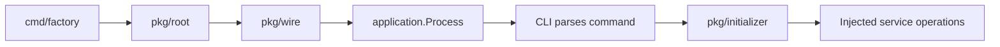
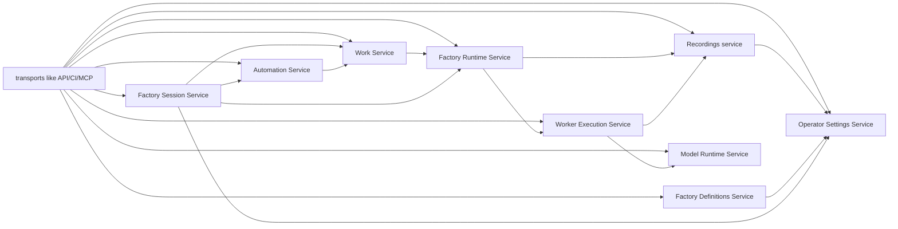
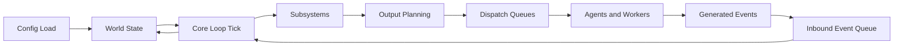
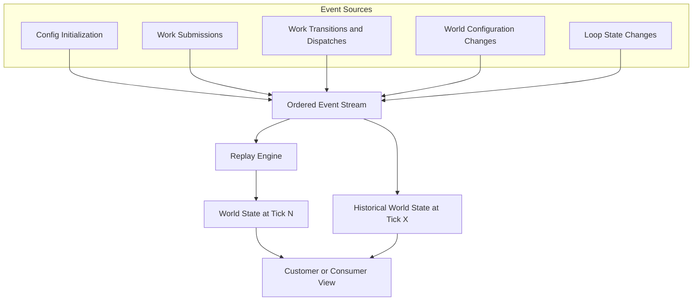
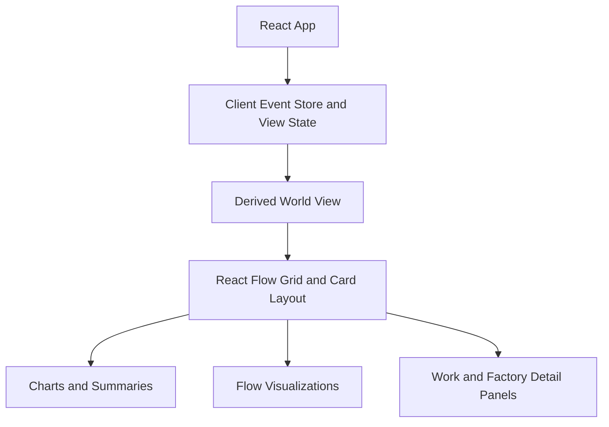
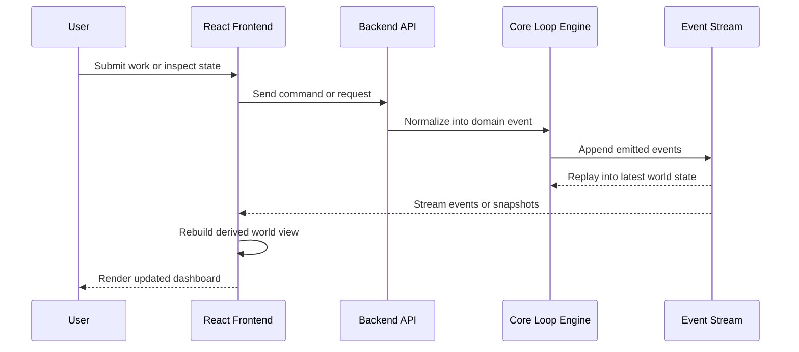

# Backend

## What?

The backend is largely a golang based backend that is responsible for orchestrating AI agents together. The architecture is largely straightforward and is generic to extension in various angles.

### abstractions
The primary abstractions the backend works off of are:
- factory
- work
- workers
- workstations
- factory sessions
- factory definition
- models
- automations
- recordings

### interactions
- A factory is a place where workers do work in workstations.
- Factories are defined in a factory definition.
- A factory is run inside of a factory session.
- A factory session takes care of handling of wiring up the workers, work, automations and event recorder with the factory.
- A worker can use models to run.

## package-structured
see ./packaged-structure.md for more details on how package structures is supposed to work.

## System flow

Process construction and command execution follow one path:

1. `cmd/factory` passes process input to `pkg/root`.
2. `pkg/root.BuildProcess` calls `pkg/wire.InjectBundle` once to construct the
   complete inert `application.Process`.
3. `Process.Execute` creates a fresh CLI command tree over the already-injected
   roles.
4. CLI parsing selects an operation; `pkg/initializer` activates and owns the
   selected lifecycle. No command calls another injector or asks a process
   facade for a service bundle.

Wire constructs the Factory Runtime assembly service and its policy
dependencies once. Opening a Factory Session invokes that injected service
with session-owned values; it does not retrieve or call a bundle-level runtime
constructor.

The opened Factory Session reports each service role explicitly. No
`bundle.Bundle` crosses into Initializer or a transport, so HTTP, invocation,
MCP, and runtime-backed session flows cannot select dependencies from a broad
service bag.

## System boundaries

The structure of the architecture is largely composed of a modular monolith, wherein we split each layer into a series of services.
Each service is responsible for some layer of complexity and all other consumers integrate against that abstracted service.

The services are meant to be deep, providing a simple abstraction that users of its interface can interact, but not outwardly.

The important rule is that no generic process facade owns all runtime behavior.
Transports receive narrow service interfaces, while `pkg/wire` composes their
implementations and `pkg/initializer` owns lifecycle.

### Current set of backend services

Runtime work should place new behavior in the narrow owner for the
responsibility being changed. The retired `pkg/service` and `pkg/runtimehost`
roots must not be recreated.

| Responsibility | Preferred owner for new implementation | Placement rule |
| --- | --- | --- |
| Process root and command handoff | `cmd/factory` and target `pkg/root` | Keep `cmd/factory` thin; construct one reusable process and execute customer input without predicting which service command will be selected. |
| Dependency construction and bundle assembly | target `pkg/wire` | Use the single `InjectBundle` entrypoint and one canonical provider set for production and functional external-edge injection. Construct one complete inert process graph; CLI selection activates an operation over injected roles and never calls a child injector or hidden full-graph builder. |
| Initializer lifecycle | `pkg/initializer` | Start, stop, cancel, join, and unwind already-constructed inert handles without constructing product services, transports, or Factory Session runtime state. |
| Transport boundaries | target `pkg/transports` | Own HTTP, CLI, MCP, generated transport contracts and clients, and boundary mapping. Translate into injected application/domain services; do not own domain policy or canonical runtime state. |
| Factory Session state and lifecycle | `pkg/services/factory_sessions` | Own the Wire-injected runtime-opening operation, live session registries, runtime identity, lifecycle gateways, event and response-stream access, durable start and resume, controls, results, dispatches, and persisted execution behavior for the customer-facing Factory Session. Runtime opening creates session-owned domain state from already-injected factories; it is not an application injection pass. Canonical ledger, replay, artifacts, and projection logic belong to Recordings. |
| Factory runtime | `pkg/services/factory_runtime` | Expose transport-neutral orchestration contracts through the Factory Runtime service root; keep source resolution, validation, preview preparation, runtime execution, and checkpoint implementation private to Factory Runtime. |
| Factory runtime loop | `pkg/services/factory_runtime` | Own event-first runtime behavior, subsystem coordination, scheduling, and emitted Factory events. |
| Factory event ledger, replay, artifacts, and projections | `pkg/services/recordings` | Own canonical event history, replay policy, durable execution artifacts, and read-model projections. |
| Workers and workstations | `pkg/services/workers` | Own worker and workstation execution, runner selection, prompt and output shaping, worktrees, mock-worker behavior, and invocation-time worker capability policy. Consume provider and model capabilities through their public service contracts. |
| Providers | `pkg/services/providers` | Own provider identity, catalog, configuration, lifecycle, ACP integration, and provider execution. Provider adapters and registries remain Providers-owned rather than Workers-owned. |
| Models and managed runtimes | `pkg/services/models` | Public behavior and Factory Session binding are operations on the root `models.Service`; implementation packages for runtime lifecycle, host supervision, assets, and catalog behavior live under `pkg/services/models/internal`, and `pkg/services/models/wire` is the only exported construction boundary. Wire injects the Models service directly—Factory Sessions does not own a Models constructor or opener. Models never call Workers; Workers consumes the public Models service when invocation needs a model. |
| Work domain | `pkg/services/work` | Own canonical Work, Work Request, content, dispatch identity, relations, payload lineage, query/selection, graph, pure invocation input and return policy, and materialization. Cron/time-work orchestration belongs to `pkg/services/automations`. Exclude Factory Session orchestration, worker/provider execution, Petri token state, and generic platform clocks. |
| Automations | `pkg/services/automations` | Own cron, filesystem watcher, script poller, hosted-source, reconciliation, and invocation scheduling behavior that observes or admits Work. |
| Provider Sessions | `pkg/services/provider_sessions` | Own provider-session discovery and provider transcript/session inspection. |
| Operator settings | `pkg/services/operator_settings` | Own operator configuration documents, defaults, input inventory, and effective settings resolution. |
| Factory visualization | `pkg/services/factory_visualization` | Own runtime presentation, live-view projections, and response-event presentation. |
| System initialization | `pkg/services/system_initialization` | Own system bootstrap and rollback operations. |
| Platform infrastructure | `pkg/platform` | Own cross-cutting logging, replay artifact filesystem mechanics, metrics, cursor storage, and non-domain clocks. Logging is canonical in `pkg/platform/logging`; collision-safe filesystem mechanics are canonical in `pkg/platform/replay`, while Factory event construction, reduction, recording lifecycle, deterministic delivery, and projections remain Recordings-owned; file-backed runtime metric recording is canonical in `pkg/platform/metrics` behind service-owned contracts; and real or deterministic clocks are canonical in `pkg/platform/clock` behind service-owned clock contracts. Platform implementations do not choose Factory, Factory Session, worker, model, scheduling, or Work policy. |
| Repository-only test support | `internal/testutil` or package-local `_test.go` files | Keep cross-package fixtures, mocks, assertions, and runtime or replay harnesses internal to this repository. Keep helpers coupled to one package beside that package's tests, and never import repository-only support from production code. |

When a change crosses rows, choose the owner that owns the durable state or
policy decision, then keep CLI, API, MCP, and UI code as adapters around that
owner. Customer-facing Factory Session behavior belongs in Factory Session
owners; Petri-net concepts stay behind the internal runtime boundary.

## System State

### System state of a session

The system largely operates off of a concept of a "factory session", which are instances of a loop along with its accoutrements, such as crons, daemon sse hooks, and other pollers.

There is a bit of complex wiring between factory sessions and runtime so we break it out as follows:

a factory session is responsible for:
1. retrieving the config/definition
2. converting all the config/definition and turning it into a declaration of what all services need to be activated
3. wiring the runtime factory with the appropriate set of definitions to execute
4. deploying the factory runtime and the appropriate services.

For example:

1. bob asks for a factory session to do some work
2. factory session gets the definition fo the factory, and figures out what all things needs to be deployed.
3. factory session sends requests to create all those resources.
4. factory wires the created resources together, i.e. tells the factory runtime service, what all worker hooks needs to be pushed to, wires the evnet hooks to push from th efactory runtime to the recorder etc.

The factory runtime is generally unaware of how the workers, recordsings, models, etc are running, it only knows that it has the service hooks wired to push to them. Same is true for all the other services.

### Core Loop

The backend centers on a deterministic tick loop that updates a shared world state from submitted events. Each tick reads pending inputs, applies subsystem logic, and emits outputs that are handed off to queues and workers.

The loop is intentionally closed: workers and agents do not mutate the world directly. They produce outputs that re-enter the system as events, which keeps the state transition history explicit and replayable.

### Event Stream

The world is derived from an ordered event stream rather than a collection of opaque mutable objects. This stream is the durable source of truth for replay, synchronization, and historical inspection.

At any tick, the current world is the composition of all prior events. Because the stream is deterministic, customers can receive the same event history and reconstruct a consistent view at any chosen timestamp or tick.

`SESSION_LIFECYCLE_CONTROL` events record accepted Factory Session pause, resume,
and related lifecycle controls. Replay and status reads use those events together
with loop-state changes so current and historical session lifecycle state stay
aligned with live control operations.

# Front End

The frontend is an embedded React application that consumes the backend event stream and derives a customer-facing world view from it. The UI emphasizes composable dashboards and visualizations rather than owning the authoritative system state.

## Frontend Composition

The React layer receives events, derives projections for the current world, and renders that state through cards, charts, and flow-oriented views.

## Frontend and Backend Integration

The frontend and backend are connected by an event-oriented contract. The backend owns execution, scheduling, and replayable history; the frontend subscribes to that history, derives projections, and sends user actions back as submissions.

This split keeps the frontend lightweight and keeps the backend authoritative. The same event stream that powers execution can also power dashboards, audit history, and deterministic replay.

### Editor state

The graph editor state represents the website's way of managing the world state.

The event stream is cloud-backed input, but the dashboard snapshot used by current activity is client-computed from events:

You can sort of see here that basically as events get streamed in, the events get streamed in.

1. from that event stream we construct snapshots of the world state at every single sample time.
2. Then the world state at a sample time presents the factory graph. the workstations, workers, work types, states, and their projection layout.
3. Then from that world state,  corresponding new UI state is persisted and combined with an internal editor stream of operations.
4. From the editor operation stream + world state, a projected currented factory/editor state is created.
5. from the editor state, we map the factory/editor state into a projection that is bespoke to the view of teh "react flow library"
6. from that flow library projection and the editor state we create a fnal state that is called the view model.
7. the state changes from the view model are projected out to the components, and components render and operate against changes by sending hook calls into the view model.
8. the view model is responsible for injecting calls into the editor state, which is then responsible for sending API calls to the backend.
9. the backend, as it finishes changes sends back events to the event stream denoting the world stat echanges as a consequences of API operations.

```mermaid
flowchart LR
  stream["Cloud event stream\nFactoryEvent SSE"]:::cloud
  hook["useFactoryEventStream"]:::client
  events["FactoryEvent[]\nuseFactoryTimelineStore"]:::client
  replay["reconstructWorldState"]:::client
  projected["projectSnapshot"]:::client
  snapshot["Computed DashboardSnapshot / WorldState\nselected tick"]:::client
  graphState["Current activity graph state"]:::client
  flowProjection["Computed React Flow graph\nnodes + edges + viewport"]:::client

  stream --> hook --> events --> replay --> projected --> snapshot
  snapshot --> graphState --> flowProjection
  snapshot --> flowProjection

  classDef cloud fill:#fee2e2,stroke:#b91c1c,color:#7f1d1d
  classDef client fill:#dbeafe,stroke:#1d4ed8,color:#1e3a8a
```

