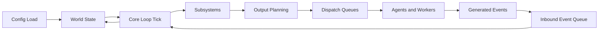
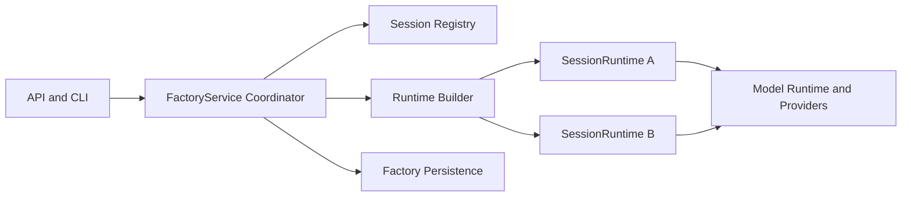
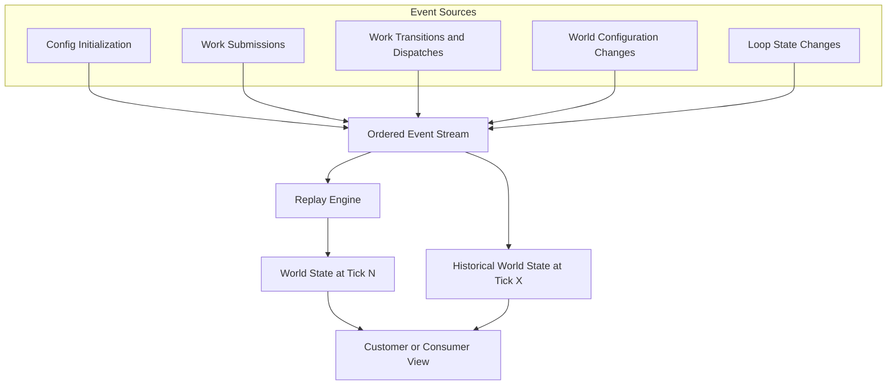
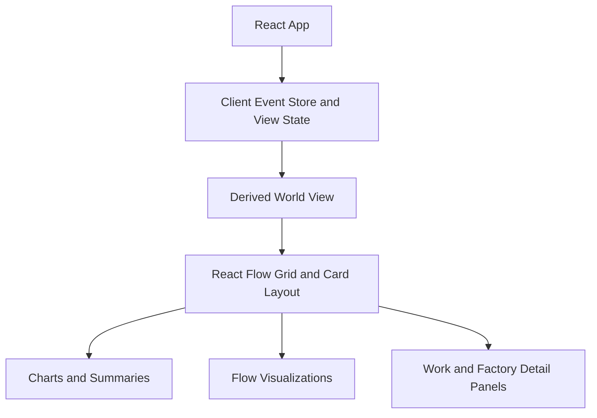
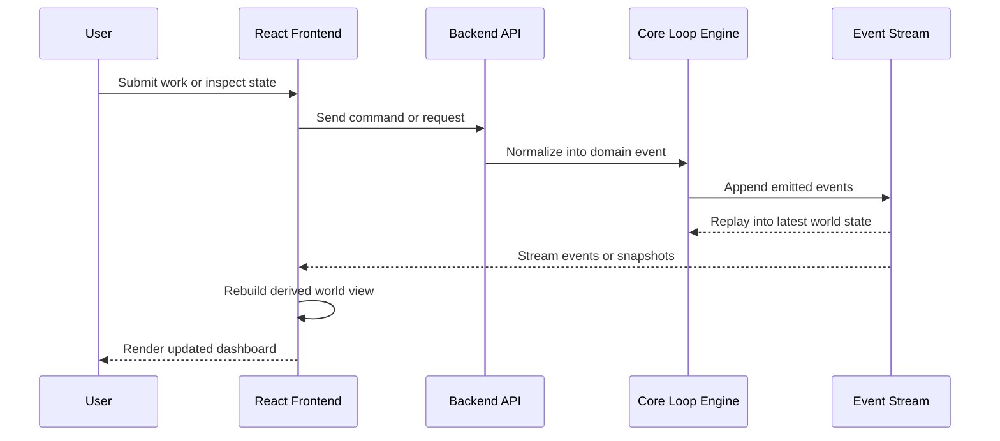

# Backend

## Runtime Startup Ownership

Runtime cleanup work should move process wiring toward this preferred ownership
path:

`cmd/factory -> pkg/root -> pkg/inject -> pkg/initializer -> transports/app graph`

```mermaid
flowchart LR
    cmd["cmd/factory"]
    root["pkg/root"]
    inject["pkg/inject"]
    graph["app dependency graph"]
    initializer["pkg/initializer"]
    transports["API / CLI / MCP transports and sidecars"]
    sessions["Factory Sessions"]

    cmd --> root
    root --> inject
    inject --> graph
    root --> initializer
    graph --> initializer
    initializer --> transports
    graph --> sessions
```

`cmd/factory` is the thin process entrypoint. It should parse only the process
boundary concerns required to hand control to the root package, then avoid
owning runtime composition or transport-specific dependency construction.

`pkg/root` selects the process mode and top-level behavior for the current
invocation, such as API service hosting, local CLI execution, or sidecar startup.
It owns root command flow and chooses which already-defined startup path to run.

`pkg/inject` builds the application dependency graph from explicit inputs. It is
the target owner for dependency construction, config-loaded collaborators, and
service graph assembly. The graph it returns should be usable by multiple
startup modes without hiding filesystem, environment, process, or transport
dependencies in package globals.

`pkg/initializer` starts transports and sidecars from already-built services. It
attaches API, CLI, MCP, or other process adapters to the assembled graph rather
than rebuilding session runtime state or reaching around the graph for ad hoc
dependencies.

This startup path preserves the event-first runtime model. Transports submit
commands into Factory Session APIs, workers and agents emit outputs, and those
outputs re-enter the runtime as Factory events. They do not mutate canonical
Factory Session state directly.

## Core Loop

The backend centers on a deterministic tick loop that updates a shared world state from submitted events. Each tick reads pending inputs, applies subsystem logic, and emits outputs that are handed off to queues and workers.



The loop is intentionally closed: workers and agents do not mutate the world directly. They produce outputs that re-enter the system as events, which keeps the state transition history explicit and replayable.

## Service and Session Boundaries

Multi-session runtime hosting adds a second architecture boundary on top of the
core loop:

- the service coordinates sessions
- each session owns one runtime
- runtime construction is driven by immutable session build inputs



The important rule is that `FactoryService` routes and coordinates, but does
not become the canonical owner of per-session runtime state.

### Factory Session state ownership

A Factory Session owns both live and durable session state. That ownership
includes the runtime instances created for the session, the ordered Factory
event history, lifecycle and control state, current work, the Current Factory,
and session read models derived for APIs, CLI callers, and dashboards.

`FactoryService` coordinates APIs, CLI calls, session registries, persistence,
runtime construction, and model/runtime dependencies. It can locate, construct,
and route to Factory Sessions, but it must not become the owner of per-session
runtime state. Stateful runtime changes should land in the Factory Session
domain or the session execution owner that serves it, with `FactoryService`
remaining a coordinator around those owners.

Dynamic workflow execution follows the same rule. A JavaScript orchestrator is a
Factory Session execution kind, so its source snapshots, progress, event
history, lifecycle controls, current work, Provider Sessions, and result read
models belong to Factory Session execution surfaces. Customer-facing APIs and
docs should describe those runs as Factory Session execution, not as a separate
public runtime resource.

### Logical session identity and restart recovery

Dashboard tabs and other long-lived clients can persist logical session intent
(`backendScopeID`, `logicalSessionKeyID`) separately from the current live
`factorySessionID` and `streamGenerationID`. After backend restart, sync
preflight resolves logical identity to the replacement live session before SSE
reconnect or timeline checkpoint restore.

`logicalSessionKeyID` is derived deterministically from normalized factory
session targets (default, folder-scoped, named, and provider-backed forms). The
backend does not allocate or persist a separate logical-session table for this
identity.

See `docs/architecture/logical-session-identity.md` for target normalization
rules, remap outcomes, preserved vs dropped client state, and verification
surfaces.

## Event Stream

The world is derived from an ordered event stream rather than a collection of opaque mutable objects. This stream is the durable source of truth for replay, synchronization, and historical inspection.



At any tick, the current world is the composition of all prior events. Because the stream is deterministic, customers can receive the same event history and reconstruct a consistent view at any chosen timestamp or tick.

`SESSION_LIFECYCLE_CONTROL` events record accepted Factory Session pause, resume,
and related lifecycle controls. Replay and status reads use those events together
with loop-state changes so current and historical session lifecycle state stay
aligned with live control operations.

# Front End

The frontend is an embedded React application that consumes the backend event stream and derives a customer-facing world view from it. The UI emphasizes composable dashboards and visualizations rather than owning the authoritative system state.

## Frontend Composition



The React layer receives events, derives projections for the current world, and renders that state through cards, charts, and flow-oriented views.

## Frontend and Backend Integration

The frontend and backend are connected by an event-oriented contract. The backend owns execution, scheduling, and replayable history; the frontend subscribes to that history, derives projections, and sends user actions back as submissions.



This split keeps the frontend lightweight and keeps the backend authoritative. The same event stream that powers execution can also power dashboards, audit history, and deterministic replay.

### Editor state

The graph editor state represents the website's way of managing the world state. 

The event stream is cloud-backed input, but the dashboard snapshot used by current activity is client-computed from events:

You can sort of see here that basically as events get streamed in, the events get streamed in. 

1. from that event stream we construct snapshots of the world state at every single sample time.
2. Then the world state at a sample time presents the factory graph. the workstations, workers, work types, states, and their projection layout. 
3. Then from that world state,  corresponding new UI state is persisted and combined with an internal editor stream of operations. 
4. From the editor operation stream + world state, a projected currented factory/editor state is created. 
5. from the editor state, we map the factory/editor state into a projection that is bespoke to the view of teh "react flow library"
6. from that flow library projection and the editor state we create a fnal state that is called the view model. 
7. the state changes from the view model are projected out to the components, and components render and operate against changes by sending hook calls into the view model. 
8. the view model is responsible for injecting calls into the editor state, which is then responsible for sending API calls to the backend. 
9. the backend, as it finishes changes sends back events to the event stream denoting the world stat echanges as a consequences of API operations. 

```mermaid
flowchart LR
  stream["Cloud event stream\nFactoryEvent SSE"]:::cloud
  hook["useFactoryEventStream"]:::client
  events["FactoryEvent[]\nuseFactoryTimelineStore"]:::client
  replay["reconstructWorldState"]:::client
  projected["projectSnapshot"]:::client
  snapshot["Computed DashboardSnapshot / WorldState\nselected tick"]:::client
  graphState["Current activity graph state"]:::client
  flowProjection["Computed React Flow graph\nnodes + edges + viewport"]:::client

  stream --> hook --> events --> replay --> projected --> snapshot
  snapshot --> graphState --> flowProjection
  snapshot --> flowProjection

  classDef cloud fill:#fee2e2,stroke:#b91c1c,color:#7f1d1d
  classDef client fill:#dbeafe,stroke:#1d4ed8,color:#1e3a8a
```



