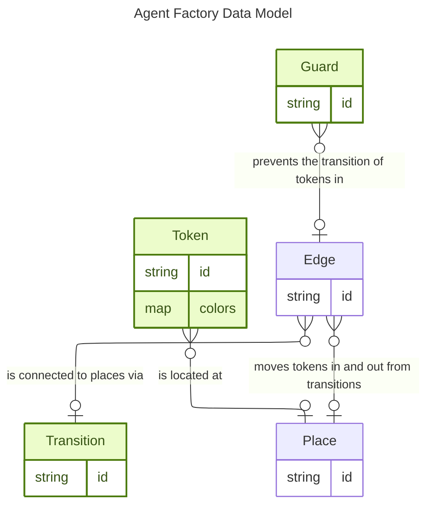
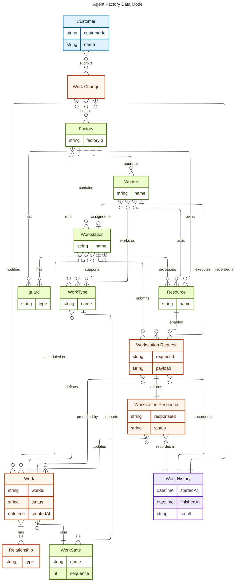

# Data model

This document captures the Agent Factory data model and separates entities into two layers:
- Customer-facing surface
- Factory internals

The data model has a customer facing data model and an internal data model. 

The internal data model is what is defined in business processes a "petri net with colored tokens and guarded transitions" 
The factory customer data model is an abstraction over that petri net that makes customers lives easier to deal with. The raw tokens/transitions ends up far too verbose to express reasonably. 

## Canonical public resource vocabulary

The public API and customer-facing documentation should use these resource meanings consistently:

- `Factory`: a persisted factory definition and the canonical public document for reading, editing, saving, importing, and exporting authored factory configuration. A `Factory` is not a live runtime session.
- `Factory Session`: one live running factory instance identified by `session_id`. A factory session owns runtime state such as event history, current work, and the currently active factory loaded into that session.
- `Current Factory`: the factory definition currently active inside one factory session. This is a session-scoped view of the canonical `Factory` resource, not a separate long-lived resource type.
- `Work`: one customer-visible unit of work moving through a factory according to the configured work types, work states, workstations, workers, and guards.
- `Work Request`: one caller-authored request that creates or upserts work through the public API. A work request is distinct from the runtime work items it creates or updates.
- `Provider Session`: one provider-backed execution session or transcript-bearing interaction owned by a workstation run or related runtime activity. Provider sessions are runtime inspection resources, not factory-definition resources.

These terms are the primary public resource model. Internal Petri-net concepts such as tokens, transitions, places, and edges remain implementation details that support the runtime, but they are not the primary customer-facing API resources.

## Internal system data model

## Customer data model 

This denotes the data model that we express to customers. Customers deal with work that goes into a factory. The factory has workstations that take in work. The factory/workstations have guards that protect the individual work.

Work is categorized by a work type. A work type defines the supported work states that work of that type can move through. Workstations and workers operate over those work types and states: a workstation declares the kind of work it can handle, and workers can be assigned to workstations to perform specific categories of work.

