# Structures

This document describes the current high-level shape of the You Agent Factory
and its prospective microservice topology. Target service boundaries should also
guide modular-monolith boundaries before services are deployed independently.

## Target architectural rules

- Each stateful service owns and persists its state. Services must not read or
  write another service's datastore.
- Services are responsible for constructing and defining their target state and reconciling their underlyings against their target state. 
- Cross-service behavior uses explicit commands, queries, and published events.
  Shared storage and implicit filesystem integration are not service contracts.
- Each service is representative of a complex and deep interface, providing abstraction for a larger set of complexity. 
- Services run as independent functions, and are each indivdiually responsible for their own daemons and long running services. 
- Event streams are clean. 
- Schemas and definitions are configuration based. 

## Visual language

| Type | Shape | Color | Meaning |
| --- | --- | --- | --- |
| External actor | Stadium | Gray | A person, agent, or external system outside the platform |
| Client | Rounded rectangle | Blue | A customer-facing application or client surface |
| Interface | Parallelogram | Cyan | A synchronous or streaming protocol boundary |
| Gateway service | Subroutine | Teal | A protocol-neutral routing and policy boundary |
| Explicit reconciler | Subroutine | Indigo | Automation or Factory Session desired/observed-state workflow management |
| Control-plane service | Subroutine | Purple | Identity, desired state, placement, and lifecycle coordination |
| Execution service | Subroutine | Orange | Runtime or provider work that actively executes customer work |
| Domain service | Subroutine | Green | A bounded business capability with its own state and contract |
| Automation service | Subroutine | Pink | A source of scheduled or externally triggered Work Requests |
| Event infrastructure | Hexagon | Amber | Durable cross-service event delivery |
| Datastore | Cylinder | Dark slate | State exclusively owned by its enclosing service |
| Contract artifact | Document | Lavender | Generated schemas, inventories, or client artifacts |

Arrow labels identify the interaction type. `command` and `query` interactions
target a service-owned interface. Dashed `event` interactions are asynchronous
facts. A service may expose several protocols without giving callers access to
its internal store. Command arrows describe logical ownership, not a permanent
synchronous transport requirement: a command may move from an in-process call
to a durable command stream without changing its owning service.

## CURRENT

The current system is a modular Go application with an embedded React dashboard.
The graph below shows implementation and lifecycle boundaries rather than
prospective deployment units. Dashed red nodes are migration-only compatibility
roots; sidecars and shared filesystem access are current-state facts, not target
architecture recommendations.

```mermaid
flowchart LR
    currentCustomer([Customer])
    currentAgent([Agent])

    subgraph currentClients[Current clients]
        currentWebsite(Embedded React dashboard)
        currentCLI(You CLI)
        currentAgentClient(Agent client)
    end

    subgraph currentStartup[Process startup and composition]
        currentCmd[[cmd/factory]]
        currentRoot[[pkg/root]]
        currentWire[[pkg/wire]]
        currentInitializer[[pkg/initializer]]
        currentProcess[(application.Process)]
        currentCLISelection{CLI-selected operation}

        currentCmd --> currentRoot
        currentRoot -->|BuildProcess| currentWire
        currentWire -->|InjectBundle: complete inert graph| currentProcess
        currentProcess -->|Execute: fresh command tree| currentCLISelection
        currentCLISelection -->|activates injected roles| currentInitializer
    end

    subgraph currentTransports[Transport adapters]
        currentHTTP[/pkg/transports/http\nREST + Factory SSE + Response SSE/]
        currentCLITransport[/pkg/transports/cli/]
        currentMCP[/pkg/transports/mcp/]
        currentMapping[[pkg/transports/mapping]]
        currentGenerated[[Generated server and clients]]

        currentHTTP --> currentMapping
        currentCLITransport --> currentMapping
        currentMCP --> currentMapping
        currentGenerated -.->|typed contracts| currentHTTP
    end

    subgraph currentDefinitions[Factory definition and configuration]
        currentLoading[[pkg/services/factory_definitions/loading]]
        currentDefinition[[pkg/services/factory_definitions]]
        currentValidation[[pkg/services/factory_definitions/validation]]
        currentMappingAdapter[[pkg/transports/mapping/factoryconfig]]
        currentFactoryFiles[(Factory and system configuration files)]

        currentLoading -->|loads| currentFactoryFiles
        currentDefinition --> currentValidation
        currentMappingAdapter -->|maps authored representations| currentDefinition
        currentDefinition -->|persists through owned service| currentFactoryFiles
    end

    subgraph currentSessions[Factory Session ownership]
        currentSessionGateway[[pkg/services/factory_sessions/service]]
        currentControlPlane[[controlplane]]
        currentDataPlane[[dataplane]]
        currentExecution[[execution and durable lifecycle]]
        currentSessionRegistry[(Live session registry)]
        currentCanonicalStream[[Canonical Factory Event stream]]
        currentResponseStream[[Ephemeral response-event stream]]
        currentProviderProjection[[pkg/services/provider_sessions\nProvider Session inspection]]
        currentCodexProviderSessions[[codex\nJSONL discovery and parsing]]
        currentCursorProviderSessions[[cursor\nstore.db discovery and parsing]]

        currentSessionGateway --> currentControlPlane
        currentSessionGateway --> currentDataPlane
        currentSessionGateway --> currentExecution
        currentSessionGateway --> currentSessionRegistry
        currentExecution --> currentCanonicalStream
        currentExecution --> currentResponseStream
        currentExecution --> currentProviderProjection
        currentProviderProjection --> currentCodexProviderSessions
        currentProviderProjection --> currentCursorProviderSessions
    end

    subgraph currentRuntime[Factory runtime]
        currentFactoryRuntime[[pkg/services/factory_runtime/runtime]]
        currentEngine[[pkg/services/factory_runtime/engine core tick loop]]
        currentSubmissionBuffer[(Submission buffer)]
        currentResultBuffer[(Worker-result buffer)]

        subgraph currentSubsystems[Ordered runtime subsystems]
            currentCircuitBreaker[[Circuit breaker]]
            currentDispatcher[[Dispatcher and scheduler]]
            currentHistory[[History]]
            currentTransitioner[[Transitioner]]
            currentCascadingFailure[[Cascading failure]]
            currentTracer[[Tracer]]
            currentTermination[[Termination check]]

            currentCircuitBreaker --> currentDispatcher
            currentDispatcher --> currentHistory
            currentHistory --> currentTransitioner
            currentTransitioner --> currentCascadingFailure
            currentCascadingFailure --> currentTracer
            currentTracer --> currentTermination
        end

        currentFactoryRuntime --> currentEngine
        currentEngine -->|drains| currentSubmissionBuffer
        currentEngine -->|drains| currentResultBuffer
        currentEngine -->|runs tick phases| currentCircuitBreaker
    end

    subgraph currentWork[Work domain packages]
        currentWorkContent[[content]]
        currentWorkMaterialize[[materialize]]
        currentWorkQuery[[query]]
        currentWorkGraph[[graph and lineage]]
        currentInvocation[[invocation policy]]
        currentTimeWork[[cron and time-work]]
    end

    subgraph currentWorkers[Worker execution]
        currentWorkerService[[pkg/services/workers/service\nworker invocation]]
        currentWorkerExecutor[[pkg/services/workers/executor]]
        currentProviderAdapters[[pkg/services/workers/provider adapters]]
        currentHostedWorkers[[pkg/services/workers/services/hosted_logic]]
        currentWorktrees[[pkg/services/workers/worktree]]

        currentWorkerService --> currentWorkerExecutor
        currentWorkerExecutor --> currentProviderAdapters
        currentWorkerExecutor --> currentHostedWorkers
        currentWorkerExecutor --> currentWorktrees
    end

    subgraph currentAutomation[Automation]
        currentAutomationService[[pkg/services/automations\ncron, poller, and watcher supervision]]
        currentAutomationService --> currentWorkContent
    end

    subgraph currentModels[Managed models]
        currentModelService[[pkg/services/models/internal/service]]
        currentModelHost[[pkg/services/models/internal/host]]
        currentLocalModels[[pkg/services/models/internal/local]]
        currentModelAssets[[pkg/services/models/internal/assets]]

        currentModelService --> currentModelHost
        currentModelHost --> currentLocalModels
        currentModelHost --> currentModelAssets
    end

    subgraph currentPersistence[Current persistence and platform infrastructure]
        currentSessionRecordings[(Factory Session recordings)]
        currentArtifacts[(Replay and artifact files)]
        currentMetrics[(Metrics and cursor state)]
        currentLogs[(Runtime log files)]
        currentLogging[[pkg/logging]]
        currentReplay[[pkg/replay]]
        currentSessionPersistence[[pkg/services/factory_sessions/cursors/persistence]]
        currentInternalPlatform[[pkg/internal/metrics and cursorstorage]]

        currentLogging --> currentLogs
        currentReplay --> currentArtifacts
        currentSessionPersistence --> currentSessionRecordings
        currentInternalPlatform --> currentMetrics
    end

    subgraph currentUI[Dashboard event projection]
        currentUIAPI[[UI API adapters]]
        currentEventHook[[useFactoryEventStream]]
        currentTimelineStore[[Factory timeline store]]
        currentReplayWorld[[reconstructWorldState]]
        currentProjectSnapshot[[projectSnapshot]]
        currentDashboard[[Dashboard, editor, outcomes, and detail views]]

        currentUIAPI --> currentEventHook
        currentEventHook --> currentTimelineStore
        currentTimelineStore --> currentReplayWorld
        currentReplayWorld --> currentProjectSnapshot
        currentProjectSnapshot --> currentDashboard
    end

    subgraph currentContracts[Authored and generated contracts]
        currentOpenAPI@{ shape: doc, label: "api/openapi-main.yaml + components" }
        currentGeneratedContracts@{ shape: docs, label: "Generated Go and TypeScript contracts" }
        currentAPIPackage@{ shape: doc, label: "packages/api generated publication" }

        currentOpenAPI -->|generates| currentGeneratedContracts
        currentOpenAPI -->|publishes| currentAPIPackage
    end

    subgraph currentProviders[External providers]
        currentClaude([Claude])
        currentCursor([Cursor])
        currentCodex([Codex])
        currentOpenCode([OpenCode])
        currentGemini([Gemini])
        currentKiro([Kiro])
        currentPi([Pi])
        currentHosted([Hosted systems])
    end

    currentCustomer --> currentWebsite
    currentCustomer --> currentCLI
    currentAgent --> currentAgentClient
    currentWebsite --> currentHTTP
    currentCLI --> currentCLITransport
    currentAgentClient --> currentMCP

    currentInitializer -->|starts selected transport| currentHTTP
    currentInitializer -->|starts selected transport| currentCLITransport
    currentInitializer -->|starts selected transport| currentMCP
    currentInitializer -->|starts current sidecars| currentWorkerService

    currentMapping --> currentSessionGateway
    currentMapping --> currentDefinition
    currentMapping --> currentModelService
    currentMapping --> currentWorkQuery
    currentControlPlane --> currentExecution
    currentDataPlane --> currentFactoryRuntime
    currentExecution --> currentFactoryRuntime
    currentExecution -->|persists canonical history| currentSessionRecordings

    currentSessionGateway -->|normalizes Work content| currentWorkContent
    currentWorkContent --> currentWorkMaterialize
    currentSessionGateway -->|submits admitted Work| currentSubmissionBuffer
    currentTimeWork --> currentWorkerService
    currentDispatcher -->|in-process dispatch| currentWorkerExecutor
    currentWorkerExecutor -->|writes result| currentResultBuffer
    currentProviderAdapters --> currentClaude
    currentProviderAdapters --> currentCursor
    currentProviderAdapters --> currentCodex
    currentProviderAdapters --> currentOpenCode
    currentProviderAdapters --> currentGemini
    currentProviderAdapters --> currentKiro
    currentProviderAdapters --> currentPi
    currentHostedWorkers --> currentHosted
    currentWorkerExecutor -->|managed inference| currentModelService
    currentWorkerService -->|submits Work Requests| currentSessionGateway

    currentCanonicalStream --> currentHTTP
    currentResponseStream --> currentHTTP
    currentProviderProjection --> currentMapping
    currentHTTP -.->|Factory Event SSE| currentUIAPI
    currentHTTP -.->|Response Event SSE| currentUIAPI

    currentConfig --> currentWire
    currentConfig --> currentFactoryRuntime
    currentGeneratedContracts -.-> currentGenerated
    currentGeneratedContracts -.-> currentUIAPI

    classDef currentExternal fill:#f3f4f6,stroke:#4b5563,color:#111827,stroke-width:1.5px
    classDef currentClient fill:#dbeafe,stroke:#2563eb,color:#1e3a8a,stroke-width:1.5px
    classDef currentInterface fill:#cffafe,stroke:#0891b2,color:#164e63,stroke-width:1.5px
    classDef currentControl fill:#ede9fe,stroke:#7c3aed,color:#4c1d95,stroke-width:2px
    classDef currentExecution fill:#ffedd5,stroke:#ea580c,color:#7c2d12,stroke-width:2px
    classDef currentDomain fill:#dcfce7,stroke:#16a34a,color:#14532d,stroke-width:2px
    classDef currentPlatform fill:#e2e8f0,stroke:#475569,color:#0f172a,stroke-width:1.5px
    classDef currentStore fill:#334155,stroke:#0f172a,color:#f8fafc,stroke-width:1.5px
    classDef currentContract fill:#f5f3ff,stroke:#8b5cf6,color:#4c1d95,stroke-width:1.5px
    classDef currentMigration fill:#fee2e2,stroke:#dc2626,color:#7f1d1d,stroke-width:2px,stroke-dasharray:5 3

    class currentCustomer,currentAgent,currentClaude,currentCursor,currentCodex,currentOpenCode,currentGemini,currentKiro,currentPi,currentHosted currentExternal
    class currentWebsite,currentCLI,currentAgentClient,currentDashboard currentClient
    class currentHTTP,currentCLITransport,currentMCP currentInterface
    class currentCmd,currentRoot,currentWire,currentInitializer,currentSessionGateway,currentControlPlane,currentDataPlane currentControl
    class currentFactoryRuntime,currentEngine,currentCircuitBreaker,currentDispatcher,currentHistory,currentTransitioner,currentCascadingFailure,currentTracer,currentTermination,currentWorkerService,currentWorkerExecutor,currentProviderAdapters,currentHostedWorkers,currentWorktrees,currentModelService,currentModelHost,currentLocalModels,currentModelAssets currentExecution
    class currentMapping,currentDefinition,currentValidation,currentWorkContent,currentWorkMaterialize,currentWorkQuery,currentWorkGraph,currentInvocation,currentTimeWork,currentExecution,currentCanonicalStream,currentResponseStream,currentProviderProjection currentDomain
    class currentConfig,currentLogging,currentReplay,currentSessionPersistence,currentInternalPlatform,currentUIAPI,currentEventHook,currentTimelineStore,currentReplayWorld,currentProjectSnapshot currentPlatform
    class currentGraph,currentFactoryFiles,currentSessionRegistry,currentSubmissionBuffer,currentResultBuffer,currentSessionRecordings,currentArtifacts,currentMetrics,currentLogs currentStore
    class currentGenerated,currentOpenAPI,currentGeneratedContracts,currentAPIPackage currentContract

    style currentStartup fill:#f5f3ff,stroke:#c4b5fd,color:#4c1d95
    style currentTransports fill:#ecfeff,stroke:#67e8f9,color:#164e63
    style currentSessions fill:#f5f3ff,stroke:#c4b5fd,color:#4c1d95
    style currentRuntime fill:#fff7ed,stroke:#fdba74,color:#7c2d12
    style currentWorkers fill:#fff7ed,stroke:#fdba74,color:#7c2d12
    style currentModels fill:#fff7ed,stroke:#fdba74,color:#7c2d12
    style currentUI fill:#eff6ff,stroke:#93c5fd,color:#1e3a8a
```

### problems with the current architecture: 
1. we lack appropriate definitions of services and the interaction layers between components is too incestuous
2. the systems require more independence
3. there is stale abstractions that we should remove in their entirety as we evolved the overall system architecture
4. there is a lack of system consistency in the case of failure
5. there is a lack of appropriate borders for maintaining target state and system consistency against target state.

### lack of abstractions

1. there is a need for further abstraction of daemons and runtimes. 
2. there is lack of segmentation of responsibilities between events and recordings and the general event stream. 

### ideal: 
1. system gets a target declared state
2. system delegates entry and constructs target states on each service
3. each service instantiates their world state based on the target declared state
4. each service is responsible for the consistency and availability of their target world state
5. websites and other interfaces operate off of a materialization of the world state, rather than a snapshot in time. 

## TARGET (WIP)

The target has nine logical product services:

| Service | Authoritative responsibility |
| --- | --- |
| Factory Definition | Definition validation, persistence, versioning, and activation |
| Factory Session | Session identity, desired lifecycle, placement, recovery, and discovery |
| Factory Runtime | Per-session execution, orchestration, dispatch planning, and checkpoints |
| Work | Work Request admission, Work content, lineage, materialization, and queries |
| Worker Execution | Executor construction, worker routing, capacity, and execution |
| Provider Session | Provider-session lifecycle, continuation, transcripts, and response events |
| Model Runtime | Model catalog, assets, readiness, leases, and inference |
| Automation | Cron, pollers, watchers, listeners, cursors, and generated Work Requests |
| Session Ledger and Projection | Canonical event ordering/replay, artifacts, response streams, and query projections |

The target diagram renders Ledger and Projection as separate components because
they have different scaling and storage characteristics. They remain one logical
service family initially and can split into independently deployed services
without changing the other eight boundaries. `pkg/wire` constructs these
services and `pkg/initializer` owns process lifecycle; neither is a product
service.

```mermaid
flowchart LR
    customer([Customer])
    agent([Agent])
    externalSystem([External system])

    subgraph clients[Client applications]
        website(React dashboard)
        cli(You CLI)
        agentClient(Agent client)
    end

    subgraph edge[Client and protocol boundary]
        apiGateway[[API Gateway]]
        rest[/REST API/]
        sse[/Factory Event SSE/]
        responseSSE[/Response Event SSE/]
        cliInterface[/CLI interface/]
        mcp[/MCP interface/]
    end

    subgraph definitionService[Factory Definition Service]
        definitions[[Factory definition API]]
        definitionStore[(Factory definition store)]
        definitions -->|persists| definitionStore
    end

    subgraph sessionControl[Factory Session Control Plane]
        sessionAPI[[Session lifecycle and discovery]]
        sessionReconciler[[Factory Session reconciler]]
        placement[[Execution placement and leases]]
        sessionStore[(Session control store)]
        sessionAPI -->|desired lifecycle command| sessionReconciler
        sessionReconciler -->|persists| sessionStore
        sessionReconciler -->|placement workflow| placement
    end

    subgraph runtimeService[Factory Runtime Service]
        runtimeAPI[[Session execution endpoint]]
        factoryRuntime[[Factory runtime]]
        coreLoop[[Core tick loop]]
        orchestrators[[Petri and JavaScript orchestrators]]
        subsystemPipeline[[Ordered tick subsystem pipeline]]
        circuitBreaker[[Circuit-breaker subsystem]]
        historySubsystem[[History subsystem]]
        transitionSubsystem[[Orchestration and transition subsystem]]
        cascadingFailure[[Cascading-failure subsystem]]
        traceRecorder[[Trace and event-recording subsystem]]
        terminationSubsystem[[Termination subsystem]]
        dispatchPlanner[[Buffered dispatch subsystem]]
        runtimeStore[(Runtime checkpoints)]
        submissionBuffer[(Submission buffer)]
        resultBuffer[(Worker-result buffer)]
        dispatchBuffer[(Dispatch-request buffer)]

        runtimeAPI -->|start, stop, or recover| factoryRuntime
        factoryRuntime -->|persists observed state| runtimeStore
        factoryRuntime --> coreLoop
        runtimeAPI -->|writes admitted Work| submissionBuffer
        runtimeAPI -->|writes Worker Results| resultBuffer
        coreLoop -->|drains| submissionBuffer
        coreLoop -->|drains| resultBuffer
        coreLoop -->|runs ordered phases| subsystemPipeline
        subsystemPipeline --> circuitBreaker
        circuitBreaker --> historySubsystem
        historySubsystem --> transitionSubsystem
        transitionSubsystem --> cascadingFailure
        cascadingFailure --> traceRecorder
        traceRecorder --> terminationSubsystem
        transitionSubsystem -->|uses| orchestrators
        transitionSubsystem -->|generated Work| submissionBuffer
        transitionSubsystem -->|transition Dispatch Request| dispatchBuffer
        dispatchPlanner -->|pulls| dispatchBuffer
    end

    subgraph workService[Work Service]
        workRequestAPI[[Work Request intake]]
        dispatchAPI[[Dispatch Request intake]]
        workCoordinator[[Work and dispatch coordinator]]
        workQuery[[Work content, lineage, and query]]
        workStore[(Work and dispatch store)]

        workRequestAPI -->|desired Work command| workCoordinator
        dispatchAPI -->|desired standalone dispatch| workCoordinator
        workCoordinator -->|persists| workStore
        workQuery -->|reads| workStore
    end

    subgraph automationService[Automation Service]
        automationAPI[[Automation management]]
        automationReconciler[[Automation reconciler]]
        cron[[Cron generation]]
        listeners[[External event generation]]
        watchers[[Filesystem and source watchers]]
        pollers[[Provider and hosted-system pollers]]
        automationStore[(Automation definitions and cursors)]

        automationAPI -->|desired automation command| automationReconciler
        automationReconciler -->|persists| automationStore
        automationReconciler --> cron
        automationReconciler --> listeners
        automationReconciler --> watchers
        automationReconciler --> pollers
        cron -->|reads schedules| automationStore
        listeners -->|reads subscriptions| automationStore
        watchers -->|reads cursors| automationStore
        pollers -->|reads cursors| automationStore
    end

    subgraph workerService[Worker Execution Service]
        workerAPI[[Worker dispatch endpoint]]
        workerScheduler[[Worker capacity and routing]]
        agentRuntime[[Agent execution]]
        scriptRuntime[[Script execution]]
        hostedRuntime[[Hosted worker execution]]
        providers[[Provider adapters]]
        workerStore[(Worker registry and execution store)]

        workerAPI -->|desired dispatch command| workerScheduler
        workerScheduler --> agentRuntime
        workerScheduler --> scriptRuntime
        workerScheduler --> hostedRuntime
        agentRuntime --> providers
        workerScheduler -->|persists| workerStore
    end

    subgraph providerSessionService[Provider Session Service]
        providerSessionAPI[[Provider Session lifecycle API]]
        providerSessionQuery[[Provider Session inspection]]
        providerSessionManager[[Provider Session lifecycle and transcript manager]]
        providerSessionStore[(Provider Session store)]
        transcriptStore[(Provider transcript store)]

        providerSessionAPI -->|desired session command| providerSessionManager
        providerSessionManager -->|persists lifecycle| providerSessionStore
        providerSessionManager -->|persists transcript| transcriptStore
        providerSessionQuery -->|reads| providerSessionStore
        providerSessionQuery -->|reads| transcriptStore
    end

    subgraph modelService[Model Runtime Service]
        modelAPI[[Model management and inference]]
        modelHost[[Model host and capacity]]
        modelPuller[[Model and asset installation]]
        inferencer[[Inference runtime]]
        modelStore[(Model catalog and readiness store)]

        modelAPI -->|install, start, recover, or infer| modelHost
        modelHost --> modelPuller
        modelHost --> inferencer
        modelHost -->|persists| modelStore
    end

    subgraph ledgerService[Factory Session Ledger Service]
        ledgerAPI[[Canonical event append and replay]]
        eventValidator[[Session event validation and ordering]]
        artifactAPI[[Session artifacts]]
        ledgerStore[(Canonical session event store)]
        artifactStore[(Artifact store)]

        ledgerAPI -->|append command| eventValidator
        eventValidator -->|appends| ledgerStore
        artifactAPI -->|persists| artifactStore
    end

    subgraph eventPlatform[Event infrastructure]
        eventBackbone{{Durable event backbone}}
    end

    subgraph projectionService[Projection and Query Service]
        projectionConsumers[[Projection consumers]]
        dashboardQuery[[Dashboard and historical queries]]
        projectionStore[(Projection store)]

        projectionConsumers -->|persists| projectionStore
        dashboardQuery -->|reads| projectionStore
    end

    subgraph observabilityService[Observability Service]
        telemetryAPI[[Logs, metrics, and traces]]
        telemetryStore[(Telemetry store)]
        telemetryAPI -->|persists| telemetryStore
    end

    subgraph contractPublication[Contract publication]
        authoredContracts@{ shape: doc, label: "OpenAPI, schemas, and inventories" }
        generatedContracts@{ shape: docs, label: "Generated Go and TypeScript contracts" }
        apiPackage@{ shape: doc, label: "Published data-only API package" }

        authoredContracts -->|generates| generatedContracts
        authoredContracts -->|publishes| apiPackage
    end

    subgraph providerSystems[External execution systems]
        claude([Claude])
        cursor([Cursor])
        codex([Codex])
        opencode([OpenCode])
        gemini([Gemini])
        kiro([Kiro])
        pi([Pi])
        hostedSystems([Hosted worker systems])
    end

    customer --> website
    customer --> cli
    agent --> agentClient
    externalSystem -->|webhook or observed change| automationAPI

    website -->|command or query| rest
    website -->|subscribe| sse
    website -->|subscribe| responseSSE
    cli --> cliInterface
    agentClient --> mcp

    rest --> apiGateway
    sse --> apiGateway
    responseSSE --> apiGateway
    cliInterface --> apiGateway
    mcp --> apiGateway

    apiGateway -->|Factory command or query| definitions
    apiGateway -->|session command or query| sessionAPI
    apiGateway -->|Work Request command or query| workRequestAPI
    apiGateway -->|Work query| workQuery
    apiGateway -->|automation command or query| automationAPI
    apiGateway -->|model command or query| modelAPI
    apiGateway -->|Provider Session command| providerSessionAPI
    apiGateway -->|Provider Session query| providerSessionQuery
    apiGateway -->|ledger replay query| ledgerAPI
    apiGateway -->|dashboard query| dashboardQuery

    sessionAPI -->|Factory version query| definitions
    sessionAPI -->|execution lease command| runtimeAPI
    placement -->|start, stop, or move execution| runtimeAPI

    cron -->|Work Request command| workRequestAPI
    listeners -->|Work Request command| workRequestAPI
    watchers -->|Work Request command| workRequestAPI
    pollers -->|Work Request command| workRequestAPI

    workCoordinator -->|admitted Work command| runtimeAPI
    dispatchPlanner -->|transition-driven worker dispatch| workerAPI
    workCoordinator -->|standalone worker dispatch| workerAPI
    workerScheduler -.->|dispatch lifecycle and result event| eventBackbone
    providers -.->|provider observation event| eventBackbone
    eventBackbone -.->|provider execution events| providerSessionManager
    providerSessionManager -->|continue or cancel command| workerAPI
    providerSessionManager -.->|Provider Session and response event| eventBackbone
    factoryRuntime -->|lifecycle event candidate| ledgerAPI
    traceRecorder -->|runtime event candidate| ledgerAPI
    eventValidator -.->|accepted canonical Factory event| eventBackbone
    definitions -.->|Factory definition event| eventBackbone
    sessionReconciler -.->|Factory Session control event| eventBackbone
    workCoordinator -.->|Work intake event| eventBackbone
    automationReconciler -.->|automation state event| eventBackbone
    modelHost -.->|model readiness and capacity event| eventBackbone

    eventBackbone -.->|Worker Result and Provider Session events| runtimeAPI
    eventBackbone -.->|Factory and dispatch events| workCoordinator
    eventBackbone -.->|runtime and ledger events| sessionReconciler
    eventBackbone -.->|model and provider capacity events| workerScheduler
    eventBackbone -.->|managed runtime events| modelHost
    eventBackbone -.->|projection events| projectionConsumers
    eventBackbone -.->|Factory Event stream| apiGateway
    eventBackbone -.->|Response Event stream| apiGateway
    apiGateway -.->|Factory Events| sse
    apiGateway -.->|Response Events| responseSSE
    sse -.-> website
    responseSSE -.-> website

    hostedRuntime --> hostedSystems
    providers --> claude
    providers --> cursor
    providers --> codex
    providers --> opencode
    providers --> gemini
    providers --> kiro
    providers --> pi
    hostedRuntime -->|inference command| modelAPI
    agentRuntime -->|inference command| modelAPI

    runtimeService -.->|telemetry| telemetryAPI
    workService -.->|telemetry| telemetryAPI
    automationService -.->|telemetry| telemetryAPI
    workerService -.->|telemetry| telemetryAPI
    providerSessionService -.->|telemetry| telemetryAPI
    modelService -.->|telemetry| telemetryAPI
    sessionControl -.->|telemetry| telemetryAPI
    ledgerService -.->|telemetry| telemetryAPI

    generatedContracts -.->|build input| apiGateway
    generatedContracts -.->|build input| website

    classDef external fill:#f3f4f6,stroke:#4b5563,color:#111827,stroke-width:1.5px
    classDef client fill:#dbeafe,stroke:#2563eb,color:#1e3a8a,stroke-width:1.5px
    classDef interface fill:#cffafe,stroke:#0891b2,color:#164e63,stroke-width:1.5px
    classDef gateway fill:#ccfbf1,stroke:#0f766e,color:#134e4a,stroke-width:2px
    classDef reconciler fill:#e0e7ff,stroke:#4f46e5,color:#312e81,stroke-width:2.5px
    classDef control fill:#ede9fe,stroke:#7c3aed,color:#4c1d95,stroke-width:2px
    classDef execution fill:#ffedd5,stroke:#ea580c,color:#7c2d12,stroke-width:2px
    classDef domain fill:#dcfce7,stroke:#16a34a,color:#14532d,stroke-width:2px
    classDef automation fill:#fce7f3,stroke:#db2777,color:#831843,stroke-width:2px
    classDef events fill:#fef3c7,stroke:#d97706,color:#78350f,stroke-width:2px
    classDef datastore fill:#334155,stroke:#0f172a,color:#f8fafc,stroke-width:1.5px
    classDef contract fill:#f5f3ff,stroke:#8b5cf6,color:#4c1d95,stroke-width:1.5px
    classDef platform fill:#e2e8f0,stroke:#475569,color:#0f172a,stroke-width:2px

    class customer,agent,externalSystem,claude,cursor,codex,opencode,gemini,kiro,pi,hostedSystems external
    class website,cli,agentClient client
    class rest,sse,responseSSE,cliInterface,mcp interface
    class apiGateway gateway
    class sessionReconciler,automationReconciler reconciler
    class sessionAPI,placement control
    class runtimeAPI,factoryRuntime,coreLoop,orchestrators,subsystemPipeline,circuitBreaker,historySubsystem,transitionSubsystem,cascadingFailure,traceRecorder,terminationSubsystem,dispatchPlanner,workerAPI,workerScheduler,agentRuntime,scriptRuntime,hostedRuntime,providers,modelAPI,modelHost,modelPuller,inferencer execution
    class definitions,workRequestAPI,dispatchAPI,workCoordinator,workQuery,providerSessionAPI,providerSessionQuery,providerSessionManager,ledgerAPI,eventValidator,artifactAPI domain
    class automationAPI,cron,listeners,watchers,pollers automation
    class eventBackbone events
    class definitionStore,sessionStore,runtimeStore,submissionBuffer,resultBuffer,dispatchBuffer,workStore,automationStore,workerStore,providerSessionStore,transcriptStore,modelStore,ledgerStore,artifactStore,projectionStore,telemetryStore datastore
    class authoredContracts,generatedContracts,apiPackage contract
    class projectionConsumers,dashboardQuery,telemetryAPI platform

    style clients fill:#eff6ff,stroke:#93c5fd,color:#1e3a8a
    style edge fill:#ecfeff,stroke:#67e8f9,color:#164e63
    style definitionService fill:#f0fdf4,stroke:#86efac,color:#14532d
    style sessionControl fill:#f5f3ff,stroke:#c4b5fd,color:#4c1d95
    style runtimeService fill:#fff7ed,stroke:#fdba74,color:#7c2d12
    style workService fill:#f0fdf4,stroke:#86efac,color:#14532d
    style automationService fill:#fdf2f8,stroke:#f9a8d4,color:#831843
    style workerService fill:#fff7ed,stroke:#fdba74,color:#7c2d12
    style providerSessionService fill:#f0fdf4,stroke:#86efac,color:#14532d
    style modelService fill:#fff7ed,stroke:#fdba74,color:#7c2d12
    style ledgerService fill:#f0fdf4,stroke:#86efac,color:#14532d
    style eventPlatform fill:#fffbeb,stroke:#fbbf24,color:#78350f
    style projectionService fill:#f8fafc,stroke:#94a3b8,color:#0f172a
    style observabilityService fill:#f8fafc,stroke:#94a3b8,color:#0f172a
    style contractPublication fill:#faf5ff,stroke:#c4b5fd,color:#4c1d95
    style providerSystems fill:#f9fafb,stroke:#9ca3af,color:#111827
```

# package structures

## initialization

cmd/factory
-> pkg/root
-> pkg/wire
-> pkg/initializer
