# Backend service graph

```mermaid
flowchart TB
  subgraph input["Inputs"]
    s_services_automations["automations<br/>9180 LOC · 7 subservices"]
    s_services_chat_sessions["chat sessions<br/>4954 LOC · 0 subservices"]
    s_services_webhooks["webhooks<br/>718 LOC · 0 subservices"]
    s_services_work["work<br/>19737 LOC · 5 subservices"]
  end
  subgraph configuration["Configuration"]
    s_services_factory_definitions["factory definitions<br/>36238 LOC · 8 subservices"]
    s_services_operator_settings["operator settings<br/>7508 LOC · 2 subservices"]
  end
  subgraph coordination["Factory coordination"]
    s_services_factory_runtime["factory runtime<br/>48581 LOC · 4 subservices"]
    s_services_factory_sessions["factory sessions<br/>57522 LOC · 3 subservices"]
  end
  subgraph execution["Execution"]
    s_services_models["models<br/>38225 LOC · 5 subservices"]
    s_services_provider_sessions["provider sessions<br/>5380 LOC · 2 subservices"]
    s_services_providers["providers<br/>14998 LOC · 3 subservices"]
    s_services_worker_sessions["worker sessions<br/>24902 LOC · 0 subservices"]
    s_services_workers["workers<br/>21614 LOC · 2 subservices"]
  end
  subgraph recordings["Recordings and events"]
    s_services_events["events<br/>1998 LOC · 0 subservices"]
    s_services_recordings["recordings<br/>33391 LOC · 8 subservices"]
  end
  subgraph metrics["Metrics"]
    s_services_costs["costs<br/>2162 LOC · 0 subservices"]
    s_services_factory_visualization["factory visualization<br/>10645 LOC · 3 subservices"]
  end
  subgraph support["Support"]
    s_services_edges["edges<br/>965 LOC · 0 subservices"]
    s_services_system_initialization["system initialization<br/>754 LOC · 0 subservices"]
  end
  s_services_automations --> s_services_factory_definitions
  s_services_chat_sessions --> s_services_events
  s_services_costs --> s_services_factory_visualization
  s_services_edges --> s_services_providers
  s_services_factory_definitions --> s_services_work
  s_services_factory_runtime --> s_services_factory_definitions
  s_services_factory_sessions --> s_services_factory_runtime
  s_services_factory_visualization --> s_services_factory_definitions
  s_services_models --> s_services_work
  s_services_operator_settings --> s_services_providers
  s_services_provider_sessions --> s_services_providers
  s_services_providers --> s_services_work
  s_services_recordings --> s_services_factory_definitions
  s_services_system_initialization --> s_services_factory_definitions
  s_services_webhooks --> s_services_recordings
  s_services_work --> s_services_events
  s_services_worker_sessions --> s_services_providers
  s_services_workers --> s_services_work
  style s_services_automations fill:#dbeafe,stroke:#1d4ed8,stroke-width:2px,color:#111827
  style s_services_chat_sessions fill:#dbeafe,stroke:#1d4ed8,stroke-width:2px,color:#111827
  style s_services_costs fill:#fce7f3,stroke:#be185d,stroke-width:2px,color:#111827
  style s_services_edges fill:#e2e8f0,stroke:#475569,stroke-width:2px,color:#111827
  style s_services_events fill:#dcfce7,stroke:#15803d,stroke-width:2px,color:#111827
  style s_services_factory_definitions fill:#ede9fe,stroke:#6d28d9,stroke-width:2px,color:#111827
  style s_services_factory_runtime fill:#ccfbf1,stroke:#0f766e,stroke-width:2px,color:#111827
  style s_services_factory_sessions fill:#ccfbf1,stroke:#0f766e,stroke-width:2px,color:#111827
  style s_services_factory_visualization fill:#fce7f3,stroke:#be185d,stroke-width:2px,color:#111827
  style s_services_models fill:#ffedd5,stroke:#c2410c,stroke-width:2px,color:#111827
  style s_services_operator_settings fill:#ede9fe,stroke:#6d28d9,stroke-width:2px,color:#111827
  style s_services_provider_sessions fill:#ffedd5,stroke:#c2410c,stroke-width:2px,color:#111827
  style s_services_providers fill:#ffedd5,stroke:#c2410c,stroke-width:2px,color:#111827
  style s_services_recordings fill:#dcfce7,stroke:#15803d,stroke-width:2px,color:#111827
  style s_services_system_initialization fill:#e2e8f0,stroke:#475569,stroke-width:2px,color:#111827
  style s_services_webhooks fill:#dbeafe,stroke:#1d4ed8,stroke-width:2px,color:#111827
  style s_services_work fill:#dbeafe,stroke:#1d4ed8,stroke-width:2px,color:#111827
  style s_services_worker_sessions fill:#ffedd5,stroke:#c2410c,stroke-width:2px,color:#111827
  style s_services_workers fill:#ffedd5,stroke:#c2410c,stroke-width:2px,color:#111827
  style input fill:#eff6ff,stroke:#1d4ed8,stroke-width:2px,color:#111827
  style configuration fill:#f5f3ff,stroke:#6d28d9,stroke-width:2px,color:#111827
  style coordination fill:#f0fdfa,stroke:#0f766e,stroke-width:2px,color:#111827
  style execution fill:#fff7ed,stroke:#c2410c,stroke-width:2px,color:#111827
  style recordings fill:#f0fdf4,stroke:#15803d,stroke-width:2px,color:#111827
  style metrics fill:#fdf2f8,stroke:#be185d,stroke-width:2px,color:#111827
  style support fill:#f8fafc,stroke:#475569,stroke-width:2px,color:#111827
  linkStyle 0 stroke:#1d4ed8,stroke-width:2px
  linkStyle 1 stroke:#1d4ed8,stroke-width:2px
  linkStyle 2 stroke:#be185d,stroke-width:2px
  linkStyle 3 stroke:#475569,stroke-width:2px
  linkStyle 4 stroke:#6d28d9,stroke-width:2px
  linkStyle 5 stroke:#0f766e,stroke-width:2px
  linkStyle 6 stroke:#0f766e,stroke-width:2px
  linkStyle 7 stroke:#be185d,stroke-width:2px
  linkStyle 8 stroke:#c2410c,stroke-width:2px
  linkStyle 9 stroke:#6d28d9,stroke-width:2px
  linkStyle 10 stroke:#c2410c,stroke-width:2px
  linkStyle 11 stroke:#c2410c,stroke-width:2px
  linkStyle 12 stroke:#15803d,stroke-width:2px
  linkStyle 13 stroke:#475569,stroke-width:2px
  linkStyle 14 stroke:#1d4ed8,stroke-width:2px
  linkStyle 15 stroke:#1d4ed8,stroke-width:2px
  linkStyle 16 stroke:#c2410c,stroke-width:2px
  linkStyle 17 stroke:#c2410c,stroke-width:2px
```

## Legend

Each arrow shows a service's most frequent direct import. Its color identifies the importing service.

| Color | Service area |
| --- | --- |
| 🟦 Blue (`#1d4ed8`) | Inputs |
| 🟪 Purple (`#6d28d9`) | Configuration |
| 🔹 Teal (`#0f766e`) | Factory coordination |
| 🟧 Orange (`#c2410c`) | Execution |
| 🟩 Green (`#15803d`) | Recordings and events |
| 🩷 Pink (`#be185d`) | Metrics |
| ⬛ Slate (`#475569`) | Support |

## Test presentation

[View test coverage](high-level-test-coverage.md).

## Service presentations

| Service | Subservices |
| --- | --- |
| [`automations`](services/automations.md) | (subservice) cron (568 LOC) (subservice) cursorscopes (361 LOC) (subservice) filesystem watchers (1161 LOC) (subservice) hosted sources (1309 LOC) (subservice) reconciliation (985 LOC) (subservice) script pollers (743 LOC) (subservice) sourcelifecycle (863 LOC) |
| [`chat_sessions`](services/chat_sessions.md) | — |
| [`costs`](services/costs.md) | — |
| [`edges`](services/edges.md) | — |
| [`events`](services/events.md) | — |
| [`factory_definitions`](services/factory_definitions.md) | (subservice) authoring layout (2136 LOC) (subservice) catalog (1376 LOC) (subservice) compilation (1673 LOC) (subservice) distribution (2845 LOC) (subservice) invocation policy (2994 LOC) (subservice) runtime snapshot (419 LOC) (subservice) snapshots portability (2370 LOC) (subservice) validation (5996 LOC) |
| [`factory_runtime`](services/factory_runtime.md) | (subservice) checkpoint recovery (982 LOC) (subservice) dispatch planning (857 LOC) (subservice) instance host (714 LOC) (subservice) orchestration (33165 LOC) |
| [`factory_sessions`](services/factory_sessions.md) | (subservice) durable execution (164 LOC) (subservice) identity (142 LOC) (subservice) response stream (402 LOC) |
| [`factory_visualization`](services/factory_visualization.md) | (subservice) activation lifecycle (444 LOC) (subservice) live view projection (530 LOC) (subservice) response event presentation (329 LOC) |
| [`models`](services/models.md) | (subservice) assets (7144 LOC) (subservice) catalog (717 LOC) (subservice) inference (1109 LOC) (subservice) runtime host (3338 LOC) (subservice) runtime scopes (185 LOC) |
| [`operator_settings`](services/operator_settings.md) | (subservice) document (738 LOC) (subservice) resolution (302 LOC) |
| [`provider_sessions`](services/provider_sessions.md) | (subservice) codex reader (1474 LOC) (subservice) cursor reader (2914 LOC) |
| [`providers`](services/providers.md) | (subservice) acp (2751 LOC) (subservice) catalog (801 LOC) (subservice) execution (5626 LOC) |
| [`recordings`](services/recordings.md) | (subservice) artifacts export (596 LOC) (subservice) canonical ledger (479 LOC) (subservice) historical query (611 LOC) (subservice) projection query (261 LOC) (subservice) recorded session inventory (314 LOC) (subservice) recording lifecycle (784 LOC) (subservice) replay (368 LOC) (subservice) worker capture (4852 LOC) |
| [`system_initialization`](services/system_initialization.md) | — |
| [`webhooks`](services/webhooks.md) | — |
| [`work`](services/work.md) | (subservice) content materialization (704 LOC) (subservice) content staging (369 LOC) (subservice) invocation preparation (355 LOC) (subservice) request preparation (369 LOC) (subservice) state access (534 LOC) |
| [`worker_sessions`](services/worker_sessions.md) | — |
| [`workers`](services/workers.md) | (subservice) runners (5641 LOC) (subservice) workstations (2436 LOC) |
