# High-level test coverage

<!-- Generated by make architecture. -->

Source commit: `016a96c0026f83a77516741077fff3b459190c0a`.

[Backend service graph](high-level-backend.md). Unit and functional percentages use measured statement coverage. `XX%` means unmeasured.

## Service coverage

```mermaid
flowchart TB
  subgraph input["Inputs"]
    s_services_automations["automations<br/>86.2% unit<br/>59.7% func<br/>7 subservices"]
    s_services_chat_sessions["chat sessions<br/>93.5% unit<br/>67.1% func<br/>0 subservices"]
    s_services_webhooks["webhooks<br/>82.4% unit<br/>76.9% func<br/>0 subservices"]
    s_services_work["work<br/>82.3% unit<br/>65.0% func<br/>5 subservices"]
  end
  subgraph configuration["Configuration"]
    s_services_factory_definitions["factory definitions<br/>72.5% unit<br/>61.3% func<br/>8 subservices"]
    s_services_operator_settings["operator settings<br/>86.0% unit<br/>51.4% func<br/>2 subservices"]
  end
  subgraph coordination["Factory coordination"]
    s_services_factory_runtime["factory runtime<br/>82.4% unit<br/>66.6% func<br/>4 subservices"]
    s_services_factory_sessions["factory sessions<br/>74.7% unit<br/>56.8% func<br/>3 subservices"]
  end
  subgraph execution["Execution"]
    s_services_models["models<br/>81.4% unit<br/>57.1% func<br/>5 subservices"]
    s_services_provider_sessions["provider sessions<br/>76.0% unit<br/>57.5% func<br/>2 subservices"]
    s_services_providers["providers<br/>85.4% unit<br/>64.6% func<br/>3 subservices"]
    s_services_worker_sessions["worker sessions<br/>88.1% unit<br/>67.6% func<br/>0 subservices"]
    s_services_workers["workers<br/>83.9% unit<br/>62.2% func<br/>2 subservices"]
  end
  subgraph recordings["Recordings and events"]
    s_services_events["events<br/>97.9% unit<br/>54.6% func<br/>0 subservices"]
    s_services_recordings["recordings<br/>82.0% unit<br/>58.4% func<br/>8 subservices"]
  end
  subgraph metrics["Metrics"]
    s_services_costs["costs<br/>88.5% unit<br/>82.4% func<br/>0 subservices"]
    s_services_factory_visualization["factory visualization<br/>76.4% unit<br/>58.9% func<br/>3 subservices"]
  end
  subgraph support["Support"]
    s_services_edges["edges<br/>73.0% unit<br/>83.6% func<br/>0 subservices"]
    s_services_system_initialization["system initialization<br/>94.5% unit<br/>73.8% func<br/>0 subservices"]
  end
  s_services_automations --> s_services_factory_definitions
  s_services_chat_sessions --> s_services_events
  s_services_costs --> s_services_factory_visualization
  s_services_edges --> s_services_providers
  s_services_factory_definitions --> s_services_work
  s_services_factory_runtime --> s_services_factory_definitions
  s_services_factory_sessions --> s_services_factory_runtime
  s_services_factory_visualization --> s_services_factory_definitions
  s_services_models --> s_services_work
  s_services_operator_settings --> s_services_providers
  s_services_provider_sessions --> s_services_providers
  s_services_providers --> s_services_work
  s_services_recordings --> s_services_factory_definitions
  s_services_system_initialization --> s_services_factory_definitions
  s_services_webhooks --> s_services_recordings
  s_services_work --> s_services_events
  s_services_worker_sessions --> s_services_workers
  s_services_workers --> s_services_work
  style s_services_automations fill:#bbf7d0,stroke:#1d4ed8,stroke-width:2px,color:#111827
  style s_services_chat_sessions fill:#bbf7d0,stroke:#1d4ed8,stroke-width:2px,color:#111827
  style s_services_costs fill:#bbf7d0,stroke:#be185d,stroke-width:2px,color:#111827
  style s_services_edges fill:#fde68a,stroke:#475569,stroke-width:2px,color:#111827
  style s_services_events fill:#bbf7d0,stroke:#15803d,stroke-width:2px,color:#111827
  style s_services_factory_definitions fill:#fde68a,stroke:#6d28d9,stroke-width:2px,color:#111827
  style s_services_factory_runtime fill:#bbf7d0,stroke:#0f766e,stroke-width:2px,color:#111827
  style s_services_factory_sessions fill:#fde68a,stroke:#0f766e,stroke-width:2px,color:#111827
  style s_services_factory_visualization fill:#fde68a,stroke:#be185d,stroke-width:2px,color:#111827
  style s_services_models fill:#bbf7d0,stroke:#c2410c,stroke-width:2px,color:#111827
  style s_services_operator_settings fill:#bbf7d0,stroke:#6d28d9,stroke-width:2px,color:#111827
  style s_services_provider_sessions fill:#fde68a,stroke:#c2410c,stroke-width:2px,color:#111827
  style s_services_providers fill:#bbf7d0,stroke:#c2410c,stroke-width:2px,color:#111827
  style s_services_recordings fill:#bbf7d0,stroke:#15803d,stroke-width:2px,color:#111827
  style s_services_system_initialization fill:#bbf7d0,stroke:#475569,stroke-width:2px,color:#111827
  style s_services_webhooks fill:#bbf7d0,stroke:#1d4ed8,stroke-width:2px,color:#111827
  style s_services_work fill:#bbf7d0,stroke:#1d4ed8,stroke-width:2px,color:#111827
  style s_services_worker_sessions fill:#bbf7d0,stroke:#c2410c,stroke-width:2px,color:#111827
  style s_services_workers fill:#bbf7d0,stroke:#c2410c,stroke-width:2px,color:#111827
  style input fill:#eff6ff,stroke:#1d4ed8,stroke-width:2px,color:#111827
  style configuration fill:#f5f3ff,stroke:#6d28d9,stroke-width:2px,color:#111827
  style coordination fill:#f0fdfa,stroke:#0f766e,stroke-width:2px,color:#111827
  style execution fill:#fff7ed,stroke:#c2410c,stroke-width:2px,color:#111827
  style recordings fill:#f0fdf4,stroke:#15803d,stroke-width:2px,color:#111827
  style metrics fill:#fdf2f8,stroke:#be185d,stroke-width:2px,color:#111827
  style support fill:#f8fafc,stroke:#475569,stroke-width:2px,color:#111827
  linkStyle 0 stroke:#1d4ed8,stroke-width:2px
  linkStyle 1 stroke:#1d4ed8,stroke-width:2px
  linkStyle 2 stroke:#be185d,stroke-width:2px
  linkStyle 3 stroke:#475569,stroke-width:2px
  linkStyle 4 stroke:#6d28d9,stroke-width:2px
  linkStyle 5 stroke:#0f766e,stroke-width:2px
  linkStyle 6 stroke:#0f766e,stroke-width:2px
  linkStyle 7 stroke:#be185d,stroke-width:2px
  linkStyle 8 stroke:#c2410c,stroke-width:2px
  linkStyle 9 stroke:#6d28d9,stroke-width:2px
  linkStyle 10 stroke:#c2410c,stroke-width:2px
  linkStyle 11 stroke:#c2410c,stroke-width:2px
  linkStyle 12 stroke:#15803d,stroke-width:2px
  linkStyle 13 stroke:#475569,stroke-width:2px
  linkStyle 14 stroke:#1d4ed8,stroke-width:2px
  linkStyle 15 stroke:#1d4ed8,stroke-width:2px
  linkStyle 16 stroke:#c2410c,stroke-width:2px
  linkStyle 17 stroke:#c2410c,stroke-width:2px
```

## Legend

Each arrow shows a service's most frequent direct import. Its color identifies the importing service.

| Color | Service area |
| --- | --- |
| 🟦 Blue (`#1d4ed8`) | Inputs |
| 🟪 Purple (`#6d28d9`) | Configuration |
| 🔹 Teal (`#0f766e`) | Factory coordination |
| 🟧 Orange (`#c2410c`) | Execution |
| 🟩 Green (`#15803d`) | Recordings and events |
| 🩷 Pink (`#be185d`) | Metrics |
| ⬛ Slate (`#475569`) | Support |

Node borders use the area colors above. Node fill shows unit coverage: 🟩 80% or higher, 🟨 50–79.9%, 🟥 below 50%, ⬜ `XX%` (unmeasured). Functional coverage appears in each node label.

| Service owner | Subservices | Unit | Functional |
| --- | ---: | ---: | ---: |
| [`automations`](services/automations.md) | 7 | 86.2% | 59.7% |
| [`chat_sessions`](services/chat_sessions.md) | 0 | 93.5% | 67.1% |
| [`costs`](services/costs.md) | 0 | 88.5% | 82.4% |
| [`edges`](services/edges.md) | 0 | 73.0% | 83.6% |
| [`events`](services/events.md) | 0 | 97.9% | 54.6% |
| [`factory_definitions`](services/factory_definitions.md) | 8 | 72.5% | 61.3% |
| [`factory_runtime`](services/factory_runtime.md) | 4 | 82.4% | 66.6% |
| [`factory_sessions`](services/factory_sessions.md) | 3 | 74.7% | 56.8% |
| [`factory_visualization`](services/factory_visualization.md) | 3 | 76.4% | 58.9% |
| [`models`](services/models.md) | 5 | 81.4% | 57.1% |
| [`operator_settings`](services/operator_settings.md) | 2 | 86.0% | 51.4% |
| [`provider_sessions`](services/provider_sessions.md) | 2 | 76.0% | 57.5% |
| [`providers`](services/providers.md) | 3 | 85.4% | 64.6% |
| [`recordings`](services/recordings.md) | 8 | 82.0% | 58.4% |
| [`system_initialization`](services/system_initialization.md) | 0 | 94.5% | 73.8% |
| [`webhooks`](services/webhooks.md) | 0 | 82.4% | 76.9% |
| [`work`](services/work.md) | 5 | 82.3% | 65.0% |
| [`worker_sessions`](services/worker_sessions.md) | 0 | 88.1% | 67.6% |
| [`workers`](services/workers.md) | 2 | 83.9% | 62.2% |
## Other backend package coverage

| Package | Unit | Functional |
| --- | ---: | ---: |
| [`pkg/initializer`](../../../pkg/initializer) | 63.2% | 63.2% |
| [`pkg/initializer/application`](../../../pkg/initializer/application) | 85.8% | 72.4% |
| [`pkg/initializer/lifecycle`](../../../pkg/initializer/lifecycle) | 87.3% | 82.8% |
| [`pkg/initializer/process`](../../../pkg/initializer/process) | 85.2% | 55.6% |
| [`pkg/initializer/runtimeapplication`](../../../pkg/initializer/runtimeapplication) | 86.2% | 73.0% |
| [`pkg/platform/browser`](../../../pkg/platform/browser) | 40.0% | 0.0% |
| [`pkg/platform/clock`](../../../pkg/platform/clock) | 92.6% | 55.6% |
| [`pkg/platform/contentstaging`](../../../pkg/platform/contentstaging) | 100.0% | 100.0% |
| [`pkg/platform/contextscope`](../../../pkg/platform/contextscope) | 100.0% | 100.0% |
| [`pkg/platform/cronschedule`](../../../pkg/platform/cronschedule) | 97.1% | 79.4% |
| [`pkg/platform/directoryreplace`](../../../pkg/platform/directoryreplace) | 46.0% | 22.2% |
| [`pkg/platform/filesystem`](../../../pkg/platform/filesystem) | 83.0% | 76.6% |
| [`pkg/platform/generatedartifacts`](../../../pkg/platform/generatedartifacts) | 88.9% | 0.0% |
| [`pkg/platform/grpc`](../../../pkg/platform/grpc) | 83.0% | 76.6% |
| [`pkg/platform/httpserver`](../../../pkg/platform/httpserver) | 95.5% | 69.6% |
| [`pkg/platform/inboxgitkeep`](../../../pkg/platform/inboxgitkeep) | 73.3% | 53.3% |
| [`pkg/platform/internal/runtimeartifact`](../../../pkg/platform/internal/runtimeartifact) | 95.5% | 79.5% |
| [`pkg/platform/jsonvalue`](../../../pkg/platform/jsonvalue) | 69.4% | 69.4% |
| [`pkg/platform/locking`](../../../pkg/platform/locking) | 73.0% | 68.3% |
| [`pkg/platform/logging`](../../../pkg/platform/logging) | 76.7% | 71.6% |
| [`pkg/platform/metrics`](../../../pkg/platform/metrics) | 85.3% | 63.2% |
| [`pkg/platform/portablefiles`](../../../pkg/platform/portablefiles) | 73.0% | 56.2% |
| [`pkg/platform/process`](../../../pkg/platform/process) | 78.6% | 58.1% |
| [`pkg/platform/process/managedchild`](../../../pkg/platform/process/managedchild) | 72.1% | 0.0% |
| [`pkg/platform/processmemory`](../../../pkg/platform/processmemory) | 100.0% | 100.0% |
| [`pkg/platform/programidentity`](../../../pkg/platform/programidentity) | XX% | XX% |
| [`pkg/platform/pty`](../../../pkg/platform/pty) | 67.9% | 1.2% |
| [`pkg/platform/random`](../../../pkg/platform/random) | 85.7% | 57.1% |
| [`pkg/platform/replay`](../../../pkg/platform/replay) | 78.4% | 52.3% |
| [`pkg/platform/rollingfile`](../../../pkg/platform/rollingfile) | 77.7% | 43.9% |
| [`pkg/platform/runtimeartifact`](../../../pkg/platform/runtimeartifact) | 92.3% | 61.5% |
| [`pkg/platform/stdio`](../../../pkg/platform/stdio) | 92.8% | 91.6% |
| [`pkg/platform/taskgroup`](../../../pkg/platform/taskgroup) | 100.0% | 94.7% |
| [`pkg/platform/wiretranscript`](../../../pkg/platform/wiretranscript) | 89.9% | 72.0% |
| [`pkg/root`](../../../pkg/root) | 67.2% | 68.8% |
| [`pkg/transports/acp`](../../../pkg/transports/acp) | 97.1% | 40.0% |
| [`pkg/transports/acp/internal/envelope`](../../../pkg/transports/acp/internal/envelope) | 100.0% | 59.0% |
| [`pkg/transports/acp/internal/identity`](../../../pkg/transports/acp/internal/identity) | 80.5% | 42.9% |
| [`pkg/transports/acp/internal/mapping`](../../../pkg/transports/acp/internal/mapping) | 100.0% | 48.8% |
| [`pkg/transports/acp/internal/negotiation`](../../../pkg/transports/acp/internal/negotiation) | 100.0% | 75.0% |
| [`pkg/transports/acp/internal/protocol`](../../../pkg/transports/acp/internal/protocol) | 100.0% | 54.7% |
| [`pkg/transports/acp/internal/session`](../../../pkg/transports/acp/internal/session) | 90.6% | 44.8% |
| [`pkg/transports/acp/internal/stdio`](../../../pkg/transports/acp/internal/stdio) | 94.6% | 69.4% |
| [`pkg/transports/acp/wire`](../../../pkg/transports/acp/wire) | XX% | 100.0% |
| [`pkg/transports/cli`](../../../pkg/transports/cli) | 76.0% | 75.5% |
| [`pkg/transports/cli/acp`](../../../pkg/transports/cli/acp) | 71.1% | 73.7% |
| [`pkg/transports/cli/baseline`](../../../pkg/transports/cli/baseline) | XX% | XX% |
| [`pkg/transports/cli/clicontract`](../../../pkg/transports/cli/clicontract) | XX% | XX% |
| [`pkg/transports/cli/clidiag`](../../../pkg/transports/cli/clidiag) | 90.9% | 77.7% |
| [`pkg/transports/cli/clihttp`](../../../pkg/transports/cli/clihttp) | 79.9% | 59.1% |
| [`pkg/transports/cli/cliinputs`](../../../pkg/transports/cli/cliinputs) | XX% | XX% |
| [`pkg/transports/cli/climanifestcobra`](../../../pkg/transports/cli/climanifestcobra) | 80.6% | 68.7% |
| [`pkg/transports/cli/climanifestentry`](../../../pkg/transports/cli/climanifestentry) | 100.0% | 100.0% |
| [`pkg/transports/cli/climanifestgen`](../../../pkg/transports/cli/climanifestgen) | XX% | XX% |
| [`pkg/transports/cli/cliserver`](../../../pkg/transports/cli/cliserver) | 90.2% | 75.5% |
| [`pkg/transports/cli/commandidentity`](../../../pkg/transports/cli/commandidentity) | XX% | XX% |
| [`pkg/transports/cli/commandregistry`](../../../pkg/transports/cli/commandregistry) | 91.4% | 71.0% |
| [`pkg/transports/cli/completionprojection`](../../../pkg/transports/cli/completionprojection) | 86.2% | 59.1% |
| [`pkg/transports/cli/dashboard`](../../../pkg/transports/cli/dashboard) | 87.6% | 0.0% |
| [`pkg/transports/cli/default`](../../../pkg/transports/cli/default) | 100.0% | 61.5% |
| [`pkg/transports/cli/docs`](../../../pkg/transports/cli/docs) | 100.0% | 93.9% |
| [`pkg/transports/cli/factory`](../../../pkg/transports/cli/factory) | 81.6% | 69.1% |
| [`pkg/transports/cli/factoryrun`](../../../pkg/transports/cli/factoryrun) | XX% | XX% |
| [`pkg/transports/cli/generated`](../../../pkg/transports/cli/generated) | 100.0% | 96.9% |
| [`pkg/transports/cli/mcp`](../../../pkg/transports/cli/mcp) | 100.0% | 70.0% |
| [`pkg/transports/cli/observation`](../../../pkg/transports/cli/observation) | 89.8% | 0.0% |
| [`pkg/transports/cli/resolvedinput`](../../../pkg/transports/cli/resolvedinput) | 87.7% | 56.6% |
| [`pkg/transports/cli/run`](../../../pkg/transports/cli/run) | 76.1% | 70.0% |
| [`pkg/transports/cli/runconfig`](../../../pkg/transports/cli/runconfig) | XX% | XX% |
| [`pkg/transports/cli/serverstop`](../../../pkg/transports/cli/serverstop) | 62.1% | 37.9% |
| [`pkg/transports/cli/sessionpath`](../../../pkg/transports/cli/sessionpath) | 100.0% | 100.0% |
| [`pkg/transports/cli/terminalpolicy`](../../../pkg/transports/cli/terminalpolicy) | 96.2% | 88.5% |
| [`pkg/transports/cli/timedisplay`](../../../pkg/transports/cli/timedisplay) | 100.0% | 7.7% |
| [`pkg/transports/http`](../../../pkg/transports/http) | 67.0% | 65.6% |
| [`pkg/transports/http/apitypes`](../../../pkg/transports/http/apitypes) | 73.9% | 43.5% |
| [`pkg/transports/http/client`](../../../pkg/transports/http/client) | XX% | XX% |
| [`pkg/transports/http/compat`](../../../pkg/transports/http/compat) | 85.1% | 84.6% |
| [`pkg/transports/http/contracttests`](../../../pkg/transports/http/contracttests) | XX% | XX% |
| [`pkg/transports/http/generated`](../../../pkg/transports/http/generated) | XX% | XX% |
| [`pkg/transports/http/recordings`](../../../pkg/transports/http/recordings) | 78.9% | 34.8% |
| [`pkg/transports/http/servertests`](../../../pkg/transports/http/servertests) | XX% | XX% |
| [`pkg/transports/http/servertests/factorysessionsse`](../../../pkg/transports/http/servertests/factorysessionsse) | XX% | XX% |
| [`pkg/transports/http/servertests/taxonomyvalidationtests`](../../../pkg/transports/http/servertests/taxonomyvalidationtests) | XX% | XX% |
| [`pkg/transports/mapping`](../../../pkg/transports/mapping) | 82.1% | 57.4% |
| [`pkg/transports/mapping/factoryconfig`](../../../pkg/transports/mapping/factoryconfig) | 85.5% | 80.5% |
| [`pkg/transports/mapping/factoryconfig/authored`](../../../pkg/transports/mapping/factoryconfig/authored) | 71.1% | 66.7% |
| [`pkg/transports/mapping/factoryconfig/mappingtests`](../../../pkg/transports/mapping/factoryconfig/mappingtests) | XX% | XX% |
| [`pkg/transports/mapping/factoryconfig/openapitests`](../../../pkg/transports/mapping/factoryconfig/openapitests) | 100.0% | XX% |
| [`pkg/transports/mapping/factorysession`](../../../pkg/transports/mapping/factorysession) | 89.9% | 50.2% |
| [`pkg/transports/mapping/factoryvalidation`](../../../pkg/transports/mapping/factoryvalidation) | 89.3% | 92.9% |
| [`pkg/transports/mapping/optional`](../../../pkg/transports/mapping/optional) | 100.0% | 100.0% |
| [`pkg/transports/mapping/taxonomyvalidationtests`](../../../pkg/transports/mapping/taxonomyvalidationtests) | XX% | XX% |
| [`pkg/transports/mapping/workcontent`](../../../pkg/transports/mapping/workcontent) | 88.4% | 67.4% |
| [`pkg/transports/mapping/workerdiagnostics`](../../../pkg/transports/mapping/workerdiagnostics) | 68.6% | XX% |
| [`pkg/transports/mapping/workerinference`](../../../pkg/transports/mapping/workerinference) | 100.0% | 100.0% |
| [`pkg/transports/mcp/content`](../../../pkg/transports/mcp/content) | 66.7% | 77.8% |
| [`pkg/transports/mcp/generated`](../../../pkg/transports/mcp/generated) | XX% | XX% |
| [`pkg/transports/mcp/server`](../../../pkg/transports/mcp/server) | 91.3% | 76.1% |
| [`pkg/transports/mcp/stdio`](../../../pkg/transports/mcp/stdio) | 100.0% | 88.9% |
| [`pkg/wire`](../../../pkg/wire) | XX% | 71.2% |
| [`pkg/wire/internal/managedbackend`](../../../pkg/wire/internal/managedbackend) | XX% | 0.0% |
