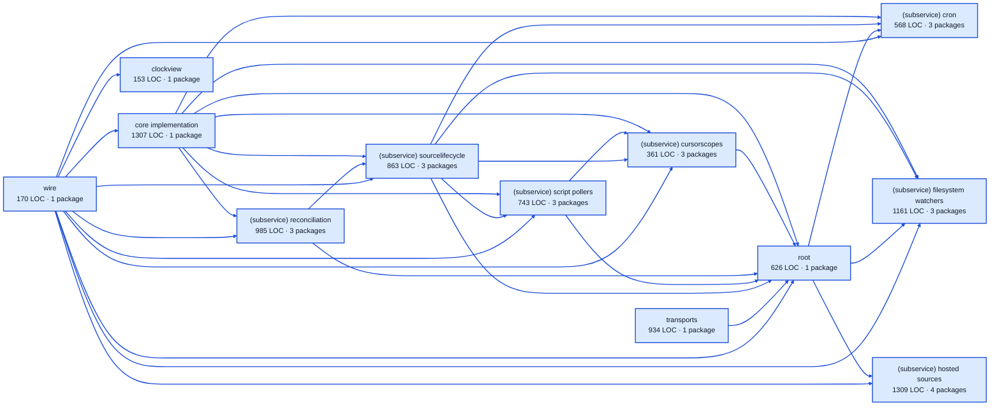

# automations service architecture

<!-- Generated by make architecture. -->

Source commit: `d3c35757b4e9cf09ce3e16bcf0276144fcbf43c7`.

[High-level backend](../high-level-backend.md) · [Test coverage](../high-level-test-coverage.md)

9180 LOC across 74 files. Arrows show imports between package groups within this service. They are static dependencies, not runtime calls. `XX%` means coverage was unmeasured.

## Package groups

`(subservice)` identifies a private service under `internal/services/`. `internal/service` is the core service implementation.

| Group | LOC | Files | Packages | Unit | Functional |
| --- | ---: | ---: | ---: | ---: | ---: |
| core implementation | 1307 | 5 | 1 | 86.1% | 65.7% |
| clockview | 153 | 3 | 1 | 98.5% | 70.1% |
| (subservice) cron | 568 | 7 | 3 | 89.5% | 38.7% |
| (subservice) cursorscopes | 361 | 4 | 3 | 83.7% | 62.9% |
| (subservice) filesystem watchers | 1161 | 10 | 3 | 78.5% | 54.0% |
| (subservice) hosted sources | 1309 | 11 | 4 | 84.1% | 69.5% |
| (subservice) reconciliation | 985 | 5 | 3 | 99.4% | 35.6% |
| (subservice) script pollers | 743 | 8 | 3 | 87.5% | 66.0% |
| (subservice) sourcelifecycle | 863 | 7 | 3 | 83.8% | 74.1% |
| root | 626 | 3 | 1 | 73.9% | 40.6% |
| transports | 934 | 9 | 1 | 87.3% | XX% |
| wire | 170 | 2 | 1 | XX% | 94.7% |

## Packages

| Package | LOC | Files | Unit | Functional |
| --- | ---: | ---: | ---: | ---: |
| [`pkg/services/automations`](../../../../pkg/services/automations) | 626 | 3 | 73.9% | 40.6% |
| [`pkg/services/automations/internal`](../../../../pkg/services/automations/internal) | 1307 | 5 | 86.1% | 65.7% |
| [`pkg/services/automations/internal/clockview`](../../../../pkg/services/automations/internal/clockview) | 153 | 3 | 98.5% | 70.1% |
| [`pkg/services/automations/internal/services/cron`](../../../../pkg/services/automations/internal/services/cron) | 162 | 2 | 100.0% | 100.0% |
| [`pkg/services/automations/internal/services/cron/internal/service`](../../../../pkg/services/automations/internal/services/cron/internal/service) | 396 | 4 | 89.3% | 37.3% |
| [`pkg/services/automations/internal/services/cron/wire`](../../../../pkg/services/automations/internal/services/cron/wire) | 10 | 1 | XX% | 100.0% |
| [`pkg/services/automations/internal/services/cursorscopes`](../../../../pkg/services/automations/internal/services/cursorscopes) | 28 | 1 | XX% | XX% |
| [`pkg/services/automations/internal/services/cursorscopes/internal/service`](../../../../pkg/services/automations/internal/services/cursorscopes/internal/service) | 322 | 2 | 83.7% | 62.6% |
| [`pkg/services/automations/internal/services/cursorscopes/wire`](../../../../pkg/services/automations/internal/services/cursorscopes/wire) | 11 | 1 | XX% | 100.0% |
| [`pkg/services/automations/internal/services/filesystem_watchers`](../../../../pkg/services/automations/internal/services/filesystem_watchers) | 123 | 2 | 100.0% | 0.0% |
| [`pkg/services/automations/internal/services/filesystem_watchers/internal/service`](../../../../pkg/services/automations/internal/services/filesystem_watchers/internal/service) | 1028 | 7 | 78.5% | 54.0% |
| [`pkg/services/automations/internal/services/filesystem_watchers/wire`](../../../../pkg/services/automations/internal/services/filesystem_watchers/wire) | 10 | 1 | XX% | 100.0% |
| [`pkg/services/automations/internal/services/hosted_sources`](../../../../pkg/services/automations/internal/services/hosted_sources) | 73 | 2 | 0.0% | 100.0% |
| [`pkg/services/automations/internal/services/hosted_sources/internal/linear`](../../../../pkg/services/automations/internal/services/hosted_sources/internal/linear) | 793 | 4 | 83.7% | 68.0% |
| [`pkg/services/automations/internal/services/hosted_sources/internal/service`](../../../../pkg/services/automations/internal/services/hosted_sources/internal/service) | 391 | 4 | 86.7% | 71.7% |
| [`pkg/services/automations/internal/services/hosted_sources/wire`](../../../../pkg/services/automations/internal/services/hosted_sources/wire) | 52 | 1 | XX% | 100.0% |
| [`pkg/services/automations/internal/services/reconciliation`](../../../../pkg/services/automations/internal/services/reconciliation) | 30 | 1 | XX% | XX% |
| [`pkg/services/automations/internal/services/reconciliation/internal/service`](../../../../pkg/services/automations/internal/services/reconciliation/internal/service) | 943 | 3 | 99.4% | 35.4% |
| [`pkg/services/automations/internal/services/reconciliation/wire`](../../../../pkg/services/automations/internal/services/reconciliation/wire) | 12 | 1 | XX% | 100.0% |
| [`pkg/services/automations/internal/services/script_pollers`](../../../../pkg/services/automations/internal/services/script_pollers) | 435 | 6 | 86.0% | 60.1% |
| [`pkg/services/automations/internal/services/script_pollers/internal/service`](../../../../pkg/services/automations/internal/services/script_pollers/internal/service) | 285 | 1 | 89.3% | 73.2% |
| [`pkg/services/automations/internal/services/script_pollers/wire`](../../../../pkg/services/automations/internal/services/script_pollers/wire) | 23 | 1 | XX% | 100.0% |
| [`pkg/services/automations/internal/services/sourcelifecycle`](../../../../pkg/services/automations/internal/services/sourcelifecycle) | 38 | 1 | XX% | XX% |
| [`pkg/services/automations/internal/services/sourcelifecycle/internal/service`](../../../../pkg/services/automations/internal/services/sourcelifecycle/internal/service) | 804 | 5 | 83.8% | 74.1% |
| [`pkg/services/automations/internal/services/sourcelifecycle/wire`](../../../../pkg/services/automations/internal/services/sourcelifecycle/wire) | 21 | 1 | XX% | 100.0% |
| [`pkg/services/automations/transports/http`](../../../../pkg/services/automations/transports/http) | 934 | 9 | 87.3% | XX% |
| [`pkg/services/automations/wire`](../../../../pkg/services/automations/wire) | 170 | 2 | XX% | 94.7% |
