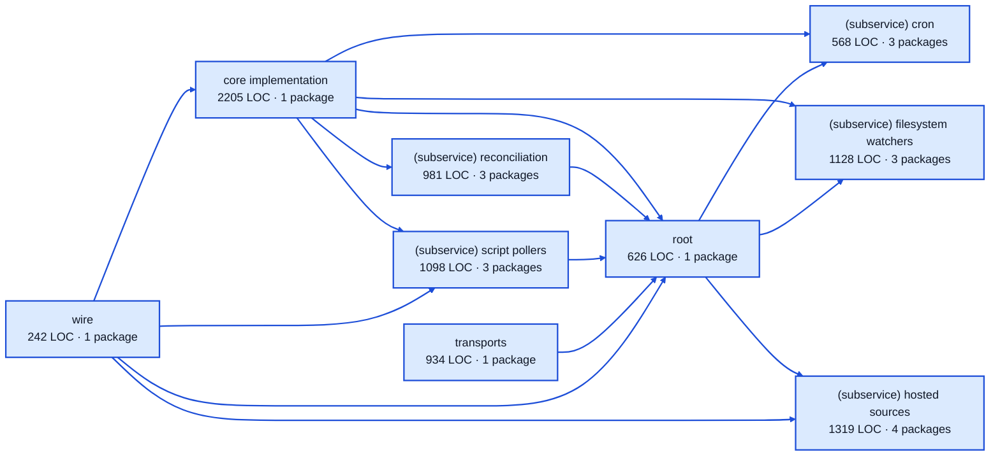

# automations service architecture

<!-- Generated by make architecture. -->

Source commit: `ad60f67915fcd8fd6cce8adf119aa11ac6c63bdb`.

[High-level backend](../high-level-backend.md) · [Test coverage](../high-level-test-coverage.md)

9101 LOC across 65 files. Arrows show imports between package groups within this service. They are static dependencies, not runtime calls. `XX%` means coverage was unmeasured.

## Package groups

`(subservice)` identifies a private service under `internal/services/`. `internal/service` is the core service implementation.

| Group | LOC | Files | Packages | Unit | Functional |
| --- | ---: | ---: | ---: | ---: | ---: |
| core implementation | 2205 | 9 | 1 | 82.6% | 69.5% |
| (subservice) cron | 568 | 7 | 3 | 89.5% | 37.0% |
| (subservice) filesystem watchers | 1128 | 10 | 3 | 77.0% | 50.3% |
| (subservice) hosted sources | 1319 | 11 | 4 | 84.6% | 55.1% |
| (subservice) reconciliation | 981 | 5 | 3 | 99.1% | 36.5% |
| (subservice) script pollers | 1098 | 9 | 3 | 84.0% | 45.1% |
| root | 626 | 3 | 1 | 73.9% | 46.4% |
| transports | 934 | 9 | 1 | 87.3% | XX% |
| wire | 242 | 2 | 1 | XX% | 61.5% |

## Packages

| Package | LOC | Files | Unit | Functional |
| --- | ---: | ---: | ---: | ---: |
| [`pkg/services/automations`](../../../../pkg/services/automations) | 626 | 3 | 73.9% | 46.4% |
| [`pkg/services/automations/internal`](../../../../pkg/services/automations/internal) | 2205 | 9 | 82.6% | 69.5% |
| [`pkg/services/automations/internal/services/cron`](../../../../pkg/services/automations/internal/services/cron) | 162 | 2 | 100.0% | 100.0% |
| [`pkg/services/automations/internal/services/cron/internal/service`](../../../../pkg/services/automations/internal/services/cron/internal/service) | 396 | 4 | 89.3% | 35.5% |
| [`pkg/services/automations/internal/services/cron/wire`](../../../../pkg/services/automations/internal/services/cron/wire) | 10 | 1 | XX% | 100.0% |
| [`pkg/services/automations/internal/services/filesystem_watchers`](../../../../pkg/services/automations/internal/services/filesystem_watchers) | 122 | 2 | 100.0% | 0.0% |
| [`pkg/services/automations/internal/services/filesystem_watchers/internal/service`](../../../../pkg/services/automations/internal/services/filesystem_watchers/internal/service) | 996 | 7 | 76.9% | 50.3% |
| [`pkg/services/automations/internal/services/filesystem_watchers/wire`](../../../../pkg/services/automations/internal/services/filesystem_watchers/wire) | 10 | 1 | XX% | 100.0% |
| [`pkg/services/automations/internal/services/hosted_sources`](../../../../pkg/services/automations/internal/services/hosted_sources) | 73 | 2 | 100.0% | 100.0% |
| [`pkg/services/automations/internal/services/hosted_sources/internal/linear`](../../../../pkg/services/automations/internal/services/hosted_sources/internal/linear) | 793 | 4 | 83.3% | 57.8% |
| [`pkg/services/automations/internal/services/hosted_sources/internal/service`](../../../../pkg/services/automations/internal/services/hosted_sources/internal/service) | 401 | 4 | 87.3% | 46.8% |
| [`pkg/services/automations/internal/services/hosted_sources/wire`](../../../../pkg/services/automations/internal/services/hosted_sources/wire) | 52 | 1 | XX% | 100.0% |
| [`pkg/services/automations/internal/services/reconciliation`](../../../../pkg/services/automations/internal/services/reconciliation) | 43 | 1 | XX% | XX% |
| [`pkg/services/automations/internal/services/reconciliation/internal/service`](../../../../pkg/services/automations/internal/services/reconciliation/internal/service) | 923 | 3 | 99.1% | 35.7% |
| [`pkg/services/automations/internal/services/reconciliation/wire`](../../../../pkg/services/automations/internal/services/reconciliation/wire) | 15 | 1 | XX% | 100.0% |
| [`pkg/services/automations/internal/services/script_pollers`](../../../../pkg/services/automations/internal/services/script_pollers) | 540 | 6 | 86.5% | 44.4% |
| [`pkg/services/automations/internal/services/script_pollers/internal/service`](../../../../pkg/services/automations/internal/services/script_pollers/internal/service) | 536 | 2 | 82.0% | 45.0% |
| [`pkg/services/automations/internal/services/script_pollers/wire`](../../../../pkg/services/automations/internal/services/script_pollers/wire) | 22 | 1 | XX% | 100.0% |
| [`pkg/services/automations/transports/http`](../../../../pkg/services/automations/transports/http) | 934 | 9 | 87.3% | XX% |
| [`pkg/services/automations/wire`](../../../../pkg/services/automations/wire) | 242 | 2 | XX% | 61.5% |
