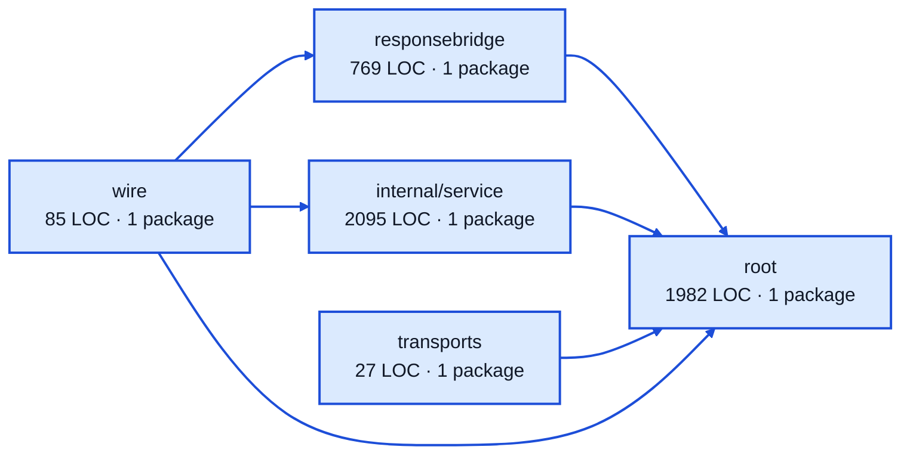

# chat sessions service architecture

<!-- Generated by make architecture. -->

Source commit: `3c6e43918a3fc4349ec9462739376d7efe1868de`.

[High-level backend](../high-level-backend.md) · [Test coverage](../high-level-test-coverage.md)

4958 LOC across 26 files. Arrows show imports between package groups within this service. They are static dependencies, not runtime calls. `XX%` means coverage was unmeasured.

## Package groups

`(subservice)` identifies a private service under `internal/services/`. `internal/service` is the core service implementation.

| Group | LOC | Files | Packages | Unit | Functional |
| --- | ---: | ---: | ---: | ---: | ---: |
| responsebridge | 769 | 2 | 1 | 87.6% | 66.1% |
| internal/service | 2095 | 12 | 1 | 93.5% | 74.1% |
| root | 1982 | 10 | 1 | 90.8% | 52.8% |
| transports | 27 | 1 | 1 | 100.0% | 100.0% |
| wire | 85 | 1 | 1 | XX% | 63.6% |

## Packages

| Package | LOC | Files | Unit | Functional |
| --- | ---: | ---: | ---: | ---: |
| [`pkg/services/chat_sessions`](../../../../pkg/services/chat_sessions) | 1982 | 10 | 90.8% | 52.8% |
| [`pkg/services/chat_sessions/internal/responsebridge`](../../../../pkg/services/chat_sessions/internal/responsebridge) | 769 | 2 | 87.6% | 66.1% |
| [`pkg/services/chat_sessions/internal/service`](../../../../pkg/services/chat_sessions/internal/service) | 2095 | 12 | 93.5% | 74.1% |
| [`pkg/services/chat_sessions/transports/acp/factorytarget`](../../../../pkg/services/chat_sessions/transports/acp/factorytarget) | 27 | 1 | 100.0% | 100.0% |
| [`pkg/services/chat_sessions/wire`](../../../../pkg/services/chat_sessions/wire) | 85 | 1 | XX% | 63.6% |
