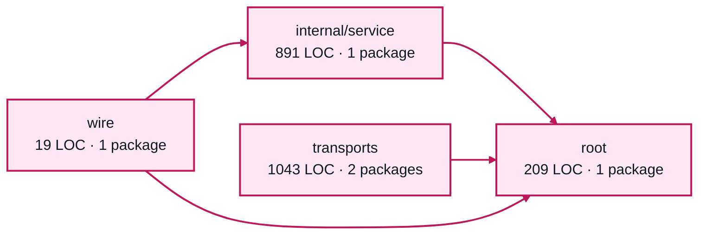

# costs service architecture

<!-- Generated by make architecture. -->

Source commit: `133a43f6c2452004ca4a827d328efa9a94de63eb`.

[High-level backend](../high-level-backend.md) · [Test coverage](../high-level-test-coverage.md)

2162 LOC across 11 files. Arrows show imports between package groups within this service. They are static dependencies, not runtime calls. `XX%` means coverage was unmeasured.

## Package groups

`(subservice)` identifies a private service under `internal/services/`. `internal/service` is the core service implementation.

| Group | LOC | Files | Packages | Unit | Functional |
| --- | ---: | ---: | ---: | ---: | ---: |
| internal/service | 891 | 3 | 1 | 90.1% | 86.8% |
| root | 209 | 1 | 1 | 93.3% | 60.0% |
| transports | 1043 | 6 | 2 | 86.6% | 78.6% |
| wire | 19 | 1 | 1 | XX% | 100.0% |

## Packages

| Package | LOC | Files | Unit | Functional |
| --- | ---: | ---: | ---: | ---: |
| [`pkg/services/costs`](../../../../pkg/services/costs) | 209 | 1 | 93.3% | 60.0% |
| [`pkg/services/costs/internal/service`](../../../../pkg/services/costs/internal/service) | 891 | 3 | 90.1% | 86.8% |
| [`pkg/services/costs/transports/cli`](../../../../pkg/services/costs/transports/cli) | 641 | 3 | 83.2% | 78.1% |
| [`pkg/services/costs/transports/http`](../../../../pkg/services/costs/transports/http) | 402 | 3 | 93.2% | 79.5% |
| [`pkg/services/costs/wire`](../../../../pkg/services/costs/wire) | 19 | 1 | XX% | 100.0% |
