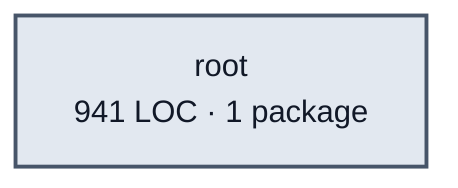

# edges service architecture

<!-- Generated by make architecture. -->

Source commit: `133a43f6c2452004ca4a827d328efa9a94de63eb`.

[High-level backend](../high-level-backend.md) · [Test coverage](../high-level-test-coverage.md)

941 LOC across 2 files. Arrows show imports between package groups within this service. They are static dependencies, not runtime calls. `XX%` means coverage was unmeasured.

## Package groups

`(subservice)` identifies a private service under `internal/services/`. `internal/service` is the core service implementation.

| Group | LOC | Files | Packages | Unit | Functional |
| --- | ---: | ---: | ---: | ---: | ---: |
| root | 941 | 2 | 1 | 74.5% | 84.1% |

## Packages

| Package | LOC | Files | Unit | Functional |
| --- | ---: | ---: | ---: | ---: |
| [`pkg/services/edges`](../../../../pkg/services/edges) | 941 | 2 | 74.5% | 84.1% |
