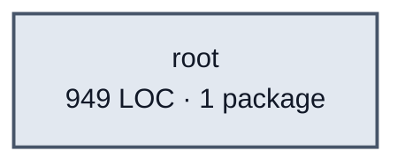

# edges service architecture

<!-- Generated by make architecture. -->

Source commit: `df510f3312660005091cad203d477f9535120d88`.

[High-level backend](../high-level-backend.md) · [Test coverage](../high-level-test-coverage.md)

949 LOC across 2 files. Arrows show imports between package groups within this service. They are static dependencies, not runtime calls. `XX%` means coverage was unmeasured.

## Package groups

`(subservice)` identifies a private service under `internal/services/`. `internal/service` is the core service implementation.

| Group | LOC | Files | Packages | Unit | Functional |
| --- | ---: | ---: | ---: | ---: | ---: |
| root | 949 | 2 | 1 | 72.6% | 87.6% |

## Packages

| Package | LOC | Files | Unit | Functional |
| --- | ---: | ---: | ---: | ---: |
| [`pkg/services/edges`](../../../../pkg/services/edges) | 949 | 2 | 72.6% | 87.6% |
