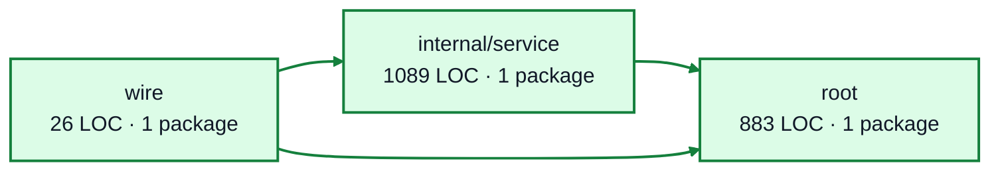

# events service architecture

<!-- Generated by make architecture. -->

Source commit: `a1f5c7a63cf7403102a0edffaf0757e773819e11`.

[High-level backend](../high-level-backend.md) · [Test coverage](../high-level-test-coverage.md)

1998 LOC across 16 files. Arrows show imports between package groups within this service. They are static dependencies, not runtime calls. `XX%` means coverage was unmeasured.

## Package groups

`(subservice)` identifies a private service under `internal/services/`. `internal/service` is the core service implementation.

| Group | LOC | Files | Packages | Unit | Functional |
| --- | ---: | ---: | ---: | ---: | ---: |
| internal/service | 1089 | 7 | 1 | 97.3% | 56.9% |
| root | 883 | 8 | 1 | 99.1% | 50.2% |
| wire | 26 | 1 | 1 | XX% | 100.0% |

## Packages

| Package | LOC | Files | Unit | Functional |
| --- | ---: | ---: | ---: | ---: |
| [`pkg/services/events`](../../../../pkg/services/events) | 883 | 8 | 99.1% | 50.2% |
| [`pkg/services/events/internal/service`](../../../../pkg/services/events/internal/service) | 1089 | 7 | 97.3% | 56.9% |
| [`pkg/services/events/wire`](../../../../pkg/services/events/wire) | 26 | 1 | XX% | 100.0% |
