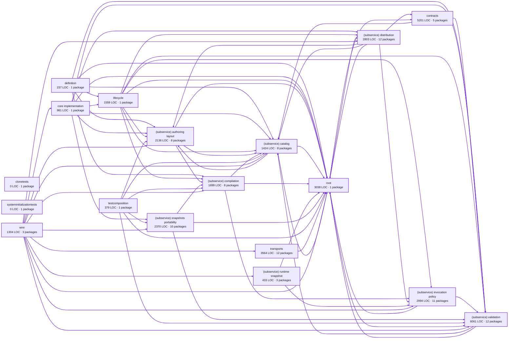

# factory definitions service architecture

<!-- Generated by make architecture. -->

Source commit: `935b079ae42891be0fa7199f16e785a828227f67`.

[High-level backend](../high-level-backend.md) · [Test coverage](../high-level-test-coverage.md)

36183 LOC across 247 files. Arrows show imports between package groups within this service. They are static dependencies, not runtime calls. `XX%` means coverage was unmeasured.

## Package groups

`(subservice)` identifies a private service under `internal/services/`. `internal/service` is the core service implementation.

| Group | LOC | Files | Packages | Unit | Functional |
| --- | ---: | ---: | ---: | ---: | ---: |
| clonetests | 0 | 0 | 1 | XX% | XX% |
| definition | 237 | 2 | 1 | 66.7% | XX% |
| core implementation | 981 | 10 | 1 | 77.8% | 63.1% |
| contracts | 5201 | 21 | 5 | 87.2% | 69.1% |
| lifecycle | 1559 | 10 | 1 | 75.2% | 59.4% |
| (subservice) authoring layout | 2136 | 12 | 8 | 61.0% | 60.2% |
| (subservice) catalog | 1424 | 10 | 8 | 75.5% | 58.8% |
| (subservice) compilation | 1699 | 8 | 8 | 75.1% | 71.0% |
| (subservice) distribution | 2803 | 21 | 12 | 83.5% | 42.9% |
| (subservice) invocation policy | 2994 | 14 | 11 | 67.6% | 71.3% |
| (subservice) runtime snapshot | 433 | 3 | 3 | 94.5% | 84.6% |
| (subservice) snapshots portability | 2370 | 16 | 10 | 72.4% | 62.6% |
| (subservice) validation | 6061 | 27 | 12 | 82.5% | 57.4% |
| testcomposition | 379 | 1 | 1 | 72.8% | XX% |
| root | 3038 | 43 | 1 | 88.3% | 51.9% |
| systeminitializationtests | 0 | 0 | 1 | XX% | XX% |
| transports | 3564 | 36 | 12 | 80.2% | 55.0% |
| wire | 1304 | 13 | 3 | 76.5% | 66.2% |

## Packages

| Package | LOC | Files | Unit | Functional |
| --- | ---: | ---: | ---: | ---: |
| [`pkg/services/factory_definitions`](../../../../pkg/services/factory_definitions) | 3038 | 43 | 88.3% | 51.9% |
| [`pkg/services/factory_definitions/clonetests`](../../../../pkg/services/factory_definitions/clonetests) | 0 | 0 | XX% | XX% |
| [`pkg/services/factory_definitions/definition`](../../../../pkg/services/factory_definitions/definition) | 237 | 2 | 66.7% | XX% |
| [`pkg/services/factory_definitions/internal`](../../../../pkg/services/factory_definitions/internal) | 981 | 10 | 77.8% | 63.1% |
| [`pkg/services/factory_definitions/internal/contracts`](../../../../pkg/services/factory_definitions/internal/contracts) | 5201 | 21 | 87.2% | 69.1% |
| [`pkg/services/factory_definitions/internal/contracts/contracttests`](../../../../pkg/services/factory_definitions/internal/contracts/contracttests) | 0 | 0 | XX% | XX% |
| [`pkg/services/factory_definitions/internal/contracts/failuremetadatatests`](../../../../pkg/services/factory_definitions/internal/contracts/failuremetadatatests) | 0 | 0 | XX% | XX% |
| [`pkg/services/factory_definitions/internal/contracts/graphtopologytests`](../../../../pkg/services/factory_definitions/internal/contracts/graphtopologytests) | 0 | 0 | XX% | XX% |
| [`pkg/services/factory_definitions/internal/contracts/taxonomytests`](../../../../pkg/services/factory_definitions/internal/contracts/taxonomytests) | 0 | 0 | XX% | XX% |
| [`pkg/services/factory_definitions/internal/lifecycle`](../../../../pkg/services/factory_definitions/internal/lifecycle) | 1559 | 10 | 75.2% | 59.4% |
| [`pkg/services/factory_definitions/internal/services/authoring_layout`](../../../../pkg/services/factory_definitions/internal/services/authoring_layout) | 56 | 1 | XX% | XX% |
| [`pkg/services/factory_definitions/internal/services/authoring_layout/authoredlayout`](../../../../pkg/services/factory_definitions/internal/services/authoring_layout/authoredlayout) | 1481 | 5 | 59.3% | 69.0% |
| [`pkg/services/factory_definitions/internal/services/authoring_layout/expand`](../../../../pkg/services/factory_definitions/internal/services/authoring_layout/expand) | 29 | 1 | 71.4% | 0.0% |
| [`pkg/services/factory_definitions/internal/services/authoring_layout/flatten`](../../../../pkg/services/factory_definitions/internal/services/authoring_layout/flatten) | 27 | 1 | 71.4% | 0.0% |
| [`pkg/services/factory_definitions/internal/services/authoring_layout/internal/service`](../../../../pkg/services/factory_definitions/internal/services/authoring_layout/internal/service) | 249 | 1 | 65.9% | 4.9% |
| [`pkg/services/factory_definitions/internal/services/authoring_layout/persist`](../../../../pkg/services/factory_definitions/internal/services/authoring_layout/persist) | 173 | 1 | 68.5% | 64.4% |
| [`pkg/services/factory_definitions/internal/services/authoring_layout/prepare`](../../../../pkg/services/factory_definitions/internal/services/authoring_layout/prepare) | 66 | 1 | 57.9% | 57.9% |
| [`pkg/services/factory_definitions/internal/services/authoring_layout/wire`](../../../../pkg/services/factory_definitions/internal/services/authoring_layout/wire) | 55 | 1 | XX% | 53.6% |
| [`pkg/services/factory_definitions/internal/services/catalog`](../../../../pkg/services/factory_definitions/internal/services/catalog) | 32 | 1 | XX% | XX% |
| [`pkg/services/factory_definitions/internal/services/catalog/internal/service`](../../../../pkg/services/factory_definitions/internal/services/catalog/internal/service) | 205 | 1 | 74.4% | 12.8% |
| [`pkg/services/factory_definitions/internal/services/catalog/namedfactories`](../../../../pkg/services/factory_definitions/internal/services/catalog/namedfactories) | 402 | 2 | 73.7% | 61.8% |
| [`pkg/services/factory_definitions/internal/services/catalog/namedpaths`](../../../../pkg/services/factory_definitions/internal/services/catalog/namedpaths) | 366 | 3 | 80.0% | 70.0% |
| [`pkg/services/factory_definitions/internal/services/catalog/persistence`](../../../../pkg/services/factory_definitions/internal/services/catalog/persistence) | 313 | 1 | 72.4% | 67.6% |
| [`pkg/services/factory_definitions/internal/services/catalog/persistence/integrationtests`](../../../../pkg/services/factory_definitions/internal/services/catalog/persistence/integrationtests) | 0 | 0 | XX% | XX% |
| [`pkg/services/factory_definitions/internal/services/catalog/resource`](../../../../pkg/services/factory_definitions/internal/services/catalog/resource) | 18 | 1 | XX% | XX% |
| [`pkg/services/factory_definitions/internal/services/catalog/wire`](../../../../pkg/services/factory_definitions/internal/services/catalog/wire) | 88 | 1 | XX% | 75.0% |
| [`pkg/services/factory_definitions/internal/services/compilation`](../../../../pkg/services/factory_definitions/internal/services/compilation) | 30 | 1 | XX% | XX% |
| [`pkg/services/factory_definitions/internal/services/compilation/canonical`](../../../../pkg/services/factory_definitions/internal/services/compilation/canonical) | 20 | 1 | 100.0% | 50.0% |
| [`pkg/services/factory_definitions/internal/services/compilation/internal/service`](../../../../pkg/services/factory_definitions/internal/services/compilation/internal/service) | 119 | 1 | 62.0% | 4.0% |
| [`pkg/services/factory_definitions/internal/services/compilation/loadedsource`](../../../../pkg/services/factory_definitions/internal/services/compilation/loadedsource) | 180 | 1 | 68.8% | 74.0% |
| [`pkg/services/factory_definitions/internal/services/compilation/loading`](../../../../pkg/services/factory_definitions/internal/services/compilation/loading) | 955 | 2 | 70.1% | 70.1% |
| [`pkg/services/factory_definitions/internal/services/compilation/runtimeconfig`](../../../../pkg/services/factory_definitions/internal/services/compilation/runtimeconfig) | 363 | 1 | 89.5% | 89.5% |
| [`pkg/services/factory_definitions/internal/services/compilation/runtimetests`](../../../../pkg/services/factory_definitions/internal/services/compilation/runtimetests) | 0 | 0 | XX% | XX% |
| [`pkg/services/factory_definitions/internal/services/compilation/wire`](../../../../pkg/services/factory_definitions/internal/services/compilation/wire) | 32 | 1 | XX% | 60.0% |
| [`pkg/services/factory_definitions/internal/services/distribution`](../../../../pkg/services/factory_definitions/internal/services/distribution) | 47 | 1 | XX% | XX% |
| [`pkg/services/factory_definitions/internal/services/distribution/goal`](../../../../pkg/services/factory_definitions/internal/services/distribution/goal) | 185 | 4 | 67.3% | XX% |
| [`pkg/services/factory_definitions/internal/services/distribution/internal/service`](../../../../pkg/services/factory_definitions/internal/services/distribution/internal/service) | 153 | 1 | 75.0% | 16.7% |
| [`pkg/services/factory_definitions/internal/services/distribution/packageassets`](../../../../pkg/services/factory_definitions/internal/services/distribution/packageassets) | 257 | 1 | 90.6% | 0.0% |
| [`pkg/services/factory_definitions/internal/services/distribution/packagedcatalog`](../../../../pkg/services/factory_definitions/internal/services/distribution/packagedcatalog) | 126 | 1 | 85.1% | 78.7% |
| [`pkg/services/factory_definitions/internal/services/distribution/packagedinstallation`](../../../../pkg/services/factory_definitions/internal/services/distribution/packagedinstallation) | 1721 | 5 | 82.7% | 55.2% |
| [`pkg/services/factory_definitions/internal/services/distribution/promptassets`](../../../../pkg/services/factory_definitions/internal/services/distribution/promptassets) | 151 | 1 | 96.8% | 0.0% |
| [`pkg/services/factory_definitions/internal/services/distribution/review`](../../../../pkg/services/factory_definitions/internal/services/distribution/review) | 9 | 1 | XX% | XX% |
| [`pkg/services/factory_definitions/internal/services/distribution/scaffoldfacts`](../../../../pkg/services/factory_definitions/internal/services/distribution/scaffoldfacts) | 39 | 1 | 73.3% | XX% |
| [`pkg/services/factory_definitions/internal/services/distribution/subagent`](../../../../pkg/services/factory_definitions/internal/services/distribution/subagent) | 33 | 2 | 100.0% | XX% |
| [`pkg/services/factory_definitions/internal/services/distribution/tts`](../../../../pkg/services/factory_definitions/internal/services/distribution/tts) | 49 | 2 | 100.0% | XX% |
| [`pkg/services/factory_definitions/internal/services/distribution/wire`](../../../../pkg/services/factory_definitions/internal/services/distribution/wire) | 33 | 1 | XX% | 60.0% |
| [`pkg/services/factory_definitions/internal/services/invocation_policy`](../../../../pkg/services/factory_definitions/internal/services/invocation_policy) | 30 | 1 | XX% | XX% |
| [`pkg/services/factory_definitions/internal/services/invocation_policy/decisionenvelope`](../../../../pkg/services/factory_definitions/internal/services/invocation_policy/decisionenvelope) | 239 | 1 | 87.9% | 84.5% |
| [`pkg/services/factory_definitions/internal/services/invocation_policy/internal/service`](../../../../pkg/services/factory_definitions/internal/services/invocation_policy/internal/service) | 65 | 1 | 100.0% | 100.0% |
| [`pkg/services/factory_definitions/internal/services/invocation_policy/invocationinterpolation`](../../../../pkg/services/factory_definitions/internal/services/invocation_policy/invocationinterpolation) | 456 | 1 | 31.0% | 75.7% |
| [`pkg/services/factory_definitions/internal/services/invocation_policy/invocationoutput`](../../../../pkg/services/factory_definitions/internal/services/invocation_policy/invocationoutput) | 206 | 1 | 63.8% | 80.0% |
| [`pkg/services/factory_definitions/internal/services/invocation_policy/invocationworktype`](../../../../pkg/services/factory_definitions/internal/services/invocation_policy/invocationworktype) | 33 | 1 | 71.4% | 78.6% |
| [`pkg/services/factory_definitions/internal/services/invocation_policy/quorumpolicy`](../../../../pkg/services/factory_definitions/internal/services/invocation_policy/quorumpolicy) | 74 | 1 | 76.2% | 85.7% |
| [`pkg/services/factory_definitions/internal/services/invocation_policy/ttsobservability`](../../../../pkg/services/factory_definitions/internal/services/invocation_policy/ttsobservability) | 120 | 1 | 80.0% | 77.8% |
| [`pkg/services/factory_definitions/internal/services/invocation_policy/wire`](../../../../pkg/services/factory_definitions/internal/services/invocation_policy/wire) | 19 | 1 | XX% | 80.0% |
| [`pkg/services/factory_definitions/internal/services/invocation_policy/workpropagation`](../../../../pkg/services/factory_definitions/internal/services/invocation_policy/workpropagation) | 24 | 1 | 85.7% | 85.7% |
| [`pkg/services/factory_definitions/internal/services/invocation_policy/workstationexecution`](../../../../pkg/services/factory_definitions/internal/services/invocation_policy/workstationexecution) | 1728 | 4 | 77.1% | 65.8% |
| [`pkg/services/factory_definitions/internal/services/runtime_snapshot`](../../../../pkg/services/factory_definitions/internal/services/runtime_snapshot) | 16 | 1 | XX% | XX% |
| [`pkg/services/factory_definitions/internal/services/runtime_snapshot/internal`](../../../../pkg/services/factory_definitions/internal/services/runtime_snapshot/internal) | 395 | 1 | 94.5% | 84.8% |
| [`pkg/services/factory_definitions/internal/services/runtime_snapshot/wire`](../../../../pkg/services/factory_definitions/internal/services/runtime_snapshot/wire) | 22 | 1 | XX% | 75.0% |
| [`pkg/services/factory_definitions/internal/services/snapshots_portability`](../../../../pkg/services/factory_definitions/internal/services/snapshots_portability) | 46 | 1 | XX% | XX% |
| [`pkg/services/factory_definitions/internal/services/snapshots_portability/capture`](../../../../pkg/services/factory_definitions/internal/services/snapshots_portability/capture) | 475 | 3 | 80.2% | 73.4% |
| [`pkg/services/factory_definitions/internal/services/snapshots_portability/editable`](../../../../pkg/services/factory_definitions/internal/services/snapshots_portability/editable) | 51 | 1 | 68.8% | 75.0% |
| [`pkg/services/factory_definitions/internal/services/snapshots_portability/internal/service`](../../../../pkg/services/factory_definitions/internal/services/snapshots_portability/internal/service) | 164 | 1 | 58.7% | 3.2% |
| [`pkg/services/factory_definitions/internal/services/snapshots_portability/materialize`](../../../../pkg/services/factory_definitions/internal/services/snapshots_portability/materialize) | 343 | 2 | 75.8% | 50.8% |
| [`pkg/services/factory_definitions/internal/services/snapshots_portability/portableconfig`](../../../../pkg/services/factory_definitions/internal/services/snapshots_portability/portableconfig) | 946 | 4 | 64.9% | 76.2% |
| [`pkg/services/factory_definitions/internal/services/snapshots_portability/portableconfig/integrationtests`](../../../../pkg/services/factory_definitions/internal/services/snapshots_portability/portableconfig/integrationtests) | 0 | 0 | XX% | XX% |
| [`pkg/services/factory_definitions/internal/services/snapshots_portability/prepare`](../../../../pkg/services/factory_definitions/internal/services/snapshots_portability/prepare) | 143 | 2 | 78.9% | 17.5% |
| [`pkg/services/factory_definitions/internal/services/snapshots_portability/replayconfig`](../../../../pkg/services/factory_definitions/internal/services/snapshots_portability/replayconfig) | 158 | 1 | 85.7% | 77.1% |
| [`pkg/services/factory_definitions/internal/services/snapshots_portability/wire`](../../../../pkg/services/factory_definitions/internal/services/snapshots_portability/wire) | 44 | 1 | XX% | 56.2% |
| [`pkg/services/factory_definitions/internal/services/validation`](../../../../pkg/services/factory_definitions/internal/services/validation) | 38 | 1 | XX% | XX% |
| [`pkg/services/factory_definitions/internal/services/validation/authoredmodel/namevalue`](../../../../pkg/services/factory_definitions/internal/services/validation/authoredmodel/namevalue) | 121 | 1 | 92.6% | 74.1% |
| [`pkg/services/factory_definitions/internal/services/validation/authoredmodel/taxonomy`](../../../../pkg/services/factory_definitions/internal/services/validation/authoredmodel/taxonomy) | 135 | 1 | 76.1% | 78.3% |
| [`pkg/services/factory_definitions/internal/services/validation/authoredmodel/workers`](../../../../pkg/services/factory_definitions/internal/services/validation/authoredmodel/workers) | 210 | 2 | 98.4% | 87.1% |
| [`pkg/services/factory_definitions/internal/services/validation/impl`](../../../../pkg/services/factory_definitions/internal/services/validation/impl) | 5269 | 16 | 82.0% | 57.8% |
| [`pkg/services/factory_definitions/internal/services/validation/internal/orchestrator`](../../../../pkg/services/factory_definitions/internal/services/validation/internal/orchestrator) | 31 | 1 | 100.0% | 0.0% |
| [`pkg/services/factory_definitions/internal/services/validation/internal/outcometests`](../../../../pkg/services/factory_definitions/internal/services/validation/internal/outcometests) | 0 | 0 | XX% | XX% |
| [`pkg/services/factory_definitions/internal/services/validation/internal/requiredtools`](../../../../pkg/services/factory_definitions/internal/services/validation/internal/requiredtools) | 16 | 1 | 100.0% | 0.0% |
| [`pkg/services/factory_definitions/internal/services/validation/internal/service`](../../../../pkg/services/factory_definitions/internal/services/validation/internal/service) | 181 | 1 | 75.4% | 2.9% |
| [`pkg/services/factory_definitions/internal/services/validation/internal/structural`](../../../../pkg/services/factory_definitions/internal/services/validation/internal/structural) | 13 | 1 | 100.0% | 0.0% |
| [`pkg/services/factory_definitions/internal/services/validation/internal/topology`](../../../../pkg/services/factory_definitions/internal/services/validation/internal/topology) | 13 | 1 | 100.0% | 0.0% |
| [`pkg/services/factory_definitions/internal/services/validation/wire`](../../../../pkg/services/factory_definitions/internal/services/validation/wire) | 34 | 1 | XX% | 60.0% |
| [`pkg/services/factory_definitions/internal/testcomposition`](../../../../pkg/services/factory_definitions/internal/testcomposition) | 379 | 1 | 72.8% | XX% |
| [`pkg/services/factory_definitions/systeminitializationtests`](../../../../pkg/services/factory_definitions/systeminitializationtests) | 0 | 0 | XX% | XX% |
| [`pkg/services/factory_definitions/transports/cli`](../../../../pkg/services/factory_definitions/transports/cli) | 266 | 4 | 91.5% | 52.4% |
| [`pkg/services/factory_definitions/transports/cli/cobracompletion`](../../../../pkg/services/factory_definitions/transports/cli/cobracompletion) | 623 | 4 | 72.7% | 63.2% |
| [`pkg/services/factory_definitions/transports/cli/config`](../../../../pkg/services/factory_definitions/transports/cli/config) | 123 | 1 | 75.6% | 64.4% |
| [`pkg/services/factory_definitions/transports/cli/factoryload`](../../../../pkg/services/factory_definitions/transports/cli/factoryload) | 167 | 1 | 96.2% | 78.8% |
| [`pkg/services/factory_definitions/transports/http`](../../../../pkg/services/factory_definitions/transports/http) | 626 | 7 | 84.7% | 17.2% |
| [`pkg/services/factory_definitions/transports/mapping/factoryconfig/diagnostics`](../../../../pkg/services/factory_definitions/transports/mapping/factoryconfig/diagnostics) | 71 | 1 | 84.2% | XX% |
| [`pkg/services/factory_definitions/transports/mapping/factorydefinition`](../../../../pkg/services/factory_definitions/transports/mapping/factorydefinition) | 162 | 2 | 66.7% | 60.6% |
| [`pkg/services/factory_definitions/transports/mapping/factorydefinition/retiredboundary`](../../../../pkg/services/factory_definitions/transports/mapping/factorydefinition/retiredboundary) | 219 | 2 | 91.3% | 85.9% |
| [`pkg/services/factory_definitions/transports/mapping/factorysnapshot`](../../../../pkg/services/factory_definitions/transports/mapping/factorysnapshot) | 41 | 1 | 87.5% | 75.0% |
| [`pkg/services/factory_definitions/transports/mapping/validationentry`](../../../../pkg/services/factory_definitions/transports/mapping/validationentry) | 187 | 2 | 73.1% | 65.7% |
| [`pkg/services/factory_definitions/transports/mapping/workerinference`](../../../../pkg/services/factory_definitions/transports/mapping/workerinference) | 39 | 1 | 91.7% | XX% |
| [`pkg/services/factory_definitions/transports/mcp`](../../../../pkg/services/factory_definitions/transports/mcp) | 1040 | 10 | 75.4% | XX% |
| [`pkg/services/factory_definitions/wire`](../../../../pkg/services/factory_definitions/wire) | 1154 | 11 | XX% | 65.5% |
| [`pkg/services/factory_definitions/wire/defaultscaffold`](../../../../pkg/services/factory_definitions/wire/defaultscaffold) | 127 | 1 | 75.8% | 69.7% |
| [`pkg/services/factory_definitions/wire/validation`](../../../../pkg/services/factory_definitions/wire/validation) | 23 | 1 | 100.0% | 100.0% |
