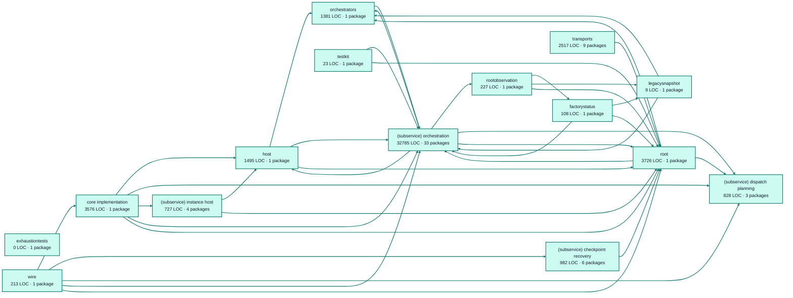

# factory runtime service architecture

<!-- Generated by make architecture. -->

[High-level backend](../high-level-backend.md) · [Test coverage](../high-level-test-coverage.md)

48597 LOC across 265 files. Arrows show imports between package groups within this service. They are static dependencies, not runtime calls. `XX%` means coverage was unmeasured.

## Package groups

`(subservice)` identifies a private service under `internal/services/`. `internal/service` is the core service implementation.

| Group | LOC | Files | Packages | Unit | Functional |
| --- | ---: | ---: | ---: | ---: | ---: |
| core implementation | 3576 | 9 | 1 | XX% | XX% |
| exhaustiontests | 0 | 0 | 1 | XX% | XX% |
| factorystatus | 108 | 1 | 1 | XX% | XX% |
| host | 1495 | 8 | 1 | XX% | XX% |
| legacysnapshot | 9 | 1 | 1 | XX% | XX% |
| orchestrators | 1381 | 8 | 1 | XX% | XX% |
| rootobservation | 227 | 1 | 1 | XX% | XX% |
| (subservice) checkpoint recovery | 982 | 10 | 6 | XX% | XX% |
| (subservice) dispatch planning | 828 | 5 | 3 | XX% | XX% |
| (subservice) instance host | 727 | 11 | 4 | XX% | XX% |
| (subservice) orchestration | 32785 | 126 | 33 | XX% | XX% |
| testkit | 23 | 1 | 1 | XX% | XX% |
| root | 3726 | 50 | 1 | XX% | XX% |
| transports | 2517 | 29 | 9 | XX% | XX% |
| wire | 213 | 5 | 1 | XX% | XX% |

## Packages

| Package | LOC | Files | Unit | Functional |
| --- | ---: | ---: | ---: | ---: |
| [`pkg/services/factory_runtime`](../../../../pkg/services/factory_runtime) | 3726 | 50 | XX% | XX% |
| [`pkg/services/factory_runtime/internal`](../../../../pkg/services/factory_runtime/internal) | 3576 | 9 | XX% | XX% |
| [`pkg/services/factory_runtime/internal/exhaustiontests`](../../../../pkg/services/factory_runtime/internal/exhaustiontests) | 0 | 0 | XX% | XX% |
| [`pkg/services/factory_runtime/internal/factorystatus`](../../../../pkg/services/factory_runtime/internal/factorystatus) | 108 | 1 | XX% | XX% |
| [`pkg/services/factory_runtime/internal/host`](../../../../pkg/services/factory_runtime/internal/host) | 1495 | 8 | XX% | XX% |
| [`pkg/services/factory_runtime/internal/legacysnapshot`](../../../../pkg/services/factory_runtime/internal/legacysnapshot) | 9 | 1 | XX% | XX% |
| [`pkg/services/factory_runtime/internal/orchestrators/petri`](../../../../pkg/services/factory_runtime/internal/orchestrators/petri) | 1381 | 8 | XX% | XX% |
| [`pkg/services/factory_runtime/internal/rootobservation`](../../../../pkg/services/factory_runtime/internal/rootobservation) | 227 | 1 | XX% | XX% |
| [`pkg/services/factory_runtime/internal/services/checkpoint_recovery`](../../../../pkg/services/factory_runtime/internal/services/checkpoint_recovery) | 144 | 4 | XX% | XX% |
| [`pkg/services/factory_runtime/internal/services/checkpoint_recovery/internal/javascriptstore`](../../../../pkg/services/factory_runtime/internal/services/checkpoint_recovery/internal/javascriptstore) | 65 | 1 | XX% | XX% |
| [`pkg/services/factory_runtime/internal/services/checkpoint_recovery/internal/javascriptsummary`](../../../../pkg/services/factory_runtime/internal/services/checkpoint_recovery/internal/javascriptsummary) | 166 | 1 | XX% | XX% |
| [`pkg/services/factory_runtime/internal/services/checkpoint_recovery/internal/processlocal`](../../../../pkg/services/factory_runtime/internal/services/checkpoint_recovery/internal/processlocal) | 472 | 2 | XX% | XX% |
| [`pkg/services/factory_runtime/internal/services/checkpoint_recovery/internal/service`](../../../../pkg/services/factory_runtime/internal/services/checkpoint_recovery/internal/service) | 95 | 1 | XX% | XX% |
| [`pkg/services/factory_runtime/internal/services/checkpoint_recovery/wire`](../../../../pkg/services/factory_runtime/internal/services/checkpoint_recovery/wire) | 40 | 1 | XX% | XX% |
| [`pkg/services/factory_runtime/internal/services/dispatch_planning`](../../../../pkg/services/factory_runtime/internal/services/dispatch_planning) | 180 | 1 | XX% | XX% |
| [`pkg/services/factory_runtime/internal/services/dispatch_planning/internal/service`](../../../../pkg/services/factory_runtime/internal/services/dispatch_planning/internal/service) | 634 | 3 | XX% | XX% |
| [`pkg/services/factory_runtime/internal/services/dispatch_planning/wire`](../../../../pkg/services/factory_runtime/internal/services/dispatch_planning/wire) | 14 | 1 | XX% | XX% |
| [`pkg/services/factory_runtime/internal/services/instance_host`](../../../../pkg/services/factory_runtime/internal/services/instance_host) | 33 | 1 | XX% | XX% |
| [`pkg/services/factory_runtime/internal/services/instance_host/build`](../../../../pkg/services/factory_runtime/internal/services/instance_host/build) | 347 | 4 | XX% | XX% |
| [`pkg/services/factory_runtime/internal/services/instance_host/internal/service`](../../../../pkg/services/factory_runtime/internal/services/instance_host/internal/service) | 337 | 5 | XX% | XX% |
| [`pkg/services/factory_runtime/internal/services/instance_host/wire`](../../../../pkg/services/factory_runtime/internal/services/instance_host/wire) | 10 | 1 | XX% | XX% |
| [`pkg/services/factory_runtime/internal/services/orchestration`](../../../../pkg/services/factory_runtime/internal/services/orchestration) | 135 | 2 | XX% | XX% |
| [`pkg/services/factory_runtime/internal/services/orchestration/context`](../../../../pkg/services/factory_runtime/internal/services/orchestration/context) | 124 | 1 | XX% | XX% |
| [`pkg/services/factory_runtime/internal/services/orchestration/definitionmapping`](../../../../pkg/services/factory_runtime/internal/services/orchestration/definitionmapping) | 702 | 1 | XX% | XX% |
| [`pkg/services/factory_runtime/internal/services/orchestration/definitionmapping/maptests`](../../../../pkg/services/factory_runtime/internal/services/orchestration/definitionmapping/maptests) | 0 | 0 | XX% | XX% |
| [`pkg/services/factory_runtime/internal/services/orchestration/engine`](../../../../pkg/services/factory_runtime/internal/services/orchestration/engine) | 2287 | 6 | XX% | XX% |
| [`pkg/services/factory_runtime/internal/services/orchestration/internal/service`](../../../../pkg/services/factory_runtime/internal/services/orchestration/internal/service) | 402 | 1 | XX% | XX% |
| [`pkg/services/factory_runtime/internal/services/orchestration/javascript`](../../../../pkg/services/factory_runtime/internal/services/orchestration/javascript) | 135 | 1 | XX% | XX% |
| [`pkg/services/factory_runtime/internal/services/orchestration/javascript/preview`](../../../../pkg/services/factory_runtime/internal/services/orchestration/javascript/preview) | 162 | 3 | XX% | XX% |
| [`pkg/services/factory_runtime/internal/services/orchestration/javascript/runtime`](../../../../pkg/services/factory_runtime/internal/services/orchestration/javascript/runtime) | 2386 | 9 | XX% | XX% |
| [`pkg/services/factory_runtime/internal/services/orchestration/javascript/source`](../../../../pkg/services/factory_runtime/internal/services/orchestration/javascript/source) | 851 | 7 | XX% | XX% |
| [`pkg/services/factory_runtime/internal/services/orchestration/javascript/validation`](../../../../pkg/services/factory_runtime/internal/services/orchestration/javascript/validation) | 1661 | 12 | XX% | XX% |
| [`pkg/services/factory_runtime/internal/services/orchestration/metrics`](../../../../pkg/services/factory_runtime/internal/services/orchestration/metrics) | 46 | 3 | XX% | XX% |
| [`pkg/services/factory_runtime/internal/services/orchestration/orchestrationowner`](../../../../pkg/services/factory_runtime/internal/services/orchestration/orchestrationowner) | 83 | 2 | XX% | XX% |
| [`pkg/services/factory_runtime/internal/services/orchestration/orchestratorcontract`](../../../../pkg/services/factory_runtime/internal/services/orchestration/orchestratorcontract) | 1089 | 11 | XX% | XX% |
| [`pkg/services/factory_runtime/internal/services/orchestration/replayhooks`](../../../../pkg/services/factory_runtime/internal/services/orchestration/replayhooks) | 73 | 1 | XX% | XX% |
| [`pkg/services/factory_runtime/internal/services/orchestration/runtime`](../../../../pkg/services/factory_runtime/internal/services/orchestration/runtime) | 12966 | 14 | XX% | XX% |
| [`pkg/services/factory_runtime/internal/services/orchestration/runtime/buffers`](../../../../pkg/services/factory_runtime/internal/services/orchestration/runtime/buffers) | 56 | 1 | XX% | XX% |
| [`pkg/services/factory_runtime/internal/services/orchestration/runtimecontract`](../../../../pkg/services/factory_runtime/internal/services/orchestration/runtimecontract) | 339 | 4 | XX% | XX% |
| [`pkg/services/factory_runtime/internal/services/orchestration/scheduler`](../../../../pkg/services/factory_runtime/internal/services/orchestration/scheduler) | 1612 | 5 | XX% | XX% |
| [`pkg/services/factory_runtime/internal/services/orchestration/state`](../../../../pkg/services/factory_runtime/internal/services/orchestration/state) | 1059 | 7 | XX% | XX% |
| [`pkg/services/factory_runtime/internal/services/orchestration/state/validation`](../../../../pkg/services/factory_runtime/internal/services/orchestration/state/validation) | 450 | 8 | XX% | XX% |
| [`pkg/services/factory_runtime/internal/services/orchestration/subsystems`](../../../../pkg/services/factory_runtime/internal/services/orchestration/subsystems) | 3278 | 10 | XX% | XX% |
| [`pkg/services/factory_runtime/internal/services/orchestration/subsystems/circuitbreakertests`](../../../../pkg/services/factory_runtime/internal/services/orchestration/subsystems/circuitbreakertests) | 0 | 0 | XX% | XX% |
| [`pkg/services/factory_runtime/internal/services/orchestration/subsystems/dispatchertests`](../../../../pkg/services/factory_runtime/internal/services/orchestration/subsystems/dispatchertests) | 0 | 0 | XX% | XX% |
| [`pkg/services/factory_runtime/internal/services/orchestration/subsystems/goalroutingtests`](../../../../pkg/services/factory_runtime/internal/services/orchestration/subsystems/goalroutingtests) | 0 | 0 | XX% | XX% |
| [`pkg/services/factory_runtime/internal/services/orchestration/subsystems/terminationtests`](../../../../pkg/services/factory_runtime/internal/services/orchestration/subsystems/terminationtests) | 0 | 0 | XX% | XX% |
| [`pkg/services/factory_runtime/internal/services/orchestration/throttle`](../../../../pkg/services/factory_runtime/internal/services/orchestration/throttle) | 86 | 1 | XX% | XX% |
| [`pkg/services/factory_runtime/internal/services/orchestration/token`](../../../../pkg/services/factory_runtime/internal/services/orchestration/token) | 228 | 3 | XX% | XX% |
| [`pkg/services/factory_runtime/internal/services/orchestration/token_transformer`](../../../../pkg/services/factory_runtime/internal/services/orchestration/token_transformer) | 571 | 1 | XX% | XX% |
| [`pkg/services/factory_runtime/internal/services/orchestration/tooling/javascript/callbehavior`](../../../../pkg/services/factory_runtime/internal/services/orchestration/tooling/javascript/callbehavior) | 734 | 4 | XX% | XX% |
| [`pkg/services/factory_runtime/internal/services/orchestration/tooling/javascript/catalog`](../../../../pkg/services/factory_runtime/internal/services/orchestration/tooling/javascript/catalog) | 960 | 3 | XX% | XX% |
| [`pkg/services/factory_runtime/internal/services/orchestration/tooling/javascript/symbolidentity`](../../../../pkg/services/factory_runtime/internal/services/orchestration/tooling/javascript/symbolidentity) | 294 | 4 | XX% | XX% |
| [`pkg/services/factory_runtime/internal/services/orchestration/wire`](../../../../pkg/services/factory_runtime/internal/services/orchestration/wire) | 16 | 1 | XX% | XX% |
| [`pkg/services/factory_runtime/internal/testkit`](../../../../pkg/services/factory_runtime/internal/testkit) | 23 | 1 | XX% | XX% |
| [`pkg/services/factory_runtime/transports/cli`](../../../../pkg/services/factory_runtime/transports/cli) | 428 | 4 | XX% | XX% |
| [`pkg/services/factory_runtime/transports/cli/workflow`](../../../../pkg/services/factory_runtime/transports/cli/workflow) | 324 | 3 | XX% | XX% |
| [`pkg/services/factory_runtime/transports/http`](../../../../pkg/services/factory_runtime/transports/http) | 155 | 2 | XX% | XX% |
| [`pkg/services/factory_runtime/transports/http/control`](../../../../pkg/services/factory_runtime/transports/http/control) | 207 | 3 | XX% | XX% |
| [`pkg/services/factory_runtime/transports/http/dispatch`](../../../../pkg/services/factory_runtime/transports/http/dispatch) | 174 | 3 | XX% | XX% |
| [`pkg/services/factory_runtime/transports/http/internal/common`](../../../../pkg/services/factory_runtime/transports/http/internal/common) | 167 | 2 | XX% | XX% |
| [`pkg/services/factory_runtime/transports/http/internal/errors`](../../../../pkg/services/factory_runtime/transports/http/internal/errors) | 140 | 1 | XX% | XX% |
| [`pkg/services/factory_runtime/transports/http/observation`](../../../../pkg/services/factory_runtime/transports/http/observation) | 97 | 2 | XX% | XX% |
| [`pkg/services/factory_runtime/transports/mcp`](../../../../pkg/services/factory_runtime/transports/mcp) | 825 | 9 | XX% | XX% |
| [`pkg/services/factory_runtime/wire`](../../../../pkg/services/factory_runtime/wire) | 213 | 5 | XX% | XX% |
