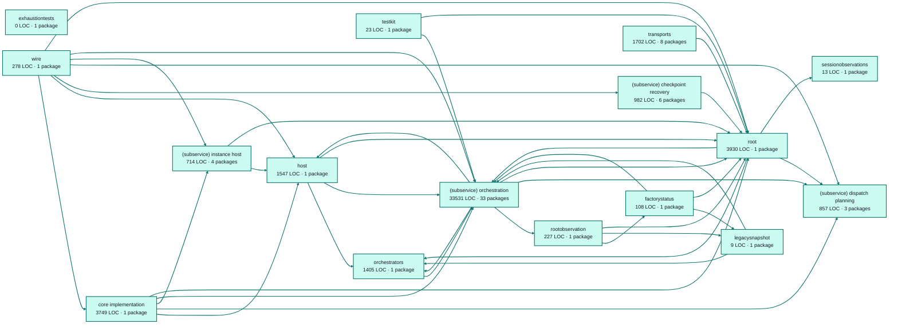

# factory runtime service architecture

<!-- Generated by make architecture. -->

Source commit: `010c36156f583c707e766514f7720c06dad809fb`.

[High-level backend](../high-level-backend.md) · [Test coverage](../high-level-test-coverage.md)

49075 LOC across 263 files. Arrows show imports between package groups within this service. They are static dependencies, not runtime calls. `XX%` means coverage was unmeasured.

## Package groups

`(subservice)` identifies a private service under `internal/services/`. `internal/service` is the core service implementation.

| Group | LOC | Files | Packages | Unit | Functional |
| --- | ---: | ---: | ---: | ---: | ---: |
| core implementation | 3749 | 11 | 1 | 57.2% | 64.3% |
| exhaustiontests | 0 | 0 | 1 | XX% | XX% |
| factorystatus | 108 | 1 | 1 | 92.3% | 90.4% |
| host | 1547 | 8 | 1 | 62.9% | 70.7% |
| legacysnapshot | 9 | 1 | 1 | XX% | XX% |
| orchestrators | 1405 | 8 | 1 | 90.0% | 72.4% |
| rootobservation | 227 | 1 | 1 | 100.0% | 84.4% |
| (subservice) checkpoint recovery | 982 | 10 | 6 | 88.5% | 19.5% |
| (subservice) dispatch planning | 857 | 5 | 3 | 83.8% | 65.6% |
| (subservice) instance host | 714 | 11 | 4 | 89.6% | 56.9% |
| (subservice) orchestration | 33531 | 130 | 33 | 85.1% | 68.4% |
| sessionobservations | 13 | 1 | 1 | XX% | XX% |
| testkit | 23 | 1 | 1 | 100.0% | XX% |
| root | 3930 | 50 | 1 | 73.6% | 49.4% |
| transports | 1702 | 20 | 8 | 92.3% | 62.5% |
| wire | 278 | 5 | 1 | XX% | 89.7% |

## Packages

| Package | LOC | Files | Unit | Functional |
| --- | ---: | ---: | ---: | ---: |
| [`pkg/services/factory_runtime`](../../../../pkg/services/factory_runtime) | 3930 | 50 | 73.6% | 49.4% |
| [`pkg/services/factory_runtime/internal`](../../../../pkg/services/factory_runtime/internal) | 3749 | 11 | 57.2% | 64.3% |
| [`pkg/services/factory_runtime/internal/exhaustiontests`](../../../../pkg/services/factory_runtime/internal/exhaustiontests) | 0 | 0 | XX% | XX% |
| [`pkg/services/factory_runtime/internal/factorystatus`](../../../../pkg/services/factory_runtime/internal/factorystatus) | 108 | 1 | 92.3% | 90.4% |
| [`pkg/services/factory_runtime/internal/host`](../../../../pkg/services/factory_runtime/internal/host) | 1547 | 8 | 62.9% | 70.7% |
| [`pkg/services/factory_runtime/internal/legacysnapshot`](../../../../pkg/services/factory_runtime/internal/legacysnapshot) | 9 | 1 | XX% | XX% |
| [`pkg/services/factory_runtime/internal/orchestrators/petri`](../../../../pkg/services/factory_runtime/internal/orchestrators/petri) | 1405 | 8 | 90.0% | 72.4% |
| [`pkg/services/factory_runtime/internal/rootobservation`](../../../../pkg/services/factory_runtime/internal/rootobservation) | 227 | 1 | 100.0% | 84.4% |
| [`pkg/services/factory_runtime/internal/services/checkpoint_recovery`](../../../../pkg/services/factory_runtime/internal/services/checkpoint_recovery) | 144 | 4 | 100.0% | 0.0% |
| [`pkg/services/factory_runtime/internal/services/checkpoint_recovery/internal/javascriptstore`](../../../../pkg/services/factory_runtime/internal/services/checkpoint_recovery/internal/javascriptstore) | 65 | 1 | 85.7% | 21.4% |
| [`pkg/services/factory_runtime/internal/services/checkpoint_recovery/internal/javascriptsummary`](../../../../pkg/services/factory_runtime/internal/services/checkpoint_recovery/internal/javascriptsummary) | 166 | 1 | 89.2% | 83.8% |
| [`pkg/services/factory_runtime/internal/services/checkpoint_recovery/internal/processlocal`](../../../../pkg/services/factory_runtime/internal/services/checkpoint_recovery/internal/processlocal) | 472 | 2 | 86.0% | 0.0% |
| [`pkg/services/factory_runtime/internal/services/checkpoint_recovery/internal/service`](../../../../pkg/services/factory_runtime/internal/services/checkpoint_recovery/internal/service) | 95 | 1 | 93.2% | 0.0% |
| [`pkg/services/factory_runtime/internal/services/checkpoint_recovery/wire`](../../../../pkg/services/factory_runtime/internal/services/checkpoint_recovery/wire) | 40 | 1 | XX% | 50.0% |
| [`pkg/services/factory_runtime/internal/services/dispatch_planning`](../../../../pkg/services/factory_runtime/internal/services/dispatch_planning) | 187 | 1 | 100.0% | 100.0% |
| [`pkg/services/factory_runtime/internal/services/dispatch_planning/internal/service`](../../../../pkg/services/factory_runtime/internal/services/dispatch_planning/internal/service) | 652 | 3 | 83.7% | 65.2% |
| [`pkg/services/factory_runtime/internal/services/dispatch_planning/wire`](../../../../pkg/services/factory_runtime/internal/services/dispatch_planning/wire) | 18 | 1 | XX% | 100.0% |
| [`pkg/services/factory_runtime/internal/services/instance_host`](../../../../pkg/services/factory_runtime/internal/services/instance_host) | 27 | 1 | XX% | XX% |
| [`pkg/services/factory_runtime/internal/services/instance_host/build`](../../../../pkg/services/factory_runtime/internal/services/instance_host/build) | 336 | 4 | 99.1% | 87.9% |
| [`pkg/services/factory_runtime/internal/services/instance_host/internal/service`](../../../../pkg/services/factory_runtime/internal/services/instance_host/internal/service) | 338 | 5 | 83.2% | 36.0% |
| [`pkg/services/factory_runtime/internal/services/instance_host/wire`](../../../../pkg/services/factory_runtime/internal/services/instance_host/wire) | 13 | 1 | XX% | 100.0% |
| [`pkg/services/factory_runtime/internal/services/orchestration`](../../../../pkg/services/factory_runtime/internal/services/orchestration) | 135 | 2 | 42.9% | 66.7% |
| [`pkg/services/factory_runtime/internal/services/orchestration/context`](../../../../pkg/services/factory_runtime/internal/services/orchestration/context) | 124 | 1 | 86.1% | 5.6% |
| [`pkg/services/factory_runtime/internal/services/orchestration/definitionmapping`](../../../../pkg/services/factory_runtime/internal/services/orchestration/definitionmapping) | 716 | 1 | 92.0% | 91.3% |
| [`pkg/services/factory_runtime/internal/services/orchestration/definitionmapping/maptests`](../../../../pkg/services/factory_runtime/internal/services/orchestration/definitionmapping/maptests) | 0 | 0 | XX% | XX% |
| [`pkg/services/factory_runtime/internal/services/orchestration/engine`](../../../../pkg/services/factory_runtime/internal/services/orchestration/engine) | 2323 | 6 | 91.0% | 77.8% |
| [`pkg/services/factory_runtime/internal/services/orchestration/internal/service`](../../../../pkg/services/factory_runtime/internal/services/orchestration/internal/service) | 393 | 1 | 82.7% | 78.6% |
| [`pkg/services/factory_runtime/internal/services/orchestration/javascript`](../../../../pkg/services/factory_runtime/internal/services/orchestration/javascript) | 135 | 1 | 74.3% | 77.1% |
| [`pkg/services/factory_runtime/internal/services/orchestration/javascript/preview`](../../../../pkg/services/factory_runtime/internal/services/orchestration/javascript/preview) | 162 | 3 | 79.5% | 66.7% |
| [`pkg/services/factory_runtime/internal/services/orchestration/javascript/runtime`](../../../../pkg/services/factory_runtime/internal/services/orchestration/javascript/runtime) | 2386 | 9 | 83.4% | 69.9% |
| [`pkg/services/factory_runtime/internal/services/orchestration/javascript/source`](../../../../pkg/services/factory_runtime/internal/services/orchestration/javascript/source) | 851 | 7 | 66.7% | 62.2% |
| [`pkg/services/factory_runtime/internal/services/orchestration/javascript/validation`](../../../../pkg/services/factory_runtime/internal/services/orchestration/javascript/validation) | 1661 | 12 | 83.0% | 64.3% |
| [`pkg/services/factory_runtime/internal/services/orchestration/metrics`](../../../../pkg/services/factory_runtime/internal/services/orchestration/metrics) | 46 | 3 | 100.0% | 100.0% |
| [`pkg/services/factory_runtime/internal/services/orchestration/orchestrationowner`](../../../../pkg/services/factory_runtime/internal/services/orchestration/orchestrationowner) | 63 | 2 | 86.7% | 80.0% |
| [`pkg/services/factory_runtime/internal/services/orchestration/orchestratorcontract`](../../../../pkg/services/factory_runtime/internal/services/orchestration/orchestratorcontract) | 1089 | 11 | 79.3% | 60.9% |
| [`pkg/services/factory_runtime/internal/services/orchestration/replayhooks`](../../../../pkg/services/factory_runtime/internal/services/orchestration/replayhooks) | 73 | 1 | 83.3% | 91.7% |
| [`pkg/services/factory_runtime/internal/services/orchestration/runtime`](../../../../pkg/services/factory_runtime/internal/services/orchestration/runtime) | 13516 | 17 | 84.5% | 68.3% |
| [`pkg/services/factory_runtime/internal/services/orchestration/runtime/buffers`](../../../../pkg/services/factory_runtime/internal/services/orchestration/runtime/buffers) | 56 | 1 | 55.0% | 55.0% |
| [`pkg/services/factory_runtime/internal/services/orchestration/runtimecontract`](../../../../pkg/services/factory_runtime/internal/services/orchestration/runtimecontract) | 339 | 4 | 74.4% | 46.4% |
| [`pkg/services/factory_runtime/internal/services/orchestration/scheduler`](../../../../pkg/services/factory_runtime/internal/services/orchestration/scheduler) | 1618 | 5 | 89.6% | 78.3% |
| [`pkg/services/factory_runtime/internal/services/orchestration/state`](../../../../pkg/services/factory_runtime/internal/services/orchestration/state) | 1059 | 7 | 84.2% | 85.1% |
| [`pkg/services/factory_runtime/internal/services/orchestration/state/validation`](../../../../pkg/services/factory_runtime/internal/services/orchestration/state/validation) | 450 | 8 | 95.6% | 32.4% |
| [`pkg/services/factory_runtime/internal/services/orchestration/subsystems`](../../../../pkg/services/factory_runtime/internal/services/orchestration/subsystems) | 3442 | 11 | 86.4% | 79.3% |
| [`pkg/services/factory_runtime/internal/services/orchestration/subsystems/circuitbreakertests`](../../../../pkg/services/factory_runtime/internal/services/orchestration/subsystems/circuitbreakertests) | 0 | 0 | XX% | XX% |
| [`pkg/services/factory_runtime/internal/services/orchestration/subsystems/dispatchertests`](../../../../pkg/services/factory_runtime/internal/services/orchestration/subsystems/dispatchertests) | 0 | 0 | XX% | XX% |
| [`pkg/services/factory_runtime/internal/services/orchestration/subsystems/goalroutingtests`](../../../../pkg/services/factory_runtime/internal/services/orchestration/subsystems/goalroutingtests) | 0 | 0 | XX% | XX% |
| [`pkg/services/factory_runtime/internal/services/orchestration/subsystems/terminationtests`](../../../../pkg/services/factory_runtime/internal/services/orchestration/subsystems/terminationtests) | 0 | 0 | XX% | XX% |
| [`pkg/services/factory_runtime/internal/services/orchestration/throttle`](../../../../pkg/services/factory_runtime/internal/services/orchestration/throttle) | 86 | 1 | 82.1% | 5.1% |
| [`pkg/services/factory_runtime/internal/services/orchestration/token`](../../../../pkg/services/factory_runtime/internal/services/orchestration/token) | 228 | 3 | 100.0% | 92.4% |
| [`pkg/services/factory_runtime/internal/services/orchestration/token_transformer`](../../../../pkg/services/factory_runtime/internal/services/orchestration/token_transformer) | 576 | 1 | 88.5% | 83.8% |
| [`pkg/services/factory_runtime/internal/services/orchestration/tooling/javascript/callbehavior`](../../../../pkg/services/factory_runtime/internal/services/orchestration/tooling/javascript/callbehavior) | 734 | 4 | 97.6% | 0.0% |
| [`pkg/services/factory_runtime/internal/services/orchestration/tooling/javascript/catalog`](../../../../pkg/services/factory_runtime/internal/services/orchestration/tooling/javascript/catalog) | 960 | 3 | 80.8% | 0.0% |
| [`pkg/services/factory_runtime/internal/services/orchestration/tooling/javascript/symbolidentity`](../../../../pkg/services/factory_runtime/internal/services/orchestration/tooling/javascript/symbolidentity) | 294 | 4 | 97.1% | 0.0% |
| [`pkg/services/factory_runtime/internal/services/orchestration/wire`](../../../../pkg/services/factory_runtime/internal/services/orchestration/wire) | 16 | 1 | XX% | 100.0% |
| [`pkg/services/factory_runtime/internal/sessionobservations`](../../../../pkg/services/factory_runtime/internal/sessionobservations) | 13 | 1 | XX% | XX% |
| [`pkg/services/factory_runtime/internal/testkit`](../../../../pkg/services/factory_runtime/internal/testkit) | 23 | 1 | 100.0% | XX% |
| [`pkg/services/factory_runtime/transports/cli`](../../../../pkg/services/factory_runtime/transports/cli) | 438 | 4 | 91.4% | 62.5% |
| [`pkg/services/factory_runtime/transports/cli/workflow`](../../../../pkg/services/factory_runtime/transports/cli/workflow) | 324 | 3 | 83.2% | XX% |
| [`pkg/services/factory_runtime/transports/http`](../../../../pkg/services/factory_runtime/transports/http) | 155 | 2 | 96.9% | XX% |
| [`pkg/services/factory_runtime/transports/http/control`](../../../../pkg/services/factory_runtime/transports/http/control) | 207 | 3 | 94.3% | XX% |
| [`pkg/services/factory_runtime/transports/http/dispatch`](../../../../pkg/services/factory_runtime/transports/http/dispatch) | 174 | 3 | 96.4% | XX% |
| [`pkg/services/factory_runtime/transports/http/internal/common`](../../../../pkg/services/factory_runtime/transports/http/internal/common) | 167 | 2 | 98.3% | XX% |
| [`pkg/services/factory_runtime/transports/http/internal/errors`](../../../../pkg/services/factory_runtime/transports/http/internal/errors) | 140 | 1 | 97.9% | XX% |
| [`pkg/services/factory_runtime/transports/http/observation`](../../../../pkg/services/factory_runtime/transports/http/observation) | 97 | 2 | 100.0% | XX% |
| [`pkg/services/factory_runtime/wire`](../../../../pkg/services/factory_runtime/wire) | 278 | 5 | XX% | 89.7% |
