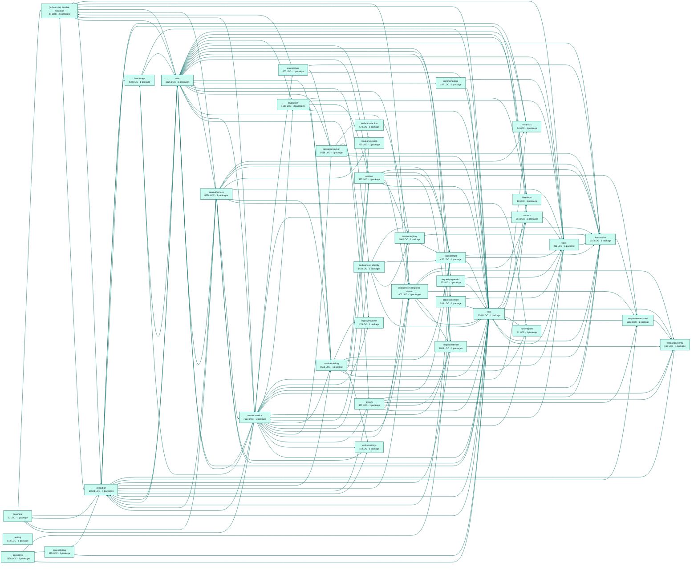

# factory sessions service architecture

<!-- Generated by make architecture. -->

Source commit: `a748355126bb8cab258d5d8fbb6f1c062cd15ba3`.

[High-level backend](../high-level-backend.md) · [Test coverage](../high-level-test-coverage.md)

60028 LOC across 243 files. Arrows show imports between package groups within this service. They are static dependencies, not runtime calls. `XX%` means coverage was unmeasured.

## Package groups

`(subservice)` identifies a private service under `internal/services/`. `internal/service` is the core service implementation.

| Group | LOC | Files | Packages | Unit | Functional |
| --- | ---: | ---: | ---: | ---: | ---: |
| artifactprojection | 57 | 1 | 1 | 42.1% | 31.6% |
| canonical | 20 | 1 | 1 | XX% | XX% |
| contracts | 94 | 2 | 1 | 100.0% | 100.0% |
| controlplane | 470 | 4 | 1 | 77.5% | 41.8% |
| cursors | 554 | 5 | 2 | 77.4% | 19.5% |
| execution | 16688 | 31 | 4 | 83.7% | 62.1% |
| fileeffects | 18 | 1 | 1 | 100.0% | 50.0% |
| invocation | 1509 | 6 | 3 | 82.6% | 84.2% |
| legacysnapshot | 27 | 1 | 1 | XX% | XX% |
| livechange | 930 | 2 | 1 | 74.9% | 57.9% |
| livesession | 215 | 1 | 1 | 87.2% | 68.1% |
| logicaltarget | 457 | 6 | 1 | 85.3% | 42.6% |
| modelinvocation | 739 | 1 | 1 | 94.2% | 62.9% |
| processlifecycle | 383 | 2 | 1 | 93.4% | 76.0% |
| requestpreparation | 35 | 1 | 1 | 100.0% | 77.8% |
| responseevents | 165 | 3 | 1 | 100.0% | 100.0% |
| responseeventstore | 1263 | 5 | 1 | 91.9% | 62.8% |
| responsestream | 1863 | 8 | 3 | 82.6% | 49.6% |
| roles | 211 | 1 | 1 | XX% | XX% |
| runtime | 565 | 2 | 1 | 75.9% | 61.8% |
| runtimebinding | 1566 | 6 | 1 | 78.9% | 62.3% |
| runtimehosting | 197 | 1 | 1 | 92.6% | 88.2% |
| runtimeports | 11 | 1 | 1 | XX% | XX% |
| scopedlisting | 115 | 1 | 1 | 92.0% | 48.0% |
| internal/service | 6738 | 27 | 3 | 71.8% | 76.7% |
| (subservice) durable execution | 94 | 2 | 2 | XX% | 100.0% |
| (subservice) identity | 142 | 3 | 3 | 60.6% | 46.3% |
| (subservice) response stream | 402 | 3 | 3 | 80.3% | 56.6% |
| sessionprojection | 1516 | 6 | 1 | 82.8% | 52.8% |
| sessionregistry | 164 | 1 | 1 | 87.1% | 65.9% |
| sessionservice | 7523 | 35 | 1 | 55.3% | 56.8% |
| stream | 375 | 3 | 1 | 85.3% | 62.7% |
| testing | 142 | 1 | 1 | 87.5% | XX% |
| workersettings | 16 | 1 | 1 | 100.0% | 100.0% |
| root | 3341 | 18 | 1 | 81.8% | 56.8% |
| transports | 10398 | 45 | 8 | 70.9% | 36.9% |
| wire | 1025 | 5 | 2 | XX% | 74.9% |

## Packages

| Package | LOC | Files | Unit | Functional |
| --- | ---: | ---: | ---: | ---: |
| [`pkg/services/factory_sessions`](../../../../pkg/services/factory_sessions) | 3341 | 18 | 81.8% | 56.8% |
| [`pkg/services/factory_sessions/internal/artifactprojection`](../../../../pkg/services/factory_sessions/internal/artifactprojection) | 57 | 1 | 42.1% | 31.6% |
| [`pkg/services/factory_sessions/internal/canonical/durable`](../../../../pkg/services/factory_sessions/internal/canonical/durable) | 20 | 1 | XX% | XX% |
| [`pkg/services/factory_sessions/internal/contracts`](../../../../pkg/services/factory_sessions/internal/contracts) | 94 | 2 | 100.0% | 100.0% |
| [`pkg/services/factory_sessions/internal/controlplane`](../../../../pkg/services/factory_sessions/internal/controlplane) | 470 | 4 | 77.5% | 41.8% |
| [`pkg/services/factory_sessions/internal/cursors`](../../../../pkg/services/factory_sessions/internal/cursors) | 372 | 4 | 69.6% | 33.9% |
| [`pkg/services/factory_sessions/internal/cursors/persistence`](../../../../pkg/services/factory_sessions/internal/cursors/persistence) | 182 | 1 | 88.0% | 0.0% |
| [`pkg/services/factory_sessions/internal/execution`](../../../../pkg/services/factory_sessions/internal/execution) | 14066 | 22 | 82.2% | 62.1% |
| [`pkg/services/factory_sessions/internal/execution/fixtures`](../../../../pkg/services/factory_sessions/internal/execution/fixtures) | 677 | 1 | XX% | XX% |
| [`pkg/services/factory_sessions/internal/execution/recordingreplay`](../../../../pkg/services/factory_sessions/internal/execution/recordingreplay) | 1524 | 5 | 94.8% | 58.6% |
| [`pkg/services/factory_sessions/internal/execution/runtimepersist`](../../../../pkg/services/factory_sessions/internal/execution/runtimepersist) | 421 | 3 | 92.7% | 77.1% |
| [`pkg/services/factory_sessions/internal/fileeffects`](../../../../pkg/services/factory_sessions/internal/fileeffects) | 18 | 1 | 100.0% | 50.0% |
| [`pkg/services/factory_sessions/internal/invocation`](../../../../pkg/services/factory_sessions/internal/invocation) | 1370 | 4 | 86.3% | 84.2% |
| [`pkg/services/factory_sessions/internal/invocation/packagedtts`](../../../../pkg/services/factory_sessions/internal/invocation/packagedtts) | 55 | 1 | 0.0% | 86.7% |
| [`pkg/services/factory_sessions/internal/invocation/runtimeadapter`](../../../../pkg/services/factory_sessions/internal/invocation/runtimeadapter) | 84 | 1 | 59.5% | 83.8% |
| [`pkg/services/factory_sessions/internal/legacysnapshot`](../../../../pkg/services/factory_sessions/internal/legacysnapshot) | 27 | 1 | XX% | XX% |
| [`pkg/services/factory_sessions/internal/livechange`](../../../../pkg/services/factory_sessions/internal/livechange) | 930 | 2 | 74.9% | 57.9% |
| [`pkg/services/factory_sessions/internal/livesession`](../../../../pkg/services/factory_sessions/internal/livesession) | 215 | 1 | 87.2% | 68.1% |
| [`pkg/services/factory_sessions/internal/logicaltarget`](../../../../pkg/services/factory_sessions/internal/logicaltarget) | 457 | 6 | 85.3% | 42.6% |
| [`pkg/services/factory_sessions/internal/modelinvocation`](../../../../pkg/services/factory_sessions/internal/modelinvocation) | 739 | 1 | 94.2% | 62.9% |
| [`pkg/services/factory_sessions/internal/processlifecycle`](../../../../pkg/services/factory_sessions/internal/processlifecycle) | 383 | 2 | 93.4% | 76.0% |
| [`pkg/services/factory_sessions/internal/requestpreparation`](../../../../pkg/services/factory_sessions/internal/requestpreparation) | 35 | 1 | 100.0% | 77.8% |
| [`pkg/services/factory_sessions/internal/responseevents`](../../../../pkg/services/factory_sessions/internal/responseevents) | 165 | 3 | 100.0% | 100.0% |
| [`pkg/services/factory_sessions/internal/responseeventstore`](../../../../pkg/services/factory_sessions/internal/responseeventstore) | 1263 | 5 | 91.9% | 62.8% |
| [`pkg/services/factory_sessions/internal/responsestream`](../../../../pkg/services/factory_sessions/internal/responsestream) | 1131 | 6 | 85.1% | 37.7% |
| [`pkg/services/factory_sessions/internal/responsestream/fragmentmap`](../../../../pkg/services/factory_sessions/internal/responsestream/fragmentmap) | 696 | 1 | 77.3% | 71.5% |
| [`pkg/services/factory_sessions/internal/responsestream/ndjsoncontract`](../../../../pkg/services/factory_sessions/internal/responsestream/ndjsoncontract) | 36 | 1 | 100.0% | XX% |
| [`pkg/services/factory_sessions/internal/roles`](../../../../pkg/services/factory_sessions/internal/roles) | 211 | 1 | XX% | XX% |
| [`pkg/services/factory_sessions/internal/runtime`](../../../../pkg/services/factory_sessions/internal/runtime) | 565 | 2 | 75.9% | 61.8% |
| [`pkg/services/factory_sessions/internal/runtimebinding`](../../../../pkg/services/factory_sessions/internal/runtimebinding) | 1566 | 6 | 78.9% | 62.3% |
| [`pkg/services/factory_sessions/internal/runtimehosting`](../../../../pkg/services/factory_sessions/internal/runtimehosting) | 197 | 1 | 92.6% | 88.2% |
| [`pkg/services/factory_sessions/internal/runtimeports`](../../../../pkg/services/factory_sessions/internal/runtimeports) | 11 | 1 | XX% | XX% |
| [`pkg/services/factory_sessions/internal/scopedlisting`](../../../../pkg/services/factory_sessions/internal/scopedlisting) | 115 | 1 | 92.0% | 48.0% |
| [`pkg/services/factory_sessions/internal/service`](../../../../pkg/services/factory_sessions/internal/service) | 5795 | 23 | 70.8% | 77.1% |
| [`pkg/services/factory_sessions/internal/service/invocation`](../../../../pkg/services/factory_sessions/internal/service/invocation) | 770 | 3 | 74.5% | 70.1% |
| [`pkg/services/factory_sessions/internal/service/operatordefaults`](../../../../pkg/services/factory_sessions/internal/service/operatordefaults) | 173 | 1 | 89.2% | 89.2% |
| [`pkg/services/factory_sessions/internal/services/durable_execution`](../../../../pkg/services/factory_sessions/internal/services/durable_execution) | 54 | 1 | XX% | XX% |
| [`pkg/services/factory_sessions/internal/services/durable_execution/wire`](../../../../pkg/services/factory_sessions/internal/services/durable_execution/wire) | 40 | 1 | XX% | 100.0% |
| [`pkg/services/factory_sessions/internal/services/identity`](../../../../pkg/services/factory_sessions/internal/services/identity) | 33 | 1 | XX% | XX% |
| [`pkg/services/factory_sessions/internal/services/identity/internal/service`](../../../../pkg/services/factory_sessions/internal/services/identity/internal/service) | 84 | 1 | 60.6% | 42.4% |
| [`pkg/services/factory_sessions/internal/services/identity/wire`](../../../../pkg/services/factory_sessions/internal/services/identity/wire) | 25 | 1 | XX% | 62.5% |
| [`pkg/services/factory_sessions/internal/services/response_stream`](../../../../pkg/services/factory_sessions/internal/services/response_stream) | 66 | 1 | 80.0% | 20.0% |
| [`pkg/services/factory_sessions/internal/services/response_stream/internal/service`](../../../../pkg/services/factory_sessions/internal/services/response_stream/internal/service) | 314 | 1 | 80.3% | 57.5% |
| [`pkg/services/factory_sessions/internal/services/response_stream/wire`](../../../../pkg/services/factory_sessions/internal/services/response_stream/wire) | 22 | 1 | XX% | 75.0% |
| [`pkg/services/factory_sessions/internal/sessionprojection`](../../../../pkg/services/factory_sessions/internal/sessionprojection) | 1516 | 6 | 82.8% | 52.8% |
| [`pkg/services/factory_sessions/internal/sessionregistry`](../../../../pkg/services/factory_sessions/internal/sessionregistry) | 164 | 1 | 87.1% | 65.9% |
| [`pkg/services/factory_sessions/internal/sessionservice`](../../../../pkg/services/factory_sessions/internal/sessionservice) | 7523 | 35 | 55.3% | 56.8% |
| [`pkg/services/factory_sessions/internal/stream`](../../../../pkg/services/factory_sessions/internal/stream) | 375 | 3 | 85.3% | 62.7% |
| [`pkg/services/factory_sessions/internal/testing/eventsstub`](../../../../pkg/services/factory_sessions/internal/testing/eventsstub) | 142 | 1 | 87.5% | XX% |
| [`pkg/services/factory_sessions/internal/workersettings`](../../../../pkg/services/factory_sessions/internal/workersettings) | 16 | 1 | 100.0% | 100.0% |
| [`pkg/services/factory_sessions/transports/cli`](../../../../pkg/services/factory_sessions/transports/cli) | 63 | 1 | 93.1% | 65.5% |
| [`pkg/services/factory_sessions/transports/cli/session`](../../../../pkg/services/factory_sessions/transports/cli/session) | 2559 | 9 | 76.7% | 44.5% |
| [`pkg/services/factory_sessions/transports/cli/session/smoke`](../../../../pkg/services/factory_sessions/transports/cli/session/smoke) | 0 | 0 | XX% | XX% |
| [`pkg/services/factory_sessions/transports/cli/sessionexecution`](../../../../pkg/services/factory_sessions/transports/cli/sessionexecution) | 354 | 2 | 19.9% | 36.2% |
| [`pkg/services/factory_sessions/transports/http`](../../../../pkg/services/factory_sessions/transports/http) | 2476 | 13 | 59.2% | 56.8% |
| [`pkg/services/factory_sessions/transports/mcp`](../../../../pkg/services/factory_sessions/transports/mcp) | 3827 | 11 | 76.4% | 20.8% |
| [`pkg/services/factory_sessions/transports/mcp/catalog`](../../../../pkg/services/factory_sessions/transports/mcp/catalog) | 536 | 3 | 80.6% | 0.0% |
| [`pkg/services/factory_sessions/transports/mcp/discoverygen`](../../../../pkg/services/factory_sessions/transports/mcp/discoverygen) | 583 | 6 | 84.2% | XX% |
| [`pkg/services/factory_sessions/wire`](../../../../pkg/services/factory_sessions/wire) | 997 | 4 | XX% | 74.9% |
| [`pkg/services/factory_sessions/wire/contracts`](../../../../pkg/services/factory_sessions/wire/contracts) | 28 | 1 | XX% | XX% |
