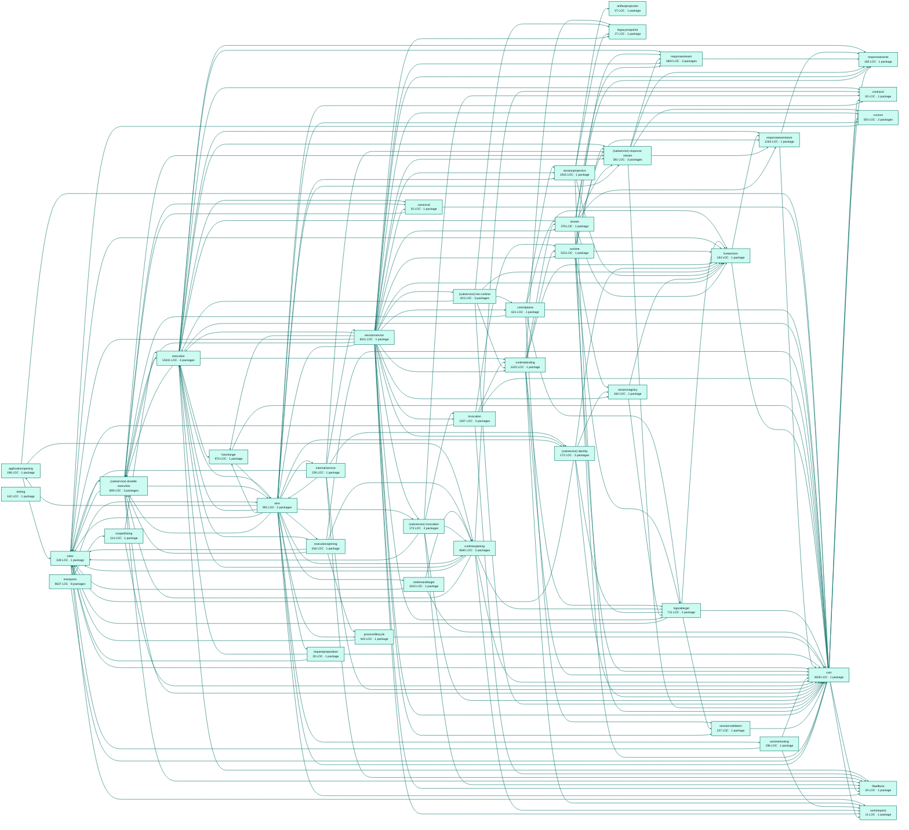

# factory sessions service architecture

<!-- Generated by make architecture. -->

Source commit: `51e453fa75853aad6108412decea73204f705829`.

[High-level backend](../high-level-backend.md) · [Test coverage](../high-level-test-coverage.md)

59851 LOC across 232 files. Arrows show imports between package groups within this service. They are static dependencies, not runtime calls. `XX%` means coverage was unmeasured.

## Package groups

`(subservice)` identifies a private service under `internal/services/`. `internal/service` is the core service implementation.

| Group | LOC | Files | Packages | Unit | Functional |
| --- | ---: | ---: | ---: | ---: | ---: |
| applicationopening | 198 | 1 | 1 | 59.6% | 67.3% |
| artifactprojection | 57 | 1 | 1 | 42.1% | 31.6% |
| canonical | 20 | 1 | 1 | XX% | XX% |
| contracts | 83 | 2 | 1 | XX% | XX% |
| controlplane | 631 | 6 | 1 | 79.4% | 47.8% |
| cursors | 554 | 5 | 2 | 77.4% | 19.5% |
| execution | 15341 | 22 | 4 | 81.6% | 62.4% |
| executionopening | 616 | 3 | 1 | 64.4% | 67.1% |
| fileeffects | 20 | 1 | 1 | 100.0% | 50.0% |
| invocation | 1507 | 6 | 3 | 81.3% | 81.6% |
| legacysnapshot | 27 | 1 | 1 | XX% | XX% |
| livechange | 974 | 2 | 1 | 76.2% | 67.6% |
| livesession | 184 | 1 | 1 | 84.2% | 63.2% |
| logicaltarget | 711 | 7 | 1 | 78.3% | 51.1% |
| ondemandtarget | 1042 | 3 | 1 | 85.3% | 73.9% |
| processlifecycle | 403 | 2 | 1 | 93.7% | 75.3% |
| requestpreparation | 35 | 1 | 1 | 100.0% | 77.8% |
| responseevents | 165 | 3 | 1 | 100.0% | 100.0% |
| responseeventstore | 1263 | 5 | 1 | 91.5% | 62.6% |
| responsestream | 1863 | 8 | 3 | 82.3% | 45.4% |
| roles | 328 | 1 | 1 | XX% | XX% |
| runtime | 533 | 2 | 1 | 59.0% | 70.5% |
| runtimebinding | 1222 | 6 | 1 | 55.7% | 57.9% |
| runtimehosting | 196 | 1 | 1 | 92.6% | 85.3% |
| runtimeopening | 6640 | 17 | 3 | 69.4% | 72.2% |
| runtimeports | 11 | 1 | 1 | XX% | XX% |
| scopedlisting | 114 | 1 | 1 | 88.0% | 48.0% |
| internal/service | 239 | 1 | 1 | 76.5% | 58.8% |
| (subservice) durable execution | 699 | 4 | 3 | 71.0% | 69.0% |
| (subservice) identity | 172 | 3 | 3 | 54.3% | 48.9% |
| (subservice) invocation | 173 | 3 | 3 | 100.0% | 68.0% |
| (subservice) live runtime | 415 | 4 | 3 | 74.8% | 55.5% |
| (subservice) response stream | 381 | 3 | 3 | 73.7% | 54.9% |
| sessionprojection | 1515 | 6 | 1 | 82.0% | 50.3% |
| sessionregistry | 164 | 1 | 1 | 86.2% | 63.2% |
| sessionservice | 6511 | 22 | 1 | 45.0% | 55.9% |
| sessionvalidation | 107 | 1 | 1 | 66.7% | 80.6% |
| stream | 378 | 3 | 1 | 82.9% | 65.1% |
| testing | 142 | 1 | 1 | 83.3% | XX% |
| root | 3628 | 20 | 1 | 75.5% | 43.7% |
| transports | 9637 | 44 | 8 | 67.7% | 32.7% |
| wire | 952 | 6 | 2 | XX% | 74.2% |

## Packages

| Package | LOC | Files | Unit | Functional |
| --- | ---: | ---: | ---: | ---: |
| [`pkg/services/factory_sessions`](../../../../pkg/services/factory_sessions) | 3628 | 20 | 75.5% | 43.7% |
| [`pkg/services/factory_sessions/internal/applicationopening`](../../../../pkg/services/factory_sessions/internal/applicationopening) | 198 | 1 | 59.6% | 67.3% |
| [`pkg/services/factory_sessions/internal/artifactprojection`](../../../../pkg/services/factory_sessions/internal/artifactprojection) | 57 | 1 | 42.1% | 31.6% |
| [`pkg/services/factory_sessions/internal/canonical/durable`](../../../../pkg/services/factory_sessions/internal/canonical/durable) | 20 | 1 | XX% | XX% |
| [`pkg/services/factory_sessions/internal/contracts`](../../../../pkg/services/factory_sessions/internal/contracts) | 83 | 2 | XX% | XX% |
| [`pkg/services/factory_sessions/internal/controlplane`](../../../../pkg/services/factory_sessions/internal/controlplane) | 631 | 6 | 79.4% | 47.8% |
| [`pkg/services/factory_sessions/internal/cursors`](../../../../pkg/services/factory_sessions/internal/cursors) | 372 | 4 | 69.6% | 33.9% |
| [`pkg/services/factory_sessions/internal/cursors/persistence`](../../../../pkg/services/factory_sessions/internal/cursors/persistence) | 182 | 1 | 88.0% | 0.0% |
| [`pkg/services/factory_sessions/internal/execution`](../../../../pkg/services/factory_sessions/internal/execution) | 13260 | 17 | 80.3% | 64.0% |
| [`pkg/services/factory_sessions/internal/execution/fixtures`](../../../../pkg/services/factory_sessions/internal/execution/fixtures) | 677 | 1 | XX% | XX% |
| [`pkg/services/factory_sessions/internal/execution/recordingreplay`](../../../../pkg/services/factory_sessions/internal/execution/recordingreplay) | 1247 | 3 | 93.5% | 46.2% |
| [`pkg/services/factory_sessions/internal/execution/runtimepersist`](../../../../pkg/services/factory_sessions/internal/execution/runtimepersist) | 157 | 1 | 90.4% | 71.2% |
| [`pkg/services/factory_sessions/internal/executionopening`](../../../../pkg/services/factory_sessions/internal/executionopening) | 616 | 3 | 64.4% | 67.1% |
| [`pkg/services/factory_sessions/internal/fileeffects`](../../../../pkg/services/factory_sessions/internal/fileeffects) | 20 | 1 | 100.0% | 50.0% |
| [`pkg/services/factory_sessions/internal/invocation`](../../../../pkg/services/factory_sessions/internal/invocation) | 1368 | 4 | 85.3% | 81.3% |
| [`pkg/services/factory_sessions/internal/invocation/packagedtts`](../../../../pkg/services/factory_sessions/internal/invocation/packagedtts) | 55 | 1 | 0.0% | 86.7% |
| [`pkg/services/factory_sessions/internal/invocation/runtimeadapter`](../../../../pkg/services/factory_sessions/internal/invocation/runtimeadapter) | 84 | 1 | 54.1% | 83.8% |
| [`pkg/services/factory_sessions/internal/legacysnapshot`](../../../../pkg/services/factory_sessions/internal/legacysnapshot) | 27 | 1 | XX% | XX% |
| [`pkg/services/factory_sessions/internal/livechange`](../../../../pkg/services/factory_sessions/internal/livechange) | 974 | 2 | 76.2% | 67.6% |
| [`pkg/services/factory_sessions/internal/livesession`](../../../../pkg/services/factory_sessions/internal/livesession) | 184 | 1 | 84.2% | 63.2% |
| [`pkg/services/factory_sessions/internal/logicaltarget`](../../../../pkg/services/factory_sessions/internal/logicaltarget) | 711 | 7 | 78.3% | 51.1% |
| [`pkg/services/factory_sessions/internal/ondemandtarget`](../../../../pkg/services/factory_sessions/internal/ondemandtarget) | 1042 | 3 | 85.3% | 73.9% |
| [`pkg/services/factory_sessions/internal/processlifecycle`](../../../../pkg/services/factory_sessions/internal/processlifecycle) | 403 | 2 | 93.7% | 75.3% |
| [`pkg/services/factory_sessions/internal/requestpreparation`](../../../../pkg/services/factory_sessions/internal/requestpreparation) | 35 | 1 | 100.0% | 77.8% |
| [`pkg/services/factory_sessions/internal/responseevents`](../../../../pkg/services/factory_sessions/internal/responseevents) | 165 | 3 | 100.0% | 100.0% |
| [`pkg/services/factory_sessions/internal/responseeventstore`](../../../../pkg/services/factory_sessions/internal/responseeventstore) | 1263 | 5 | 91.5% | 62.6% |
| [`pkg/services/factory_sessions/internal/responsestream`](../../../../pkg/services/factory_sessions/internal/responsestream) | 1131 | 6 | 84.7% | 34.9% |
| [`pkg/services/factory_sessions/internal/responsestream/fragmentmap`](../../../../pkg/services/factory_sessions/internal/responsestream/fragmentmap) | 696 | 1 | 77.3% | 64.6% |
| [`pkg/services/factory_sessions/internal/responsestream/ndjsoncontract`](../../../../pkg/services/factory_sessions/internal/responsestream/ndjsoncontract) | 36 | 1 | 100.0% | XX% |
| [`pkg/services/factory_sessions/internal/roles`](../../../../pkg/services/factory_sessions/internal/roles) | 328 | 1 | XX% | XX% |
| [`pkg/services/factory_sessions/internal/runtime`](../../../../pkg/services/factory_sessions/internal/runtime) | 533 | 2 | 59.0% | 70.5% |
| [`pkg/services/factory_sessions/internal/runtimebinding`](../../../../pkg/services/factory_sessions/internal/runtimebinding) | 1222 | 6 | 55.7% | 57.9% |
| [`pkg/services/factory_sessions/internal/runtimehosting`](../../../../pkg/services/factory_sessions/internal/runtimehosting) | 196 | 1 | 92.6% | 85.3% |
| [`pkg/services/factory_sessions/internal/runtimeopening`](../../../../pkg/services/factory_sessions/internal/runtimeopening) | 5646 | 14 | 66.2% | 70.8% |
| [`pkg/services/factory_sessions/internal/runtimeopening/invocation`](../../../../pkg/services/factory_sessions/internal/runtimeopening/invocation) | 821 | 2 | 80.0% | 75.8% |
| [`pkg/services/factory_sessions/internal/runtimeopening/operatordefaults`](../../../../pkg/services/factory_sessions/internal/runtimeopening/operatordefaults) | 173 | 1 | 89.2% | 84.3% |
| [`pkg/services/factory_sessions/internal/runtimeports`](../../../../pkg/services/factory_sessions/internal/runtimeports) | 11 | 1 | XX% | XX% |
| [`pkg/services/factory_sessions/internal/scopedlisting`](../../../../pkg/services/factory_sessions/internal/scopedlisting) | 114 | 1 | 88.0% | 48.0% |
| [`pkg/services/factory_sessions/internal/service`](../../../../pkg/services/factory_sessions/internal/service) | 239 | 1 | 76.5% | 58.8% |
| [`pkg/services/factory_sessions/internal/services/durable_execution`](../../../../pkg/services/factory_sessions/internal/services/durable_execution) | 41 | 1 | XX% | XX% |
| [`pkg/services/factory_sessions/internal/services/durable_execution/internal/service`](../../../../pkg/services/factory_sessions/internal/services/durable_execution/internal/service) | 581 | 2 | 71.0% | 68.5% |
| [`pkg/services/factory_sessions/internal/services/durable_execution/wire`](../../../../pkg/services/factory_sessions/internal/services/durable_execution/wire) | 77 | 1 | XX% | 83.3% |
| [`pkg/services/factory_sessions/internal/services/identity`](../../../../pkg/services/factory_sessions/internal/services/identity) | 44 | 1 | XX% | XX% |
| [`pkg/services/factory_sessions/internal/services/identity/internal/service`](../../../../pkg/services/factory_sessions/internal/services/identity/internal/service) | 98 | 1 | 54.3% | 45.7% |
| [`pkg/services/factory_sessions/internal/services/identity/wire`](../../../../pkg/services/factory_sessions/internal/services/identity/wire) | 30 | 1 | XX% | 60.0% |
| [`pkg/services/factory_sessions/internal/services/invocation`](../../../../pkg/services/factory_sessions/internal/services/invocation) | 36 | 1 | XX% | XX% |
| [`pkg/services/factory_sessions/internal/services/invocation/internal/service`](../../../../pkg/services/factory_sessions/internal/services/invocation/internal/service) | 84 | 1 | 100.0% | 65.0% |
| [`pkg/services/factory_sessions/internal/services/invocation/wire`](../../../../pkg/services/factory_sessions/internal/services/invocation/wire) | 53 | 1 | XX% | 80.0% |
| [`pkg/services/factory_sessions/internal/services/live_runtime`](../../../../pkg/services/factory_sessions/internal/services/live_runtime) | 37 | 1 | XX% | XX% |
| [`pkg/services/factory_sessions/internal/services/live_runtime/internal/service`](../../../../pkg/services/factory_sessions/internal/services/live_runtime/internal/service) | 368 | 2 | 74.8% | 55.2% |
| [`pkg/services/factory_sessions/internal/services/live_runtime/wire`](../../../../pkg/services/factory_sessions/internal/services/live_runtime/wire) | 10 | 1 | XX% | 100.0% |
| [`pkg/services/factory_sessions/internal/services/response_stream`](../../../../pkg/services/factory_sessions/internal/services/response_stream) | 66 | 1 | 60.0% | 20.0% |
| [`pkg/services/factory_sessions/internal/services/response_stream/internal/service`](../../../../pkg/services/factory_sessions/internal/services/response_stream/internal/service) | 293 | 1 | 74.3% | 55.8% |
| [`pkg/services/factory_sessions/internal/services/response_stream/wire`](../../../../pkg/services/factory_sessions/internal/services/response_stream/wire) | 22 | 1 | XX% | 75.0% |
| [`pkg/services/factory_sessions/internal/sessionprojection`](../../../../pkg/services/factory_sessions/internal/sessionprojection) | 1515 | 6 | 82.0% | 50.3% |
| [`pkg/services/factory_sessions/internal/sessionregistry`](../../../../pkg/services/factory_sessions/internal/sessionregistry) | 164 | 1 | 86.2% | 63.2% |
| [`pkg/services/factory_sessions/internal/sessionservice`](../../../../pkg/services/factory_sessions/internal/sessionservice) | 6511 | 22 | 45.0% | 55.9% |
| [`pkg/services/factory_sessions/internal/sessionvalidation`](../../../../pkg/services/factory_sessions/internal/sessionvalidation) | 107 | 1 | 66.7% | 80.6% |
| [`pkg/services/factory_sessions/internal/stream`](../../../../pkg/services/factory_sessions/internal/stream) | 378 | 3 | 82.9% | 65.1% |
| [`pkg/services/factory_sessions/internal/testing/eventsstub`](../../../../pkg/services/factory_sessions/internal/testing/eventsstub) | 142 | 1 | 83.3% | XX% |
| [`pkg/services/factory_sessions/transports/cli`](../../../../pkg/services/factory_sessions/transports/cli) | 63 | 1 | 93.1% | 65.5% |
| [`pkg/services/factory_sessions/transports/cli/session`](../../../../pkg/services/factory_sessions/transports/cli/session) | 2547 | 9 | 76.3% | 44.7% |
| [`pkg/services/factory_sessions/transports/cli/session/smoke`](../../../../pkg/services/factory_sessions/transports/cli/session/smoke) | 0 | 0 | XX% | XX% |
| [`pkg/services/factory_sessions/transports/cli/sessionexecution`](../../../../pkg/services/factory_sessions/transports/cli/sessionexecution) | 354 | 2 | 19.0% | 30.3% |
| [`pkg/services/factory_sessions/transports/http`](../../../../pkg/services/factory_sessions/transports/http) | 2560 | 13 | 55.8% | 51.1% |
| [`pkg/services/factory_sessions/transports/mcp`](../../../../pkg/services/factory_sessions/transports/mcp) | 3021 | 10 | 70.6% | 6.1% |
| [`pkg/services/factory_sessions/transports/mcp/catalog`](../../../../pkg/services/factory_sessions/transports/mcp/catalog) | 529 | 3 | 80.4% | 0.0% |
| [`pkg/services/factory_sessions/transports/mcp/discoverygen`](../../../../pkg/services/factory_sessions/transports/mcp/discoverygen) | 563 | 6 | 84.5% | XX% |
| [`pkg/services/factory_sessions/wire`](../../../../pkg/services/factory_sessions/wire) | 923 | 5 | XX% | 74.2% |
| [`pkg/services/factory_sessions/wire/contracts`](../../../../pkg/services/factory_sessions/wire/contracts) | 29 | 1 | XX% | XX% |
