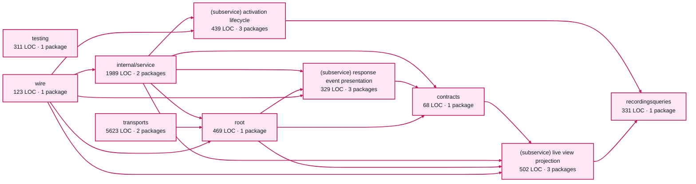

# factory visualization service architecture

<!-- Generated by make architecture. -->

Source commit: `e35483788534480dc6bf2324780b93922fef10e0`.

[High-level backend](../high-level-backend.md) · [Test coverage](../high-level-test-coverage.md)

10184 LOC across 56 files. Arrows show imports between package groups within this service. They are static dependencies, not runtime calls. `XX%` means coverage was unmeasured.

## Package groups

`(subservice)` identifies a private service under `internal/services/`. `internal/service` is the core service implementation.

| Group | LOC | Files | Packages | Unit | Functional |
| --- | ---: | ---: | ---: | ---: | ---: |
| contracts | 68 | 2 | 1 | 100.0% | 100.0% |
| recordingsqueries | 331 | 2 | 1 | 82.0% | 21.8% |
| internal/service | 1989 | 9 | 2 | 85.7% | 60.5% |
| (subservice) activation lifecycle | 439 | 3 | 3 | 76.8% | 57.2% |
| (subservice) live view projection | 502 | 3 | 3 | 80.0% | 2.4% |
| (subservice) response event presentation | 329 | 3 | 3 | 84.5% | 81.4% |
| testing | 311 | 1 | 1 | 12.7% | XX% |
| root | 469 | 5 | 1 | 47.2% | 13.9% |
| transports | 5623 | 26 | 2 | 78.6% | 60.6% |
| wire | 123 | 2 | 1 | XX% | 88.2% |

## Packages

| Package | LOC | Files | Unit | Functional |
| --- | ---: | ---: | ---: | ---: |
| [`pkg/services/factory_visualization`](../../../../pkg/services/factory_visualization) | 469 | 5 | 47.2% | 13.9% |
| [`pkg/services/factory_visualization/internal/contracts`](../../../../pkg/services/factory_visualization/internal/contracts) | 68 | 2 | 100.0% | 100.0% |
| [`pkg/services/factory_visualization/internal/recordingsqueries`](../../../../pkg/services/factory_visualization/internal/recordingsqueries) | 331 | 2 | 82.0% | 21.8% |
| [`pkg/services/factory_visualization/internal/service`](../../../../pkg/services/factory_visualization/internal/service) | 1989 | 9 | 85.7% | 60.5% |
| [`pkg/services/factory_visualization/internal/service/stresstests`](../../../../pkg/services/factory_visualization/internal/service/stresstests) | 0 | 0 | XX% | XX% |
| [`pkg/services/factory_visualization/internal/services/activation_lifecycle`](../../../../pkg/services/factory_visualization/internal/services/activation_lifecycle) | 117 | 1 | 0.0% | 0.0% |
| [`pkg/services/factory_visualization/internal/services/activation_lifecycle/internal/service`](../../../../pkg/services/factory_visualization/internal/services/activation_lifecycle/internal/service) | 310 | 1 | 81.1% | 60.1% |
| [`pkg/services/factory_visualization/internal/services/activation_lifecycle/wire`](../../../../pkg/services/factory_visualization/internal/services/activation_lifecycle/wire) | 12 | 1 | XX% | 100.0% |
| [`pkg/services/factory_visualization/internal/services/live_view_projection`](../../../../pkg/services/factory_visualization/internal/services/live_view_projection) | 127 | 1 | 77.8% | 0.0% |
| [`pkg/services/factory_visualization/internal/services/live_view_projection/internal/service`](../../../../pkg/services/factory_visualization/internal/services/live_view_projection/internal/service) | 363 | 1 | 80.1% | 1.9% |
| [`pkg/services/factory_visualization/internal/services/live_view_projection/wire`](../../../../pkg/services/factory_visualization/internal/services/live_view_projection/wire) | 12 | 1 | XX% | 100.0% |
| [`pkg/services/factory_visualization/internal/services/response_event_presentation`](../../../../pkg/services/factory_visualization/internal/services/response_event_presentation) | 17 | 1 | XX% | XX% |
| [`pkg/services/factory_visualization/internal/services/response_event_presentation/internal/service`](../../../../pkg/services/factory_visualization/internal/services/response_event_presentation/internal/service) | 299 | 1 | 84.5% | 81.3% |
| [`pkg/services/factory_visualization/internal/services/response_event_presentation/wire`](../../../../pkg/services/factory_visualization/internal/services/response_event_presentation/wire) | 13 | 1 | XX% | 100.0% |
| [`pkg/services/factory_visualization/internal/testing/recordingsstub`](../../../../pkg/services/factory_visualization/internal/testing/recordingsstub) | 311 | 1 | 12.7% | XX% |
| [`pkg/services/factory_visualization/transports/cli`](../../../../pkg/services/factory_visualization/transports/cli) | 4318 | 9 | 76.8% | 68.6% |
| [`pkg/services/factory_visualization/transports/http`](../../../../pkg/services/factory_visualization/transports/http) | 1305 | 17 | 86.8% | 24.0% |
| [`pkg/services/factory_visualization/wire`](../../../../pkg/services/factory_visualization/wire) | 123 | 2 | XX% | 88.2% |
