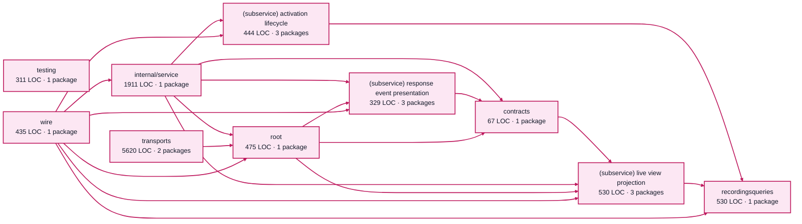

# factory visualization service architecture

<!-- Generated by make architecture. -->

Source commit: `02ca052e085c0347ffdded7daedad13974648fff`.

[High-level backend](../high-level-backend.md) · [Test coverage](../high-level-test-coverage.md)

10652 LOC across 59 files. Arrows show imports between package groups within this service. They are static dependencies, not runtime calls. `XX%` means coverage was unmeasured.

## Package groups

`(subservice)` identifies a private service under `internal/services/`. `internal/service` is the core service implementation.

| Group | LOC | Files | Packages | Unit | Functional |
| --- | ---: | ---: | ---: | ---: | ---: |
| contracts | 67 | 2 | 1 | 100.0% | 100.0% |
| recordingsqueries | 530 | 3 | 1 | 51.8% | 34.9% |
| internal/service | 1911 | 9 | 1 | 82.7% | 70.0% |
| (subservice) activation lifecycle | 444 | 3 | 3 | 79.2% | 54.8% |
| (subservice) live view projection | 530 | 3 | 3 | 71.5% | 16.9% |
| (subservice) response event presentation | 329 | 3 | 3 | 84.5% | 84.6% |
| testing | 311 | 1 | 1 | 12.7% | XX% |
| root | 475 | 5 | 1 | 47.2% | 8.3% |
| transports | 5620 | 26 | 2 | 78.4% | 55.9% |
| wire | 435 | 4 | 1 | XX% | 39.8% |

## Packages

| Package | LOC | Files | Unit | Functional |
| --- | ---: | ---: | ---: | ---: |
| [`pkg/services/factory_visualization`](../../../../pkg/services/factory_visualization) | 475 | 5 | 47.2% | 8.3% |
| [`pkg/services/factory_visualization/internal/contracts`](../../../../pkg/services/factory_visualization/internal/contracts) | 67 | 2 | 100.0% | 100.0% |
| [`pkg/services/factory_visualization/internal/recordingsqueries`](../../../../pkg/services/factory_visualization/internal/recordingsqueries) | 530 | 3 | 51.8% | 34.9% |
| [`pkg/services/factory_visualization/internal/service`](../../../../pkg/services/factory_visualization/internal/service) | 1911 | 9 | 82.7% | 70.0% |
| [`pkg/services/factory_visualization/internal/services/activation_lifecycle`](../../../../pkg/services/factory_visualization/internal/services/activation_lifecycle) | 117 | 1 | 0.0% | 0.0% |
| [`pkg/services/factory_visualization/internal/services/activation_lifecycle/internal/service`](../../../../pkg/services/factory_visualization/internal/services/activation_lifecycle/internal/service) | 309 | 1 | 83.6% | 57.5% |
| [`pkg/services/factory_visualization/internal/services/activation_lifecycle/wire`](../../../../pkg/services/factory_visualization/internal/services/activation_lifecycle/wire) | 18 | 1 | XX% | 100.0% |
| [`pkg/services/factory_visualization/internal/services/live_view_projection`](../../../../pkg/services/factory_visualization/internal/services/live_view_projection) | 127 | 1 | 77.8% | 0.0% |
| [`pkg/services/factory_visualization/internal/services/live_view_projection/internal/service`](../../../../pkg/services/factory_visualization/internal/services/live_view_projection/internal/service) | 373 | 1 | 71.2% | 16.0% |
| [`pkg/services/factory_visualization/internal/services/live_view_projection/wire`](../../../../pkg/services/factory_visualization/internal/services/live_view_projection/wire) | 30 | 1 | XX% | 80.0% |
| [`pkg/services/factory_visualization/internal/services/response_event_presentation`](../../../../pkg/services/factory_visualization/internal/services/response_event_presentation) | 17 | 1 | XX% | XX% |
| [`pkg/services/factory_visualization/internal/services/response_event_presentation/internal/service`](../../../../pkg/services/factory_visualization/internal/services/response_event_presentation/internal/service) | 299 | 1 | 84.5% | 84.5% |
| [`pkg/services/factory_visualization/internal/services/response_event_presentation/wire`](../../../../pkg/services/factory_visualization/internal/services/response_event_presentation/wire) | 13 | 1 | XX% | 100.0% |
| [`pkg/services/factory_visualization/internal/testing/recordingsstub`](../../../../pkg/services/factory_visualization/internal/testing/recordingsstub) | 311 | 1 | 12.7% | XX% |
| [`pkg/services/factory_visualization/transports/cli`](../../../../pkg/services/factory_visualization/transports/cli) | 4318 | 9 | 76.8% | 63.1% |
| [`pkg/services/factory_visualization/transports/http`](../../../../pkg/services/factory_visualization/transports/http) | 1302 | 17 | 85.3% | 23.4% |
| [`pkg/services/factory_visualization/wire`](../../../../pkg/services/factory_visualization/wire) | 435 | 4 | XX% | 39.8% |
