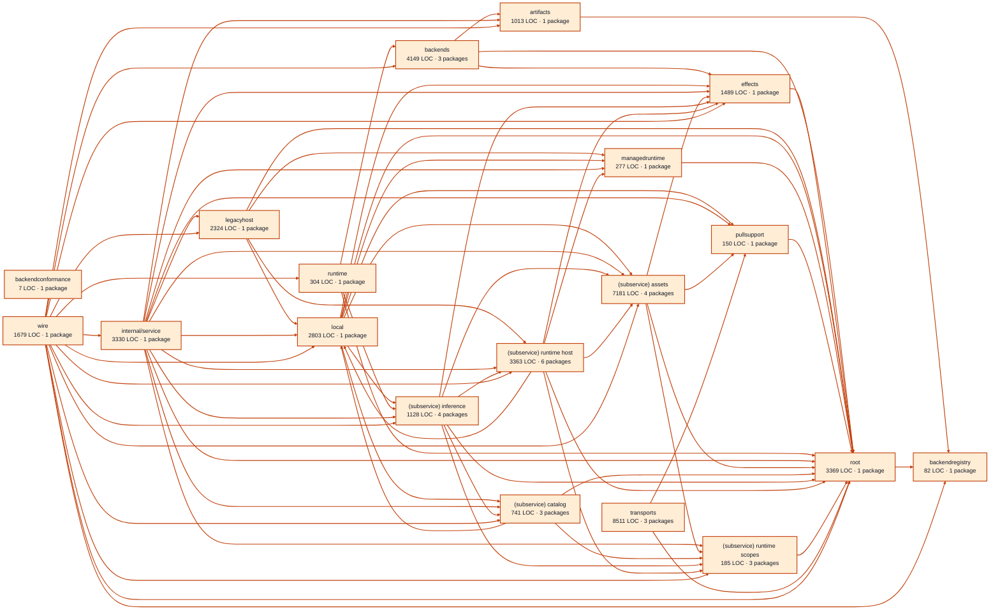

# models service architecture

<!-- Generated by make architecture. -->

Source commit: `6a05c2f495604ba783e12a658f84339484e75a33`.

[High-level backend](../high-level-backend.md) · [Test coverage](../high-level-test-coverage.md)

42085 LOC across 150 files. Arrows show imports between package groups within this service. They are static dependencies, not runtime calls. `XX%` means coverage was unmeasured.

## Package groups

`(subservice)` identifies a private service under `internal/services/`. `internal/service` is the core service implementation.

| Group | LOC | Files | Packages | Unit | Functional |
| --- | ---: | ---: | ---: | ---: | ---: |
| artifacts | 1013 | 6 | 1 | 79.1% | 60.3% |
| backendconformance | 7 | 2 | 1 | XX% | XX% |
| backendregistry | 82 | 1 | 1 | 100.0% | 90.9% |
| backends | 4149 | 12 | 3 | 73.5% | 32.5% |
| effects | 1489 | 5 | 1 | 82.5% | 31.5% |
| legacyhost | 2324 | 7 | 1 | 71.0% | 26.9% |
| local | 2803 | 5 | 1 | 77.1% | 69.1% |
| managedruntime | 277 | 2 | 1 | 72.5% | 50.0% |
| pullsupport | 150 | 1 | 1 | 85.2% | 78.7% |
| runtime | 304 | 3 | 1 | 81.7% | 71.3% |
| internal/service | 3330 | 8 | 1 | 79.3% | 59.2% |
| (subservice) assets | 7181 | 12 | 4 | 80.3% | 65.8% |
| (subservice) catalog | 741 | 3 | 3 | 88.1% | 79.9% |
| (subservice) inference | 1128 | 13 | 4 | 85.3% | 53.7% |
| (subservice) runtime host | 3363 | 12 | 6 | 82.4% | 63.8% |
| (subservice) runtime scopes | 185 | 3 | 3 | 95.5% | 79.2% |
| root | 3369 | 10 | 1 | 89.5% | 70.2% |
| transports | 8511 | 38 | 3 | 84.8% | 66.6% |
| wire | 1679 | 7 | 1 | XX% | 66.5% |

## Packages

| Package | LOC | Files | Unit | Functional |
| --- | ---: | ---: | ---: | ---: |
| [`pkg/services/models`](../../../../pkg/services/models) | 3369 | 10 | 89.5% | 70.2% |
| [`pkg/services/models/internal/artifacts`](../../../../pkg/services/models/internal/artifacts) | 1013 | 6 | 79.1% | 60.3% |
| [`pkg/services/models/internal/backendconformance`](../../../../pkg/services/models/internal/backendconformance) | 7 | 2 | XX% | XX% |
| [`pkg/services/models/internal/backendregistry`](../../../../pkg/services/models/internal/backendregistry) | 82 | 1 | 100.0% | 90.9% |
| [`pkg/services/models/internal/backends/localai`](../../../../pkg/services/models/internal/backends/localai) | 2548 | 8 | 72.8% | 27.9% |
| [`pkg/services/models/internal/backends/localai/codecs`](../../../../pkg/services/models/internal/backends/localai/codecs) | 1411 | 3 | 75.1% | 39.6% |
| [`pkg/services/models/internal/backends/localai/videoaudio`](../../../../pkg/services/models/internal/backends/localai/videoaudio) | 190 | 1 | 74.7% | 59.8% |
| [`pkg/services/models/internal/effects`](../../../../pkg/services/models/internal/effects) | 1489 | 5 | 82.5% | 31.5% |
| [`pkg/services/models/internal/legacyhost`](../../../../pkg/services/models/internal/legacyhost) | 2324 | 7 | 71.0% | 26.9% |
| [`pkg/services/models/internal/local`](../../../../pkg/services/models/internal/local) | 2803 | 5 | 77.1% | 69.1% |
| [`pkg/services/models/internal/managedruntime`](../../../../pkg/services/models/internal/managedruntime) | 277 | 2 | 72.5% | 50.0% |
| [`pkg/services/models/internal/pullsupport`](../../../../pkg/services/models/internal/pullsupport) | 150 | 1 | 85.2% | 78.7% |
| [`pkg/services/models/internal/runtime`](../../../../pkg/services/models/internal/runtime) | 304 | 3 | 81.7% | 71.3% |
| [`pkg/services/models/internal/service`](../../../../pkg/services/models/internal/service) | 3330 | 8 | 79.3% | 59.2% |
| [`pkg/services/models/internal/services/assets`](../../../../pkg/services/models/internal/services/assets) | 84 | 1 | XX% | XX% |
| [`pkg/services/models/internal/services/assets/internal/reclamation`](../../../../pkg/services/models/internal/services/assets/internal/reclamation) | 901 | 3 | 72.3% | 71.2% |
| [`pkg/services/models/internal/services/assets/internal/service`](../../../../pkg/services/models/internal/services/assets/internal/service) | 6104 | 7 | 81.5% | 65.0% |
| [`pkg/services/models/internal/services/assets/wire`](../../../../pkg/services/models/internal/services/assets/wire) | 92 | 1 | XX% | 58.8% |
| [`pkg/services/models/internal/services/catalog`](../../../../pkg/services/models/internal/services/catalog) | 41 | 1 | XX% | XX% |
| [`pkg/services/models/internal/services/catalog/internal/service`](../../../../pkg/services/models/internal/services/catalog/internal/service) | 661 | 1 | 88.1% | 80.7% |
| [`pkg/services/models/internal/services/catalog/wire`](../../../../pkg/services/models/internal/services/catalog/wire) | 39 | 1 | XX% | 54.5% |
| [`pkg/services/models/internal/services/inference`](../../../../pkg/services/models/internal/services/inference) | 85 | 4 | 100.0% | 0.0% |
| [`pkg/services/models/internal/services/inference/internal/artifacts`](../../../../pkg/services/models/internal/services/inference/internal/artifacts) | 144 | 2 | 83.9% | 51.6% |
| [`pkg/services/models/internal/services/inference/internal/service`](../../../../pkg/services/models/internal/services/inference/internal/service) | 800 | 6 | 85.4% | 53.6% |
| [`pkg/services/models/internal/services/inference/wire`](../../../../pkg/services/models/internal/services/inference/wire) | 99 | 1 | XX% | 65.2% |
| [`pkg/services/models/internal/services/runtime_host`](../../../../pkg/services/models/internal/services/runtime_host) | 51 | 1 | XX% | XX% |
| [`pkg/services/models/internal/services/runtime_host/internal/service`](../../../../pkg/services/models/internal/services/runtime_host/internal/service) | 2848 | 7 | 81.5% | 63.4% |
| [`pkg/services/models/internal/services/runtime_host/internal/services/leases`](../../../../pkg/services/models/internal/services/runtime_host/internal/services/leases) | 28 | 1 | XX% | XX% |
| [`pkg/services/models/internal/services/runtime_host/internal/services/leases/internal/service`](../../../../pkg/services/models/internal/services/runtime_host/internal/services/leases/internal/service) | 329 | 1 | 89.5% | 65.4% |
| [`pkg/services/models/internal/services/runtime_host/internal/services/leases/wire`](../../../../pkg/services/models/internal/services/runtime_host/internal/services/leases/wire) | 44 | 1 | XX% | 76.9% |
| [`pkg/services/models/internal/services/runtime_host/wire`](../../../../pkg/services/models/internal/services/runtime_host/wire) | 63 | 1 | XX% | 64.7% |
| [`pkg/services/models/internal/services/runtime_scopes`](../../../../pkg/services/models/internal/services/runtime_scopes) | 32 | 1 | XX% | XX% |
| [`pkg/services/models/internal/services/runtime_scopes/internal/service`](../../../../pkg/services/models/internal/services/runtime_scopes/internal/service) | 134 | 1 | 95.5% | 80.3% |
| [`pkg/services/models/internal/services/runtime_scopes/wire`](../../../../pkg/services/models/internal/services/runtime_scopes/wire) | 19 | 1 | XX% | 66.7% |
| [`pkg/services/models/transports/cli`](../../../../pkg/services/models/transports/cli) | 5664 | 12 | 85.6% | 68.4% |
| [`pkg/services/models/transports/http`](../../../../pkg/services/models/transports/http) | 1770 | 14 | 81.8% | 61.3% |
| [`pkg/services/models/transports/mcp`](../../../../pkg/services/models/transports/mcp) | 1077 | 12 | 86.8% | XX% |
| [`pkg/services/models/wire`](../../../../pkg/services/models/wire) | 1679 | 7 | XX% | 66.5% |
