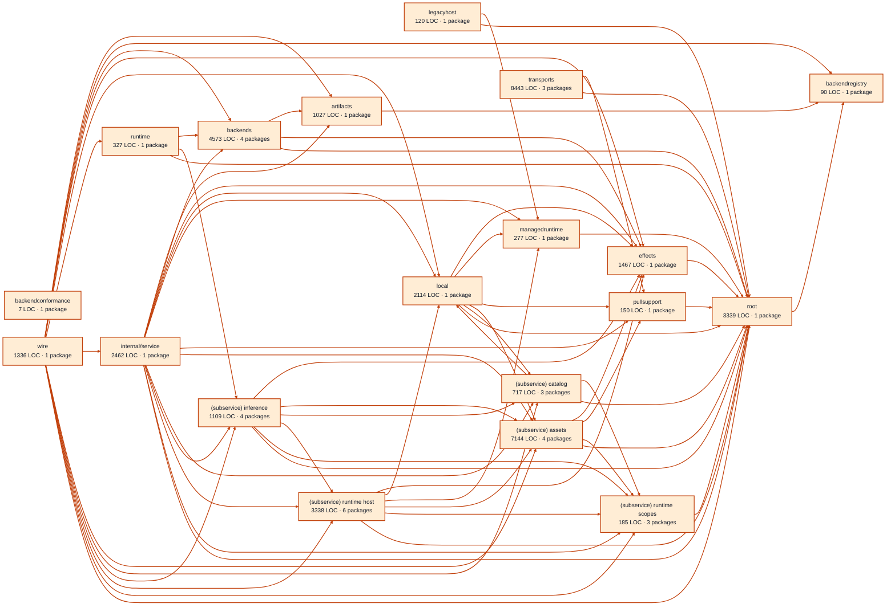

# models service architecture

<!-- Generated by make architecture. -->

Source commit: `552b419cfb69ebee70812a94df664bda9adc647c`.

[High-level backend](../high-level-backend.md) · [Test coverage](../high-level-test-coverage.md)

38225 LOC across 142 files. Arrows show imports between package groups within this service. They are static dependencies, not runtime calls. `XX%` means coverage was unmeasured.

## Package groups

`(subservice)` identifies a private service under `internal/services/`. `internal/service` is the core service implementation.

| Group | LOC | Files | Packages | Unit | Functional |
| --- | ---: | ---: | ---: | ---: | ---: |
| artifacts | 1027 | 6 | 1 | 76.1% | 56.5% |
| backendconformance | 7 | 2 | 1 | XX% | XX% |
| backendregistry | 90 | 1 | 1 | 100.0% | 81.8% |
| backends | 4573 | 12 | 4 | 75.0% | 31.9% |
| effects | 1467 | 5 | 1 | 82.5% | 31.5% |
| legacyhost | 120 | 1 | 1 | XX% | XX% |
| local | 2114 | 5 | 1 | 82.2% | 68.8% |
| managedruntime | 277 | 2 | 1 | 66.2% | 47.5% |
| pullsupport | 150 | 1 | 1 | 85.2% | 78.7% |
| runtime | 327 | 3 | 1 | 78.9% | 69.5% |
| internal/service | 2462 | 7 | 1 | 76.4% | 68.3% |
| (subservice) assets | 7144 | 12 | 4 | 80.4% | 56.4% |
| (subservice) catalog | 717 | 3 | 3 | 87.2% | 81.4% |
| (subservice) inference | 1109 | 13 | 4 | 87.0% | 52.0% |
| (subservice) runtime host | 3338 | 12 | 6 | 83.9% | 59.8% |
| (subservice) runtime scopes | 185 | 3 | 3 | 95.5% | 79.2% |
| root | 3339 | 10 | 1 | 88.7% | 73.5% |
| transports | 8443 | 37 | 3 | 84.7% | 62.5% |
| wire | 1336 | 7 | 1 | XX% | 69.0% |

## Packages

| Package | LOC | Files | Unit | Functional |
| --- | ---: | ---: | ---: | ---: |
| [`pkg/services/models`](../../../../pkg/services/models) | 3339 | 10 | 88.7% | 73.5% |
| [`pkg/services/models/internal/artifacts`](../../../../pkg/services/models/internal/artifacts) | 1027 | 6 | 76.1% | 56.5% |
| [`pkg/services/models/internal/backendconformance`](../../../../pkg/services/models/internal/backendconformance) | 7 | 2 | XX% | XX% |
| [`pkg/services/models/internal/backendregistry`](../../../../pkg/services/models/internal/backendregistry) | 90 | 1 | 100.0% | 81.8% |
| [`pkg/services/models/internal/backends/localai`](../../../../pkg/services/models/internal/backends/localai) | 2848 | 8 | 74.7% | 28.0% |
| [`pkg/services/models/internal/backends/localai/codecs`](../../../../pkg/services/models/internal/backends/localai/codecs) | 1514 | 3 | 75.9% | 37.7% |
| [`pkg/services/models/internal/backends/localai/codecs/stresstests`](../../../../pkg/services/models/internal/backends/localai/codecs/stresstests) | 0 | 0 | XX% | XX% |
| [`pkg/services/models/internal/backends/localai/videoaudio`](../../../../pkg/services/models/internal/backends/localai/videoaudio) | 211 | 1 | 75.6% | 60.0% |
| [`pkg/services/models/internal/effects`](../../../../pkg/services/models/internal/effects) | 1467 | 5 | 82.5% | 31.5% |
| [`pkg/services/models/internal/legacyhost`](../../../../pkg/services/models/internal/legacyhost) | 120 | 1 | XX% | XX% |
| [`pkg/services/models/internal/local`](../../../../pkg/services/models/internal/local) | 2114 | 5 | 82.2% | 68.8% |
| [`pkg/services/models/internal/managedruntime`](../../../../pkg/services/models/internal/managedruntime) | 277 | 2 | 66.2% | 47.5% |
| [`pkg/services/models/internal/pullsupport`](../../../../pkg/services/models/internal/pullsupport) | 150 | 1 | 85.2% | 78.7% |
| [`pkg/services/models/internal/runtime`](../../../../pkg/services/models/internal/runtime) | 327 | 3 | 78.9% | 69.5% |
| [`pkg/services/models/internal/service`](../../../../pkg/services/models/internal/service) | 2462 | 7 | 76.4% | 68.3% |
| [`pkg/services/models/internal/services/assets`](../../../../pkg/services/models/internal/services/assets) | 75 | 1 | XX% | XX% |
| [`pkg/services/models/internal/services/assets/internal/reclamation`](../../../../pkg/services/models/internal/services/assets/internal/reclamation) | 901 | 3 | 72.3% | 71.2% |
| [`pkg/services/models/internal/services/assets/internal/service`](../../../../pkg/services/models/internal/services/assets/internal/service) | 6113 | 7 | 81.7% | 54.0% |
| [`pkg/services/models/internal/services/assets/wire`](../../../../pkg/services/models/internal/services/assets/wire) | 55 | 1 | XX% | 60.0% |
| [`pkg/services/models/internal/services/catalog`](../../../../pkg/services/models/internal/services/catalog) | 41 | 1 | XX% | XX% |
| [`pkg/services/models/internal/services/catalog/internal/service`](../../../../pkg/services/models/internal/services/catalog/internal/service) | 661 | 1 | 87.2% | 81.3% |
| [`pkg/services/models/internal/services/catalog/wire`](../../../../pkg/services/models/internal/services/catalog/wire) | 15 | 1 | XX% | 100.0% |
| [`pkg/services/models/internal/services/inference`](../../../../pkg/services/models/internal/services/inference) | 85 | 4 | 100.0% | 0.0% |
| [`pkg/services/models/internal/services/inference/internal/artifacts`](../../../../pkg/services/models/internal/services/inference/internal/artifacts) | 144 | 2 | 82.3% | 37.1% |
| [`pkg/services/models/internal/services/inference/internal/service`](../../../../pkg/services/models/internal/services/inference/internal/service) | 770 | 6 | 87.9% | 54.1% |
| [`pkg/services/models/internal/services/inference/wire`](../../../../pkg/services/models/internal/services/inference/wire) | 110 | 1 | XX% | 66.7% |
| [`pkg/services/models/internal/services/runtime_host`](../../../../pkg/services/models/internal/services/runtime_host) | 37 | 1 | XX% | XX% |
| [`pkg/services/models/internal/services/runtime_host/internal/service`](../../../../pkg/services/models/internal/services/runtime_host/internal/service) | 2823 | 7 | 83.2% | 58.6% |
| [`pkg/services/models/internal/services/runtime_host/internal/services/leases`](../../../../pkg/services/models/internal/services/runtime_host/internal/services/leases) | 28 | 1 | XX% | XX% |
| [`pkg/services/models/internal/services/runtime_host/internal/services/leases/internal/service`](../../../../pkg/services/models/internal/services/runtime_host/internal/services/leases/internal/service) | 325 | 1 | 88.8% | 66.5% |
| [`pkg/services/models/internal/services/runtime_host/internal/services/leases/wire`](../../../../pkg/services/models/internal/services/runtime_host/internal/services/leases/wire) | 38 | 1 | XX% | 72.7% |
| [`pkg/services/models/internal/services/runtime_host/wire`](../../../../pkg/services/models/internal/services/runtime_host/wire) | 87 | 1 | XX% | 71.4% |
| [`pkg/services/models/internal/services/runtime_scopes`](../../../../pkg/services/models/internal/services/runtime_scopes) | 32 | 1 | XX% | XX% |
| [`pkg/services/models/internal/services/runtime_scopes/internal/service`](../../../../pkg/services/models/internal/services/runtime_scopes/internal/service) | 134 | 1 | 95.5% | 80.3% |
| [`pkg/services/models/internal/services/runtime_scopes/wire`](../../../../pkg/services/models/internal/services/runtime_scopes/wire) | 19 | 1 | XX% | 66.7% |
| [`pkg/services/models/transports/cli`](../../../../pkg/services/models/transports/cli) | 5663 | 12 | 85.5% | 63.7% |
| [`pkg/services/models/transports/http`](../../../../pkg/services/models/transports/http) | 1703 | 13 | 81.7% | 59.0% |
| [`pkg/services/models/transports/mcp`](../../../../pkg/services/models/transports/mcp) | 1077 | 12 | 86.8% | XX% |
| [`pkg/services/models/wire`](../../../../pkg/services/models/wire) | 1336 | 7 | XX% | 69.0% |
