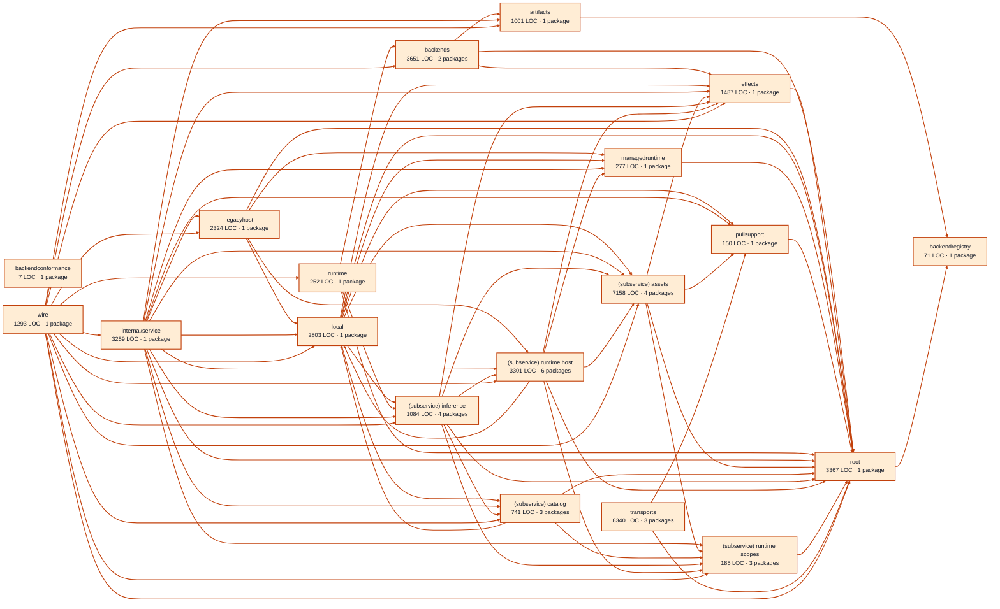

# models service architecture

<!-- Generated by make architecture. -->

[High-level backend](../high-level-backend.md) · [Test coverage](../high-level-test-coverage.md)

40751 LOC across 150 files. Arrows show imports between package groups within this service. They are static dependencies, not runtime calls. `XX%` means coverage was unmeasured.

## Package groups

`(subservice)` identifies a private service under `internal/services/`. `internal/service` is the core service implementation.

| Group | LOC | Files | Packages | Unit | Functional |
| --- | ---: | ---: | ---: | ---: | ---: |
| artifacts | 1001 | 6 | 1 | XX% | XX% |
| backendconformance | 7 | 2 | 1 | XX% | XX% |
| backendregistry | 71 | 1 | 1 | XX% | XX% |
| backends | 3651 | 11 | 2 | XX% | XX% |
| effects | 1487 | 5 | 1 | XX% | XX% |
| legacyhost | 2324 | 7 | 1 | XX% | XX% |
| local | 2803 | 5 | 1 | XX% | XX% |
| managedruntime | 277 | 2 | 1 | XX% | XX% |
| pullsupport | 150 | 1 | 1 | XX% | XX% |
| runtime | 252 | 3 | 1 | XX% | XX% |
| internal/service | 3259 | 7 | 1 | XX% | XX% |
| (subservice) assets | 7158 | 12 | 4 | XX% | XX% |
| (subservice) catalog | 741 | 3 | 3 | XX% | XX% |
| (subservice) inference | 1084 | 13 | 4 | XX% | XX% |
| (subservice) runtime host | 3301 | 12 | 6 | XX% | XX% |
| (subservice) runtime scopes | 185 | 3 | 3 | XX% | XX% |
| root | 3367 | 10 | 1 | XX% | XX% |
| transports | 8340 | 38 | 3 | XX% | XX% |
| wire | 1293 | 9 | 1 | XX% | XX% |

## Packages

| Package | LOC | Files | Unit | Functional |
| --- | ---: | ---: | ---: | ---: |
| [`pkg/services/models`](../../../../pkg/services/models) | 3367 | 10 | XX% | XX% |
| [`pkg/services/models/internal/artifacts`](../../../../pkg/services/models/internal/artifacts) | 1001 | 6 | XX% | XX% |
| [`pkg/services/models/internal/backendconformance`](../../../../pkg/services/models/internal/backendconformance) | 7 | 2 | XX% | XX% |
| [`pkg/services/models/internal/backendregistry`](../../../../pkg/services/models/internal/backendregistry) | 71 | 1 | XX% | XX% |
| [`pkg/services/models/internal/backends/localai`](../../../../pkg/services/models/internal/backends/localai) | 2268 | 8 | XX% | XX% |
| [`pkg/services/models/internal/backends/localai/codecs`](../../../../pkg/services/models/internal/backends/localai/codecs) | 1383 | 3 | XX% | XX% |
| [`pkg/services/models/internal/effects`](../../../../pkg/services/models/internal/effects) | 1487 | 5 | XX% | XX% |
| [`pkg/services/models/internal/legacyhost`](../../../../pkg/services/models/internal/legacyhost) | 2324 | 7 | XX% | XX% |
| [`pkg/services/models/internal/local`](../../../../pkg/services/models/internal/local) | 2803 | 5 | XX% | XX% |
| [`pkg/services/models/internal/managedruntime`](../../../../pkg/services/models/internal/managedruntime) | 277 | 2 | XX% | XX% |
| [`pkg/services/models/internal/pullsupport`](../../../../pkg/services/models/internal/pullsupport) | 150 | 1 | XX% | XX% |
| [`pkg/services/models/internal/runtime`](../../../../pkg/services/models/internal/runtime) | 252 | 3 | XX% | XX% |
| [`pkg/services/models/internal/service`](../../../../pkg/services/models/internal/service) | 3259 | 7 | XX% | XX% |
| [`pkg/services/models/internal/services/assets`](../../../../pkg/services/models/internal/services/assets) | 84 | 1 | XX% | XX% |
| [`pkg/services/models/internal/services/assets/internal/reclamation`](../../../../pkg/services/models/internal/services/assets/internal/reclamation) | 901 | 3 | XX% | XX% |
| [`pkg/services/models/internal/services/assets/internal/service`](../../../../pkg/services/models/internal/services/assets/internal/service) | 6081 | 7 | XX% | XX% |
| [`pkg/services/models/internal/services/assets/wire`](../../../../pkg/services/models/internal/services/assets/wire) | 92 | 1 | XX% | XX% |
| [`pkg/services/models/internal/services/catalog`](../../../../pkg/services/models/internal/services/catalog) | 41 | 1 | XX% | XX% |
| [`pkg/services/models/internal/services/catalog/internal/service`](../../../../pkg/services/models/internal/services/catalog/internal/service) | 661 | 1 | XX% | XX% |
| [`pkg/services/models/internal/services/catalog/wire`](../../../../pkg/services/models/internal/services/catalog/wire) | 39 | 1 | XX% | XX% |
| [`pkg/services/models/internal/services/inference`](../../../../pkg/services/models/internal/services/inference) | 85 | 4 | XX% | XX% |
| [`pkg/services/models/internal/services/inference/internal/artifacts`](../../../../pkg/services/models/internal/services/inference/internal/artifacts) | 144 | 2 | XX% | XX% |
| [`pkg/services/models/internal/services/inference/internal/service`](../../../../pkg/services/models/internal/services/inference/internal/service) | 756 | 6 | XX% | XX% |
| [`pkg/services/models/internal/services/inference/wire`](../../../../pkg/services/models/internal/services/inference/wire) | 99 | 1 | XX% | XX% |
| [`pkg/services/models/internal/services/runtime_host`](../../../../pkg/services/models/internal/services/runtime_host) | 49 | 1 | XX% | XX% |
| [`pkg/services/models/internal/services/runtime_host/internal/service`](../../../../pkg/services/models/internal/services/runtime_host/internal/service) | 2827 | 7 | XX% | XX% |
| [`pkg/services/models/internal/services/runtime_host/internal/services/leases`](../../../../pkg/services/models/internal/services/runtime_host/internal/services/leases) | 26 | 1 | XX% | XX% |
| [`pkg/services/models/internal/services/runtime_host/internal/services/leases/internal/service`](../../../../pkg/services/models/internal/services/runtime_host/internal/services/leases/internal/service) | 292 | 1 | XX% | XX% |
| [`pkg/services/models/internal/services/runtime_host/internal/services/leases/wire`](../../../../pkg/services/models/internal/services/runtime_host/internal/services/leases/wire) | 44 | 1 | XX% | XX% |
| [`pkg/services/models/internal/services/runtime_host/wire`](../../../../pkg/services/models/internal/services/runtime_host/wire) | 63 | 1 | XX% | XX% |
| [`pkg/services/models/internal/services/runtime_scopes`](../../../../pkg/services/models/internal/services/runtime_scopes) | 32 | 1 | XX% | XX% |
| [`pkg/services/models/internal/services/runtime_scopes/internal/service`](../../../../pkg/services/models/internal/services/runtime_scopes/internal/service) | 134 | 1 | XX% | XX% |
| [`pkg/services/models/internal/services/runtime_scopes/wire`](../../../../pkg/services/models/internal/services/runtime_scopes/wire) | 19 | 1 | XX% | XX% |
| [`pkg/services/models/transports/cli`](../../../../pkg/services/models/transports/cli) | 5663 | 12 | XX% | XX% |
| [`pkg/services/models/transports/http`](../../../../pkg/services/models/transports/http) | 1600 | 14 | XX% | XX% |
| [`pkg/services/models/transports/mcp`](../../../../pkg/services/models/transports/mcp) | 1077 | 12 | XX% | XX% |
| [`pkg/services/models/wire`](../../../../pkg/services/models/wire) | 1293 | 9 | XX% | XX% |
