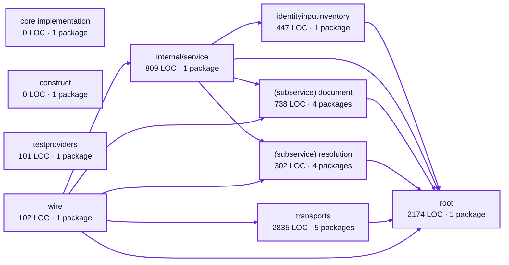

# operator settings service architecture

<!-- Generated by make architecture. -->

Source commit: `162213cbed4f0c31f6f5b4c91f3c898c8c9e6d3a`.

[High-level backend](../high-level-backend.md) · [Test coverage](../high-level-test-coverage.md)

7508 LOC across 71 files. Arrows show imports between package groups within this service. They are static dependencies, not runtime calls. `XX%` means coverage was unmeasured.

## Package groups

`(subservice)` identifies a private service under `internal/services/`. `internal/service` is the core service implementation.

| Group | LOC | Files | Packages | Unit | Functional |
| --- | ---: | ---: | ---: | ---: | ---: |
| core implementation | 0 | 0 | 1 | XX% | XX% |
| construct | 0 | 0 | 1 | XX% | XX% |
| identityinputinventory | 447 | 6 | 1 | 100.0% | 0.0% |
| internal/service | 809 | 3 | 1 | 65.8% | 50.2% |
| (subservice) document | 738 | 11 | 4 | 90.6% | 75.3% |
| (subservice) resolution | 302 | 6 | 4 | 94.4% | 67.9% |
| testproviders | 101 | 1 | 1 | 97.0% | XX% |
| root | 2174 | 12 | 1 | 87.1% | 35.5% |
| transports | 2835 | 28 | 5 | 89.6% | 59.7% |
| wire | 102 | 4 | 1 | XX% | 66.7% |

## Packages

| Package | LOC | Files | Unit | Functional |
| --- | ---: | ---: | ---: | ---: |
| [`pkg/services/operator_settings`](../../../../pkg/services/operator_settings) | 2174 | 12 | 87.1% | 35.5% |
| [`pkg/services/operator_settings/internal`](../../../../pkg/services/operator_settings/internal) | 0 | 0 | XX% | XX% |
| [`pkg/services/operator_settings/internal/construct`](../../../../pkg/services/operator_settings/internal/construct) | 0 | 0 | XX% | XX% |
| [`pkg/services/operator_settings/internal/identityinputinventory`](../../../../pkg/services/operator_settings/internal/identityinputinventory) | 447 | 6 | 100.0% | 0.0% |
| [`pkg/services/operator_settings/internal/service`](../../../../pkg/services/operator_settings/internal/service) | 809 | 3 | 65.8% | 50.2% |
| [`pkg/services/operator_settings/internal/services/document`](../../../../pkg/services/operator_settings/internal/services/document) | 25 | 2 | XX% | XX% |
| [`pkg/services/operator_settings/internal/services/document/identityinventory`](../../../../pkg/services/operator_settings/internal/services/document/identityinventory) | 243 | 3 | 100.0% | XX% |
| [`pkg/services/operator_settings/internal/services/document/internal/service`](../../../../pkg/services/operator_settings/internal/services/document/internal/service) | 449 | 5 | 89.7% | 75.2% |
| [`pkg/services/operator_settings/internal/services/document/wire`](../../../../pkg/services/operator_settings/internal/services/document/wire) | 21 | 1 | XX% | 100.0% |
| [`pkg/services/operator_settings/internal/services/resolution`](../../../../pkg/services/operator_settings/internal/services/resolution) | 11 | 1 | XX% | XX% |
| [`pkg/services/operator_settings/internal/services/resolution/defaults`](../../../../pkg/services/operator_settings/internal/services/resolution/defaults) | 34 | 2 | 100.0% | XX% |
| [`pkg/services/operator_settings/internal/services/resolution/internal/service`](../../../../pkg/services/operator_settings/internal/services/resolution/internal/service) | 244 | 2 | 94.0% | 67.5% |
| [`pkg/services/operator_settings/internal/services/resolution/wire`](../../../../pkg/services/operator_settings/internal/services/resolution/wire) | 13 | 1 | XX% | 100.0% |
| [`pkg/services/operator_settings/internal/testproviders`](../../../../pkg/services/operator_settings/internal/testproviders) | 101 | 1 | 97.0% | XX% |
| [`pkg/services/operator_settings/transports/cli`](../../../../pkg/services/operator_settings/transports/cli) | 342 | 4 | 82.4% | 71.8% |
| [`pkg/services/operator_settings/transports/cli/initsetup`](../../../../pkg/services/operator_settings/transports/cli/initsetup) | 72 | 1 | 66.7% | 86.7% |
| [`pkg/services/operator_settings/transports/globalconfig`](../../../../pkg/services/operator_settings/transports/globalconfig) | 844 | 2 | 97.8% | 83.7% |
| [`pkg/services/operator_settings/transports/http`](../../../../pkg/services/operator_settings/transports/http) | 688 | 12 | 84.0% | XX% |
| [`pkg/services/operator_settings/transports/mcp`](../../../../pkg/services/operator_settings/transports/mcp) | 889 | 9 | 83.5% | 2.7% |
| [`pkg/services/operator_settings/wire`](../../../../pkg/services/operator_settings/wire) | 102 | 4 | XX% | 66.7% |
