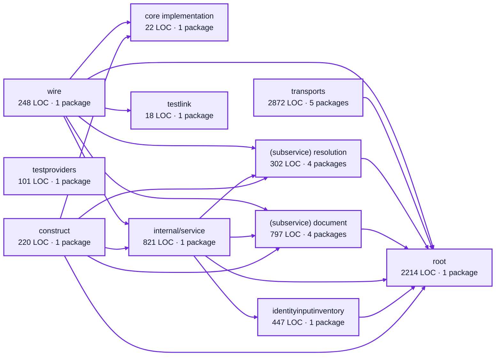

# operator settings service architecture

<!-- Generated by make architecture. -->

[High-level backend](../high-level-backend.md) · [Test coverage](../high-level-test-coverage.md)

8062 LOC across 82 files. Arrows show imports between package groups within this service. They are static dependencies, not runtime calls. `XX%` means coverage was unmeasured.

## Package groups

`(subservice)` identifies a private service under `internal/services/`. `internal/service` is the core service implementation.

| Group | LOC | Files | Packages | Unit | Functional |
| --- | ---: | ---: | ---: | ---: | ---: |
| core implementation | 22 | 1 | 1 | XX% | XX% |
| construct | 220 | 6 | 1 | XX% | XX% |
| identityinputinventory | 447 | 6 | 1 | XX% | XX% |
| internal/service | 821 | 3 | 1 | XX% | XX% |
| (subservice) document | 797 | 11 | 4 | XX% | XX% |
| (subservice) resolution | 302 | 6 | 4 | XX% | XX% |
| testlink | 18 | 1 | 1 | XX% | XX% |
| testproviders | 101 | 1 | 1 | XX% | XX% |
| root | 2214 | 12 | 1 | XX% | XX% |
| transports | 2872 | 28 | 5 | XX% | XX% |
| wire | 248 | 7 | 1 | XX% | XX% |

## Packages

| Package | LOC | Files | Unit | Functional |
| --- | ---: | ---: | ---: | ---: |
| [`pkg/services/operator_settings`](../../../../pkg/services/operator_settings) | 2214 | 12 | XX% | XX% |
| [`pkg/services/operator_settings/internal`](../../../../pkg/services/operator_settings/internal) | 22 | 1 | XX% | XX% |
| [`pkg/services/operator_settings/internal/construct`](../../../../pkg/services/operator_settings/internal/construct) | 220 | 6 | XX% | XX% |
| [`pkg/services/operator_settings/internal/identityinputinventory`](../../../../pkg/services/operator_settings/internal/identityinputinventory) | 447 | 6 | XX% | XX% |
| [`pkg/services/operator_settings/internal/service`](../../../../pkg/services/operator_settings/internal/service) | 821 | 3 | XX% | XX% |
| [`pkg/services/operator_settings/internal/services/document`](../../../../pkg/services/operator_settings/internal/services/document) | 25 | 2 | XX% | XX% |
| [`pkg/services/operator_settings/internal/services/document/identityinventory`](../../../../pkg/services/operator_settings/internal/services/document/identityinventory) | 243 | 3 | XX% | XX% |
| [`pkg/services/operator_settings/internal/services/document/internal/service`](../../../../pkg/services/operator_settings/internal/services/document/internal/service) | 494 | 5 | XX% | XX% |
| [`pkg/services/operator_settings/internal/services/document/wire`](../../../../pkg/services/operator_settings/internal/services/document/wire) | 35 | 1 | XX% | XX% |
| [`pkg/services/operator_settings/internal/services/resolution`](../../../../pkg/services/operator_settings/internal/services/resolution) | 11 | 1 | XX% | XX% |
| [`pkg/services/operator_settings/internal/services/resolution/defaults`](../../../../pkg/services/operator_settings/internal/services/resolution/defaults) | 34 | 2 | XX% | XX% |
| [`pkg/services/operator_settings/internal/services/resolution/internal/service`](../../../../pkg/services/operator_settings/internal/services/resolution/internal/service) | 244 | 2 | XX% | XX% |
| [`pkg/services/operator_settings/internal/services/resolution/wire`](../../../../pkg/services/operator_settings/internal/services/resolution/wire) | 13 | 1 | XX% | XX% |
| [`pkg/services/operator_settings/internal/testlink`](../../../../pkg/services/operator_settings/internal/testlink) | 18 | 1 | XX% | XX% |
| [`pkg/services/operator_settings/internal/testproviders`](../../../../pkg/services/operator_settings/internal/testproviders) | 101 | 1 | XX% | XX% |
| [`pkg/services/operator_settings/transports/cli`](../../../../pkg/services/operator_settings/transports/cli) | 368 | 4 | XX% | XX% |
| [`pkg/services/operator_settings/transports/cli/initsetup`](../../../../pkg/services/operator_settings/transports/cli/initsetup) | 71 | 1 | XX% | XX% |
| [`pkg/services/operator_settings/transports/globalconfig`](../../../../pkg/services/operator_settings/transports/globalconfig) | 844 | 2 | XX% | XX% |
| [`pkg/services/operator_settings/transports/http`](../../../../pkg/services/operator_settings/transports/http) | 688 | 12 | XX% | XX% |
| [`pkg/services/operator_settings/transports/mcp`](../../../../pkg/services/operator_settings/transports/mcp) | 901 | 9 | XX% | XX% |
| [`pkg/services/operator_settings/wire`](../../../../pkg/services/operator_settings/wire) | 248 | 7 | XX% | XX% |
