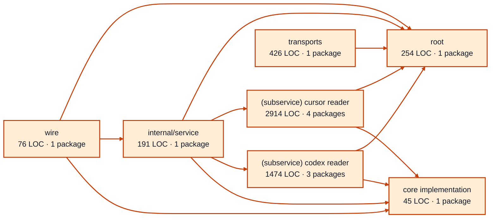

# provider sessions service architecture

<!-- Generated by make architecture. -->

Source commit: `999d1092f82b8acd820116ad278bbb64b1aefd54`.

[High-level backend](../high-level-backend.md) · [Test coverage](../high-level-test-coverage.md)

5380 LOC across 38 files. Arrows show imports between package groups within this service. They are static dependencies, not runtime calls. `XX%` means coverage was unmeasured.

## Package groups

`(subservice)` identifies a private service under `internal/services/`. `internal/service` is the core service implementation.

| Group | LOC | Files | Packages | Unit | Functional |
| --- | ---: | ---: | ---: | ---: | ---: |
| core implementation | 45 | 1 | 1 | XX% | XX% |
| internal/service | 191 | 1 | 1 | 94.4% | 65.3% |
| (subservice) codex reader | 1474 | 8 | 3 | 88.0% | 75.5% |
| (subservice) cursor reader | 2914 | 18 | 4 | 68.0% | 46.9% |
| root | 254 | 2 | 1 | 100.0% | 50.0% |
| transports | 426 | 6 | 1 | 94.1% | 81.4% |
| wire | 76 | 2 | 1 | XX% | 50.0% |

## Packages

| Package | LOC | Files | Unit | Functional |
| --- | ---: | ---: | ---: | ---: |
| [`pkg/services/provider_sessions`](../../../../pkg/services/provider_sessions) | 254 | 2 | 100.0% | 50.0% |
| [`pkg/services/provider_sessions/internal`](../../../../pkg/services/provider_sessions/internal) | 45 | 1 | XX% | XX% |
| [`pkg/services/provider_sessions/internal/service`](../../../../pkg/services/provider_sessions/internal/service) | 191 | 1 | 94.4% | 65.3% |
| [`pkg/services/provider_sessions/internal/services/codex_reader`](../../../../pkg/services/provider_sessions/internal/services/codex_reader) | 14 | 1 | XX% | XX% |
| [`pkg/services/provider_sessions/internal/services/codex_reader/internal/service`](../../../../pkg/services/provider_sessions/internal/services/codex_reader/internal/service) | 1445 | 6 | 88.0% | 75.4% |
| [`pkg/services/provider_sessions/internal/services/codex_reader/wire`](../../../../pkg/services/provider_sessions/internal/services/codex_reader/wire) | 15 | 1 | XX% | 100.0% |
| [`pkg/services/provider_sessions/internal/services/cursor_reader`](../../../../pkg/services/provider_sessions/internal/services/cursor_reader) | 13 | 1 | XX% | XX% |
| [`pkg/services/provider_sessions/internal/services/cursor_reader/internal/cursor`](../../../../pkg/services/provider_sessions/internal/services/cursor_reader/internal/cursor) | 2763 | 15 | 67.8% | 46.6% |
| [`pkg/services/provider_sessions/internal/services/cursor_reader/internal/service`](../../../../pkg/services/provider_sessions/internal/services/cursor_reader/internal/service) | 113 | 1 | 75.0% | 57.1% |
| [`pkg/services/provider_sessions/internal/services/cursor_reader/wire`](../../../../pkg/services/provider_sessions/internal/services/cursor_reader/wire) | 25 | 1 | XX% | 100.0% |
| [`pkg/services/provider_sessions/transports/http`](../../../../pkg/services/provider_sessions/transports/http) | 426 | 6 | 94.1% | 81.4% |
| [`pkg/services/provider_sessions/wire`](../../../../pkg/services/provider_sessions/wire) | 76 | 2 | XX% | 50.0% |
