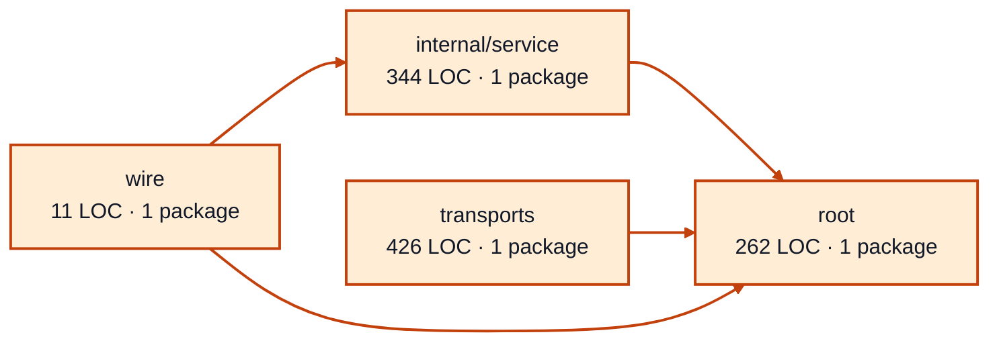

# provider sessions service architecture

<!-- Generated by make architecture. -->

Source commit: `4963fafea26d593d461bf94380c4ab2561348e92`.

[High-level backend](../high-level-backend.md) · [Test coverage](../high-level-test-coverage.md)

1043 LOC across 11 files. Arrows show imports between package groups within this service. They are static dependencies, not runtime calls. `XX%` means coverage was unmeasured.

## Package groups

`(subservice)` identifies a private service under `internal/services/`. `internal/service` is the core service implementation.

| Group | LOC | Files | Packages | Unit | Functional |
| --- | ---: | ---: | ---: | ---: | ---: |
| internal/service | 344 | 2 | 1 | 95.3% | 77.2% |
| root | 262 | 2 | 1 | 92.3% | 23.1% |
| transports | 426 | 6 | 1 | 94.1% | 72.0% |
| wire | 11 | 1 | 1 | XX% | 100.0% |

## Packages

| Package | LOC | Files | Unit | Functional |
| --- | ---: | ---: | ---: | ---: |
| [`pkg/services/provider_sessions`](../../../../pkg/services/provider_sessions) | 262 | 2 | 92.3% | 23.1% |
| [`pkg/services/provider_sessions/internal/service`](../../../../pkg/services/provider_sessions/internal/service) | 344 | 2 | 95.3% | 77.2% |
| [`pkg/services/provider_sessions/transports/http`](../../../../pkg/services/provider_sessions/transports/http) | 426 | 6 | 94.1% | 72.0% |
| [`pkg/services/provider_sessions/wire`](../../../../pkg/services/provider_sessions/wire) | 11 | 1 | XX% | 100.0% |
