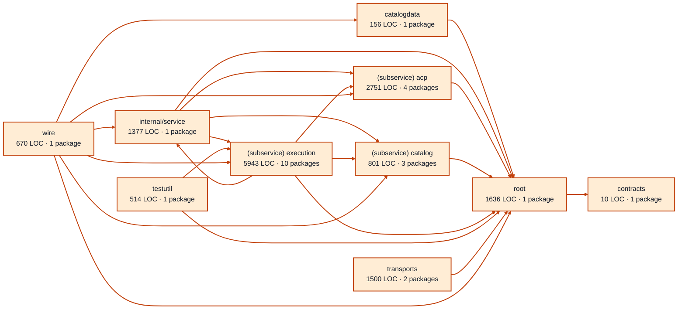

# providers service architecture

<!-- Generated by make architecture. -->

Source commit: `3d22888c624f42d43806648aa6200ee9ce071858`.

[High-level backend](../high-level-backend.md) · [Test coverage](../high-level-test-coverage.md)

15358 LOC across 85 files. Arrows show imports between package groups within this service. They are static dependencies, not runtime calls. `XX%` means coverage was unmeasured.

## Package groups

`(subservice)` identifies a private service under `internal/services/`. `internal/service` is the core service implementation.

| Group | LOC | Files | Packages | Unit | Functional |
| --- | ---: | ---: | ---: | ---: | ---: |
| catalogdata | 156 | 1 | 1 | 98.7% | 82.1% |
| contracts | 10 | 1 | 1 | XX% | XX% |
| internal/service | 1377 | 6 | 1 | 89.8% | 74.1% |
| (subservice) acp | 2751 | 9 | 4 | 82.5% | 81.4% |
| (subservice) catalog | 801 | 5 | 3 | 96.2% | 80.1% |
| (subservice) execution | 5943 | 33 | 10 | 85.2% | 56.9% |
| testutil | 514 | 1 | 1 | 87.5% | XX% |
| root | 1636 | 9 | 1 | 92.8% | 74.4% |
| transports | 1500 | 15 | 2 | 85.6% | 59.4% |
| wire | 670 | 5 | 1 | XX% | 69.7% |

## Packages

| Package | LOC | Files | Unit | Functional |
| --- | ---: | ---: | ---: | ---: |
| [`pkg/services/providers`](../../../../pkg/services/providers) | 1636 | 9 | 92.8% | 74.4% |
| [`pkg/services/providers/internal/catalogdata`](../../../../pkg/services/providers/internal/catalogdata) | 156 | 1 | 98.7% | 82.1% |
| [`pkg/services/providers/internal/contracts`](../../../../pkg/services/providers/internal/contracts) | 10 | 1 | XX% | XX% |
| [`pkg/services/providers/internal/service`](../../../../pkg/services/providers/internal/service) | 1377 | 6 | 89.8% | 74.1% |
| [`pkg/services/providers/internal/services/acp`](../../../../pkg/services/providers/internal/services/acp) | 65 | 1 | XX% | XX% |
| [`pkg/services/providers/internal/services/acp/internal/service`](../../../../pkg/services/providers/internal/services/acp/internal/service) | 2475 | 6 | 81.9% | 82.6% |
| [`pkg/services/providers/internal/services/acp/internal/service/cancelwindow`](../../../../pkg/services/providers/internal/services/acp/internal/service/cancelwindow) | 191 | 1 | 100.0% | 42.9% |
| [`pkg/services/providers/internal/services/acp/wire`](../../../../pkg/services/providers/internal/services/acp/wire) | 20 | 1 | XX% | 100.0% |
| [`pkg/services/providers/internal/services/catalog`](../../../../pkg/services/providers/internal/services/catalog) | 29 | 1 | XX% | XX% |
| [`pkg/services/providers/internal/services/catalog/internal/service`](../../../../pkg/services/providers/internal/services/catalog/internal/service) | 755 | 3 | 96.2% | 79.9% |
| [`pkg/services/providers/internal/services/catalog/wire`](../../../../pkg/services/providers/internal/services/catalog/wire) | 17 | 1 | XX% | 100.0% |
| [`pkg/services/providers/internal/services/execution`](../../../../pkg/services/providers/internal/services/execution) | 90 | 1 | 88.2% | 82.4% |
| [`pkg/services/providers/internal/services/execution/internal/adapters/agy`](../../../../pkg/services/providers/internal/services/execution/internal/adapters/agy) | 1350 | 8 | 84.9% | 54.6% |
| [`pkg/services/providers/internal/services/execution/internal/adapters/agy/agypty`](../../../../pkg/services/providers/internal/services/execution/internal/adapters/agy/agypty) | 871 | 7 | 83.5% | 1.7% |
| [`pkg/services/providers/internal/services/execution/internal/adapters/claude`](../../../../pkg/services/providers/internal/services/execution/internal/adapters/claude) | 1208 | 4 | 80.4% | 55.9% |
| [`pkg/services/providers/internal/services/execution/internal/adapters/codex`](../../../../pkg/services/providers/internal/services/execution/internal/adapters/codex) | 1451 | 6 | 83.0% | 73.7% |
| [`pkg/services/providers/internal/services/execution/internal/adapters/commanddispatch`](../../../../pkg/services/providers/internal/services/execution/internal/adapters/commanddispatch) | 81 | 1 | 86.7% | 96.7% |
| [`pkg/services/providers/internal/services/execution/internal/commandenv`](../../../../pkg/services/providers/internal/services/execution/internal/commandenv) | 24 | 1 | 100.0% | 50.0% |
| [`pkg/services/providers/internal/services/execution/internal/provider_test`](../../../../pkg/services/providers/internal/services/execution/internal/provider_test) | 0 | 0 | XX% | XX% |
| [`pkg/services/providers/internal/services/execution/internal/service`](../../../../pkg/services/providers/internal/services/execution/internal/service) | 787 | 4 | 100.0% | 84.4% |
| [`pkg/services/providers/internal/services/execution/wire`](../../../../pkg/services/providers/internal/services/execution/wire) | 81 | 1 | XX% | 69.2% |
| [`pkg/services/providers/internal/testutil/execution`](../../../../pkg/services/providers/internal/testutil/execution) | 514 | 1 | 87.5% | XX% |
| [`pkg/services/providers/transports/cli`](../../../../pkg/services/providers/transports/cli) | 775 | 4 | 83.0% | 59.4% |
| [`pkg/services/providers/transports/http`](../../../../pkg/services/providers/transports/http) | 725 | 11 | 88.7% | XX% |
| [`pkg/services/providers/wire`](../../../../pkg/services/providers/wire) | 670 | 5 | XX% | 69.7% |
