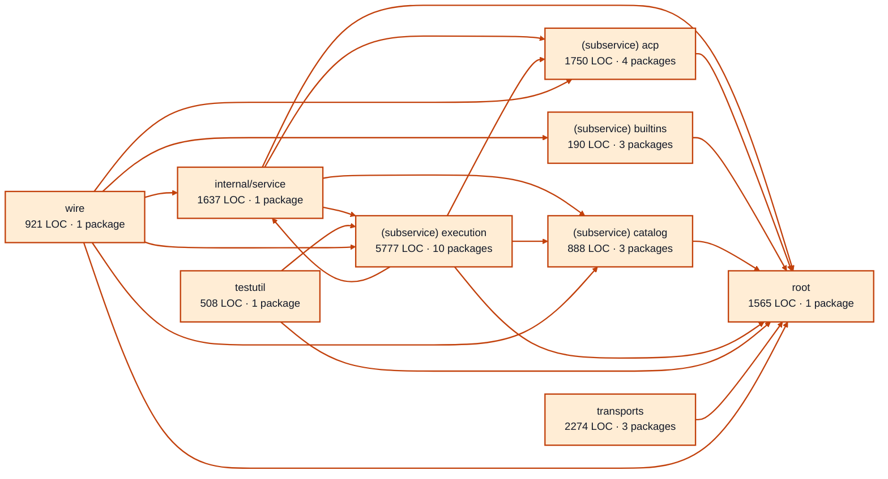

# providers service architecture

<!-- Generated by make architecture. -->

[High-level backend](../high-level-backend.md) · [Test coverage](../high-level-test-coverage.md)

15510 LOC across 90 files. Arrows show imports between package groups within this service. They are static dependencies, not runtime calls. `XX%` means coverage was unmeasured.

## Package groups

`(subservice)` identifies a private service under `internal/services/`. `internal/service` is the core service implementation.

| Group | LOC | Files | Packages | Unit | Functional |
| --- | ---: | ---: | ---: | ---: | ---: |
| internal/service | 1637 | 4 | 1 | XX% | XX% |
| (subservice) acp | 1750 | 7 | 4 | XX% | XX% |
| (subservice) builtins | 190 | 3 | 3 | XX% | XX% |
| (subservice) catalog | 888 | 5 | 3 | XX% | XX% |
| (subservice) execution | 5777 | 32 | 10 | XX% | XX% |
| testutil | 508 | 1 | 1 | XX% | XX% |
| root | 1565 | 9 | 1 | XX% | XX% |
| transports | 2274 | 24 | 3 | XX% | XX% |
| wire | 921 | 5 | 1 | XX% | XX% |

## Packages

| Package | LOC | Files | Unit | Functional |
| --- | ---: | ---: | ---: | ---: |
| [`pkg/services/providers`](../../../../pkg/services/providers) | 1565 | 9 | XX% | XX% |
| [`pkg/services/providers/internal/service`](../../../../pkg/services/providers/internal/service) | 1637 | 4 | XX% | XX% |
| [`pkg/services/providers/internal/services/acp`](../../../../pkg/services/providers/internal/services/acp) | 65 | 1 | XX% | XX% |
| [`pkg/services/providers/internal/services/acp/internal/service`](../../../../pkg/services/providers/internal/services/acp/internal/service) | 1479 | 4 | XX% | XX% |
| [`pkg/services/providers/internal/services/acp/internal/service/cancelwindow`](../../../../pkg/services/providers/internal/services/acp/internal/service/cancelwindow) | 191 | 1 | XX% | XX% |
| [`pkg/services/providers/internal/services/acp/wire`](../../../../pkg/services/providers/internal/services/acp/wire) | 15 | 1 | XX% | XX% |
| [`pkg/services/providers/internal/services/builtins`](../../../../pkg/services/providers/internal/services/builtins) | 8 | 1 | XX% | XX% |
| [`pkg/services/providers/internal/services/builtins/internal/service`](../../../../pkg/services/providers/internal/services/builtins/internal/service) | 166 | 1 | XX% | XX% |
| [`pkg/services/providers/internal/services/builtins/wire`](../../../../pkg/services/providers/internal/services/builtins/wire) | 16 | 1 | XX% | XX% |
| [`pkg/services/providers/internal/services/catalog`](../../../../pkg/services/providers/internal/services/catalog) | 39 | 1 | XX% | XX% |
| [`pkg/services/providers/internal/services/catalog/internal/service`](../../../../pkg/services/providers/internal/services/catalog/internal/service) | 830 | 3 | XX% | XX% |
| [`pkg/services/providers/internal/services/catalog/wire`](../../../../pkg/services/providers/internal/services/catalog/wire) | 19 | 1 | XX% | XX% |
| [`pkg/services/providers/internal/services/execution`](../../../../pkg/services/providers/internal/services/execution) | 90 | 1 | XX% | XX% |
| [`pkg/services/providers/internal/services/execution/internal/adapters/agy`](../../../../pkg/services/providers/internal/services/execution/internal/adapters/agy) | 1359 | 8 | XX% | XX% |
| [`pkg/services/providers/internal/services/execution/internal/adapters/agy/agypty`](../../../../pkg/services/providers/internal/services/execution/internal/adapters/agy/agypty) | 891 | 7 | XX% | XX% |
| [`pkg/services/providers/internal/services/execution/internal/adapters/claude`](../../../../pkg/services/providers/internal/services/execution/internal/adapters/claude) | 1201 | 4 | XX% | XX% |
| [`pkg/services/providers/internal/services/execution/internal/adapters/codex`](../../../../pkg/services/providers/internal/services/execution/internal/adapters/codex) | 1190 | 5 | XX% | XX% |
| [`pkg/services/providers/internal/services/execution/internal/adapters/commanddispatch`](../../../../pkg/services/providers/internal/services/execution/internal/adapters/commanddispatch) | 80 | 1 | XX% | XX% |
| [`pkg/services/providers/internal/services/execution/internal/commandenv`](../../../../pkg/services/providers/internal/services/execution/internal/commandenv) | 24 | 1 | XX% | XX% |
| [`pkg/services/providers/internal/services/execution/internal/provider_test`](../../../../pkg/services/providers/internal/services/execution/internal/provider_test) | 0 | 0 | XX% | XX% |
| [`pkg/services/providers/internal/services/execution/internal/service`](../../../../pkg/services/providers/internal/services/execution/internal/service) | 732 | 4 | XX% | XX% |
| [`pkg/services/providers/internal/services/execution/wire`](../../../../pkg/services/providers/internal/services/execution/wire) | 210 | 1 | XX% | XX% |
| [`pkg/services/providers/internal/testutil/execution`](../../../../pkg/services/providers/internal/testutil/execution) | 508 | 1 | XX% | XX% |
| [`pkg/services/providers/transports/cli`](../../../../pkg/services/providers/transports/cli) | 775 | 4 | XX% | XX% |
| [`pkg/services/providers/transports/http`](../../../../pkg/services/providers/transports/http) | 725 | 11 | XX% | XX% |
| [`pkg/services/providers/transports/mcp`](../../../../pkg/services/providers/transports/mcp) | 774 | 9 | XX% | XX% |
| [`pkg/services/providers/wire`](../../../../pkg/services/providers/wire) | 921 | 5 | XX% | XX% |
