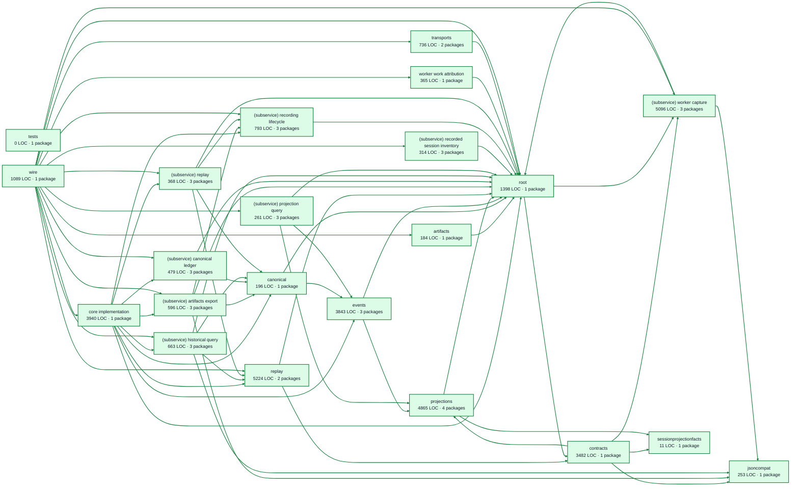

# recordings service architecture

<!-- Generated by make architecture. -->

Source commit: `4efd1f3d3d72afbdb9fce85b2ea52029e9a7819d`.

[High-level backend](../high-level-backend.md) · [Test coverage](../high-level-test-coverage.md)

34156 LOC across 129 files. Arrows show imports between package groups within this service. They are static dependencies, not runtime calls. `XX%` means coverage was unmeasured.

## Package groups

`(subservice)` identifies a private service under `internal/services/`. `internal/service` is the core service implementation.

| Group | LOC | Files | Packages | Unit | Functional |
| --- | ---: | ---: | ---: | ---: | ---: |
| core implementation | 3940 | 9 | 1 | 83.9% | 39.7% |
| artifacts | 184 | 3 | 1 | 87.7% | 3.1% |
| canonical | 196 | 3 | 1 | 89.6% | 77.6% |
| contracts | 3482 | 9 | 1 | 85.7% | 60.9% |
| events | 3843 | 9 | 3 | 85.0% | 69.6% |
| jsoncompat | 253 | 1 | 1 | 80.8% | 63.8% |
| projections | 4865 | 11 | 4 | 85.7% | 60.9% |
| replay | 5224 | 8 | 2 | 73.8% | 54.2% |
| (subservice) artifacts export | 596 | 6 | 3 | 74.3% | 61.2% |
| (subservice) canonical ledger | 479 | 5 | 3 | 95.4% | 48.1% |
| (subservice) historical query | 663 | 5 | 3 | 52.6% | 76.0% |
| (subservice) projection query | 261 | 5 | 3 | 93.2% | 57.8% |
| (subservice) recorded session inventory | 314 | 3 | 3 | 85.5% | 62.9% |
| (subservice) recording lifecycle | 793 | 6 | 3 | 93.5% | 79.9% |
| (subservice) replay | 368 | 4 | 3 | 99.0% | 40.2% |
| (subservice) worker capture | 5096 | 21 | 3 | 83.1% | 72.9% |
| sessionprojectionfacts | 11 | 1 | 1 | XX% | XX% |
| tests | 0 | 0 | 1 | XX% | XX% |
| worker work attribution | 365 | 3 | 1 | 87.3% | 69.4% |
| root | 1398 | 5 | 1 | 48.7% | 53.8% |
| transports | 736 | 3 | 2 | 95.2% | 58.5% |
| wire | 1089 | 9 | 1 | XX% | 11.7% |

## Packages

| Package | LOC | Files | Unit | Functional |
| --- | ---: | ---: | ---: | ---: |
| [`pkg/services/recordings`](../../../../pkg/services/recordings) | 1398 | 5 | 48.7% | 53.8% |
| [`pkg/services/recordings/internal`](../../../../pkg/services/recordings/internal) | 3940 | 9 | 83.9% | 39.7% |
| [`pkg/services/recordings/internal/artifacts`](../../../../pkg/services/recordings/internal/artifacts) | 184 | 3 | 87.7% | 3.1% |
| [`pkg/services/recordings/internal/canonical`](../../../../pkg/services/recordings/internal/canonical) | 196 | 3 | 89.6% | 77.6% |
| [`pkg/services/recordings/internal/contracts`](../../../../pkg/services/recordings/internal/contracts) | 3482 | 9 | 85.7% | 60.9% |
| [`pkg/services/recordings/internal/events`](../../../../pkg/services/recordings/internal/events) | 3379 | 6 | 85.9% | 67.6% |
| [`pkg/services/recordings/internal/events/kinds`](../../../../pkg/services/recordings/internal/events/kinds) | 75 | 2 | 100.0% | 100.0% |
| [`pkg/services/recordings/internal/events/snapshot`](../../../../pkg/services/recordings/internal/events/snapshot) | 389 | 1 | 74.2% | 87.9% |
| [`pkg/services/recordings/internal/jsoncompat`](../../../../pkg/services/recordings/internal/jsoncompat) | 253 | 1 | 80.8% | 63.8% |
| [`pkg/services/recordings/internal/projections`](../../../../pkg/services/recordings/internal/projections) | 3407 | 9 | 85.9% | 62.2% |
| [`pkg/services/recordings/internal/projections/dashboard`](../../../../pkg/services/recordings/internal/projections/dashboard) | 437 | 1 | 85.5% | 36.4% |
| [`pkg/services/recordings/internal/projections/projectiontests`](../../../../pkg/services/recordings/internal/projections/projectiontests) | 0 | 0 | XX% | XX% |
| [`pkg/services/recordings/internal/projections/workstation`](../../../../pkg/services/recordings/internal/projections/workstation) | 1021 | 1 | 84.5% | 70.1% |
| [`pkg/services/recordings/internal/replay`](../../../../pkg/services/recordings/internal/replay) | 5224 | 8 | 73.8% | 54.2% |
| [`pkg/services/recordings/internal/replay/fixturetests`](../../../../pkg/services/recordings/internal/replay/fixturetests) | 0 | 0 | XX% | XX% |
| [`pkg/services/recordings/internal/services/artifacts_export`](../../../../pkg/services/recordings/internal/services/artifacts_export) | 46 | 2 | XX% | XX% |
| [`pkg/services/recordings/internal/services/artifacts_export/internal/service`](../../../../pkg/services/recordings/internal/services/artifacts_export/internal/service) | 503 | 2 | 74.3% | 59.8% |
| [`pkg/services/recordings/internal/services/artifacts_export/wire`](../../../../pkg/services/recordings/internal/services/artifacts_export/wire) | 47 | 2 | XX% | 90.0% |
| [`pkg/services/recordings/internal/services/canonical_ledger`](../../../../pkg/services/recordings/internal/services/canonical_ledger) | 91 | 2 | XX% | XX% |
| [`pkg/services/recordings/internal/services/canonical_ledger/internal/service`](../../../../pkg/services/recordings/internal/services/canonical_ledger/internal/service) | 376 | 2 | 95.4% | 47.7% |
| [`pkg/services/recordings/internal/services/canonical_ledger/wire`](../../../../pkg/services/recordings/internal/services/canonical_ledger/wire) | 12 | 1 | XX% | 100.0% |
| [`pkg/services/recordings/internal/services/historical_query`](../../../../pkg/services/recordings/internal/services/historical_query) | 9 | 1 | XX% | XX% |
| [`pkg/services/recordings/internal/services/historical_query/internal/service`](../../../../pkg/services/recordings/internal/services/historical_query/internal/service) | 639 | 3 | 52.6% | 75.9% |
| [`pkg/services/recordings/internal/services/historical_query/wire`](../../../../pkg/services/recordings/internal/services/historical_query/wire) | 15 | 1 | XX% | 100.0% |
| [`pkg/services/recordings/internal/services/projection_query`](../../../../pkg/services/recordings/internal/services/projection_query) | 116 | 3 | XX% | XX% |
| [`pkg/services/recordings/internal/services/projection_query/internal/service`](../../../../pkg/services/recordings/internal/services/projection_query/internal/service) | 135 | 1 | 93.2% | 56.8% |
| [`pkg/services/recordings/internal/services/projection_query/wire`](../../../../pkg/services/recordings/internal/services/projection_query/wire) | 10 | 1 | XX% | 100.0% |
| [`pkg/services/recordings/internal/services/recorded_session_inventory`](../../../../pkg/services/recordings/internal/services/recorded_session_inventory) | 9 | 1 | XX% | XX% |
| [`pkg/services/recordings/internal/services/recorded_session_inventory/internal/service`](../../../../pkg/services/recordings/internal/services/recorded_session_inventory/internal/service) | 289 | 1 | 85.5% | 62.6% |
| [`pkg/services/recordings/internal/services/recorded_session_inventory/wire`](../../../../pkg/services/recordings/internal/services/recorded_session_inventory/wire) | 16 | 1 | XX% | 100.0% |
| [`pkg/services/recordings/internal/services/recording_lifecycle`](../../../../pkg/services/recordings/internal/services/recording_lifecycle) | 44 | 2 | XX% | XX% |
| [`pkg/services/recordings/internal/services/recording_lifecycle/internal/service`](../../../../pkg/services/recordings/internal/services/recording_lifecycle/internal/service) | 723 | 3 | 93.5% | 79.8% |
| [`pkg/services/recordings/internal/services/recording_lifecycle/wire`](../../../../pkg/services/recordings/internal/services/recording_lifecycle/wire) | 26 | 1 | XX% | 100.0% |
| [`pkg/services/recordings/internal/services/replay`](../../../../pkg/services/recordings/internal/services/replay) | 64 | 2 | XX% | XX% |
| [`pkg/services/recordings/internal/services/replay/internal/service`](../../../../pkg/services/recordings/internal/services/replay/internal/service) | 279 | 1 | 99.0% | 39.6% |
| [`pkg/services/recordings/internal/services/replay/wire`](../../../../pkg/services/recordings/internal/services/replay/wire) | 25 | 1 | XX% | 100.0% |
| [`pkg/services/recordings/internal/services/worker_capture`](../../../../pkg/services/recordings/internal/services/worker_capture) | 2111 | 7 | 76.6% | 68.4% |
| [`pkg/services/recordings/internal/services/worker_capture/internal/service`](../../../../pkg/services/recordings/internal/services/worker_capture/internal/service) | 2962 | 13 | 86.6% | 75.2% |
| [`pkg/services/recordings/internal/services/worker_capture/wire`](../../../../pkg/services/recordings/internal/services/worker_capture/wire) | 23 | 1 | XX% | 100.0% |
| [`pkg/services/recordings/internal/sessionprojectionfacts`](../../../../pkg/services/recordings/internal/sessionprojectionfacts) | 11 | 1 | XX% | XX% |
| [`pkg/services/recordings/internal/tests/load/worker_recordings`](../../../../pkg/services/recordings/internal/tests/load/worker_recordings) | 0 | 0 | XX% | XX% |
| [`pkg/services/recordings/internal/worker_work_attribution`](../../../../pkg/services/recordings/internal/worker_work_attribution) | 365 | 3 | 87.3% | 69.4% |
| [`pkg/services/recordings/transports/cli`](../../../../pkg/services/recordings/transports/cli) | 357 | 1 | 98.0% | 58.5% |
| [`pkg/services/recordings/transports/http`](../../../../pkg/services/recordings/transports/http) | 379 | 2 | 92.3% | XX% |
| [`pkg/services/recordings/wire`](../../../../pkg/services/recordings/wire) | 1089 | 9 | XX% | 11.7% |
