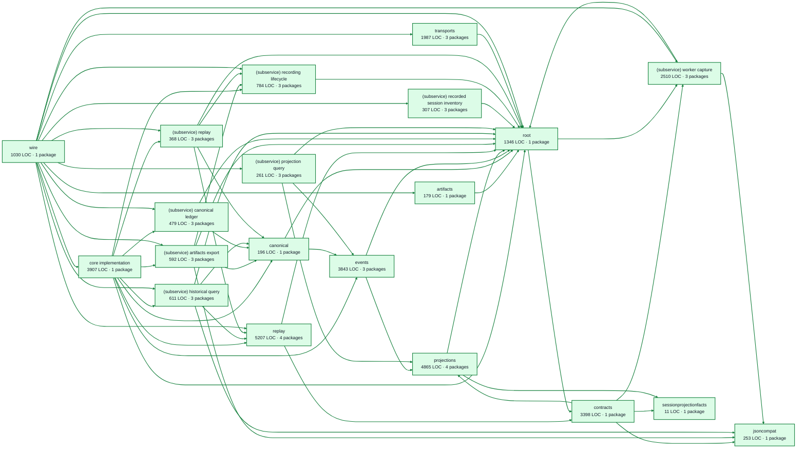

# recordings service architecture

<!-- Generated by make architecture. -->

Source commit: `ea09fd962883af26e54d025e931bd6211857b41f`.

[High-level backend](../high-level-backend.md) · [Test coverage](../high-level-test-coverage.md)

32134 LOC across 120 files. Arrows show imports between package groups within this service. They are static dependencies, not runtime calls. `XX%` means coverage was unmeasured.

## Package groups

`(subservice)` identifies a private service under `internal/services/`. `internal/service` is the core service implementation.

| Group | LOC | Files | Packages | Unit | Functional |
| --- | ---: | ---: | ---: | ---: | ---: |
| core implementation | 3907 | 9 | 1 | 85.0% | 39.4% |
| artifacts | 179 | 3 | 1 | 79.0% | 3.2% |
| canonical | 196 | 3 | 1 | 89.6% | 77.6% |
| contracts | 3398 | 8 | 1 | 84.8% | 60.8% |
| events | 3843 | 9 | 3 | 84.5% | 69.7% |
| jsoncompat | 253 | 1 | 1 | 80.8% | 65.4% |
| projections | 4865 | 11 | 4 | 86.0% | 60.3% |
| replay | 5207 | 8 | 4 | 78.6% | 53.5% |
| (subservice) artifacts export | 592 | 6 | 3 | 74.4% | 61.5% |
| (subservice) canonical ledger | 479 | 5 | 3 | 95.4% | 65.6% |
| (subservice) historical query | 611 | 4 | 3 | 61.8% | 68.3% |
| (subservice) projection query | 261 | 5 | 3 | 95.5% | 57.8% |
| (subservice) recorded session inventory | 307 | 3 | 3 | 81.4% | 19.2% |
| (subservice) recording lifecycle | 784 | 6 | 3 | 93.4% | 76.1% |
| (subservice) replay | 368 | 4 | 3 | 99.0% | 38.2% |
| (subservice) worker capture | 2510 | 7 | 3 | 76.0% | 67.8% |
| sessionprojectionfacts | 11 | 1 | 1 | XX% | XX% |
| root | 1346 | 5 | 1 | 48.7% | 46.2% |
| transports | 1987 | 14 | 3 | 88.5% | 25.9% |
| wire | 1030 | 8 | 1 | XX% | 7.3% |

## Packages

| Package | LOC | Files | Unit | Functional |
| --- | ---: | ---: | ---: | ---: |
| [`pkg/services/recordings`](../../../../pkg/services/recordings) | 1346 | 5 | 48.7% | 46.2% |
| [`pkg/services/recordings/internal`](../../../../pkg/services/recordings/internal) | 3907 | 9 | 85.0% | 39.4% |
| [`pkg/services/recordings/internal/artifacts`](../../../../pkg/services/recordings/internal/artifacts) | 179 | 3 | 79.0% | 3.2% |
| [`pkg/services/recordings/internal/canonical`](../../../../pkg/services/recordings/internal/canonical) | 196 | 3 | 89.6% | 77.6% |
| [`pkg/services/recordings/internal/contracts`](../../../../pkg/services/recordings/internal/contracts) | 3398 | 8 | 84.8% | 60.8% |
| [`pkg/services/recordings/internal/events`](../../../../pkg/services/recordings/internal/events) | 3379 | 6 | 85.3% | 67.6% |
| [`pkg/services/recordings/internal/events/kinds`](../../../../pkg/services/recordings/internal/events/kinds) | 75 | 2 | 100.0% | 100.0% |
| [`pkg/services/recordings/internal/events/snapshot`](../../../../pkg/services/recordings/internal/events/snapshot) | 389 | 1 | 74.2% | 89.4% |
| [`pkg/services/recordings/internal/jsoncompat`](../../../../pkg/services/recordings/internal/jsoncompat) | 253 | 1 | 80.8% | 65.4% |
| [`pkg/services/recordings/internal/projections`](../../../../pkg/services/recordings/internal/projections) | 3407 | 9 | 86.2% | 63.0% |
| [`pkg/services/recordings/internal/projections/dashboard`](../../../../pkg/services/recordings/internal/projections/dashboard) | 437 | 1 | 87.2% | 36.4% |
| [`pkg/services/recordings/internal/projections/projectiontests`](../../../../pkg/services/recordings/internal/projections/projectiontests) | 0 | 0 | XX% | XX% |
| [`pkg/services/recordings/internal/projections/workstation`](../../../../pkg/services/recordings/internal/projections/workstation) | 1021 | 1 | 84.5% | 63.1% |
| [`pkg/services/recordings/internal/replay`](../../../../pkg/services/recordings/internal/replay) | 5207 | 8 | 78.6% | 53.5% |
| [`pkg/services/recordings/internal/replay/clocktests`](../../../../pkg/services/recordings/internal/replay/clocktests) | 0 | 0 | XX% | XX% |
| [`pkg/services/recordings/internal/replay/configtests`](../../../../pkg/services/recordings/internal/replay/configtests) | 0 | 0 | XX% | XX% |
| [`pkg/services/recordings/internal/replay/fixturetests`](../../../../pkg/services/recordings/internal/replay/fixturetests) | 0 | 0 | XX% | XX% |
| [`pkg/services/recordings/internal/services/artifacts_export`](../../../../pkg/services/recordings/internal/services/artifacts_export) | 46 | 2 | XX% | XX% |
| [`pkg/services/recordings/internal/services/artifacts_export/internal/service`](../../../../pkg/services/recordings/internal/services/artifacts_export/internal/service) | 499 | 2 | 74.4% | 60.2% |
| [`pkg/services/recordings/internal/services/artifacts_export/wire`](../../../../pkg/services/recordings/internal/services/artifacts_export/wire) | 47 | 2 | XX% | 90.0% |
| [`pkg/services/recordings/internal/services/canonical_ledger`](../../../../pkg/services/recordings/internal/services/canonical_ledger) | 91 | 2 | XX% | XX% |
| [`pkg/services/recordings/internal/services/canonical_ledger/internal/service`](../../../../pkg/services/recordings/internal/services/canonical_ledger/internal/service) | 376 | 2 | 95.4% | 65.4% |
| [`pkg/services/recordings/internal/services/canonical_ledger/wire`](../../../../pkg/services/recordings/internal/services/canonical_ledger/wire) | 12 | 1 | XX% | 100.0% |
| [`pkg/services/recordings/internal/services/historical_query`](../../../../pkg/services/recordings/internal/services/historical_query) | 9 | 1 | XX% | XX% |
| [`pkg/services/recordings/internal/services/historical_query/internal/service`](../../../../pkg/services/recordings/internal/services/historical_query/internal/service) | 587 | 2 | 61.8% | 68.1% |
| [`pkg/services/recordings/internal/services/historical_query/wire`](../../../../pkg/services/recordings/internal/services/historical_query/wire) | 15 | 1 | XX% | 100.0% |
| [`pkg/services/recordings/internal/services/projection_query`](../../../../pkg/services/recordings/internal/services/projection_query) | 116 | 3 | XX% | XX% |
| [`pkg/services/recordings/internal/services/projection_query/internal/service`](../../../../pkg/services/recordings/internal/services/projection_query/internal/service) | 135 | 1 | 95.5% | 56.8% |
| [`pkg/services/recordings/internal/services/projection_query/wire`](../../../../pkg/services/recordings/internal/services/projection_query/wire) | 10 | 1 | XX% | 100.0% |
| [`pkg/services/recordings/internal/services/recorded_session_inventory`](../../../../pkg/services/recordings/internal/services/recorded_session_inventory) | 9 | 1 | XX% | XX% |
| [`pkg/services/recordings/internal/services/recorded_session_inventory/internal/service`](../../../../pkg/services/recordings/internal/services/recorded_session_inventory/internal/service) | 282 | 1 | 81.4% | 18.6% |
| [`pkg/services/recordings/internal/services/recorded_session_inventory/wire`](../../../../pkg/services/recordings/internal/services/recorded_session_inventory/wire) | 16 | 1 | XX% | 100.0% |
| [`pkg/services/recordings/internal/services/recording_lifecycle`](../../../../pkg/services/recordings/internal/services/recording_lifecycle) | 43 | 2 | XX% | XX% |
| [`pkg/services/recordings/internal/services/recording_lifecycle/internal/service`](../../../../pkg/services/recordings/internal/services/recording_lifecycle/internal/service) | 715 | 3 | 93.4% | 76.0% |
| [`pkg/services/recordings/internal/services/recording_lifecycle/wire`](../../../../pkg/services/recordings/internal/services/recording_lifecycle/wire) | 26 | 1 | XX% | 100.0% |
| [`pkg/services/recordings/internal/services/replay`](../../../../pkg/services/recordings/internal/services/replay) | 64 | 2 | XX% | XX% |
| [`pkg/services/recordings/internal/services/replay/internal/service`](../../../../pkg/services/recordings/internal/services/replay/internal/service) | 279 | 1 | 99.0% | 37.6% |
| [`pkg/services/recordings/internal/services/replay/wire`](../../../../pkg/services/recordings/internal/services/replay/wire) | 25 | 1 | XX% | 100.0% |
| [`pkg/services/recordings/internal/services/worker_capture`](../../../../pkg/services/recordings/internal/services/worker_capture) | 1600 | 4 | 73.6% | 70.6% |
| [`pkg/services/recordings/internal/services/worker_capture/internal/service`](../../../../pkg/services/recordings/internal/services/worker_capture/internal/service) | 888 | 2 | 79.4% | 63.6% |
| [`pkg/services/recordings/internal/services/worker_capture/wire`](../../../../pkg/services/recordings/internal/services/worker_capture/wire) | 22 | 1 | XX% | 100.0% |
| [`pkg/services/recordings/internal/sessionprojectionfacts`](../../../../pkg/services/recordings/internal/sessionprojectionfacts) | 11 | 1 | XX% | XX% |
| [`pkg/services/recordings/transports/cli`](../../../../pkg/services/recordings/transports/cli) | 357 | 1 | 98.0% | 58.5% |
| [`pkg/services/recordings/transports/http`](../../../../pkg/services/recordings/transports/http) | 379 | 2 | 92.3% | XX% |
| [`pkg/services/recordings/transports/mcp`](../../../../pkg/services/recordings/transports/mcp) | 1251 | 11 | 82.6% | 10.9% |
| [`pkg/services/recordings/wire`](../../../../pkg/services/recordings/wire) | 1030 | 8 | XX% | 7.3% |
