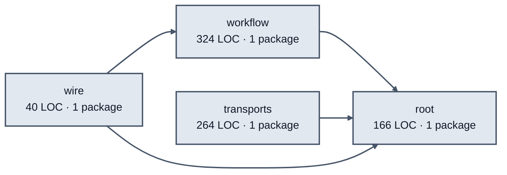

# system initialization service architecture

<!-- Generated by make architecture. -->

Source commit: `316fc4d5eb67c2f99da47f8ab396e4bc2ba5ecba`.

[High-level backend](../high-level-backend.md) · [Test coverage](../high-level-test-coverage.md)

794 LOC across 10 files. Arrows show imports between package groups within this service. They are static dependencies, not runtime calls. `XX%` means coverage was unmeasured.

## Package groups

`(subservice)` identifies a private service under `internal/services/`. `internal/service` is the core service implementation.

| Group | LOC | Files | Packages | Unit | Functional |
| --- | ---: | ---: | ---: | ---: | ---: |
| workflow | 324 | 2 | 1 | 91.7% | 72.5% |
| root | 166 | 3 | 1 | 92.9% | 0.0% |
| transports | 264 | 3 | 1 | 93.5% | XX% |
| wire | 40 | 2 | 1 | XX% | 75.0% |

## Packages

| Package | LOC | Files | Unit | Functional |
| --- | ---: | ---: | ---: | ---: |
| [`pkg/services/system_initialization`](../../../../pkg/services/system_initialization) | 166 | 3 | 92.9% | 0.0% |
| [`pkg/services/system_initialization/internal/workflow`](../../../../pkg/services/system_initialization/internal/workflow) | 324 | 2 | 91.7% | 72.5% |
| [`pkg/services/system_initialization/transports/cli`](../../../../pkg/services/system_initialization/transports/cli) | 264 | 3 | 93.5% | XX% |
| [`pkg/services/system_initialization/wire`](../../../../pkg/services/system_initialization/wire) | 40 | 2 | XX% | 75.0% |
