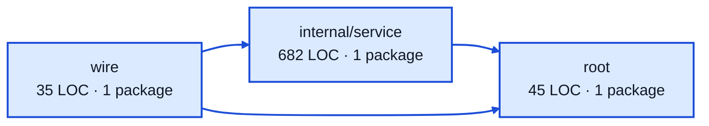

# webhooks service architecture

<!-- Generated by make architecture. -->

Source commit: `02c60f888612779f831d3268463ff1f4f7a8b78c`.

[High-level backend](../high-level-backend.md) · [Test coverage](../high-level-test-coverage.md)

762 LOC across 5 files. Arrows show imports between package groups within this service. They are static dependencies, not runtime calls. `XX%` means coverage was unmeasured.

## Package groups

`(subservice)` identifies a private service under `internal/services/`. `internal/service` is the core service implementation.

| Group | LOC | Files | Packages | Unit | Functional |
| --- | ---: | ---: | ---: | ---: | ---: |
| internal/service | 682 | 3 | 1 | 79.9% | 68.0% |
| root | 45 | 1 | 1 | XX% | XX% |
| wire | 35 | 1 | 1 | XX% | 66.7% |

## Packages

| Package | LOC | Files | Unit | Functional |
| --- | ---: | ---: | ---: | ---: |
| [`pkg/services/webhooks`](../../../../pkg/services/webhooks) | 45 | 1 | XX% | XX% |
| [`pkg/services/webhooks/internal/service`](../../../../pkg/services/webhooks/internal/service) | 682 | 3 | 79.9% | 68.0% |
| [`pkg/services/webhooks/wire`](../../../../pkg/services/webhooks/wire) | 35 | 1 | XX% | 66.7% |
