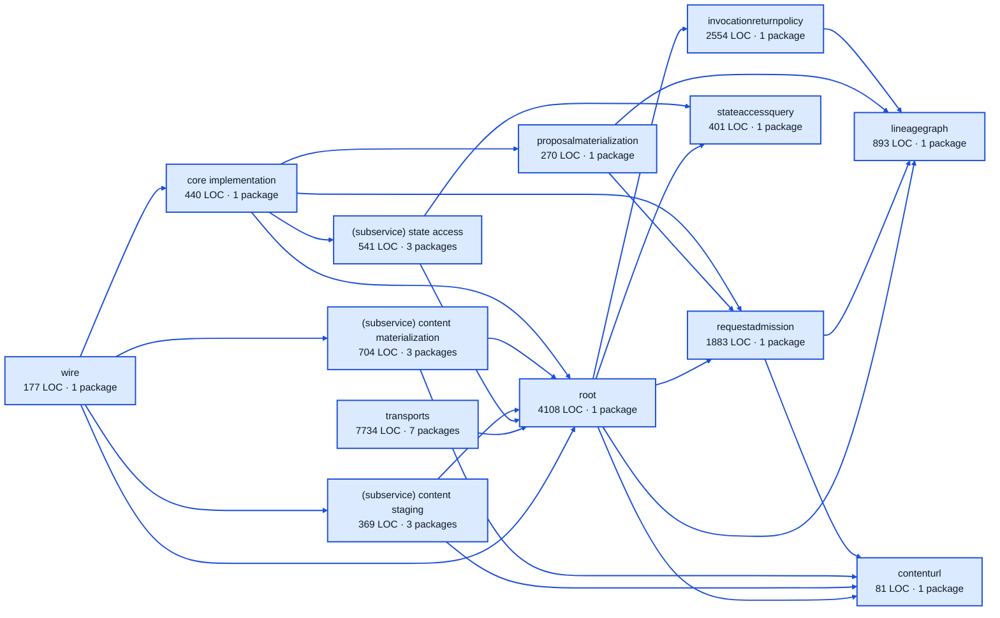

# work service architecture

<!-- Generated by make architecture. -->

Source commit: `73a895d96cc1e89561f85edf773e39e08d5990a2`.

[High-level backend](../high-level-backend.md) · [Test coverage](../high-level-test-coverage.md)

20155 LOC across 117 files. Arrows show imports between package groups within this service. They are static dependencies, not runtime calls. `XX%` means coverage was unmeasured.

## Package groups

`(subservice)` identifies a private service under `internal/services/`. `internal/service` is the core service implementation.

| Group | LOC | Files | Packages | Unit | Functional |
| --- | ---: | ---: | ---: | ---: | ---: |
| core implementation | 440 | 3 | 1 | 75.0% | 47.1% |
| contenturl | 81 | 1 | 1 | 66.7% | 33.3% |
| invocationreturnpolicy | 2554 | 9 | 1 | 82.7% | 69.2% |
| lineagegraph | 893 | 8 | 1 | 90.5% | 76.2% |
| proposalmaterialization | 270 | 1 | 1 | 83.3% | 52.4% |
| requestadmission | 1883 | 8 | 1 | 87.5% | 75.5% |
| (subservice) content materialization | 704 | 10 | 3 | 72.3% | 5.4% |
| (subservice) content staging | 369 | 3 | 3 | 77.7% | 65.0% |
| (subservice) state access | 541 | 5 | 3 | 84.5% | 84.7% |
| stateaccessquery | 401 | 3 | 1 | 93.1% | 76.2% |
| root | 4108 | 13 | 1 | 81.5% | 71.9% |
| transports | 7734 | 52 | 7 | 81.6% | 61.6% |
| wire | 177 | 1 | 1 | XX% | 11.4% |

## Packages

| Package | LOC | Files | Unit | Functional |
| --- | ---: | ---: | ---: | ---: |
| [`pkg/services/work`](../../../../pkg/services/work) | 4108 | 13 | 81.5% | 71.9% |
| [`pkg/services/work/internal`](../../../../pkg/services/work/internal) | 440 | 3 | 75.0% | 47.1% |
| [`pkg/services/work/internal/contenturl`](../../../../pkg/services/work/internal/contenturl) | 81 | 1 | 66.7% | 33.3% |
| [`pkg/services/work/internal/invocationreturnpolicy`](../../../../pkg/services/work/internal/invocationreturnpolicy) | 2554 | 9 | 82.7% | 69.2% |
| [`pkg/services/work/internal/lineagegraph`](../../../../pkg/services/work/internal/lineagegraph) | 893 | 8 | 90.5% | 76.2% |
| [`pkg/services/work/internal/proposalmaterialization`](../../../../pkg/services/work/internal/proposalmaterialization) | 270 | 1 | 83.3% | 52.4% |
| [`pkg/services/work/internal/requestadmission`](../../../../pkg/services/work/internal/requestadmission) | 1883 | 8 | 87.5% | 75.5% |
| [`pkg/services/work/internal/services/content_materialization`](../../../../pkg/services/work/internal/services/content_materialization) | 37 | 2 | 0.0% | 0.0% |
| [`pkg/services/work/internal/services/content_materialization/internal/service`](../../../../pkg/services/work/internal/services/content_materialization/internal/service) | 613 | 7 | 73.4% | 4.1% |
| [`pkg/services/work/internal/services/content_materialization/wire`](../../../../pkg/services/work/internal/services/content_materialization/wire) | 54 | 1 | XX% | 80.0% |
| [`pkg/services/work/internal/services/content_staging`](../../../../pkg/services/work/internal/services/content_staging) | 33 | 1 | XX% | XX% |
| [`pkg/services/work/internal/services/content_staging/internal/service`](../../../../pkg/services/work/internal/services/content_staging/internal/service) | 314 | 1 | 77.7% | 64.7% |
| [`pkg/services/work/internal/services/content_staging/wire`](../../../../pkg/services/work/internal/services/content_staging/wire) | 22 | 1 | XX% | 75.0% |
| [`pkg/services/work/internal/services/state_access`](../../../../pkg/services/work/internal/services/state_access) | 44 | 1 | XX% | XX% |
| [`pkg/services/work/internal/services/state_access/internal/service`](../../../../pkg/services/work/internal/services/state_access/internal/service) | 420 | 2 | 84.5% | 85.6% |
| [`pkg/services/work/internal/services/state_access/wire`](../../../../pkg/services/work/internal/services/state_access/wire) | 77 | 2 | XX% | 73.3% |
| [`pkg/services/work/internal/stateaccessquery`](../../../../pkg/services/work/internal/stateaccessquery) | 401 | 3 | 93.1% | 76.2% |
| [`pkg/services/work/transports/cli`](../../../../pkg/services/work/transports/cli) | 2739 | 9 | 76.9% | 60.9% |
| [`pkg/services/work/transports/cli/batchload`](../../../../pkg/services/work/transports/cli/batchload) | 13 | 1 | 100.0% | 0.0% |
| [`pkg/services/work/transports/cli/climanifest`](../../../../pkg/services/work/transports/cli/climanifest) | 1315 | 7 | 89.2% | 50.3% |
| [`pkg/services/work/transports/cli/submit`](../../../../pkg/services/work/transports/cli/submit) | 964 | 8 | 87.2% | 75.7% |
| [`pkg/services/work/transports/cli/work`](../../../../pkg/services/work/transports/cli/work) | 90 | 5 | 73.3% | 60.0% |
| [`pkg/services/work/transports/http`](../../../../pkg/services/work/transports/http) | 1760 | 11 | 80.1% | 62.9% |
| [`pkg/services/work/transports/mcp`](../../../../pkg/services/work/transports/mcp) | 853 | 11 | 90.0% | XX% |
| [`pkg/services/work/wire`](../../../../pkg/services/work/wire) | 177 | 1 | XX% | 11.4% |
