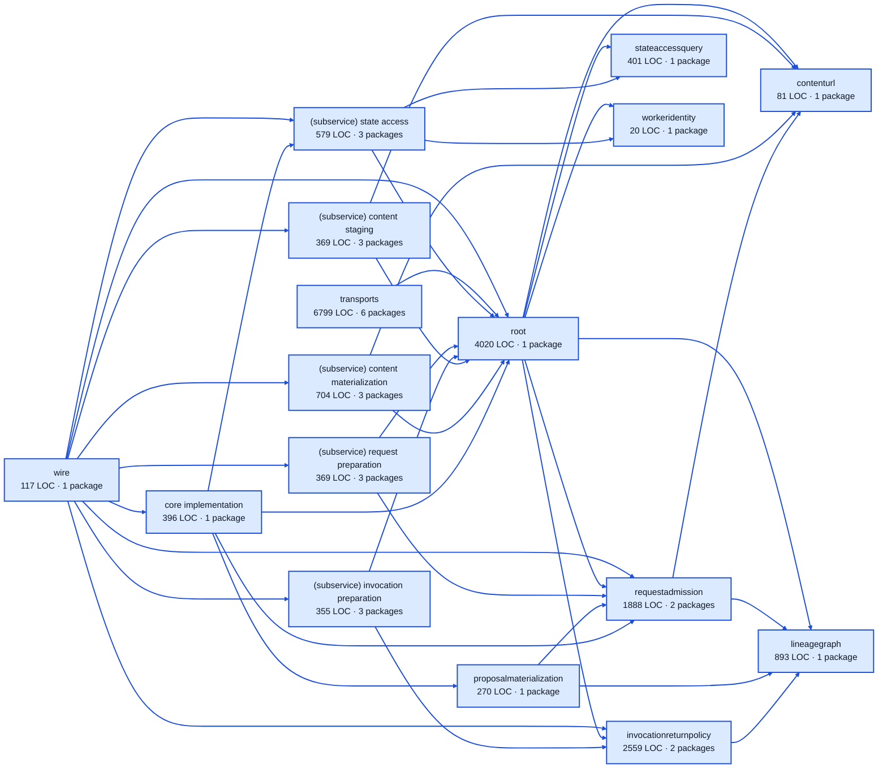

# work service architecture

<!-- Generated by make architecture. -->

Source commit: `0de11962ea0d64c51d336f6d95526f89ef0198ee`.

[High-level backend](../high-level-backend.md) · [Test coverage](../high-level-test-coverage.md)

19820 LOC across 116 files. Arrows show imports between package groups within this service. They are static dependencies, not runtime calls. `XX%` means coverage was unmeasured.

## Package groups

`(subservice)` identifies a private service under `internal/services/`. `internal/service` is the core service implementation.

| Group | LOC | Files | Packages | Unit | Functional |
| --- | ---: | ---: | ---: | ---: | ---: |
| core implementation | 396 | 3 | 1 | 80.7% | 51.4% |
| contenturl | 81 | 1 | 1 | 66.7% | 33.3% |
| invocationreturnpolicy | 2559 | 10 | 2 | 82.4% | 70.3% |
| lineagegraph | 893 | 8 | 1 | 90.5% | 76.5% |
| proposalmaterialization | 270 | 1 | 1 | 83.3% | 82.1% |
| requestadmission | 1888 | 9 | 2 | 87.5% | 77.3% |
| (subservice) content materialization | 704 | 10 | 3 | 71.6% | 5.4% |
| (subservice) content staging | 369 | 3 | 3 | 77.0% | 67.8% |
| (subservice) invocation preparation | 355 | 3 | 3 | 75.4% | 53.3% |
| (subservice) request preparation | 369 | 3 | 3 | 85.7% | 56.6% |
| (subservice) state access | 579 | 5 | 3 | 82.0% | 82.9% |
| stateaccessquery | 401 | 3 | 1 | 93.1% | 76.2% |
| workeridentity | 20 | 1 | 1 | XX% | XX% |
| root | 4020 | 13 | 1 | 81.4% | 70.6% |
| transports | 6799 | 41 | 6 | 81.5% | 62.8% |
| wire | 117 | 2 | 1 | XX% | 100.0% |

## Packages

| Package | LOC | Files | Unit | Functional |
| --- | ---: | ---: | ---: | ---: |
| [`pkg/services/work`](../../../../pkg/services/work) | 4020 | 13 | 81.4% | 70.6% |
| [`pkg/services/work/internal`](../../../../pkg/services/work/internal) | 396 | 3 | 80.7% | 51.4% |
| [`pkg/services/work/internal/contenturl`](../../../../pkg/services/work/internal/contenturl) | 81 | 1 | 66.7% | 33.3% |
| [`pkg/services/work/internal/invocationreturnpolicy`](../../../../pkg/services/work/internal/invocationreturnpolicy) | 2554 | 9 | 82.4% | 70.3% |
| [`pkg/services/work/internal/invocationreturnpolicy/wire`](../../../../pkg/services/work/internal/invocationreturnpolicy/wire) | 5 | 1 | XX% | 100.0% |
| [`pkg/services/work/internal/lineagegraph`](../../../../pkg/services/work/internal/lineagegraph) | 893 | 8 | 90.5% | 76.5% |
| [`pkg/services/work/internal/proposalmaterialization`](../../../../pkg/services/work/internal/proposalmaterialization) | 270 | 1 | 83.3% | 82.1% |
| [`pkg/services/work/internal/requestadmission`](../../../../pkg/services/work/internal/requestadmission) | 1880 | 8 | 87.5% | 77.2% |
| [`pkg/services/work/internal/requestadmission/wire`](../../../../pkg/services/work/internal/requestadmission/wire) | 8 | 1 | XX% | 100.0% |
| [`pkg/services/work/internal/services/content_materialization`](../../../../pkg/services/work/internal/services/content_materialization) | 37 | 2 | 0.0% | 0.0% |
| [`pkg/services/work/internal/services/content_materialization/internal/service`](../../../../pkg/services/work/internal/services/content_materialization/internal/service) | 613 | 7 | 72.7% | 4.1% |
| [`pkg/services/work/internal/services/content_materialization/wire`](../../../../pkg/services/work/internal/services/content_materialization/wire) | 54 | 1 | XX% | 80.0% |
| [`pkg/services/work/internal/services/content_staging`](../../../../pkg/services/work/internal/services/content_staging) | 33 | 1 | XX% | XX% |
| [`pkg/services/work/internal/services/content_staging/internal/service`](../../../../pkg/services/work/internal/services/content_staging/internal/service) | 314 | 1 | 77.0% | 67.6% |
| [`pkg/services/work/internal/services/content_staging/wire`](../../../../pkg/services/work/internal/services/content_staging/wire) | 22 | 1 | XX% | 75.0% |
| [`pkg/services/work/internal/services/invocation_preparation`](../../../../pkg/services/work/internal/services/invocation_preparation) | 6 | 1 | XX% | XX% |
| [`pkg/services/work/internal/services/invocation_preparation/internal/service`](../../../../pkg/services/work/internal/services/invocation_preparation/internal/service) | 340 | 1 | 75.4% | 53.0% |
| [`pkg/services/work/internal/services/invocation_preparation/wire`](../../../../pkg/services/work/internal/services/invocation_preparation/wire) | 9 | 1 | XX% | 100.0% |
| [`pkg/services/work/internal/services/request_preparation`](../../../../pkg/services/work/internal/services/request_preparation) | 4 | 1 | XX% | XX% |
| [`pkg/services/work/internal/services/request_preparation/internal/service`](../../../../pkg/services/work/internal/services/request_preparation/internal/service) | 350 | 1 | 85.7% | 55.5% |
| [`pkg/services/work/internal/services/request_preparation/wire`](../../../../pkg/services/work/internal/services/request_preparation/wire) | 15 | 1 | XX% | 100.0% |
| [`pkg/services/work/internal/services/state_access`](../../../../pkg/services/work/internal/services/state_access) | 49 | 1 | XX% | XX% |
| [`pkg/services/work/internal/services/state_access/internal/service`](../../../../pkg/services/work/internal/services/state_access/internal/service) | 448 | 2 | 82.0% | 83.4% |
| [`pkg/services/work/internal/services/state_access/wire`](../../../../pkg/services/work/internal/services/state_access/wire) | 82 | 2 | XX% | 76.5% |
| [`pkg/services/work/internal/stateaccessquery`](../../../../pkg/services/work/internal/stateaccessquery) | 401 | 3 | 93.1% | 76.2% |
| [`pkg/services/work/internal/workeridentity`](../../../../pkg/services/work/internal/workeridentity) | 20 | 1 | XX% | XX% |
| [`pkg/services/work/transports/cli`](../../../../pkg/services/work/transports/cli) | 2739 | 9 | 76.9% | 61.0% |
| [`pkg/services/work/transports/cli/batchload`](../../../../pkg/services/work/transports/cli/batchload) | 13 | 1 | 100.0% | 66.7% |
| [`pkg/services/work/transports/cli/climanifest`](../../../../pkg/services/work/transports/cli/climanifest) | 1315 | 7 | 89.2% | 50.3% |
| [`pkg/services/work/transports/cli/submit`](../../../../pkg/services/work/transports/cli/submit) | 964 | 8 | 87.2% | 76.2% |
| [`pkg/services/work/transports/cli/work`](../../../../pkg/services/work/transports/cli/work) | 90 | 5 | 66.7% | 60.0% |
| [`pkg/services/work/transports/http`](../../../../pkg/services/work/transports/http) | 1678 | 11 | 81.6% | 66.9% |
| [`pkg/services/work/wire`](../../../../pkg/services/work/wire) | 117 | 2 | XX% | 100.0% |
