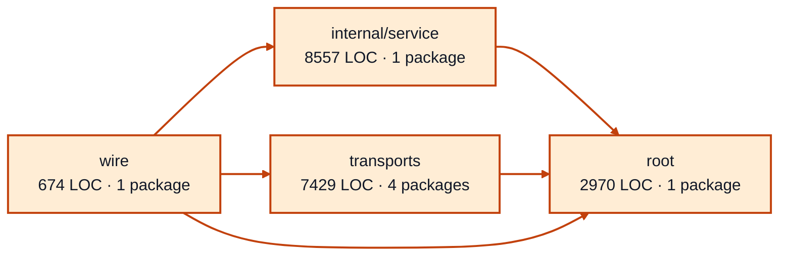

# worker sessions service architecture

<!-- Generated by make architecture. -->

Source commit: `c038071b04eed9c590fb573f3017bf8be9506d5e`.

[High-level backend](../high-level-backend.md) · [Test coverage](../high-level-test-coverage.md)

19630 LOC across 41 files. Arrows show imports between package groups within this service. They are static dependencies, not runtime calls. `XX%` means coverage was unmeasured.

## Package groups

`(subservice)` identifies a private service under `internal/services/`. `internal/service` is the core service implementation.

| Group | LOC | Files | Packages | Unit | Functional |
| --- | ---: | ---: | ---: | ---: | ---: |
| internal/service | 8557 | 9 | 1 | 96.9% | 66.0% |
| root | 2970 | 8 | 1 | 99.2% | 70.9% |
| transports | 7429 | 21 | 4 | 76.3% | 63.9% |
| wire | 674 | 3 | 1 | XX% | 65.0% |

## Packages

| Package | LOC | Files | Unit | Functional |
| --- | ---: | ---: | ---: | ---: |
| [`pkg/services/worker_sessions`](../../../../pkg/services/worker_sessions) | 2970 | 8 | 99.2% | 70.9% |
| [`pkg/services/worker_sessions/internal/service`](../../../../pkg/services/worker_sessions/internal/service) | 8557 | 9 | 96.9% | 66.0% |
| [`pkg/services/worker_sessions/transports/cli`](../../../../pkg/services/worker_sessions/transports/cli) | 3913 | 8 | 75.8% | 61.7% |
| [`pkg/services/worker_sessions/transports/cli/worker_sessions`](../../../../pkg/services/worker_sessions/transports/cli/worker_sessions) | 30 | 1 | 100.0% | 0.0% |
| [`pkg/services/worker_sessions/transports/http`](../../../../pkg/services/worker_sessions/transports/http) | 2970 | 7 | 75.0% | 64.1% |
| [`pkg/services/worker_sessions/transports/mcp`](../../../../pkg/services/worker_sessions/transports/mcp) | 516 | 5 | 87.6% | 81.8% |
| [`pkg/services/worker_sessions/wire`](../../../../pkg/services/worker_sessions/wire) | 674 | 3 | XX% | 65.0% |
