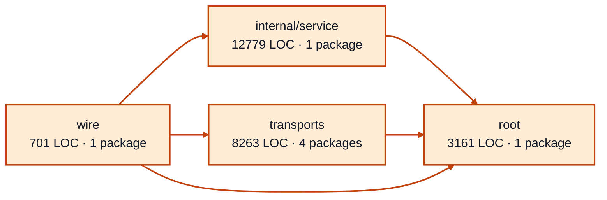

# worker sessions service architecture

<!-- Generated by make architecture. -->

Source commit: `999d1092f82b8acd820116ad278bbb64b1aefd54`.

[High-level backend](../high-level-backend.md) · [Test coverage](../high-level-test-coverage.md)

24904 LOC across 73 files. Arrows show imports between package groups within this service. They are static dependencies, not runtime calls. `XX%` means coverage was unmeasured.

## Package groups

`(subservice)` identifies a private service under `internal/services/`. `internal/service` is the core service implementation.

| Group | LOC | Files | Packages | Unit | Functional |
| --- | ---: | ---: | ---: | ---: | ---: |
| internal/service | 12779 | 36 | 1 | 94.4% | 70.1% |
| root | 3161 | 9 | 1 | 98.3% | 71.3% |
| transports | 8263 | 25 | 4 | 77.3% | 68.1% |
| wire | 701 | 3 | 1 | XX% | 71.0% |

## Packages

| Package | LOC | Files | Unit | Functional |
| --- | ---: | ---: | ---: | ---: |
| [`pkg/services/worker_sessions`](../../../../pkg/services/worker_sessions) | 3161 | 9 | 98.3% | 71.3% |
| [`pkg/services/worker_sessions/internal/service`](../../../../pkg/services/worker_sessions/internal/service) | 12779 | 36 | 94.4% | 70.1% |
| [`pkg/services/worker_sessions/transports/cli`](../../../../pkg/services/worker_sessions/transports/cli) | 4343 | 11 | 77.3% | 66.3% |
| [`pkg/services/worker_sessions/transports/cli/worker_sessions`](../../../../pkg/services/worker_sessions/transports/cli/worker_sessions) | 30 | 1 | 100.0% | 0.0% |
| [`pkg/services/worker_sessions/transports/http`](../../../../pkg/services/worker_sessions/transports/http) | 3250 | 8 | 75.2% | 68.1% |
| [`pkg/services/worker_sessions/transports/mcp`](../../../../pkg/services/worker_sessions/transports/mcp) | 640 | 5 | 88.5% | 81.0% |
| [`pkg/services/worker_sessions/wire`](../../../../pkg/services/worker_sessions/wire) | 701 | 3 | XX% | 71.0% |
