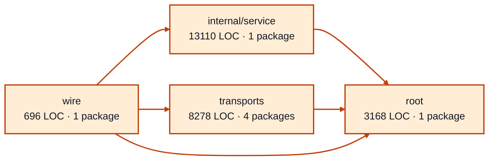

# worker sessions service architecture

<!-- Generated by make architecture. -->

Source commit: `e1b4543dd3486765cf455108f1cd78ecbd7bb140`.

[High-level backend](../high-level-backend.md) · [Test coverage](../high-level-test-coverage.md)

25252 LOC across 74 files. Arrows show imports between package groups within this service. They are static dependencies, not runtime calls. `XX%` means coverage was unmeasured.

## Package groups

`(subservice)` identifies a private service under `internal/services/`. `internal/service` is the core service implementation.

| Group | LOC | Files | Packages | Unit | Functional |
| --- | ---: | ---: | ---: | ---: | ---: |
| internal/service | 13110 | 38 | 1 | 93.8% | 71.2% |
| root | 3168 | 9 | 1 | 98.2% | 71.4% |
| transports | 8278 | 24 | 4 | 77.8% | 69.3% |
| wire | 696 | 3 | 1 | XX% | 72.2% |

## Packages

| Package | LOC | Files | Unit | Functional |
| --- | ---: | ---: | ---: | ---: |
| [`pkg/services/worker_sessions`](../../../../pkg/services/worker_sessions) | 3168 | 9 | 98.2% | 71.4% |
| [`pkg/services/worker_sessions/internal/service`](../../../../pkg/services/worker_sessions/internal/service) | 13110 | 38 | 93.8% | 71.2% |
| [`pkg/services/worker_sessions/transports/cli`](../../../../pkg/services/worker_sessions/transports/cli) | 4372 | 11 | 77.6% | 67.3% |
| [`pkg/services/worker_sessions/transports/cli/worker_sessions`](../../../../pkg/services/worker_sessions/transports/cli/worker_sessions) | 30 | 1 | 100.0% | 0.0% |
| [`pkg/services/worker_sessions/transports/http`](../../../../pkg/services/worker_sessions/transports/http) | 3275 | 8 | 75.4% | 69.0% |
| [`pkg/services/worker_sessions/transports/mcp`](../../../../pkg/services/worker_sessions/transports/mcp) | 601 | 4 | 90.6% | 84.1% |
| [`pkg/services/worker_sessions/wire`](../../../../pkg/services/worker_sessions/wire) | 696 | 3 | XX% | 72.2% |
