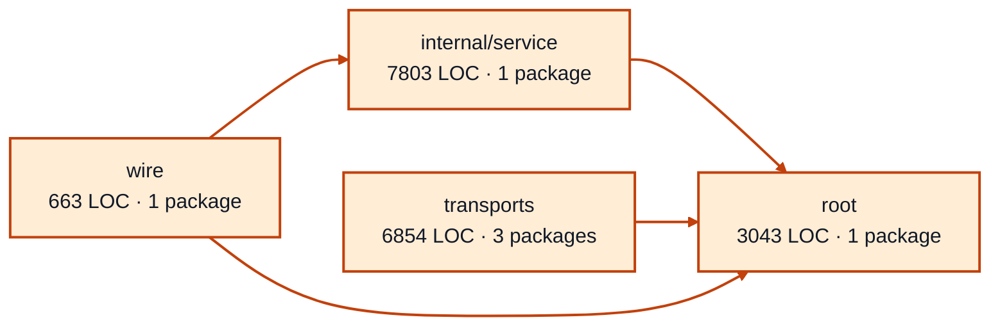

# worker sessions service architecture

<!-- Generated by make architecture. -->

Source commit: `316fc4d5eb67c2f99da47f8ab396e4bc2ba5ecba`.

[High-level backend](../high-level-backend.md) · [Test coverage](../high-level-test-coverage.md)

18363 LOC across 35 files. Arrows show imports between package groups within this service. They are static dependencies, not runtime calls. `XX%` means coverage was unmeasured.

## Package groups

`(subservice)` identifies a private service under `internal/services/`. `internal/service` is the core service implementation.

| Group | LOC | Files | Packages | Unit | Functional |
| --- | ---: | ---: | ---: | ---: | ---: |
| internal/service | 7803 | 9 | 1 | 97.6% | 66.2% |
| root | 3043 | 8 | 1 | 100.0% | 64.4% |
| transports | 6854 | 16 | 3 | 75.5% | 61.8% |
| wire | 663 | 2 | 1 | XX% | 67.6% |

## Packages

| Package | LOC | Files | Unit | Functional |
| --- | ---: | ---: | ---: | ---: |
| [`pkg/services/worker_sessions`](../../../../pkg/services/worker_sessions) | 3043 | 8 | 100.0% | 64.4% |
| [`pkg/services/worker_sessions/internal/service`](../../../../pkg/services/worker_sessions/internal/service) | 7803 | 9 | 97.6% | 66.2% |
| [`pkg/services/worker_sessions/transports/cli`](../../../../pkg/services/worker_sessions/transports/cli) | 3896 | 8 | 76.2% | 61.6% |
| [`pkg/services/worker_sessions/transports/cli/worker_sessions`](../../../../pkg/services/worker_sessions/transports/cli/worker_sessions) | 30 | 1 | 100.0% | 0.0% |
| [`pkg/services/worker_sessions/transports/http`](../../../../pkg/services/worker_sessions/transports/http) | 2928 | 7 | 74.5% | 62.2% |
| [`pkg/services/worker_sessions/wire`](../../../../pkg/services/worker_sessions/wire) | 663 | 2 | XX% | 67.6% |
