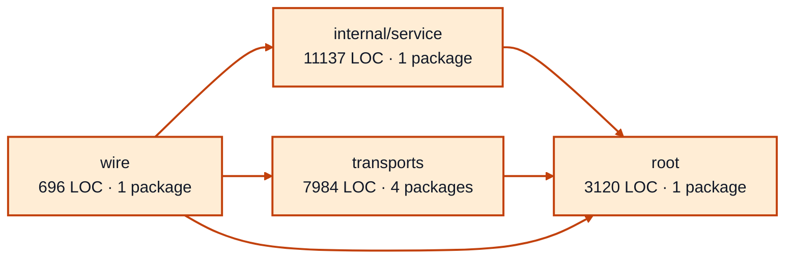

# worker sessions service architecture

<!-- Generated by make architecture. -->

Source commit: `a94fe95ec29344d6b1dcf04666cc546ca29760f3`.

[High-level backend](../high-level-backend.md) · [Test coverage](../high-level-test-coverage.md)

22937 LOC across 62 files. Arrows show imports between package groups within this service. They are static dependencies, not runtime calls. `XX%` means coverage was unmeasured.

## Package groups

`(subservice)` identifies a private service under `internal/services/`. `internal/service` is the core service implementation.

| Group | LOC | Files | Packages | Unit | Functional |
| --- | ---: | ---: | ---: | ---: | ---: |
| internal/service | 11137 | 26 | 1 | 95.2% | 67.8% |
| root | 3120 | 9 | 1 | 98.4% | 72.5% |
| transports | 7984 | 24 | 4 | 76.6% | 66.1% |
| wire | 696 | 3 | 1 | XX% | 70.7% |

## Packages

| Package | LOC | Files | Unit | Functional |
| --- | ---: | ---: | ---: | ---: |
| [`pkg/services/worker_sessions`](../../../../pkg/services/worker_sessions) | 3120 | 9 | 98.4% | 72.5% |
| [`pkg/services/worker_sessions/internal/service`](../../../../pkg/services/worker_sessions/internal/service) | 11137 | 26 | 95.2% | 67.8% |
| [`pkg/services/worker_sessions/transports/cli`](../../../../pkg/services/worker_sessions/transports/cli) | 4268 | 10 | 76.9% | 63.6% |
| [`pkg/services/worker_sessions/transports/cli/worker_sessions`](../../../../pkg/services/worker_sessions/transports/cli/worker_sessions) | 30 | 1 | 100.0% | 0.0% |
| [`pkg/services/worker_sessions/transports/http`](../../../../pkg/services/worker_sessions/transports/http) | 3137 | 8 | 74.1% | 66.9% |
| [`pkg/services/worker_sessions/transports/mcp`](../../../../pkg/services/worker_sessions/transports/mcp) | 549 | 5 | 88.4% | 82.7% |
| [`pkg/services/worker_sessions/wire`](../../../../pkg/services/worker_sessions/wire) | 696 | 3 | XX% | 70.7% |
