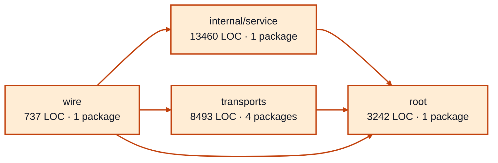

# worker sessions service architecture

<!-- Generated by make architecture. -->

Source commit: `146c8f41d1706980063c7a1c57b87932b94e3d5f`.

[High-level backend](../high-level-backend.md) · [Test coverage](../high-level-test-coverage.md)

25932 LOC across 78 files. Arrows show imports between package groups within this service. They are static dependencies, not runtime calls. `XX%` means coverage was unmeasured.

## Package groups

`(subservice)` identifies a private service under `internal/services/`. `internal/service` is the core service implementation.

| Group | LOC | Files | Packages | Unit | Functional |
| --- | ---: | ---: | ---: | ---: | ---: |
| internal/service | 13460 | 39 | 1 | 93.9% | 71.6% |
| root | 3242 | 10 | 1 | 98.1% | 72.4% |
| transports | 8493 | 26 | 4 | 79.0% | 70.5% |
| wire | 737 | 3 | 1 | XX% | 72.3% |

## Packages

| Package | LOC | Files | Unit | Functional |
| --- | ---: | ---: | ---: | ---: |
| [`pkg/services/worker_sessions`](../../../../pkg/services/worker_sessions) | 3242 | 10 | 98.1% | 72.4% |
| [`pkg/services/worker_sessions/internal/service`](../../../../pkg/services/worker_sessions/internal/service) | 13460 | 39 | 93.9% | 71.6% |
| [`pkg/services/worker_sessions/transports/cli`](../../../../pkg/services/worker_sessions/transports/cli) | 4448 | 12 | 78.5% | 68.2% |
| [`pkg/services/worker_sessions/transports/cli/worker_sessions`](../../../../pkg/services/worker_sessions/transports/cli/worker_sessions) | 30 | 1 | 100.0% | 0.0% |
| [`pkg/services/worker_sessions/transports/http`](../../../../pkg/services/worker_sessions/transports/http) | 3414 | 9 | 77.4% | 70.7% |
| [`pkg/services/worker_sessions/transports/mcp`](../../../../pkg/services/worker_sessions/transports/mcp) | 601 | 4 | 90.6% | 84.8% |
| [`pkg/services/worker_sessions/wire`](../../../../pkg/services/worker_sessions/wire) | 737 | 3 | XX% | 72.3% |
