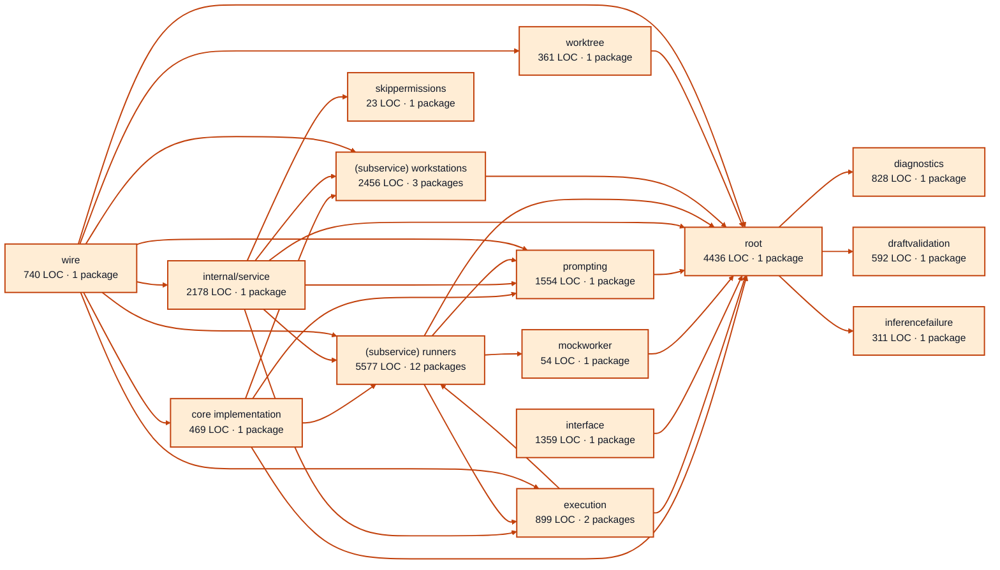

# workers service architecture

<!-- Generated by make architecture. -->

[High-level backend](../high-level-backend.md) · [Test coverage](../high-level-test-coverage.md)

21837 LOC across 120 files. Arrows show imports between package groups within this service. They are static dependencies, not runtime calls. `XX%` means coverage was unmeasured.

## Package groups

`(subservice)` identifies a private service under `internal/services/`. `internal/service` is the core service implementation.

| Group | LOC | Files | Packages | Unit | Functional |
| --- | ---: | ---: | ---: | ---: | ---: |
| core implementation | 469 | 8 | 1 | XX% | XX% |
| diagnostics | 828 | 4 | 1 | XX% | XX% |
| draftvalidation | 592 | 2 | 1 | XX% | XX% |
| execution | 899 | 7 | 2 | XX% | XX% |
| inferencefailure | 311 | 1 | 1 | XX% | XX% |
| interface | 1359 | 9 | 1 | XX% | XX% |
| mockworker | 54 | 1 | 1 | XX% | XX% |
| prompting | 1554 | 6 | 1 | XX% | XX% |
| internal/service | 2178 | 11 | 1 | XX% | XX% |
| (subservice) runners | 5577 | 20 | 12 | XX% | XX% |
| (subservice) workstations | 2456 | 15 | 3 | XX% | XX% |
| skippermissions | 23 | 1 | 1 | XX% | XX% |
| worktree | 361 | 4 | 1 | XX% | XX% |
| root | 4436 | 27 | 1 | XX% | XX% |
| wire | 740 | 4 | 1 | XX% | XX% |

## Packages

| Package | LOC | Files | Unit | Functional |
| --- | ---: | ---: | ---: | ---: |
| [`pkg/services/workers`](../../../../pkg/services/workers) | 4436 | 27 | XX% | XX% |
| [`pkg/services/workers/internal`](../../../../pkg/services/workers/internal) | 469 | 8 | XX% | XX% |
| [`pkg/services/workers/internal/diagnostics`](../../../../pkg/services/workers/internal/diagnostics) | 828 | 4 | XX% | XX% |
| [`pkg/services/workers/internal/draftvalidation`](../../../../pkg/services/workers/internal/draftvalidation) | 592 | 2 | XX% | XX% |
| [`pkg/services/workers/internal/execution`](../../../../pkg/services/workers/internal/execution) | 451 | 5 | XX% | XX% |
| [`pkg/services/workers/internal/execution/recording`](../../../../pkg/services/workers/internal/execution/recording) | 448 | 2 | XX% | XX% |
| [`pkg/services/workers/internal/inferencefailure`](../../../../pkg/services/workers/internal/inferencefailure) | 311 | 1 | XX% | XX% |
| [`pkg/services/workers/internal/interface`](../../../../pkg/services/workers/internal/interface) | 1359 | 9 | XX% | XX% |
| [`pkg/services/workers/internal/mockworker`](../../../../pkg/services/workers/internal/mockworker) | 54 | 1 | XX% | XX% |
| [`pkg/services/workers/internal/prompting`](../../../../pkg/services/workers/internal/prompting) | 1554 | 6 | XX% | XX% |
| [`pkg/services/workers/internal/service`](../../../../pkg/services/workers/internal/service) | 2178 | 11 | XX% | XX% |
| [`pkg/services/workers/internal/services/runners`](../../../../pkg/services/workers/internal/services/runners) | 115 | 1 | XX% | XX% |
| [`pkg/services/workers/internal/services/runners/internal/inference`](../../../../pkg/services/workers/internal/services/runners/internal/inference) | 822 | 2 | XX% | XX% |
| [`pkg/services/workers/internal/services/runners/internal/mock`](../../../../pkg/services/workers/internal/services/runners/internal/mock) | 285 | 1 | XX% | XX% |
| [`pkg/services/workers/internal/services/runners/internal/script`](../../../../pkg/services/workers/internal/services/runners/internal/script) | 843 | 3 | XX% | XX% |
| [`pkg/services/workers/internal/services/runners/internal/service`](../../../../pkg/services/workers/internal/services/runners/internal/service) | 270 | 2 | XX% | XX% |
| [`pkg/services/workers/internal/services/runners/internal/services/agent`](../../../../pkg/services/workers/internal/services/runners/internal/services/agent) | 15 | 1 | XX% | XX% |
| [`pkg/services/workers/internal/services/runners/internal/services/agent/internal/service`](../../../../pkg/services/workers/internal/services/runners/internal/services/agent/internal/service) | 1490 | 3 | XX% | XX% |
| [`pkg/services/workers/internal/services/runners/internal/services/agent/wire`](../../../../pkg/services/workers/internal/services/runners/internal/services/agent/wire) | 19 | 1 | XX% | XX% |
| [`pkg/services/workers/internal/services/runners/internal/testkit`](../../../../pkg/services/workers/internal/services/runners/internal/testkit) | 307 | 1 | XX% | XX% |
| [`pkg/services/workers/internal/services/runners/process`](../../../../pkg/services/workers/internal/services/runners/process) | 559 | 1 | XX% | XX% |
| [`pkg/services/workers/internal/services/runners/testing`](../../../../pkg/services/workers/internal/services/runners/testing) | 541 | 3 | XX% | XX% |
| [`pkg/services/workers/internal/services/runners/wire`](../../../../pkg/services/workers/internal/services/runners/wire) | 311 | 1 | XX% | XX% |
| [`pkg/services/workers/internal/services/workstations/executor`](../../../../pkg/services/workers/internal/services/workstations/executor) | 803 | 7 | XX% | XX% |
| [`pkg/services/workers/internal/services/workstations/executor/agentrun`](../../../../pkg/services/workers/internal/services/workstations/executor/agentrun) | 1157 | 7 | XX% | XX% |
| [`pkg/services/workers/internal/services/workstations/invocation`](../../../../pkg/services/workers/internal/services/workstations/invocation) | 496 | 1 | XX% | XX% |
| [`pkg/services/workers/internal/skippermissions`](../../../../pkg/services/workers/internal/skippermissions) | 23 | 1 | XX% | XX% |
| [`pkg/services/workers/internal/worktree`](../../../../pkg/services/workers/internal/worktree) | 361 | 4 | XX% | XX% |
| [`pkg/services/workers/wire`](../../../../pkg/services/workers/wire) | 740 | 4 | XX% | XX% |
