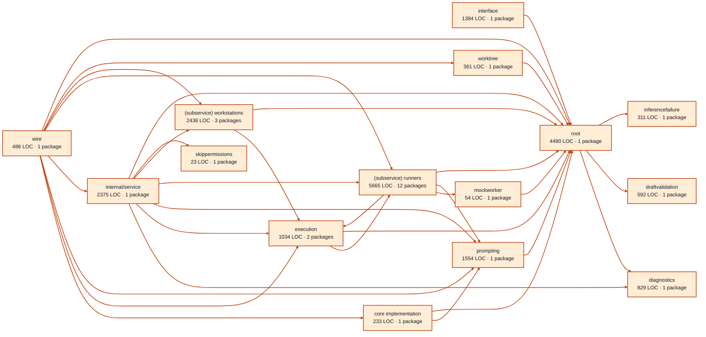

# workers service architecture

<!-- Generated by make architecture. -->

Source commit: `0de11962ea0d64c51d336f6d95526f89ef0198ee`.

[High-level backend](../high-level-backend.md) · [Test coverage](../high-level-test-coverage.md)

21827 LOC across 120 files. Arrows show imports between package groups within this service. They are static dependencies, not runtime calls. `XX%` means coverage was unmeasured.

## Package groups

`(subservice)` identifies a private service under `internal/services/`. `internal/service` is the core service implementation.

| Group | LOC | Files | Packages | Unit | Functional |
| --- | ---: | ---: | ---: | ---: | ---: |
| core implementation | 233 | 4 | 1 | 87.0% | 29.6% |
| diagnostics | 829 | 4 | 1 | 84.3% | 71.4% |
| draftvalidation | 592 | 2 | 1 | 81.6% | 50.5% |
| execution | 1034 | 8 | 2 | 75.2% | 73.3% |
| inferencefailure | 311 | 1 | 1 | 64.1% | 42.7% |
| interface | 1384 | 9 | 1 | 96.9% | XX% |
| mockworker | 54 | 1 | 1 | 75.0% | 75.0% |
| prompting | 1554 | 6 | 1 | 86.9% | 56.2% |
| internal/service | 2375 | 14 | 1 | 79.4% | 84.1% |
| (subservice) runners | 5665 | 21 | 12 | 91.1% | 66.4% |
| (subservice) workstations | 2436 | 15 | 3 | 87.4% | 47.2% |
| skippermissions | 23 | 1 | 1 | 100.0% | 80.0% |
| worktree | 361 | 4 | 1 | 62.8% | 57.9% |
| root | 4490 | 27 | 1 | 88.3% | 71.1% |
| wire | 486 | 3 | 1 | XX% | 63.4% |

## Packages

| Package | LOC | Files | Unit | Functional |
| --- | ---: | ---: | ---: | ---: |
| [`pkg/services/workers`](../../../../pkg/services/workers) | 4490 | 27 | 88.3% | 71.1% |
| [`pkg/services/workers/internal`](../../../../pkg/services/workers/internal) | 233 | 4 | 87.0% | 29.6% |
| [`pkg/services/workers/internal/diagnostics`](../../../../pkg/services/workers/internal/diagnostics) | 829 | 4 | 84.3% | 71.4% |
| [`pkg/services/workers/internal/draftvalidation`](../../../../pkg/services/workers/internal/draftvalidation) | 592 | 2 | 81.6% | 50.5% |
| [`pkg/services/workers/internal/execution`](../../../../pkg/services/workers/internal/execution) | 586 | 6 | 86.4% | 80.3% |
| [`pkg/services/workers/internal/execution/recording`](../../../../pkg/services/workers/internal/execution/recording) | 448 | 2 | 65.7% | 67.4% |
| [`pkg/services/workers/internal/inferencefailure`](../../../../pkg/services/workers/internal/inferencefailure) | 311 | 1 | 64.1% | 42.7% |
| [`pkg/services/workers/internal/interface`](../../../../pkg/services/workers/internal/interface) | 1384 | 9 | 96.9% | XX% |
| [`pkg/services/workers/internal/mockworker`](../../../../pkg/services/workers/internal/mockworker) | 54 | 1 | 75.0% | 75.0% |
| [`pkg/services/workers/internal/prompting`](../../../../pkg/services/workers/internal/prompting) | 1554 | 6 | 86.9% | 56.2% |
| [`pkg/services/workers/internal/service`](../../../../pkg/services/workers/internal/service) | 2375 | 14 | 79.4% | 84.1% |
| [`pkg/services/workers/internal/services/runners`](../../../../pkg/services/workers/internal/services/runners) | 120 | 1 | XX% | XX% |
| [`pkg/services/workers/internal/services/runners/internal/inference`](../../../../pkg/services/workers/internal/services/runners/internal/inference) | 831 | 3 | 94.9% | 46.6% |
| [`pkg/services/workers/internal/services/runners/internal/mock`](../../../../pkg/services/workers/internal/services/runners/internal/mock) | 289 | 1 | 84.4% | 0.0% |
| [`pkg/services/workers/internal/services/runners/internal/script`](../../../../pkg/services/workers/internal/services/runners/internal/script) | 828 | 3 | 94.1% | 85.9% |
| [`pkg/services/workers/internal/services/runners/internal/service`](../../../../pkg/services/workers/internal/services/runners/internal/service) | 270 | 2 | 90.2% | 70.7% |
| [`pkg/services/workers/internal/services/runners/internal/services/agent`](../../../../pkg/services/workers/internal/services/runners/internal/services/agent) | 15 | 1 | XX% | XX% |
| [`pkg/services/workers/internal/services/runners/internal/services/agent/internal/service`](../../../../pkg/services/workers/internal/services/runners/internal/services/agent/internal/service) | 1506 | 3 | 91.9% | 83.9% |
| [`pkg/services/workers/internal/services/runners/internal/services/agent/wire`](../../../../pkg/services/workers/internal/services/runners/internal/services/agent/wire) | 19 | 1 | XX% | 100.0% |
| [`pkg/services/workers/internal/services/runners/internal/testkit`](../../../../pkg/services/workers/internal/services/runners/internal/testkit) | 307 | 1 | 88.9% | XX% |
| [`pkg/services/workers/internal/services/runners/process`](../../../../pkg/services/workers/internal/services/runners/process) | 606 | 1 | 82.4% | 72.2% |
| [`pkg/services/workers/internal/services/runners/testing`](../../../../pkg/services/workers/internal/services/runners/testing) | 544 | 3 | 92.4% | 52.5% |
| [`pkg/services/workers/internal/services/runners/wire`](../../../../pkg/services/workers/internal/services/runners/wire) | 330 | 1 | XX% | 64.0% |
| [`pkg/services/workers/internal/services/workstations/executor`](../../../../pkg/services/workers/internal/services/workstations/executor) | 804 | 7 | 89.2% | 55.1% |
| [`pkg/services/workers/internal/services/workstations/executor/agentrun`](../../../../pkg/services/workers/internal/services/workstations/executor/agentrun) | 1189 | 7 | 83.7% | 32.6% |
| [`pkg/services/workers/internal/services/workstations/invocation`](../../../../pkg/services/workers/internal/services/workstations/invocation) | 443 | 1 | 94.7% | 74.7% |
| [`pkg/services/workers/internal/skippermissions`](../../../../pkg/services/workers/internal/skippermissions) | 23 | 1 | 100.0% | 80.0% |
| [`pkg/services/workers/internal/worktree`](../../../../pkg/services/workers/internal/worktree) | 361 | 4 | 62.8% | 57.9% |
| [`pkg/services/workers/wire`](../../../../pkg/services/workers/wire) | 486 | 3 | XX% | 63.4% |
