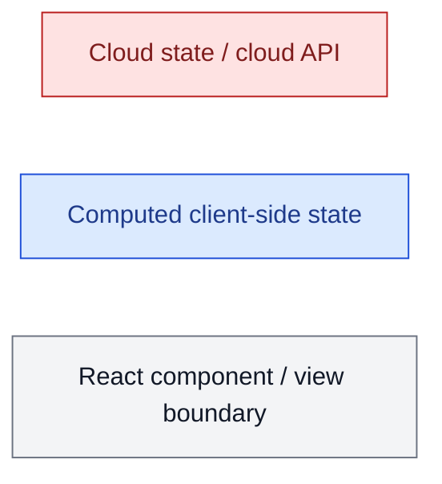
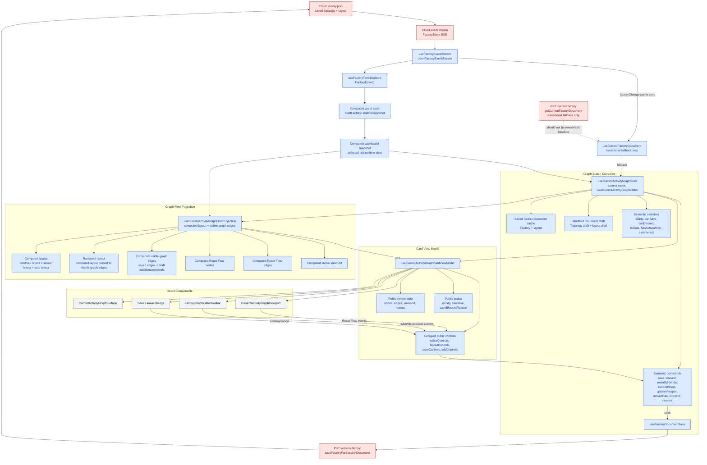
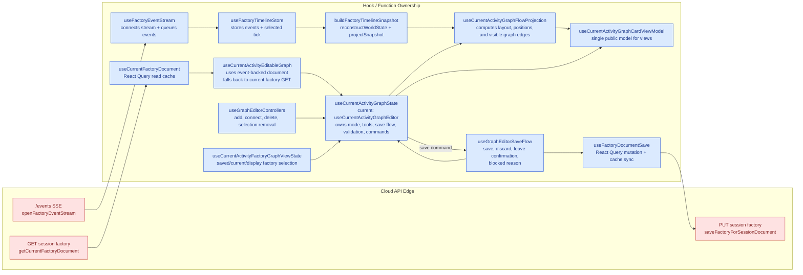
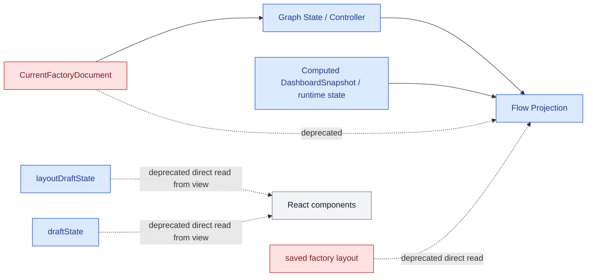
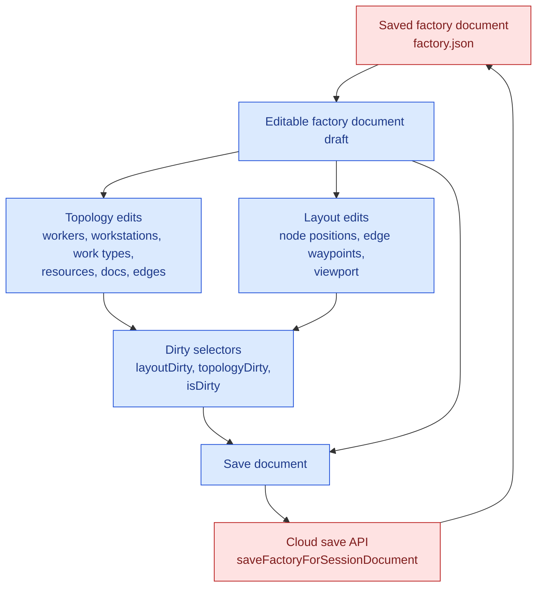
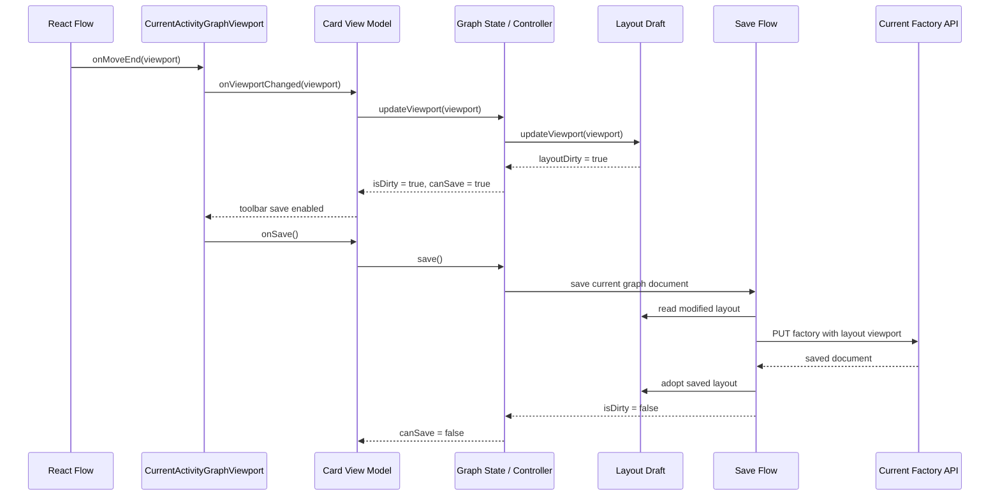
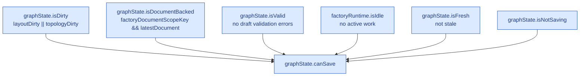
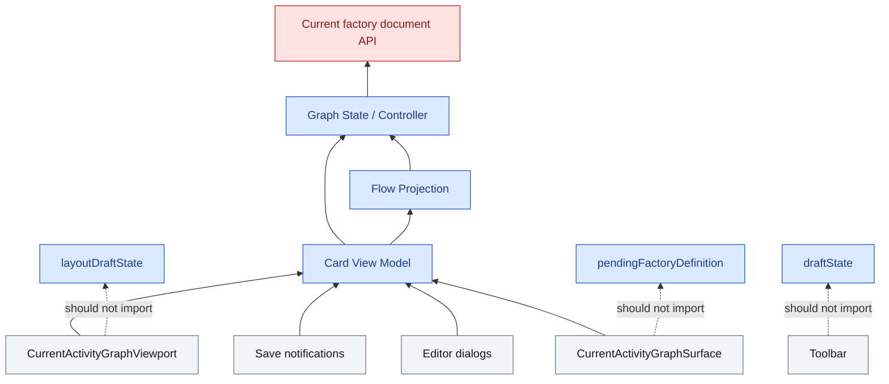

# Current Activity Graph Data Model

This note describes the intended data boundaries for the current activity graph. The goal is to keep factory graph state behind one canonical graph state layer, keep React Flow state as a projection, and let components interact through a semantic view model instead of reaching into draft internals.

## Color Legend

The Mermaid diagrams use color to distinguish persistence boundaries:



## Layer Contract



## Data Models

```mermaid
classDiagram
  class CloudFactoryJson {
    factoryJson
    topology
    layout
    version
  }

  class FactoryEventStream {
    FactoryEvent
    contextSequence
    payload
  }

  class CurrentFactoryDocumentCache {
    reactQueryCache
    CurrentFactoryDocument
  }

  class FactoryTimelineStore {
    factoryEvents
    selectedTick
    worldViewCache
  }

  class ComputedWorldState {
    replayedRuntimeState
    selectedTick
  }

  class ComputedDashboardSnapshot {
    factory
    topology
    runtime
    tickCount
  }

  class CurrentFactoryDocument {
    name
    version
    workTypes
    workers
    workstations
    resources
    supportingFiles
    layout
  }

  class FactoryLayout {
    schemaVersion
    nodes
    edges
    groups
    viewport
  }

  class FactoryGraphDraftState {
    source
    baseDocument
    latestDocument
    draft
    pendingFactoryDefinition
    validationErrors
    hasChanges
  }

  class FactoryGraphLayoutDraftState {
    baseLayout
    layout
    layoutDirty
    canUndoLayout
    canRedoLayout
  }

  class CurrentActivityGraphState {
    editorMode
    activeTool
    draftState
    layoutDraftState
    dirtyState
    saveState
    actions
  }

  class CurrentActivityGraphProjection {
    graphLayout
    canonicalLayout
    computedViewport
    nodes
    edges
    initialFitViewOptions
  }

  class CurrentActivityGraphCardViewModel {
    nodes
    edges
    viewport
    status
    saveBlockedReason
    editorControls
    layoutControls
    saveControls
    leaveControls
    addControls
    removalControls
    validationControls
    visibilityControls
  }

  CloudFactoryJson --> CurrentFactoryDocument : GET current factory
  CloudFactoryJson --> FactoryEventStream : emits factory/runtime events
  FactoryEventStream --> FactoryTimelineStore : useFactoryEventStream
  FactoryTimelineStore --> ComputedWorldState : buildFactoryTimelineSnapshot
  ComputedWorldState --> ComputedDashboardSnapshot : projectSnapshot
  CurrentFactoryDocument --> CurrentFactoryDocumentCache : useCurrentFactoryDocument
  CurrentFactoryDocumentCache --> CurrentActivityGraphState : document input
  ComputedDashboardSnapshot --> CurrentActivityGraphState : runtime blockers
  ComputedDashboardSnapshot --> CurrentActivityGraphProjection : runtime decoration
  CurrentFactoryDocument --> FactoryLayout : contains
  CurrentActivityGraphState --> FactoryGraphDraftState : owns
  CurrentActivityGraphState --> FactoryGraphLayoutDraftState : owns
  FactoryGraphLayoutDraftState --> FactoryLayout : modified
  CurrentFactoryDocument --> FactoryLayout : saved
  CurrentActivityGraphProjection --> CurrentActivityGraphState : reads
  CurrentActivityGraphCardViewModel --> CurrentActivityGraphState : delegates commands
  CurrentActivityGraphCardViewModel --> CurrentActivityGraphProjection : exposes render data

  class CloudFactoryJson,FactoryEventStream,CurrentFactoryDocument cloud
  class CurrentFactoryDocumentCache,FactoryTimelineStore,ComputedWorldState,ComputedDashboardSnapshot,CurrentActivityGraphState,FactoryGraphDraftState,FactoryGraphLayoutDraftState,CurrentActivityGraphProjection,CurrentActivityGraphCardViewModel client

  classDef cloud fill:#fee2e2,stroke:#b91c1c,color:#7f1d1d
  classDef client fill:#dbeafe,stroke:#1d4ed8,color:#1e3a8a
```

## Function Layout



Recommended naming direction:

| Current name | Intended role | Better name |
| --- | --- | --- |
| `useCurrentActivityGraphEditor` | Stateful graph controller used by read and edit modes | `useCurrentActivityGraphState` or `useCurrentActivityGraphController` |
| `useCurrentActivityGraphFlowProjection` | Computed graph projection: layout precedence, node positions, visible edges, rendered layout | keep name |
| `useCurrentActivityGraphViewModel` | React Flow node/edge decoration from the graph projection and runtime snapshot | rename toward `useCurrentActivityReactFlowProjection` once callers are flatter |
| `useCurrentActivityGraphCardViewModel` | Public component-facing model | keep name; graph surface, dialogs, and notifications consume this model directly |
| `useCurrentActivityEditableGraph` | Current-factory document and editable graph bridge | keep or fold into graph state |

The public card view model should not expose raw `graphState`; components should
consume prepared fields such as `nodes`, `edges`, `canonicalLayoutViewport`,
`layoutControls`, and `status`.

Layout UI should consume `layoutControls` for both rendered layout state and
layout mutations. Components should not receive separate top-level layout
commands such as node movement, viewport update, undo/redo, reset, or waypoint
mutation handlers.

The public `status` object should also stay semantic. Components should consume
fields such as `dirtySummary`, `hasSharedGraphChanges`, `isDefinitionLoading`,
`loadErrorMessage`, `isSaving`, `saveError`, `hasActiveWork`, `isStaleDraft`,
and `saveBlockedReason`, not raw draft-state, layout-draft, dirty-state,
active-runtime, or save-mutation objects.

Save UI should consume a semantic `saveControls` object that owns save
capability, confirmation state, feedback, summary text, and save commands.
Components should not assemble save behavior from separate controller fields.

Validation UI should consume a semantic `validationControls` object that owns
the validation factory definition, projected validation state, and targets.
Components should not assemble validation display from separate raw controller
fields.

Add-node UI should consume a semantic `addControls` object that owns add menu
actions, add dialog draft state, validation errors, and add commands.
Components should not assemble add behavior from separate draft/error/menu
setters.

Removal UI should consume a semantic `removalControls` object that owns blocked
removal messaging, pending removal confirmation state, and removal commands.
Components should not assemble removal behavior from separate pending intent,
blocked reason, or delete/cancel/confirm handler fields.

Card-level wrappers should construct `useCurrentActivityGraphCardViewModel`
before rendering graph children. Child components such as the surface, dialogs,
save notifications, and card view should receive the card view model rather than
the raw editor/controller object.

Viewport components should also receive grouped control objects from the card
view model. The graph surface should pass `addControls`, `saveControls`,
`layoutControls`, `visibilityControls`, and `editorControls` into the viewport
instead of fanning them back out into legacy-shaped save, add-menu, undo/redo,
viewport, node-move, hide/show, visibility-preference, mode-toggle, active-tool,
or interaction-availability props.

Editor mode UI should consume `editorControls` for `activeTool`,
`canInteract`, `connectionNotice`, `isEditing`, `toggleMode`,
`discardPendingChanges`, `selectTool`, and editor-unavailable messaging.
Components should not read top-level `editorMode`, `activeTool`,
`canInteractWithEditor`, `connectionNotice`,
`editorUnavailableClassifierWorkstationName`, `handleEditorModeToggle`,
`handleDiscardPendingChanges`, or `setActiveTool` from the public card model.

The card component module should export the card and stable shared types only.
Lower-level projection hooks should stay imported from their owning hook modules
inside tests or implementation code, not re-exported from the component boundary.
Shared types such as `CurrentActivitySelection` should come from the feature lib
type module rather than from a React component file.

The React Flow projection hook should accept a narrow render-facing editor shape:
render graph projection fields, connection-anchor command, pending connection
source, active tool, interaction flags, and validation targets. It should not be
typed against the full graph controller return value or the full flow projection
that also contains persistence-resolution details such as canonical and rendered
layout internals.

Factory-definition selection helpers should consume explicit graph/document
state such as `editableFactoryDocument` and `editableFactoryDocumentStatus`.
React Query objects should stay inside document-loading hooks and should not be
part of the graph projection selector contract.

Graph selection helpers should also avoid subscribing directly to timeline
state. The selected runtime world is already represented by the
`DashboardSnapshot` handed into the graph controller; helpers should receive
that snapshot as input instead of reading `useFactoryTimelineStore` themselves.

## Cloud APIs And Client Hooks

| Direction | Cloud surface | API function | Client hook / caller | Client state affected |
| --- | --- | --- | --- | --- |
| Cloud to client | Session event stream `/events` | `openFactoryEventStream` | `useFactoryEventStream` | `useFactoryTimelineStore`, dashboard stream status, current factory query cache on `factoryChange` |
| Cloud to client | Current session factory document | `getCurrentFactoryDocument` | `useCurrentFactoryDocument` | Transitional fallback only; should not be required for graph render or edit baseline |
| Client to cloud | Session factory save | `saveFactoryForSessionDocument` | `useFactoryDocumentSave`, called through editable graph save flow | Cloud `factory.json`, React Query current factory document cache |

The event stream is cloud-backed input, but the dashboard snapshot used by current activity is client-computed from events:

```mermaid
flowchart LR
  stream["Cloud event stream\nFactoryEvent SSE"]:::cloud
  hook["useFactoryEventStream"]:::client
  events["FactoryEvent[]\nuseFactoryTimelineStore"]:::client
  replay["reconstructWorldState"]:::client
  projected["projectSnapshot"]:::client
  snapshot["Computed DashboardSnapshot / WorldState\nselected tick"]:::client
  graphState["Current activity graph state"]:::client
  flowProjection["Computed React Flow graph\nnodes + edges + viewport"]:::client

  stream --> hook --> events --> replay --> projected --> snapshot
  snapshot --> graphState --> flowProjection
  snapshot --> flowProjection

  classDef cloud fill:#fee2e2,stroke:#b91c1c,color:#7f1d1d
  classDef client fill:#dbeafe,stroke:#1d4ed8,color:#1e3a8a
```



## No-Ping State Target

The desired dashboard data rule is:

```txt
The dashboard should not poll or query cloud state for renderable factory state.
It should receive state through the canonical factory event stream and write
state only through explicit user actions.
```

Current audit result:

| Question | Current answer | Evidence |
| --- | --- | --- |
| Can the runtime dashboard snapshot be rendered from events? | Yes | `useDashboardSnapshot` opens `useFactoryEventStream`; `useFactoryTimelineStore` stores events; `buildFactoryTimelineSnapshot` replays events into `WorldState` / `DashboardSnapshot`. |
| Does the event stream carry factory topology changes? | Yes | `RUN_REQUEST`, `INITIAL_STRUCTURE_REQUEST`, and `FACTORY_CHANGE` all carry `factory`; `replayWorldState` assigns `state.factory` and topology from those payloads. |
| Does the factory schema include graph layout? | Yes | `Factory.layout` is part of the generated OpenAPI factory schema, so viewport and layout can be event-sourced when included in event payloads. |
| Does current activity read-mode graph rendering prefer the event-computed factory? | Yes | `currentActivityCardFactoryDefinition` now uses `snapshot.factory` as the observe-mode topology/layout source and only preserves bundled docs from the current-factory document. |
| Does current activity still ping for the current factory document? | Only as a fallback | `useCurrentActivityFactoryDocumentState` now keeps `useCurrentFactoryDocument` disabled while read mode has an event-computed factory with version metadata; it synthesizes the editor baseline from `snapshot.factory` and only enables the GET after edit intent when the event factory cannot provide a versioned baseline. |
| Do other dashboard paths still ping for current factory document? | Yes | Current selection detail/edit hooks, export/import activation, and several editable configuration hooks call `useCurrentFactoryDocument` or `getCurrentFactoryDocument`. |
| Is SSE currently guaranteed to include every editable document field? | Not fully | Client code preserves existing bundled files because event-stream and timeline snapshot factories may omit `supportingFiles.bundledFiles`; factory-change events without `version` invalidate the document query. |

To make the no-ping rule complete for the graph/editor path, the event stream contract needs to guarantee that the latest event-computed factory document contains:

- full topology
- full `layout`, including viewport
- current factory `version` suitable for stale-write detection
- bundled document metadata needed by graph doc nodes and doc editing
- ordered `FACTORY_CHANGE` events relative to runtime events
- historical replay on connection and reconnect with no gaps

Current activity graph state is already event-first for versioned stream factories: read mode does not enable the current-factory GET, and edit/save can use the event-computed factory as its document baseline. Once the bundled-file and version guarantees are universal, `getCurrentFactoryDocument` should be removed from current activity graph state and treated only as an explicit user-request fallback for non-live workflows such as export, if any remain.

## Deprecated Connections

Projection code should not read current factory document sources directly. It should read resolved graph state.



Deprecated dependencies:

| Dependency | Why it should go away | Replacement |
| --- | --- | --- |
| Observe mode chooses topology/layout from `CurrentFactoryDocument` | Lets a GET-backed document override the event-computed runtime view | Observe mode uses `snapshot.factory`; the document may only decorate bundled docs or provide fallback when no snapshot factory exists |
| Projection reads `CurrentFactoryDocument` directly | Makes projection choose between saved, modified, and fallback factory state | Graph state exposes `displayFactoryDefinition`, `topologyFactoryDefinition`, and `computedLayout` |
| Projection or components read saved layout and layout draft separately | Recreates persistence precedence outside the state owner | Graph state exposes `computedLayout`, `renderedLayout`, and `computedViewport` |
| Projection reads topology draft edge changes directly | Makes React Flow projection decide how saved graph state and modified graph state combine | Graph state exposes `visibleGraphEdges` and `pendingAdditionEdgeIds` |
| Components read `draftState`, `layoutDraftState`, dirty summaries, document queries, or `pendingFactoryDefinition` | Couples UI controls to internal persistence mechanics | Components read `model.status` and call `model.actions` |
| Components accept separate editor and projection props | Lets views recreate the state/projection merge outside the card view-model boundary | `CurrentActivityGraphSurface` receives only `CurrentActivityGraphCardViewModel` |
| Save enablement reads topology draft details | Layout-only edits can diverge from topology-only predicates | Save enablement reads semantic selectors such as `isDirty`, `isValid`, and `hasActiveWork` |
| Separate read-mode hooks for persisted graph data | Creates mode-specific data paths and viewport jumps | Read and edit modes use the same graph state boundary |

The intended projection signature is:

```ts
type CurrentActivityGraphProjectionInput = {
  graphState: {
    displayFactoryDefinition: CanonicalFactoryDefinition | null;
    topologyFactoryDefinition: CanonicalFactoryDefinition | null;
    computedLayout: FactoryLayout;
    computedViewport: FactoryLayoutViewport | null;
    draft: FactoryGraphDraft;
    editor: CurrentActivityGraphEditorProjectionState;
  };
  runtimeState: CurrentActivityRuntimeGraphState;
};
```

The projection may combine graph state with runtime activity state, but it should not decide which document or layout is authoritative.

## Draft State Consolidation

The backend stores graph topology and graph layout together in the cloud-backed `factory.json`. The frontend should reflect that by treating topology and layout as one editable factory document draft, even if implementation details remain split into smaller hooks.



Recommended target:

```ts
type EditableFactoryDocumentDraft = {
  baseDocument: CurrentFactoryDocument | null;
  latestDocument: CurrentFactoryDocument | null;
  topologyDraft: FactoryGraphDraft;
  layoutDraft: FactoryLayout;
  dirty: {
    topology: boolean;
    layout: boolean;
    any: boolean;
  };
  validation: FactoryGraphValidationState;
  status: CurrentActivityGraphStatus;
  actions: {
    updateTopology(operation: FactoryGraphOperation): void;
    updateLayout(operation: FactoryLayoutOperation): void;
    save(): Promise<boolean>;
    discard(): void;
    adoptSavedDocument(document: CurrentFactoryDocument): void;
  };
};
```

This does not require one giant hook. It means there is one public draft boundary. Internally, topology operations and layout history can stay in separate helper modules because they have different validation and undo behavior. The public state should still answer as one document draft:

```ts
draft.isDirty === draft.dirty.topology || draft.dirty.layout
draft.canSave === draft.status.canSave
draft.save() // saves topology and layout together
```

Keeping topology and layout as separate public state objects is the source of several historical mismatches:

- save button enablement followed topology state while viewport dirtiness followed layout state
- read mode and edit mode could pick different viewport sources
- tests and mocks encoded topology-only assumptions for document save
- projection code had to resolve saved layout and modified layout itself

Merging the public draft boundary would align the frontend with the backend persistence model: one factory document with topology and layout stored together.

## Interaction Rules



Components should follow these rules:

| Component layer | May read | May write |
| --- | --- | --- |
| React Flow view | `model.nodes`, `model.edges`, `model.canonicalLayoutViewport`, grouped controls | only call semantic model commands |
| Surface / toolbar | `model.status`, `model.editorControls`, notices, grouped controls | only call semantic model commands |
| Projection hook | canonical graph state, snapshot, runtime activity | no durable writes |
| Graph state hook | API document, draft state, layout draft, runtime blockers | owns all durable or saveable mutations |

The public editor/card model should not expose raw `draftState`, `layoutDraftState`, `editableDefinitionQuery`, or `viewState`. If a component or projection needs information from those internals, graph state should promote a semantic field such as `status`, `editorControls`, `layoutControls`, `leaveControls`, a narrow graph render projection, or a named command.

The view may render projected state, but it should not mutate projected state as a durable source of truth. React Flow state is a library projection. Events from React Flow must be translated into graph commands, such as `updateViewport`, `moveNode`, `connect`, or `remove`.

View components should call named commands for UI state transitions as well.
For example, opening save confirmation should be exposed as a command such as
`requestSaveConfirmation`, not as a raw setter like `setIsConfirmingSave(true)`.
Leave confirmation should likewise use `leaveControls` rather than raw fields
such as `leaveDialogOpen`, `setIsConfirmingLeaveEditor`, or
`handleDiscardEditorChanges`.

## Save And Dirty Selectors

The save button should not depend on topology-only implementation details. It should depend on semantic graph state:



Suggested selector shape:

```ts
type CurrentActivityGraphStatus = {
  canDiscard: boolean;
  canSave: boolean;
  isDirty: boolean;
  isDocumentBacked: boolean;
  isFresh: boolean;
  isSaving: boolean;
  isValid: boolean;
  hasActiveWork: boolean;
  saveBlockedReason?: string;
};
```

`canSave` should be equivalent to:

```ts
status.isDirty &&
  status.isDocumentBacked &&
  status.isValid &&
  status.isFresh &&
  !status.isSaving &&
  !status.hasActiveWork
```

Topology details such as `pendingFactoryDefinition` can still exist inside the state layer, but they should not be consumed by toolbar components or save-button enablement.

## Component Dependency Direction



The intended dependency direction is:

1. Components consume `CurrentActivityGraphCardViewModel`.
2. The card view model composes graph state and graph projection.
3. The projection reads graph state and snapshot/runtime data to produce React Flow render data.
4. The graph state/controller owns all saveable graph mutations.
5. Components do not reach directly into `draftState`, `layoutDraftState`, or `pendingFactoryDefinition`.

## Current Refactor Target

The near-term refactor target is not necessarily one large hook file. The target is one public graph model boundary:

```ts
type CurrentActivityGraphCardModel = {
  nodes: CurrentActivityNode[];
  edges: Edge[];
  viewport: FactoryLayoutViewport | null;
  status: CurrentActivityGraphStatus;
  editorControls: {
    isEditing: boolean;
    toggleMode(): void;
    discardPendingChanges(): void;
  };
  saveControls: {
    canSave: boolean;
    requestConfirmation(): void;
    confirmSave(): Promise<boolean>;
  };
  leaveControls: {
    isOpen: boolean;
    cancel(): void;
    discardChanges(): void;
  };
  layoutControls: {
    updateViewport(viewport: FactoryLayoutViewport): void;
    moveNode(nodeId: string, position: FactoryLayoutPoint): void;
  };
};
```

Once the public model has this shape, the internal hooks can remain composed for maintainability while the component tree sees only one coherent data contract.
