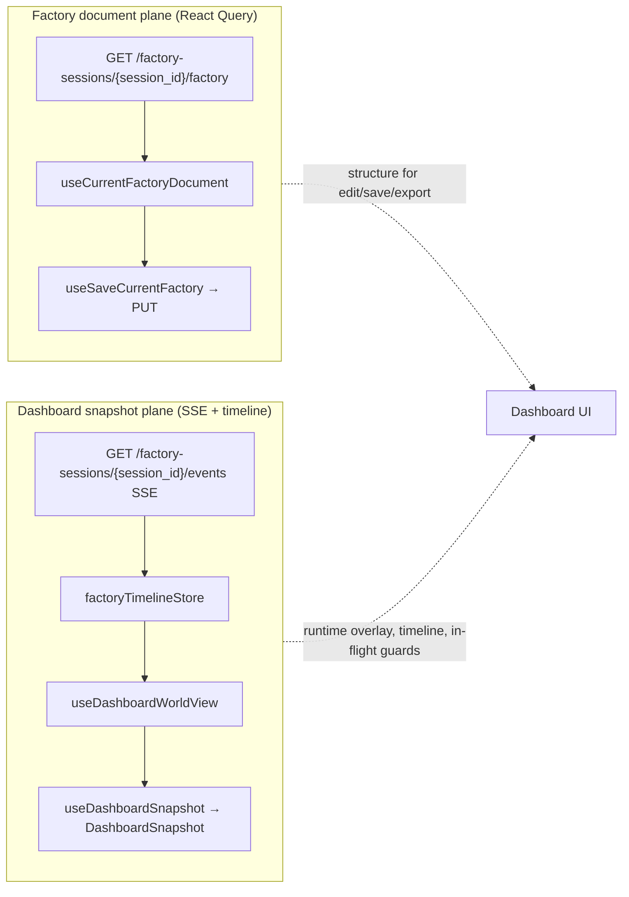

# Agent Factory Development Guide

This guide is the contributor guide for the Agent Factory checkout rooted at this repository root. Read it before changing runtime behavior, dashboard assets, workflow fixtures, or maintainer documentation, then use the local [docs index](../README.md) and [standards index](../standards/STANDARDS.md) for the current shared guidance.

## Purpose

`agent-factory` is the Coloured Petri Net workflow engine for orchestrating AI agent and script work. It owns runtime scheduling, worker dispatch, failure and retry behavior, replay, the HTTP API, and the embedded dashboard shell.

## Repository Root Contract

This checkout is operated from the repository root that contains `go.mod`, `Makefile`, `api/`, `cmd/`, `docs/`, `factory/`, `pkg/`, `tests/`, and `ui/`. Do not translate the commands in this guide into a legacy `libraries/agent-factory` subdirectory workflow; the maintained execution surface in this repo is the checkout root itself.

## Local Architecture

- `cmd/factory/` is the CLI binary entrypoint.
- `api/` contains the authored OpenAPI sources, bundling configuration, and published contract artifact used by generation and smoke checks.
- `factory/` contains the checked-in operator workflow surfaces, including starter guidance, workstation prompts, and the live idea or batch inbox directories under `factory/inputs/`.
- `pkg/transports/cli/` temporarily owns Cobra root routing and the MCP command adapter;
  command-specific adapters, shared server/startup helpers, and CLI dashboard
  read models live under `pkg/transports/cli/`.
- `pkg/factory/` owns runtime engine behavior, scheduling, markings, transitions, resources, and engine state snapshots.
- `pkg/services/` defines transport-independent service contracts and
  implementations; `pkg/wire/` is the sole composition root for the complete
  inert customer process graph.
- `pkg/transports/http/` serves runtime HTTP endpoints and the embedded dashboard shell.
- `pkg/workers/` owns worker execution contracts, provider calls, script command execution, and work-scoped metadata.
- `pkg/platform/replay/` owns policy-free replay artifact filesystem mechanics; `pkg/factory/replay/` owns Factory-event artifact construction, side-effect matching, and deterministic replay behavior.
- `ui/` is the Vite dashboard source. `ui/dist/` is generated local build output, and `make ui-build` refreshes the ignored embed registration that wires those assets into Go builds.
- `tests/functional_test/` contains workflow fixtures and smoke coverage.

## Development Commands

Run commands from the repository root shown above.

Fresh checkouts should run `make init` once to install Bun dependencies for the dashboard (`ui/`) and the scoped components package (`ui/packages/components/`). The target requires Bun on `PATH`, stops on the first failed install, and does not require changing directories manually.

```bash
make init
make build
make generate-api
make api-smoke
make verify-fast
make verify-pr
make verify-extended
make test
make test-unit
make test-functional
make test-stress
make test-release
make test-full
make typecheck
make verify-build
make verify-lint
make verify-api
make verify-build-contracts
make verify-tests
make verify
make release-surface-smoke
make lint
make backend-size
make backend-dependency-graph
make pkg-maint
make ui-deadcode
make script-timeout-companion-smoke-100
make current-factory-watcher-switch-smoke
make packaged-factory-catalog-check
make packaged-factory-package-script-test
make packaged-factory-package-pack-check
make packaged-factory-package-candidate-dry-run
make packaged-factory-package-consumer-smoke
make fmt
make dashboard-verify
make release VERSION=v1.2.3
make ui-deps
make ui-verify-fresh-npm-install
make ui-build
make ui-test
make ui-integration-test
make ui-storybook
make ui-test-storybook
```

`make backend-dependency-graph` writes the direct production-import graph for
repository packages under `cmd/` and `pkg/` to
`.artifacts/backend-dependency-graph/backend-dependency-graph.dot`. When
Graphviz's `dot` command is available, the target also renders a sibling SVG.
Standard-library, third-party, `internal/`, and test-only packages are omitted so
the graph stays focused on the requested backend package boundaries.

## Dashboard UI test runners

Run dashboard package commands from `ui/` with Bun 1.3.12+ on PATH. Root `make` targets wrap the same lanes for CI and local reruns.

| Goal | Canonical command | Runner |
| --- | --- | --- |
| Bun-native unit tests (Node) | `cd ui && bun run test:unit:bun` | Discovers `.bun.unit.test.ts` files and runs them with Bun's native test API; DOM-free and browser-free, disjoint from component, browser, performance, and Storybook conventions |
| Aggregate unit tests (Bun + Vitest) | `cd ui && bun run test:unit` or `make ui-test` | Runs the Bun-native suffix lane first, then the optimized Vitest `dashboard-unit` project for ordinary `.test.ts` and supported `.unit.test.mts` files; stops on either failure |
| Component tests (jsdom) | `cd ui && bun run test:component` | Named Vitest `dashboard-component` project |
| Coverage thresholds and replay fixture guard | `make test-ui-coverage` | Vitest Node coverage plus the Bun-owned unit LCOV merged once into the coverage report, then replay check |
| Playwright integration | `cd ui && bun run test:integration` or `make ui-integration-test` | Vitest + Playwright |
| Unit, component, then integration | `cd ui && bun run test` | Fail-fast orchestration of aggregate units, component tests, and browser integration |
| Fresh npm install proof for scoped local components | `make ui-verify-fresh-npm-install` or `cd ui && npm run verify:fresh-npm-install` | Node script runs an isolated dashboard `npm install` and asserts `@you-agent-factory/components` resolves from `packages/components` |
| Storybook browser integration | `make ui-storybook-integration-test` | Storybook static build plus focused responsive browser checks |

Prefer `bun run test:unit` (or `make ui-test`) for dashboard unit work so both
unit owners, the Node-only exclusions, and the measured Vitest worker policy
stay aligned with CI. Use `bun run test:unit:bun` when proving one migrated
`.bun.unit.test.ts` file, and `bun run test:component` when the contract renders
React or needs DOM APIs. Targeted proof may pass paths to Vitest with the
matching lane config.

## GitHub Actions CI Baseline

The repository CI workflow lives at `.github/workflows/ci.yml`. It runs automatically on pull requests and branch pushes and is intentionally limited to validation only. This first-pass workflow does not package or deploy releases.

`.github/workflows/long-local-inference.yml` owns the Linux managed-runtime and real-inference regression. CI invokes it only when the classifier selects the Local Inference lane; it remains independently runnable after merge, on its daily `06:00 UTC` schedule, and through `workflow_dispatch`. Use it when a change affects managed local inference runtime setup, model download/cache behavior, or real local inference behavior.

The maintainer-owned CLI release policy lives in [CLI release policy](cli-release-policy.md). Keep future release automation aligned with that guide: release publication should come from manual semver tags on `main`, not from developer-machine publishing or manually created GitHub Release events.

The workflow schedules only the ownership-selected lanes. Frontend coverage,
mocked browser integration, and Storybook integration are separate jobs, as are backend verification, focused
real-backend browser verification, API package verification, the two other
package-family checks, documentation checks, and local inference. `make
verify-pr` remains the intentionally broad local aggregate, while a CI lane
uses the direct command shown in the ownership table below.

Use `make test-ui-coverage`, `make test-ui-browser-integration`, and `make
test-ui-storybook-integration` to reproduce the frontend jobs. Use `make test-backend-verification` and `make
ui-durable-session-real-backend-integration-test` for backend-owned changes.
The browser jobs install Chromium in their own setup.

Use the same root-level commands locally when reproducing a GitHub Actions failure. The workflow installs Go from `go.mod` and pins Bun to `1.3.12` in `.github/workflows/ci.yml`; keep that version aligned with the checked-in `ui/package.json` `packageManager` pin when either file changes.

Use these canonical verification tiers on the root command surface before reaching for the lower-level lane names:

- `make verify-fast` for the fastest safe author pass: dashboard typecheck, the jsdom-oriented UI unit lane, and the short Go suite. The tier prints the owned suite label before each step and, on failure, emits the exact `make <target>` rerun command for that step.
- `make verify-pr` for the pull-request-equivalent local pass: `make verify-build-contracts` plus the required CI test lanes. Like `make verify-fast`, it prints the owned aggregate or lane label before each nested step and reports the exact `make <target>` rerun command when one of those owned steps fails.
- `make verify-extended` for opt-in deeper coverage after the PR-equivalent pass: `make verify-pr` plus `make long-tests`. Like the other contributor-facing tiers, it labels the owned step before each nested `make` call and emits the exact rerun target if one of the opt-in long lanes fails.

The older aggregate names remain available as compatibility aliases while docs, workflows, and active review branches converge on the clearer tiered surface. In particular, `make verify` still works, but it now points contributors at `make verify-pr` as the canonical pull-request rerun command.

Treat the matrix below as the canonical suite-ownership and rerun guide for the tiered test surface:

The focused Go suite commands are `make test-unit`, `make test-maintenance`,
`make test-integration`, `make test-contract`, `make test-functional`, `make
test-stress`, and `make test-release`. The unit command enumerates only
`./pkg/...`, then uses the shared `internal/testlanes` policy to exclude
specialized packages. Code under `cmd/`, `internal/`, `tests/`, root
`contracts/`, and the Go UI embed package is intentionally outside unit
discovery. `make test-lane-audit` verifies that every required Go test package
has one primary owner. Unit package concurrency defaults to 32 and remains
overridable with `UNIT_DEFAULT_JOBS`. The fast unit lane schedules only packages
that contain Go tests and disables `go test`'s duplicate implicit vet pass;
`make lint` and the required PR verification tier continue to run `go vet ./...`.
The normal `make test` loop retains Go's content-addressed test cache, so
unchanged packages do not relink and rerun on every local invocation. Use
`make test-unit-fresh` when uncached `-count=1` evidence is explicitly needed.
`make test` is the compatibility entrypoint for `make test-unit`; `make
test-full` remains the broad unshortened aggregate across every Go package.

| Surface | Runs | Intentionally excludes | Failure rerun path |
| --- | --- | --- | --- |
| `make verify-fast` | `make typecheck`, `make ui-test`, `make test` | `make test-ui-coverage`, `make ui-integration-test`, `make test-backend-verification`, `make long-tests` | rerun the failing owned step directly: `make typecheck`, `make ui-test`, or `make test` |
| `make verify-pr` | `make verify-build-contracts` once, then `make verify-tests` once | `make long-tests`, `make test-functional-long`, managed-runtime specialty coverage | rerun `make verify-pr` for the full required envelope, or rerun the failing owned lane called out in output |
| `make verify-extended` | `make verify-pr`, then `make long-tests` | no extra hidden suites beyond the named long and specialty lanes | rerun `make verify-extended` for the whole opt-in pass, or rerun the failing owned long lane called out in output |
| `make verify-tests` | `make test-maintenance`, `make test-integration`, `make test-contract`, `make release-surface-smoke`, `make test-root-process-acceptance`, concurrent UI coverage/browser integration, then independent backend unit and functional coverage | compatibility aliases that would repeat the same confidence outcome | rerun the exact failing required lane printed in output |
| `make long-tests` | `make test-ui-performance`, `make long-tests-managed-runtime`, `make long-tests-functional-runtime` | short-path fast and PR-tier suites, unless you intentionally rerun them through `make verify-pr` first | rerun the exact failing specialty lane printed in output |

Compatibility aliases that still remain on the root command surface:

| Compatibility alias | Canonical command to prefer | Why the alias still exists |
| --- | --- | --- |
| `make verify` | `make verify-pr` | Keeps existing docs, workflow references, and active review branches working while the canonical PR-tier name rolls out. |
| `make test-ui-browser-integration` | `make ui-integration-test` | Preserves the older lane-shaped name while the browser-backed dashboard lane keeps the simpler direct test-owner target. |
| `make test-backend-coverage` | `make test-unit-coverage` | Preserves the older backend wording while keeping the unit profile independent. |
| `make test-backend-functional` | `make test-functional-coverage` | Preserves the older backend-functional wording while keeping the functional profile independent. |

The pull-request workflow restores the supported built-in Go module and build cache through `actions/setup-go` keyed by `go.sum`, and restores Bun's global package cache from `~/.bun/install/cache` keyed by the hosted-runner OS, the pinned `BUN_VERSION`, and `ui/bun.lock`. Keep those invalidation inputs aligned with the real dependency surfaces instead of introducing static cache keys. The workflow intentionally does not cache Playwright browser binaries in the PR lanes because Playwright's CI guidance says restore cost is usually comparable to a fresh download on hosted runners; if that assumption changes, document the measured reason before adding a browser cache layer.

The `UI Browser Integration` lane intentionally does not reuse a prebuilt `ui/dist` artifact from the `Build` lane. The owned browser harness in `ui/integration/event-stream-replay.integration.test.mjs` rebuilds the dashboard with a lane-scoped `VITE_AGENT_FACTORY_API_ORIGIN` and then starts its own `vite preview` server inside `beforeAll`, so downloading an upstream artifact would add upload/download coupling without removing the lane's own build-and-preview responsibility or making independent retries easier to reason about.

Use `make dashboard-verify` for dashboard review readiness after UI source changes that affect embedded assets. It runs `ui-build`, `lint`, and the short Go test suite sequentially so Vite asset rotation does not race with Go embed scanning.

`make typecheck` is the root-level dashboard typecheck command and should stay aligned with the CI `bun run tsc` step.

`make backend-size` is the direct maintainer command for the repo-owned backend size gate. It runs `go run ./cmd/backendsizecheck` and fails when maintained backend Go files exceed 1000 lines or maintained backend Go functions exceed 100 lines under the scanner's explicit owned-source rules. When a legacy oversized surface must stay intact temporarily, use an inline `backendsizecheck:ignore-file` or `backendsizecheck:ignore-function` comment with a concrete justification at the owning file or function instead of adding shell-only allowlists. Register the exact rule and reported file or `file#Function` target in the sorted `docs/internal/baselines/backend-exemption-budget.json`, including a non-empty accountable `owner` and an actionable `removalReason`; the command rejects an unregistered directive or incomplete entry. Production validation defines an actionable removal reason as at least 20 characters that names a concrete removal action such as split, extract, refactor, replace, reduce, move, migrate, simplify, remove, or delete.

`make pkg-maint` is the stable maintainer and reviewer command path for the handwritten `pkg/` maintainability lane. It runs `go run ./cmd/pkgmaintcheck -root .`, scans only owned `pkg/` Go source, excludes generated artifacts and `testdata` through the same repo-owned path rules as the backend size gate, and reports `file-lines`, `function-lines`, and `cyclomatic-complexity` violations with actual values and configured limits. The current thresholds are 1000 file lines, 100 function lines, and cyclomatic complexity 15. Use rule-scoped inline directives only when a later maintainability story needs a narrow exception tied to a concrete runtime, boundary, or generated-artifact constraint: `pkgmaintcheck:ignore-file-lines`, `pkgmaintcheck:ignore-function-lines`, or `pkgmaintcheck:ignore-cyclomatic-complexity`, each paired with a reviewer-readable justification comment and a matching accountable entry in `docs/internal/baselines/backend-exemption-budget.json`.

Burn down an exemption by removing both the inline directive and its matching `docs/internal/baselines/backend-exemption-budget.json` entry in the same change, then run `make backend-size` and `make pkg-maint`. Removing only the directive leaves a stale entry and fails the applicable command; removing both lowers the checked baseline without requiring cleanup of unrelated exemptions. The exemption budget covers only these size and complexity directives. Root package-family and migration-shim policy remains exclusively owned by `make pkg-boundary`.

`make lint` runs the UI Biome lint, the UI Knip dead-code baseline gate, `go vet ./...`, `make backend-size`, `make pkg-maint`, and the pinned Go deadcode analyzer. The frontend deadcode step writes a normalized current report to `bin/frontend-deadcode-current.json` and compares it with `docs/internal/baselines/frontend-deadcode-baseline.json`. The backend deadcode step writes a normalized current report to `bin/deadcode-current.txt` and compares it with `docs/internal/baselines/deadcode-baseline.txt`. Review any drift before updating either baseline.

Treat the `ui/` Biome excessive-lines rules as a maintainability boundary for handwritten frontend code, not as a prompt to add new suppressions. Generated API artifacts under `ui/src/api/generated/` may keep generated-code-specific exceptions, but handwritten app code, tests, stories, and fixtures should stay under the standard limits by decomposing the surface into smaller feature components, story modules, shared fixtures, or named test helpers. Review-ready proof for that decomposition is the normal `make typecheck`, `make lint`, and behavior-specific test or Storybook evidence for the touched surface, not a separate source-inventory audit.

`make verify-build-contracts` is the repository-owned aggregate for local full build-contract verification. It runs `make typecheck`, then `make verify-build`, `make verify-lint`, and `make verify-api`. CI runs those three focused commands in independent `Build`, `Lint`, and `API` jobs after each job's own setup.

`make verify-tests` is the repository-owned local aggregate for the required test lanes. It starts with maintenance (including the lane audit), integration, and contract evidence before release and root-process acceptance, concurrent UI coverage/browser integration, and backend unit and functional coverage. CI uses the ownership-selected `Frontend`, `Frontend Coverage`, `Frontend Browser`, and `Backend` jobs. `make test-ui-coverage` is the single local and CI covered-dashboard command.

`make test-root-process-acceptance` is the focused rerun command for the hermetic root-process S24 acceptance package under `tests/functional/acceptance`. Each command invocation constructs an independent `root.BuildProcess`; the lane does not build a CLI executable. It runs the full behavioral acceptance corpus (including named-goal, stream, subagent, and local-model scenarios that skip under `-short`) and fails with scenario subtest names such as `s24-subagent` when the scenario matrix drifts from its documented customer-outcome mapping in `internal/builtcliacceptance/scenarios.go`.

Every pull request begins with `Classify Verification`. The classifier is an additive ownership table: a mixed change runs the union of selected lanes rather than one exclusive bucket. `factory/**` is neutral, so factory-only changes select no product verification. `.github/workflows/**`, `scripts/ci/**`, `Makefile`, `go.mod`, `go.sum`, empty diffs, and unknown paths select every lane conservatively.

| Changed surface | Selected CI lanes | Direct local rerun |
| --- | --- | --- |
| `docs/reference/**`, `docs/README.md` | Docs Reference | `make docs-reference-smoke` |
| `README.md` | README | `make readme-check` |
| `factory/**` only or other internal docs | None | None |
| `ui/**` | Frontend and Frontend Browser | `make typecheck ui-lint test-ui-coverage`; `make test-ui-browser-integration` |
| `cmd/**`, `pkg/**`, `internal/**`, `tests/**` | Backend and UI Backend Integration | `make build test-backend-verification`; `make ui-durable-session-real-backend-integration-test` |
| API contracts, HTTP transport/mapping, generated API output | Frontend, Frontend Browser, Backend, UI Backend Integration, API Package | the corresponding commands above plus `make api-package-verify` |
| `packages/api/**` or API package scripts | API Package, Frontend, Frontend Browser, Backend, UI Backend Integration | `make api-package-verify` and the corresponding commands above |
| Packaged Factories package | Packaged Factories Package and Backend | `make packaged-factory-package-verify`; `make build test-backend-verification` |
| Model Providers package | Model Providers Package and Backend | `make model-provider-package-verify`; `make build test-backend-verification` |
| Local inference ownership | Backend and Local Inference | `make build test-backend-verification`; `make verify-pr-inference` |

`Verification Policy` is the stable required check. It validates selected results and publishes touched areas, selected and skipped lanes, reasons, and local rerun commands. Lane conditions are applied to jobs, so unselected work does not allocate a hosted runner. Development Package applies the same package ownership to validation and pull-request candidate artifacts; protected `main` still prepares every artifact needed by publication.

The next table describes focused local verification targets. CI execution is the
ownership table above; coverage runs as one job rather than a shard matrix.

| CI lane | Owned checks | Local rerun command | Why this lane stays separate |
| --- | --- | --- | --- |
| `Frontend` | dashboard typecheck, lint, and covered unit verification | `make typecheck ui-lint test-ui-coverage` | Keeps frontend-only behavior separate from browser and backend ownership. |
| `Frontend Browser` | explicit mocked/static browser inventory with test-scoped API and browser isolation | `make ui-integration-test` | Keeps mocked real-browser workflows independent from Storybook and the Go-backed UI lane. |
| `Frontend Storybook` | Storybook static build and focused responsive browser checks | `make ui-storybook-integration-test` | Runs in parallel with the mocked browser and UI backend lanes instead of extending their critical path. |
| `UI Backend Integration` | durable-session browser scenarios against the real Go browser API harness | `make ui-durable-session-real-backend-integration-test` | Owns Go setup and real-backend behavior outside the mocked browser lane. |
| `Backend Verification` | `make test-unit-coverage` and `make functional-test-viz` run sequentially in the Backend job. | `make test-backend-verification` | Keeps the direct local aggregate aligned with the selected Backend lane. |
| `Backend Unit Coverage` | `cmd/gocoveragecheck` executes tests from `./cmd/factory` and maintained backend `./pkg/...` packages while measuring backend-owned code. | `make test-unit-coverage` | Keeps package-level coverage and per-package gates independent from system-level functional coverage. |
| `Backend Functional Coverage` | `make functional-test-viz`: `functional-boundary-check`, then one `cmd/gocoveragecheck` functional coverage run (profile + JSON), then the Markdown catalog generator. | `make functional-test-viz` | Shows the internal-system coverage contributed by functional flows without unit, stress, or release tests affecting the profile, and uploads the inventory-plus-coverage artifact set. Boundary regressions cannot pass this lane on coverage alone. Coverage-only local reruns remain `make test-functional-coverage`. |
| `Local Inference` | one Linux managed-runtime and real-inference regression through `make verify-pr-inference` after OMNIVOICE runtime and managed-model cache provisioning | `make verify-pr-inference` | Runs only when the Local Inference ownership lane is selected; narrow regression rerun: `make pr-inference-approval`. |

UI Coverage orchestration is owned by `ui/scripts/ui-coverage-runner.mjs` behind
`ui/package.json`'s `test:coverage` script. Its covered phase explicitly selects
`vitest.lanes.config.ts` and `dashboard-unit`, so no jsdom, component, browser,
or performance test can enter through a broad default glob. The selected Frontend
CI job runs `make test-ui-coverage` once. Coverage thresholds are enforced by
that monolithic pass without shard artifacts or a report-merge job. The separate Frontend Browser job owns
browser-backed integration, and the standalone dashboard-shell script remains an
uncovered structural check.

Focused workflow-activity current activity card verification after split coverage changes: `cd ui && bun x vitest run src/features/workflow-activity/components/current-activity-card/react-flow-current-activity-card-editor-chrome.test.tsx src/features/workflow-activity/components/current-activity-card/react-flow-current-activity-card-import-flows.test.tsx src/features/workflow-activity/components/current-activity-card/react-flow-current-activity-card-graph-semantics.test.tsx src/features/workflow-activity/components/current-activity-card/react-flow-current-activity-card-layout.test.tsx src/features/workflow-activity/components/current-activity-card/react-flow-current-activity-card-topology-localization.test.tsx`. Broader dashboard jsdom regressions remain `make ui-test`; full covered UI verification remains `make ui-test` or `make test-ui-coverage` as appropriate for the touched surface.

The UI Coverage contract also includes the replay coverage check. Keep browser-backed integration tests under `ui/integration/*.integration.test.mjs` out of the Node unit-coverage corpus and exclude `integration/**` harness sources from `ui/vite.config.ts` coverage thresholds (the browser lane owns that code), keep the standalone script-style dashboard shell responsive test outside the main covered worker pool, and preserve the stable `[ui-coverage]` phase labels (`Main covered Vitest pass`, `Standalone script-style test`, and replay check) so benchmark comparisons can use the same names across runs. See [UI coverage speed closeout](ui-coverage-speed-closeout.md) for timing history.

Covered UI and browser integration lanes emit stable slow-file summaries through `ui/scripts/ui-test-cost-report.mjs`. The monolithic unit-coverage pass prints `[ui-coverage] Main covered pass slowest test files` after enforcing aggregate thresholds. Browser integration uses `ui/scripts/ui-integration-runner.mjs` behind `test:integration` and prints `[ui-browser-integration] Browser integration slowest test files` with per-file cost categories (`app-shell-integration`, `react-flow-graph`, `replay-timeline`, `import-export`, `script-style`, `uncategorized`). Copy those lines into closeout notes to compare runs without scraping source topology.

Backend coverage is intentionally split. `make test-unit-coverage` discovers only `./cmd/factory` and maintained backend `./pkg/...` test packages and enforces both the aggregate unit floor and `go-unit-coverage-package-minimums.json`. `make test-functional-coverage` runs `functional-boundary-check` first, then discovers only maintained short packages under `tests/functional/...`, excludes `tests/functional/internal/...`, and enforces both the aggregate functional floor and `go-functional-coverage-package-minimums.json` over the same backend-owned code. Packages not exercised by a functional test are reported at `0.0%`; their unit-test coverage is never substituted. Ordinary low coverage is represented by the lane manifest's numeric current floor, so the required lanes no longer depend on newline-delimited package exception lists or a shared 80% package target. `make test-backend-coverage` and `make test-backend-functional` remain focused aliases for the unit and functional lanes respectively; `make test-backend-verification` is an aggregate compatibility target that runs both blocking reports in sequence. Stress, root-process release acceptance, release-surface smoke, and tagged long tests remain outside both coverage profiles.

The deterministic current package floors are recorded in
`go-unit-coverage-package-minimums.json` and
`go-functional-coverage-package-minimums.json`. Each manifest uses schema
version `1`, names its `unit` or `functional` lane, and contains an import-path-
sorted `packages` array. A measured entry has exactly `package` and a numeric
`minimum` written with two decimal places. A package with no measurable
statements uses `exception` instead of `minimum`; the exception must identify a
`measurement` or `migration` defect and include `justification`, `owner`, a
`deadline` in `YYYY-MM-DD` form, and an objective `removalGate`. Ordinary low
coverage is represented by a numeric floor, not an exception.

Bootstrap a new lane manifest from the lane's integer statement counts with
`go run ./cmd/gocoveragecheck -suite <unit|functional> -min 0 -generate-manifest <new-file>`. Generation is create-only: it refuses to overwrite reviewed policy.

Enforce a reviewed lane manifest with
`go run ./cmd/gocoveragecheck -suite <unit|functional> -package-manifest <manifest-file>`.
The check fails closed when a measured package is missing, an exception is
expired, or the exact integer statement ratio is below its package floor.
Regression diagnostics include the lane, package, expected minimum, actual
coverage, signed delta, and the monotonic update command for ratcheting the
reviewed manifest after coverage is restored. Aggregate `-min` enforcement
remains independent and blocking.
The renderer sorts entries and truncates each exact ratio downward to two
decimal percentage points, so identical profiles produce identical bytes and a
generated floor never exceeds its measurement. Ratchet an existing reviewed
manifest explicitly with
`go run ./cmd/gocoveragecheck -suite <unit|functional> -min 0 -update-manifest <manifest-file>`.
The command reports every package as `added`, `raised`, `unchanged`, or
`rejected` in import-path order. Any rejected decrease prevents the entire
write; repeating the command without an added package or qualifying increase
leaves the manifest byte-for-byte unchanged.

The browser-backed lane remains self-building for the same reason: `make ui-integration-test` delegates into the shared browser harness that runs `bun run build` with a test-owned API origin and serves that exact build with `vite preview`. Treat that build plus preview startup as part of the lane's owned runtime contract instead of uploading `ui/dist` from another job.

When a required lane fails, GitHub Actions keeps the lane-owned failure evidence for 14 days and names it explicitly in the lane summary:

| CI lane | Failure artifact name | Retained evidence |
| --- | --- | --- |
| `UI Browser Integration` | `ui-browser-integration-failure-artifacts` | lane `command.log` plus the shared harness browser evidence: Playwright trace, final screenshot, page HTML snapshot, and diagnostics JSON |
| `Backend Unit Coverage` | `backend-unit-coverage-report` | independent `coverage.out`, function-level `coverage.txt`, and unit lane `command.log` |
| `Backend Functional Coverage` | `backend-functional-coverage-report` | `functional-tests.md`, `coverage-summary.json`, `coverage.out`, function-level `coverage.txt` when the profile exists, and functional lane `command.log` (uploaded on success and failure when present) |
| `PR Inference Approval` | `pr-inference-approval-failure-artifacts` | lane `command.log` under `.artifacts/pr-inference-approval/` plus `runtime-setup.log` with platform, backend path, and cache path |

Backend verification failure summaries are rendered by `go run ./cmd/backendverificationsummary -log .artifacts/backend-verification/command.log`. Keep that helper covered with `go test ./cmd/backendverificationsummary`, and keep the summary output focused on the first actionable failure block before falling back to a bounded command-log excerpt.

### Local Inference

The `Local Inference` lane is selected only for local-inference ownership or conservative full verification. It is not folded into Backend Verification. The reusable workflow runs Linux managed-runtime and real-inference coverage once.

**Local rerun commands**

- `make verify-pr-inference` — canonical PR-gated inference approval lane. Prints prerequisite guidance, then runs the single merge-blocking regression.
- `make pr-inference-approval` — narrow rerun for only the named regression without the wrapper messaging.

**Named regression and observable contract**

The PR lane runs `TestRealLocalInference_OMNIVOICEModelInvokeAndDirectAPIProduceAudio` in `tests/functional/runtime_api` (built with the `functionallong` tag). On a healthy branch it proves end-to-end OMNIVOICE local inference:

- `POST /models/OMNIVOICE_Q4_K_M/pull` succeeds with model identity, cache path, revision, and downloaded files.
- Direct `POST /models/OMNIVOICE_Q4_K_M/invocations` returns local TTS metadata and a valid `audio/wav` file output.
- Streamed invocation returns `audio/wav` bytes.
- Factory `MODEL_INVOKE` through submitted work reaches `speech:complete` and emits recorded audio in factory events.

The `functionallong` compile surface for `tests/functional/runtime_api` is still exercised when `pr-inference-approval` compiles the package with `-tags=functionallong` before running the OMNIVOICE regression.

**Environment and runtime prerequisites**

| Input | Required | Purpose |
| --- | --- | --- |
| `INFINITE_YOU_RUN_OMNIVOICE_LONG_TESTS=1` | yes | Opt-in gate for real OMNIVOICE long inference tests |
| `omnivoice-llamacpp` on `PATH` or `INFINITE_YOU_OMNIVOICE_COMMAND` | yes | Local OMNIVOICE runtime executable |
| `INFINITE_YOU_OMNIVOICE_CACHE_DIR` | optional | Reuse managed model cache; omit to use a temp cache locally |

CI provisions Linux `omnivoice-llamacpp` through `scripts/ci/install-omnivoice-command.sh`, sets `INFINITE_YOU_OMNIVOICE_COMMAND` to the installed binary, and caches `.cache/managed-models` plus `.cache/omnivoice-command` under a PR-lane-specific cache key.

**Why this lane is selected**

Inference-specific code can regress in ways the short Backend Verification corpus does not exercise: compile failures in `functionallong` tests, broken model pull or invocation routes, or factory-level `MODEL_INVOKE` wiring. The PR lane catches that class with one stable long regression before merge. It intentionally runs only the single sentinel test rather than the full specialty sweep so required PR feedback stays bounded.

**How this differs from Long Local Inference**

| Surface | PR Inference Approval | Long Local Inference |
| --- | --- | --- |
| Workflow | required job in `.github/workflows/ci.yml` | separate `.github/workflows/long-local-inference.yml` |
| Trigger | every pull request and main push | post-merge push to `main`, daily schedule, manual dispatch |
| Platforms | Linux only | Linux, macOS, and Windows matrix |
| Command | `make verify-pr-inference` | `make long-tests` (managed runtime + functional runtime aggregate) |
| Scope | one named OMNIVOICE regression | broader opt-in specialty sweep |

Treat `Long Local Inference` as the maintainer-owned follow-up lane for deeper multi-platform coverage rather than as a substitute for merge-blocking PR inference approval. In GitHub Actions, its run names distinguish `post-merge verification`, `scheduled verification`, and `manual verification` so maintainers can tell why it ran from the workflow list. Reach for it after merging runtime-sensitive local-model changes, before a risky runtime release, or when you need cross-platform OMNIVOICE confirmation outside the narrower PR lane.

**Failure surfaces and diagnostics**

Distinguish setup failures from inference behavior failures when triaging a red `PR Inference Approval` job:

| Failure class | Typical symptoms | Where to look |
| --- | --- | --- |
| Runtime setup | `platform or backend failure`, install script errors, missing `INFINITE_YOU_OMNIVOICE_COMMAND` | job step `Install OMNIVOICE runtime`, `.artifacts/pr-inference-approval/runtime-setup.log`, failure-step cache listing |
| Compile or test wiring | `go test` compile errors before OMNIVOICE runs, duplicate helper symbols in `runtime_api` | `command.log` head; locally run `go test -tags=functionallong ./tests/functional/runtime_api -run '^$' -count=0` |
| Inference behavior | `asset pull failure`, `invocation failure`, `output validation failure`, factory wait timeouts | `command.log` test output; rerun `make pr-inference-approval` with the same env |

Lane summaries name `PR Inference Approval` explicitly and point to `make verify-pr-inference` and `make pr-inference-approval` on failure. Download `pr-inference-approval-failure-artifacts` for the retained `command.log` and `runtime-setup.log`.

Use the lane-specific targets below when you need to rerun one required CI lane locally without replaying the full suite:

- `make test-ui-coverage` for the jsdom-oriented dashboard coverage lane.
- `make ui-integration-test` for the browser-backed dashboard integration lane.
- `make test-unit-coverage` for backend package-test coverage.
- `make test-functional-coverage` for independent maintained short functional-test coverage.
- `make functional-test-viz` for the inventory-plus-coverage catalog: runs `functional-boundary-check`, executes the short functional coverage lane once with profile and `gocoveragecheck -json-output` under `.artifacts/functional-test-viz/` by default, then renders `functional-tests.md` via `cmd/functionaltestviz`. Required CI Backend Functional Coverage runs this target with `FUNCTIONAL_TEST_VIZ_DIR=.artifacts/backend-functional-coverage` and uploads `functional-tests.md`, `coverage-summary.json`, `coverage.out`, and `command.log` on success and failure when present. Boundary, suite, coverage-floor, metadata, or rendering failures exit non-zero; already-written diagnostics under the artifact root are left in place for inspection.
- `make verify-pr-inference` for the required PR inference approval lane (requires OMNIVOICE runtime prerequisites above).

`make verify-pr` is the canonical full review-ready local pass once dependencies and browser prerequisites are already installed. It does not install packages or browsers itself, so routine verification stays network-free after setup.

`make verify` remains as a compatibility alias for `make verify-pr` while existing references migrate.

## Website Copy Localization Guardrail

User-facing dashboard copy belongs in locale-aware message catalogs instead of inline React component text. When adding or changing visible UI text, validation messages, empty states, toast or dialog text, chart labels, accessible names, or other customer-facing metadata under `ui/src/`, put the message in the owning feature catalog under `ui/src/features/<feature>/messages/`. Shared primitive copy belongs under `ui/src/components/<shared>/messages/` only when the shared component owns the reusable wording. Keep IDs, enum values, API codes, CSS classes, and other structural values out of catalogs unless they are actually rendered as product copy.

Run the hardcoded-copy guard locally from the UI package:

```bash
cd ui && bun run check:localized-copy
```

The normal UI lint path also runs this guard through:

```bash
cd ui && bun run lint
```

The guard intentionally excludes tests, stories, generated API code, fixtures, developer-testing seams, and message-catalog files. Do not add product UI copy to `docs/internal/baselines/hardcoded-ui-copy-baseline.txt`; the baseline is expected to stay empty for product copy. If the scanner reports a literal that is truly not product UI copy, such as a structural node id, an API error code, a class recipe, or maintainer-only diagnostic text, document that exact literal with the inline marker `hardcoded-ui-copy-exception: non-product-diagnostic` near the source. Use that marker narrowly and never as a bypass for customer-facing copy.

Localization changes should include tests at the layer where users observe the message. Prefer assertions against rendered text, accessible names, formatted labels, emitted validation errors, or pure message helper output, and cover at least one non-default locale when the behavior depends on locale selection, fallback, or interpolation. Avoid testing the source inventory itself; the guard already owns scanner behavior.

Reviewers should block new product copy that bypasses message catalogs, concatenates translated fragments instead of authoring a complete localized message, omits tests for dynamic interpolation or fallback behavior, or skips browser evidence for visible UI changes. For browser-backed dashboard proof, use the maintained Storybook or integration-test lanes described in this guide and record the relevant command and scenario in the PR notes.

Treat the opt-in long and specialty commands as a separate maintainer tier rather than hidden follow-on work inside `make verify-fast` or `make verify-pr`:

- `make verify-pr-inference` is the required merge-blocking PR inference approval lane. It runs only the named OMNIVOICE regression and is separate from `make verify-pr`.
- `make verify-extended` is the canonical "everything above plus the deeper safety nets" pass. Use it after `make verify-pr` when a change may have touched managed-local runtime behavior or the real local inference path and you want one aggregate command that still preserves exact rerun hints.
- `make long-tests-managed-runtime` is the narrow specialty rerun for the managed-runtime lane in `pkg/models/local`. It protects the subprocess adapter and managed local model behavior without requiring the full end-to-end API flow.
- `make long-tests-functional-runtime` is the narrow specialty rerun for the real OMNIVOICE functional lane in `tests/functional/runtime_api`. It delegates to `make pr-inference-approval` so the PR regression and specialty functional lane share one test invocation without changing the broader `make long-tests` meaning.
- `make long-tests` is the explicit aggregate over those two opt-in specialty lanes. It prints the owned specialty lane before each nested step and reports the direct `make long-tests-...` rerun command on failure.

`make verify-pr-inference` is required in CI but intentionally excluded from `make verify-fast` and `make verify-pr` because it needs the OMNIVOICE runtime. The broader `make long-tests` aggregate remains opt-in for deeper specialty coverage beyond the single PR sentinel. Keep both distinctions explicit so contributors do not confuse merge-blocking PR inference approval with the broader Long Local Inference workflow.

When extending the workflow, change the repository-owned command surface before editing GitHub Actions orchestration. Add or adjust the relevant `make test-*` target first, keep the lane name aligned with the owned command, and document any cache, artifact, or deduplication decision here in the same change. Contributors should be able to answer "which lane owns this check?" and "what do I rerun locally?" from this section alone without reverse-engineering `.github/workflows/ci.yml`.

To reproduce the backend size gate directly, run:

```bash
make backend-size
```

To reproduce the backend dead-code gate directly, run:

```bash
make deadcode
```

To prove the gate fails on newly introduced unreachable Go code without keeping the seed in the worktree, run:

```bash
seed_file=pkg/deadcode_seed_for_review.go
trap 'rm -f "$seed_file"' EXIT
printf 'package pkg\n\nfunc seededUnusedBackendDeadCodeForReview() {}\n' > "$seed_file"
make deadcode
```

The seeded command should exit non-zero and point reviewers at `bin/deadcode-current.txt`; remove the seed file before continuing normal verification.

To reproduce the frontend dead-code gate directly, run:

```bash
make ui-deadcode
```

To prove the gate fails on newly introduced unused frontend code without keeping the seed in the worktree, run:

```bash
seed_file=ui/src/deadcode-seed-for-review.ts
trap 'rm -f "$seed_file"' EXIT
printf 'export function seededUnusedFrontendDeadCodeForReview() { return true; }\n' > "$seed_file"
make ui-deadcode
```

The seeded command should exit non-zero and point reviewers at `bin/frontend-deadcode-current.json`; remove the seed file before continuing normal verification.

To run the backend size gate and both dead-code gates through the normal integrated lint path, run:

```bash
make lint
```

`make release VERSION=v1.2.3` is the maintainer-owned release-preparation path. It must run from a clean `main` checkout, reruns the repository readiness targets, creates the semver tag locally, and pushes only the tag so GitHub Actions owns publication.


Use `make ui-storybook` followed by `make ui-test-storybook` when dashboard Storybook stories, play functions, runtime mocks, or the package-local Storybook runner change. `ui-storybook` builds `ui/storybook-static`; `ui-test-storybook` serves that static build on the dashboard-owned runner port and executes the dashboard Storybook interaction tests through the UI package's `test-storybook` script.

Use `make ui-integration-test` as the canonical browser-backed dashboard lane. It runs the real-browser scenarios under `ui/integration/` without pulling in the jsdom-focused `ui/src` suite, keeps replay coverage as one member of that lane rather than a one-off exception, and should stay deterministic by preferring checked-in fixtures plus the shared browser harness seams over operating-system-native dialogs or timing-sensitive interactions.

## API Contract Generation

The authored JSON API contract source is `api/openapi-main.yaml` plus referenced fragments under `api/components/schemas/`. Keep the public event envelope, event enums, and event payload fragments under `api/components/schemas/events/`; keep reusable domain objects under `api/components/schemas/data-models/`; keep HTTP-facing request, response, status, token, and pagination contracts under `api/components/schemas/api/`; keep compatibility dashboard read-model schemas under `api/components/schemas/factory-world/`; and keep small cross-surface helpers under `api/components/schemas/shared/`. The checked-in `api/openapi.yaml` remains the bundled published artifact consumed by code generation, tests, and downstream readers. This standardization pass preserves the existing runtime API behavior; future route removals, renamed fields, pagination redesigns, or response fields changes need separate PRD/story scope before editing handlers or generated contracts for that redesign.

From a clean checkout, use this workflow after editing `api/openapi-main.yaml` or a referenced fragment:

1. Validate the authored source tree from the repository root:

```bash
node scripts/run-quiet-api-command.js validate:main ./api/openapi-main.yaml
```

2. Rebundle the published contract from the authored source tree:

```bash
make bundle-api
```

This uses the repository-supported Redocly CLI from the root `api/` workspace and rewrites `api/openapi.yaml` from `api/openapi-main.yaml` without manual post-processing. The package-local targets intentionally keep the command surface rooted at the checkout so the same workflow works in standard clones and nested worktrees.

3. Regenerate the checked-in Go server interface, model types, and UI OpenAPI types from the bundled contract:

```bash
make generate-api
```

`make generate-api` rebundles `api/openapi.yaml`, then runs the server and
client directives from `pkg/transports/http/generate.go`. Those directives use
`api/codegen_config/server.yaml` and `api/codegen_config/client.yaml` to write
`pkg/transports/http/generated/server.gen.go` and
`pkg/transports/http/client/client.gen.go`, respectively. The target then runs
the dashboard UI OpenAPI generator to refresh
`ui/src/api/generated/openapi.ts`.

4. Prove regeneration is stable when the authored sources are unchanged:

```bash
make api-smoke
```

`make api-smoke` validates `api/openapi-main.yaml`, runs `make generate-api` twice from the split-source tree, verifies `api/openapi.yaml`, `pkg/transports/http/generated/server.gen.go`, `pkg/transports/http/client/client.gen.go`, and `ui/src/api/generated/openapi.ts` are clean with `git diff --exit-code`, runs the focused bundled event-contract completeness guard from `pkg/transports/http/openapi_contract_test.go`, and then runs the generated-contract live API smoke test across supported work, status, event, and generated-client current-factory surfaces without requiring live LLM provider credentials.

5. Run the focused API and package checks that cover the contract boundary:

```bash
go test ./pkg/transports/http -count=1
make test
make lint
```

Review any generated diff together with the authored OpenAPI change. Do not
hand-edit `api/openapi.yaml`,
`pkg/transports/http/generated/server.gen.go`,
`pkg/transports/http/client/client.gen.go`, or
`ui/src/api/generated/openapi.ts`; change `api/openapi-main.yaml` or a
referenced fragment, then regenerate.

## Factory CLI Wire Composition

`google/wire` composition lives in `pkg/wire`. `root.BuildProcess` calls the
single checked-in `wire.InjectBundle` injector to construct one complete,
inert process graph. HTTP, CLI, and MCP receive only the service interfaces
they consume; `pkg/initializer` activates the selected lifecycle. Tests use
the same root-built process and replace external systems through `edges.Edges`.

From a clean checkout, after editing `wire.go` or a provider:

1. Regenerate the checked-in injector:

```bash
go generate ./pkg/wire
```

2. Commit `wire_gen.go` with the provider changes. Do not hand-edit
   `wire_gen.go`.

3. Verify the factory binary and composition tests:

```bash
go build ./cmd/factory/...
go test ./cmd/factory/compose/... ./pkg/transports/cli/run/... -count=1
```

CI and `make verify-build-contracts` also run `make wire-smoke`, which
regenerates `wire_gen.go` and fails when the checked-in file is stale. Fix
drift with `go generate ./cmd/factory/compose/...` and commit the generated
file.

## Factory Sharing Contract

The canonical export/import sharing boundary is the generated OpenAPI
`Factory` payload returned by `GET /factory-sessions/{session_id}/factory`
and accepted by `POST /factories`. The active default runtime is addressed
through the default `session_id` route rather than a `~current` sentinel.
PNG export
and import reuse that exact payload through

Use [Named Factory API Contract Data Model](named-factory-api-contract-data-model.md)
as the detailed backend contract reference and
[UI Factory API Module Ownership](ui-factory-api-module-ownership.md) for
dashboard module boundaries (`session-factory`, `factory-definition`,
`current-factory-definition`). Keep the dashboard on the authored API boundary.
Do not rebuild sharing payloads from `/events`, runtime-only projections, or
export-only field aliases. Do not import deleted `ui/src/api/named-factory` from
feature code.

## Package-Specific Verification

1. Run `make test` for normal Go changes; the short suite skips stress tests.
2. Run `make test-full` when changing scheduler behavior, retry logic, stress-sensitive runtime code, or failure cascades.
3. Run `make release-surface-smoke` after changing release-facing README content, shipped docs/examples, checked-in starter content, or `agent-factory init` defaults. It is the canonical smoke path for proving Agent Factory still reads as a standalone library across those public surfaces.
4. Run `make script-timeout-companion-smoke-100` after changing script timeout, requeue, command-runner, or companion smoke behavior. The target runs `TestProviderCancellationTerminatesCompanionProcesses` 100 consecutive times through the real timeout/requeue/later-completion flow and fails on the first run that misses the direct timeout signal, retry dispatch, requeue mutation, or final completion.
5. Run `make current-factory-watcher-switch-smoke` after changing current-factory activation, watched-input listener ownership, or service-mode watcher handoff behavior. The target runs the focused named-factory smoke that proves watched input moves to the activated factory, the previous factory stops receiving watched work, and the handoff leaves only one completed dispatch for the new watched file.
6. Run `make dashboard-verify` after dashboard UI source changes or embedded asset changes.
7. Run `make ui-test` (Node unit lane) for focused dashboard UI behavior.
8. Run `make ui-integration-test` when changing browser-backed dashboard workflows, files under `ui/integration/`, shared browser harness seams, or fixture-driven session and graph-editor journeys that must be verified in Chromium.
9. Run `make ui-storybook` when Storybook fixtures, visual states, or dashboard component stories change.
10. Run `make ui-test-storybook` after `make ui-storybook` when Storybook play functions, dashboard Storybook runtime mocks, or browser-backed interaction behavior change.
11. Run replay-focused smoke tests when changing `pkg/platform/replay`, `pkg/factory/replay`, record/replay CLI flags, worker side-effect matching, or artifact promotion behavior.

## Frontend Testing Layers

Place new dashboard UI regressions at the shallowest layer that still observes the customer-visible contract. Prefer behavioral assertions on rendered text, accessible names, network bodies, and emitted events—not source inventories, route lists, or doc-link topology checks.

See [UI Test Lane Boundaries](ui-test-lane-boundaries.md) for observable contracts per lane, browser-integration durable-behavior guidance, minimum import/export and graph-editing browser contracts, and the redundancy policy applied when jsdom and browser suites overlap.

| Layer | Scope | Example path |
| --- | --- | --- |
| Unit | Pure helpers, fixtures, routing, projections, and state operations under Node | `ui/src/features/app-routing/lib/resolve-app-surface.unit.test.ts` |
| Component | One widget, hook, or named dashboard composition seam under jsdom with Testing Library | `ui/src/features/submit-work/components/submit-work-widget.test.tsx` |
| Dashboard composition component | Cross-owner session, replay, or trace wiring through `DashboardScreen`, without mounting `App.tsx` or unrelated routes | `ui/src/features/dashboard/components/dashboard-replay-wiring.component.test.tsx` |
| Browser integration (`ui/integration/`) | Real Chromium flows across session tabs, import/export, or replay fixtures | `ui/integration/factory-import-second-session.integration.test.mjs` |
| Storybook | Visual states, play functions, and dashboard runtime mocks on built `storybook-static` | `ui/src/features/bento/components/dashboard-bento-metrics-workflow-catalog.stories.tsx` |

### Dashboard composition vs card-level harnesses

Use **`renderApp(...)`** from `ui/src/testing/app-shell-test-utils.tsx` only when the regression needs `DashboardScreen` together: session tab bootstrap, event-stream wiring, timeline checkpoint lifecycle, or cross-card replay/trace projection. The helper deliberately does not mount `App.tsx`; route selection, packaged factories, and emulator code must not enter the dashboard component graph. Pass optional `sessionID` so `DashboardSessionTestProvider` pins `useDashboardSessionStore` without per-file store seeding.

Use **card-level `render(...)`** (or a feature-local test helper) when the behavior is owned by one card, hook, or graph surface and does not depend on shell routing. Combine focused renders with the shared harness modules below instead of duplicating inline `vi.fn()` fetch or mutation stubs.

| Concern | Harness module | Typical consumers |
| --- | --- | --- |
| Editable factory graph mocks and fixtures | `ui/src/testing/graph-editor-harness.ts` | `use-editable-factory-graph.test.tsx` and other graph-editor suites |
| Current activity card render/lifecycle helpers | `ui/src/features/workflow-activity/components/current-activity-card/test-support/react-flow-current-activity-card-component.harness.tsx` | split `react-flow-current-activity-card-*.test.tsx` suites under `current-activity-card/` |
| Session factory GET/PUT fetch doubles | `ui/src/testing/session-factory-mocks.ts` | Import/export feature component tests and `ui/src/api/session-factory/*.test.ts` |
| Dashboard session store pinning | `ui/src/testing/dashboard-session-test-provider.tsx` | `renderApp({ sessionID })`, `ui/.storybook/dashboard-story-runtime.tsx` |
| Bento catalog Storybook fixtures | `ui/src/features/bento/components/dashboard-bento-story-shared.tsx` | `dashboard-bento-*-catalog.stories.tsx` |
| Factory document save mutation states | `ui/src/testing/factory-document-save-mocks.ts` | `current-selection-widget.save.test.tsx`, worker save hook tests |
| Detail-card selection fixtures and time pins | `ui/src/features/current-selection/base/components/detail-card-test-helpers.tsx` | `work-item-card.test.tsx`, `workstation-detail-card.test.tsx` |

Harness modules under `ui/src/testing/` must import only types, fixtures, and test doubles—no production React components—and must not create import cycles with feature code.

For Storybook-only dashboard API mocking, keep fetch and session install logic in `ui/.storybook/dashboard-story-runtime.tsx` and prove session reset between story installs in `ui/.storybook/dashboard-story-runtime.test.ts`. After changing stories or runtime mocks, run `make ui-storybook` then `make ui-test-storybook` (or the targeted Storybook Vitest lane described under **Local Gotchas** when the full suite is blocked).

For jsdom coverage of app and component tests, use `make ui-test` or the `UI Coverage` lane (`make test-ui-coverage`) as appropriate for the touched surface.

### Cron Workstation Changes

Cron behavior crosses service tick production, Petri-net guards, dispatcher identity, event history, API read models, and dashboard projections. Keep [Workstation Kinds and Parameterized Fields](../reference/workstations.md#cron-kind) as the canonical authoring and migration guide instead of duplicating the full cron model in local notes.

`TestCronFiresAtInjectedTimeWithoutWallClockSleep` in `tests/functional/workstations/cron/clock_test.go` is the end-to-end integration smoke for the token-backed cron flow. It starts service mode, observes missing-input time work, verifies stale tick expiry and retry, submits the required input, proves normal worker dispatch/output, checks canonical cron metadata, and confirms normal API/dashboard projections hide internal time work by advancing a controllable external clock rather than wall-clock sleeps.

Use these focused checks before the broader package gates when changing cron behavior:

```bash
go test ./pkg/config ./pkg/work/timework ./pkg/services/automation/service ./pkg/factory/scheduler ./pkg/factory/subsystems ./pkg/factory/projections -count=1
make cron-time-work-smoke CRON_TIME_WORK_SMOKE_COUNT=1
make test-full GO_TEST_TIMEOUT=300s
```

Use the default `make cron-time-work-smoke` count when the change touches timing-sensitive cron scheduling, expiry, dispatcher, or projection behavior and needs repeated stability evidence.

Run `make ui-test` and `make ui-build` when dashboard or projection code changes. Run `make api-smoke` after editing `api/openapi-main.yaml`, any referenced OpenAPI fragment, or handler behavior.

## Functional Test Harness Guidance

Functional tests construct one reusable process with `root.BuildProcess`,
provide only typed external replacements through `edges.Edges`, and invoke the
same CLI, HTTP, or MCP surfaces used by customers. Provider behavior belongs at
the provider or provider-command boundary; process, filesystem, HTTP, clock,
and listener behavior belongs at the corresponding exact edge.

Do not construct a Factory Runtime, service bundle, transport server, mapping
graph, or test-only application graph. If supported behavior cannot be
observed publicly, first add the missing public projection or event. If the
behavior is an intentionally malformed internal contract, move that test to
the package that owns the contract instead of exposing a new functional edge.

Use [Functional Test Execution Mode Inventory](functional-test-execution-mode-inventory.md)
when migrating historical shortcut tests. Keep
`docs/internal/processes/AGENTS.md` linked to this section instead of
duplicating the rule.

Provider-error smoke tests that need to prove "requeue first, then fail after a
bounded retry budget" should mutate the copied fixture's `factory.json` with a
test-local guarded `LOGICAL_MOVE` workstation using a `visit_count` guard
instead of editing shared testdata. Keep the shared `worktree_passthrough`
fixture on its default infinite-retry shape and make the terminal-budget
behavior explicit inside the test that needs it.

## Local Gotchas

- Embedded dashboard builds are generated local artifacts. Rebuild `ui/dist/` with `make ui-build` or `make dashboard-verify` after dashboard source changes so Go picks up the refreshed embed registration.
- Do not run `ui-build` in parallel with Go vet, build, or test commands; Vite rotates hashed files under `ui/dist/assets`.
- Treat `factory.json` as a generated-schema boundary: normalize legacy key styles first, then decode through `pkg/transports/http/generated.Factory` with unknown-field rejection enabled. Keep any compatibility exceptions explicit and narrow instead of falling back to permissive handwritten DTOs.
- Apply that same generated-schema boundary to replay and event-carried factory config: when `RUN_REQUEST.payload.factory` is decoded back from JSON, route the nested factory payload through `config.GeneratedFactoryFromOpenAPIJSON(...)` instead of relying on permissive struct unmarshalling.
- Browser-side PNG export should load the authored payload from `GET /factory-sessions/{session_id}/factory` and treat that canonical `Factory` response as the only source of truth for embedded sharing metadata. The detailed boundary and wrapper shape are documented in [Named Factory API Contract Data Model](named-factory-api-contract-data-model.md).
- Browser-side sharing roundtrip coverage should exercise `writeFactoryExportPng(...)`, `readFactoryImportPng(...)`, and `useFactoryImportActivation(...)` together so tests prove the same canonical `Factory` reaches `POST /factories` without dashboard-only reshaping.
- App-level browser sharing smokes should export through the real dashboard dialog, capture the downloaded PNG blob, drop that same file back through the graph viewport import entry, and assert the resulting `POST /factories` body matches the original `GET /factory-sessions/{session_id}/factory` `Factory` payload exactly.
- Dashboard Storybook interaction tooling is package-local to `ui/`. Keep runner config, `storybook-static` serving assumptions, base-path behavior, and API mocks under `ui/` or `ui/.storybook` instead of importing website Storybook setup.
- Browser-side factory export should serialize the authored `Factory` payload returned by `GET /factory-sessions/{session_id}/factory` and write it into one PNG `iTXt` metadata chunk through the additive `PortOSFactoryPngEnvelope` wrapper; do not create a parallel export-only DTO or mixed event-derived payload.
- Browser-side factory sharing metadata must reuse the public generated `Factory` contract fields directly, with PNG-only concerns limited to additive wrapper fields such as `schemaVersion`; do not reintroduce retired wrapper keys such as nested `factory` or `factoryName`.
- If browser-side PNG metadata has already shipped under a given `schemaVersion`, keep import compatibility for those required fields under that same version; for example, `v1` import still needs to accept legacy `factoryName` even though fresh exports now write canonical `name`.
- Browser-side factory export canonicalization must normalize legacy guard enum spellings such as `visit_count`, `all_children_complete`, and `any_child_failed` to the public OpenAPI values before packaging metadata; key-only alias rewrites still leak non-canonical factory contracts into exported PNGs.
- Browser-side export canonicalization must also preserve the full generated same-name input-guard contract: normalize `same_name` to `SAME_NAME` and `match_input` to `matchInput` instead of rejecting valid current-factory payloads during PNG export.
- Browser-side export canonicalization must stay aligned with `pkg/factory/contracts/public_factory_enums.go` and the strict generated-factory boundary in `pkg/config`: shared worker and workstation aliases canonicalize through the Factory-owned helpers, while the generated `Factory` decode still rejects unsupported values after normalization.
- Browser-side export dialogs must invalidate any in-flight PNG export attempt when the dialog closes so a late async rasterization or metadata-write completion cannot trigger a download after the user cancels or dismisses the flow.
- For Agent Factory boundary-cleanup work that narrows a customer-visible DTO or formatter seam, check in a field inventory under `docs/internal/development/*-data-model.md` before removing the broad contract so later stories can distinguish render-owned fields from canonical passthrough and dead aggregate-only ballast.
- For browser-backed dashboard download stories, serve `ui/storybook-static` and scope the Vitest Storybook run with `--testNamePattern` when only one changed story needs proof. If the story or App-level test both decodes an uploaded image and downloads a blob, stub `createImageBitmap` or `OffscreenCanvas` on `globalThis` instead of `URL.createObjectURL` so the upload decode path does not consume the download stub.
- For package-local browser-visible narrow-width verification, wrap the dashboard story in a bounded container such as `width: 360px`, keep the same production component tree, and assert `document.documentElement.scrollWidth <= document.documentElement.clientWidth + 1` in the story `play` function instead of relying on website-only viewport helpers.
- Dashboard typography roles live in `ui/src/components/ui/dashboard-typography.ts` and `ui/src/styles.css`. Reuse those semantic page, section, body, and supporting text classes before adding new `text-[...]` literals to cards, drill-downs, or chart labels.
- Shared dashboard shell helpers also live in `ui/src/components/ui/dashboard-typography.ts`: use `DASHBOARD_SUPPORTING_LABELS_CLASS` for repeated metadata-label containers and `DASHBOARD_WIDGET_SUBTITLE_CLASS` for repeated large widget value/subtitle text instead of rebuilding inline label/value typography bundles.
- Detail-card and trace-table typography should layer `DASHBOARD_BODY_TEXT_CLASS`, `DASHBOARD_SUPPORTING_TEXT_CLASS`, `DASHBOARD_BODY_CODE_CLASS`, and `DASHBOARD_SUPPORTING_CODE_CLASS` onto nested rows, captions, pills, and metadata rather than restyling repeated `dt`/`dd` or code shells with local `text-[...]` values.
- Workstation-request selection banners and unavailable-request status copy should use `DASHBOARD_SUPPORTING_TEXT_CLASS` rather than keeping separate `text-[0.78rem]` status literals in drill-down cards.
- Current-selection drill-down coverage should stay in the focused component test files such as `work-item-card.test.tsx`, the split `workstation-request-detail.*.test.tsx` siblings, `workstation-detail-card.test.tsx`, `state-node-detail.test.tsx`, and `terminal-work-summary-detail.test.tsx`; do not revive broad duplicate umbrella suites like `detail-cards.test.tsx` after the component contracts have split.
- Nested workstation-request drill-down sections should use `DASHBOARD_SECTION_HEADING_CLASS` for subsection headings and `DASHBOARD_SUPPORTING_LABEL_CLASS` for prompt/response captions instead of bare `<h4>` elements or local `text-[...]` label spans.
- Trend summaries and chart-adjacent secondary copy should keep `dl` containers on `DASHBOARD_SUPPORTING_LABELS_CLASS`, put primary summary values on `DASHBOARD_WIDGET_SUBTITLE_CLASS`, and use `DASHBOARD_BODY_TEXT_CLASS` for nearby select controls or cause-list copy instead of descendant `text-[...]` literals.
- Keep the dashboard shell on `overflow-x-hidden` when the page includes the React Flow graph. The graph viewport intentionally contains off-screen nodes and labels for pan/zoom, and without shell-level horizontal clipping those internal transforms can widen the page at narrow widths even when the visible card layout is otherwise correct.
- Current-activity workstation icons should come from `ui/src/features/flowchart/workstation-icon-metadata.ts`; keep node rendering, legend entries, and regression fixtures on that shared metadata instead of maintaining separate workstation icon lists.
- Use `ui/src/components/dashboard/test-fixtures.ts` `workstationKindParityDashboardSnapshot` for browser-visible standard/repeater/cron icon checks instead of mutating `semanticWorkflowDashboardSnapshot` inline in stories or Vitest files.
- When Storybook and Vitest need the same dashboard parity assertions, export the scenario-specific expectation catalog from `ui/src/components/dashboard/test-fixtures.ts` and derive icon expectations from shared flowchart metadata instead of restating labels or icon kinds inline.
- The current-activity graph legend uses `DashboardFlowAxisLegend` and starts minimized by default; tests and stories that assert legend icons should expand it first with the shared `expandGraphLegend(...)` helper instead of assuming the legend panel is already rendered.
- Canonical runtime history for dashboard and Factory Session consumers is exposed through `GET /factory-sessions/{session_id}/events`; `GET /events` remains compatibility-only for process-global diagnostics. New API and UI history consumers should replay factory events from the session-scoped stream instead of depending on dashboard snapshot routes.
- Inference-event consumers should treat `FactoryEvent.context.dispatchId` as the canonical dispatch identity. Generated inference payloads no longer restate `dispatchId` or `transitionId`, so projections should recover the transition from the matching dispatch request and only keep a narrow legacy-payload fallback for older recorded fixtures.
- Compatibility dashboard projections should derive from `GetEngineStateSnapshot(...)` or canonical event world state instead of recombining primitive getters in handlers.
- Runtime log policy is process-configured, but each live session owns its runtime log sink and emitted records. Construct file-backed logging through the Wire runtime graph and pass work identity through `workers.ExecutionMetadata`.
- Runtime metrics CLI wiring mirrors runtime logging: add flags on `you run`, map them into the session coordinator configuration at the Wire boundary, and expose selected paths through startup diagnostics rather than teaching CLI packages about metrics file layout details.
- Multi-session runtime ownership should follow `docs/architecture/session-runtime-ownership.md`: the service is the coordinator and router, while session runtime config, execution base, event history, and active runtime state belong to the addressed live session rather than mutable service-global config.
- Worktree-backed tests must locate the repository root by searching upward for `go.mod` instead of assuming fixed `../../..` traversal from package directories. Nested `.claude/worktrees/...` layouts break hard-coded relative root calculations.
- Keep behavior-oriented package tests on package-local or paired replay fixtures. Repository-root generated artifacts and dashboard fixture sweeps belong in release-surface smoke coverage instead of `pkg/transports/http`, `pkg/config`, or `pkg/factory/replay` behavior tests.
- Provider-error and lane-isolation smoke tests should use `internal/testutil` harness helpers instead of open-coded fixture scaffolding and polling loops.
- Shared Codex, Cursor-family, and Claude provider-failure fixtures live in `pkg/workers/testdata/provider_error_corpus.json`; extend that corpus and load it through `provider.LoadProviderErrorCorpus()` from `pkg/workers/provider` before adding new inline raw provider payloads to worker or functional tests.
- Shared provider-error smoke scenarios should assert `CompletedDispatch.FailureMetadata` type and family from the corpus entry they use, so normalization and runtime routing stay aligned through the full worker-pool path instead of only through final token placement.
- When transcript-trimming or bounded-error-line tests need extra noise around a supported provider failure, start from the shared corpus entry and layer the unique transcript text around that corpus-derived `ERROR:` line instead of open-coding a fresh supported payload.
- When Codex or Cursor-family provider failures change classification, update both `pkg/workers/testdata/provider_error_corpus.json` and the shared `codexProviderBehavior` matcher needles in `pkg/workers/provider_behavior.go` so retryable temporary-server failures do not silently drift into throttle or unknown handling.
- Keep record/replay side effects behind existing worker interfaces. Replay mode should install replay-aware providers and command runners through service wiring, not through runtime-specific shortcuts.
- When retiring a public `Factory` config field from `api/openapi.yaml`, remove it from the generated/public `Factory` model, drop any orphaned OpenAPI component schemas that existed only for that field, reject the raw input at `FactoryConfigMapper.Expand` with migration guidance once the validation story lands, and migrate checked-in fixtures/examples to the supported replacement contract in the same change.
- Guarded loop breakers authored as `type: LOGICAL_MOVE` plus `visit_count` guards stay normal scheduler-dispatched workstations when docs or tests need dispatcher-visible execution history; reserve `TransitionExhaustion` for legacy or system circuit-breaker paths such as retired `exhaustion_rules` and time-expiry consumption.
- File watcher input handling should parse `FACTORY_REQUEST_BATCH` JSON as the only structured submit format, map public batch item `workTypeName` values into runtime work type IDs, fill missing batch item work types from the watched folder, wrap Markdown and non-batch JSON files as one-item `WorkRequest` batches with raw file content payloads, reject item work-type conflicts before submitting, and parse plus validate all preseed files before calling the factory so startup failures do not create partial work.
- Deadcode findings are baseline-managed through `docs/internal/baselines/deadcode-baseline.txt` for Go and `docs/internal/baselines/frontend-deadcode-baseline.json` for the UI. Remove confirmed stale symbols first, then update the baseline only for accepted remaining library, public-surface, or test-helper debt.

## Extending the Type System

Adding a new workstation type requires two steps — no engine changes are needed:

1. **Implement the `WorkstationTypeStrategy` interface:**

```go
type MyCustomType struct{}

func (m *MyCustomType) Kind() config.WorkstationKind {
    return "my-custom"
}

func (m *MyCustomType) HandleResult(result WorkResult) PostResultAction {
    // Return ActionAdvance to route normally, or ActionRepeat to re-fire.
    if result.Outcome == OutcomeRejected {
        return ActionRepeat
    }
    return ActionAdvance
}
```

2. **Register with the type registry:**

```go
registry := workers.NewWorkstationTypeRegistry()
registry.Register(&MyCustomType{})
```

The config validator checks workstation scheduling values against a known set of kinds. To make a new kind available in `factory.json`, add the kind constant to `pkg/factory/contracts/factory_config.go` and update the validation in `pkg/config/config_validator.go`.

## Factory document vs dashboard snapshot

The dashboard keeps two separate factory-related data planes. Do not treat them as interchangeable sources of truth.

| Concern | Authoritative plane | Primary hooks / owners |
| --- | --- | --- |
| Edit and save payloads | **Factory document** (React Query) | `useCurrentFactoryDocument`, `useSaveCurrentFactory`, `GET/PUT /factory-sessions/{session_id}/factory` |
| Graph editor structure (nodes, edges, draft baseline) | **Factory document** | `useEditableFactoryGraph` bases `baseDocument` / `latestDocument` on `useCurrentFactoryDocument` only |
| Runtime counts, in-flight dispatch, save-blocked while work runs | **Dashboard snapshot** | `DashboardSnapshot.runtime` (for example `in_flight_dispatch_count`, `activeWorkCount`) via `useDashboardSnapshot` |
| Timeline selection and selected-tick world view | **Dashboard snapshot** | `useFactoryTimelineStore`, `useDashboardWorldView` |
| Stale-save and version mismatch warnings | **Document version + snapshot runtime** | Compare document `version` from `useCurrentFactoryDocument`; use snapshot `in_flight_dispatch_count` for idle guards—not snapshot factory version alone |
| Export download payload | **Factory document** | Session-scoped factory GET for `useDashboardSession().sessionID`, not `DashboardSnapshot.factory` alone |
| Observe-mode live overlay (counts, selection hints) | **Dashboard snapshot** (display only) | Snapshot projection at the selected timeline tick; re-baseline on edit mode from the document plane |

**Save rule:** `DashboardSnapshot.factory` must **not** be the sole source for save payloads when a document is loaded. Build saves from `latestDocument`, pending graph draft, or other document-plane state, then send `baseVersion` from the document query.

### Data flow



ASCII equivalent:

```text
Factory document:  GET /factory-sessions/{id}/factory → React Query → edit / save / export
Dashboard snapshot: GET /factory-sessions/{session_id}/events (SSE) → timeline store → world view → runtime overlay + timeline
```

Full program spec: [UI Factory Document vs Snapshot Planes](../../../tasks/prd-ui-factory-document-snapshot-planes.md).

Implementation hooks live under `ui/src/features/current-factory-definition/`, `ui/src/features/dashboard/hooks/useDashboardSnapshot.ts`, and `ui/src/features/timeline/`. Session-scoped query keys must include normalized `sessionID` from `useDashboardSession()`.

**Session switch:** When `sessionID` changes, `useDashboardSessionLifecycle` calls `resetDashboardSessionScopedState`, which resets the timeline and selection stores and `removeQueries` for every `current-factory-definition` cache entry (all sessions). `useCurrentFactoryDocument` then refetches for the active session only. Graph editor draft state resets via `factoryDocumentScopeKey` on `useFactoryGraphDraftState` / `useEditableFactoryGraph` so a dirty draft from the previous tab cannot seed the next session while the new document GET is pending.

### After-save convergence

Successful graph saves converge the document plane and live snapshot without a full page reload:

1. **Document plane (immediate):** `useSaveCurrentFactory` writes the PUT response—including `version` metadata—into both `currentFactoryDocumentQueryKey` and `currentFactoryDefinitionQueryKey` via `setQueryData`. The mutation does not refetch the document GET.
2. **Graph draft:** `useEditableFactoryGraph` clears pending edits after save; `useFactoryGraphDraftState` re-syncs `latestDocument` from the updated React Query cache on the next render.
3. **Snapshot plane (SSE):** The backend emits `FACTORY_CHANGE` on the session event stream after a live runtime replacement. Timeline replay rebuilds `DashboardSnapshot` from streamed events—there is no separate dashboard refresh token on save. Observe-mode overlay and runtime counts update when the event is processed.
4. **Document cache bridge:** `syncCurrentFactoryDefinition` (called from `useFactoryEventStream`) updates the definition cache from the event payload. When the payload includes hybrid logical `version` metadata, it also `setQueryData`s the document cache so a post-save `FACTORY_CHANGE` does not trigger a redundant document GET. When version metadata is absent, it invalidates the document query once so stale-save warnings can refresh version from GET.

`refreshToken` on the dashboard bento store only forces stream/timeline reset on explicit operator refresh or session lifecycle changes—not on each successful save.

## Related Docs

- [Model Provider Integration Convergence Plan](plans/model-providers/provider-integration-convergence.md)
- [Factory CLI wire composition](cmd-factory-wire-composition.md)
- [CLI release policy](cli-release-policy.md)
- [Agent Factory README](../../README.md)
- [Internal Architecture](architecture.md)
- [API Inventory](api-inventory.md)
- [Dashboard UI Replay Testing](dashboard-ui-replay-testing.md)
- [Contract Guard Walker Inventory](contract-guard-walker-inventory.md)
- [Factory Config Schema Inventory And Enum Policy](factory-config-schema-inventory-and-enum-policy.md)
- [Factory Config Generated-Schema Boundary Inventory](factory-config-generated-schema-boundary-inventory.md)
- [Safe Diagnostics Contract Consolidation Data Model](safe-diagnostics-contract-consolidation-data-model.md)
- [Simple Dashboard World-View Seam Inventory](simple-dashboard-world-view-seam-inventory.md)
- [Simple Dashboard Render DTO Data Model](simple-dashboard-render-dto-data-model.md)
- [Simple Dashboard World-View Field Inventory](simple-dashboard-world-view-field-inventory.md)
- [World-View Contract Cleanup Data Model](world-view-contract-cleanup-data-model.md)
- [Factory document vs dashboard snapshot](#factory-document-vs-dashboard-snapshot) (this guide)
- [Live Dashboard](live-dashboard.md)
- [Record and Replay](record-replay.md)
- [Provider Error Corpus Audit](provider-error-corpus-audit.md)
- [Root Factory Artifact Contract Inventory](root-factory-artifact-contract-inventory.md)
- [Dashboard UI Workflow Baseline](dashboard-ui-workflow-baseline.md)
- [Dashboard UI Bun Validation](dashboard-ui-bun-validation.md)
- [Agent Factory Intent](../intents/agent-factory.md)
- [Standards Index](../standards/STANDARDS.md)
